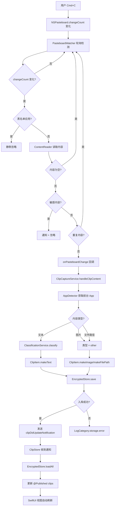
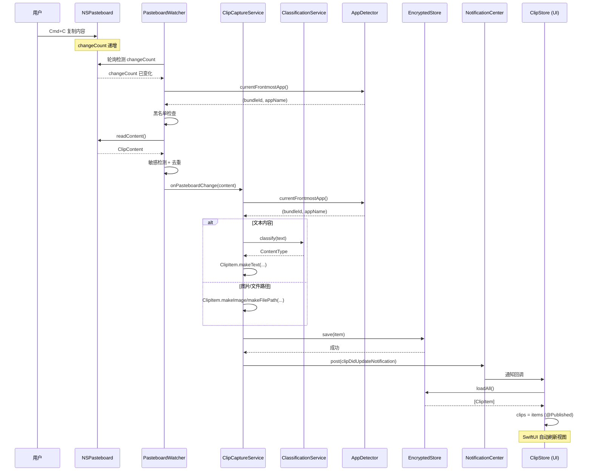

# 复制内容后 app 中没有任何内容

## 问题描述

用户在系统中复制内容后，ClipMind app 中没有任何内容显示。期望行为是 app 能捕获剪贴板内容并显示在 popover 和主窗口的历史列表中。

## 前置：步骤 0 获取的运行日志信息

- AI-test logs 目录和当前 worktree logs 目录均为空，无可用日志
- 用户确认 bug 理解正确：复制内容后 app 中无任何内容显示
- 工作环境：新建隔离工作树 `fix/clipboard-empty-after-copy`（基于 main c8c1ccb）
- 基线 CI：复用 main 分支 run 29251854978（conclusion=success，headSha 一致）

## 红灯：测试用例

新增 `ClipCaptureServiceTests`：
- `testClipboardTextChangeSavesClipItem`：剪贴板变化后，`EncryptedStore` 中应新增一条 ClipItem，内容为复制的文本
- `testClipUpdateNotificationPosted`：入库后应发送 `clipDidUpdateNotification` 通知，供 UI 监听刷新

红灯原因：`ClipCaptureService` 类不存在，测试无法编译。

## 根因调查

### 证据收集

1. **`PasteboardWatcher` 从未被实例化**：全局搜索 `PasteboardWatcher` 仅出现在自身定义文件和测试文件中，无任何生产代码引用。
   - `ClipMind/Capture/PasteboardWatcher.swift` 定义完整（轮询、去重、黑名单、敏感检测）
   - `ClipMindTests/Capture/PasteboardWatcherTests.swift` 测试通过
   - 但 `AppDelegate.applicationDidFinishLaunching` 只设置了 `StatusItemController` 和 `CleanupService`

2. **缺少捕获编排服务**：设计规范 3.3 节流程图标注 `ClipCaptureService.process()`，但代码库中不存在此类。
   - 设计规范预期流程：剪贴板变化 → 读取内容 → 黑名单检查 → 敏感检测 → 生成嵌入向量 → 分类 → 创建 ClipItem → 加密入库 → 更新 UI
   - `PasteboardWatcher` 覆盖了前半段（变化检测 → 黑名单 → 敏感 → 去重 → 回调）
   - 后半段（分类 → 创建 ClipItem → 入库 → 通知 UI）完全缺失

3. **UI 视图不从存储加载数据**：
   - `HistoryListView.clips` 初始化为 `[]`（非 UI 测试模式），无 `onAppear` 加载逻辑
   - `PopoverView.clips` 初始化为 `[]`，无加载逻辑
   - `MainWindow.allClips` 初始化为 `[]`，无加载逻辑
   - 三个视图均不监听任何更新通知

### 数据流追踪

```
用户复制 → NSPasteboard.changeCount 变化 → [PasteboardWatcher 轮询检测] → onPasteboardChange 回调
                                          ↑ 此处断链：回调无人注册
                                          ↓ 期望链路
ClipCaptureService.handleClipContent → ClassificationService.classify → ClipItem.makeText → EncryptedStore.save → 通知 UI
                                          ↑ 此处缺失：ClipCaptureService 不存在
                                          ↓ 期望链路
UI 视图收到通知 → EncryptedStore.loadAll → 更新 clips 列表 → 渲染
                                          ↑ 此处缺失：UI 无加载与监听逻辑
```

### 模式分析

对比 `CleanupService`（已正确接线）：
- `AppDelegate.setupCleanupService()` 中实例化 `EncryptedStore` + `AppSettings` + `CleanupService`
- 调用 `cleanupOnLaunch()` 和 `startPeriodicCleanup()`
- `CleanupService` 持有 `store` 引用，可操作数据库

剪贴板捕获应采用相同模式，但在 `AppDelegate` 中完全缺失。

### 假设与验证

**假设**：`PasteboardWatcher` 从未被启动，且无服务将剪贴板内容写入存储并通知 UI，导致复制后 app 中无内容。

**验证**：
1. 在 `AppDelegate` 中搜索 `PasteboardWatcher` → 无结果
2. 在 `AppDelegate` 中搜索 `startWatching` → 无结果
3. 在 `AppDelegate` 中搜索 `onPasteboardChange` → 无结果
4. 搜索全局 `ClipCaptureService` → 无结果（仅设计规范文档提及）
5. `HistoryListView` / `PopoverView` / `MainWindow` 中搜索 `loadAll` / `EncryptedStore` → 无结果

**结论**：假设成立。根因是捕获管线完全未接线。

## 绿灯：修复实施

### 修复方案

1. **新建 `ClipCaptureService`**（`ClipMind/Capture/ClipCaptureService.swift`）：
   - 持有 `PasteboardWatcher` + `EncryptedStore` + `ClassificationService` + `AppDetector`
   - `start()` 启动 watcher，注册 `onPasteboardChange` 回调
   - 回调中：分类文本 → 创建 ClipItem → 存入 EncryptedStore → 发送 `clipDidUpdateNotification`

2. **`AppDelegate` 接线**：在 `configureActivationPolicy` 完成引导后实例化并启动 `ClipCaptureService`

3. **UI 视图加载与监听**：
   - `HistoryListView`：`onAppear` 从 `EncryptedStore.loadAll()` 加载；监听 `clipDidUpdateNotification` 刷新
   - `PopoverView`：同上
   - `MainWindow`：`allClips` 改为 `onAppear` 加载 + 监听通知

### 修改文件

| 文件 | 变更 |
|------|------|
| `ClipMind/Capture/ClipCaptureService.swift` | 新建：捕获编排服务 |
| `ClipMind/App/ClipMindApp.swift` | 修改：AppDelegate 实例化并启动 ClipCaptureService |
| `ClipMind/UI/MainWindow/HistoryListView.swift` | 修改：onAppear 加载 + 监听通知 |
| `ClipMind/UI/MenuBar/PopoverView.swift` | 修改：onAppear 加载 + 监听通知 |
| `ClipMind/UI/MainWindow/MainWindow.swift` | 修改：allClips 加载 + 监听通知 |
| `ClipMindTests/Capture/ClipCaptureServiceTests.swift` | 新建：TDD 测试 |

### 单测试绿灯结果

- `testClipboardTextChangeSavesClipItem`：通过（EncryptedStore 新增 1 条记录，内容匹配）
- `testClipUpdateNotificationPosted`：通过（收到 clipDidUpdateNotification）
- 全量回归延迟到步骤 3.3.5 走 CI

## 总结

根因是剪贴板捕获管线完全未接线：`PasteboardWatcher` 已实现但从未启动，`ClipCaptureService` 缺失，UI 不从存储加载也不监听更新。修复方案是新建 `ClipCaptureService` 编排捕获→分类→入库→通知流程，并在 `AppDelegate` 启动它，同时让 UI 视图从 `EncryptedStore` 加载并监听更新通知。

## 流程图：修复后的捕获执行流程



## 时序图：组件交互顺序


