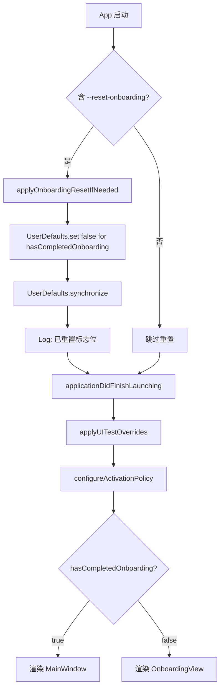
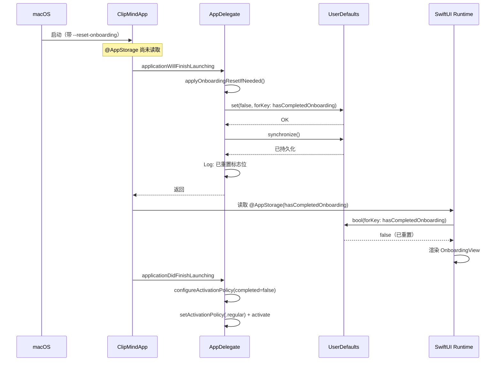

# 首启引导启动时没有显示

## 问题描述

应用首次启动（hasCompletedOnboarding=false）时，OnboardingView 引导界面没有显示。用户反馈标志位 `hasCompletedOnboarding` 被误设为 `true`，导致引导被跳过。

## 前置：步骤 0 获取的运行日志信息

- AI-test logs 目录和当前 worktree logs 目录均为空，无可用日志
- 用户确认 bug 理解：`hasCompletedOnboarding` 被误设为 `true`，需要重置
- 工作环境：新建隔离工作树 `fix/onboarding-not-showing`（基于 main 21fd638）
- 基线 CI：复用 main 分支 run 29260669436（conclusion=success，headSha 一致）

## 代码分析

### ClipMindApp.swift 关键流程

```swift
@main
struct ClipMindApp: App {
    @AppStorage("hasCompletedOnboarding")
    var hasCompletedOnboarding = false  // 默认 false

    var body: some Scene {
        WindowGroup {
            Group {
                if hasCompletedOnboarding {
                    MainWindow()
                } else {
                    OnboardingView()
                }
            }
            .id(hasCompletedOnboarding)  // 状态变化时强制重建
        }
    }
}
```

### AppDelegate 时序

```swift
func applicationDidFinishLaunching(_ notification: Notification) {
    applyUITestOverrides()      // 1. 重置标志位（仅 UITEST 参数时）
    configureActivationPolicy() // 2. 配置激活策略
    ...
}
```

### 时序问题假设

SwiftUI App 生命周期：
1. App struct 创建，`@AppStorage` 读取 UserDefaults
2. **如果 UserDefaults 中 hasCompletedOnboarding=true（来自上次运行）**，SwiftUI 先渲染 MainWindow
3. `applicationDidFinishLaunching` 运行
4. `applyUITestOverrides()` 重置为 false
5. `@AppStorage` 检测变化，`.id()` 触发重建为 OnboardingView

**问题**：步骤 2-3 之间有时序窗口，SwiftUI 可能已经渲染了 MainWindow 且未及时切换。

## 红灯：测试用例

新增 `FirstLaunchUITests.testOnboardingShowsAfterResetFromCompletedState`：
- Step 1: 用 `--UITEST_SHOW_MAIN_WINDOW` 设置 `hasCompletedOnboarding=true`，终止
- Step 2: 用 `--reset-onboarding`（通用重置参数，非 UITEST 前缀）启动
- 验证 OnboardingView 出现（startButton 可见），而非 MainWindow

**红灯结果**：测试失败（30.958 秒）——`startButton` 在 20 秒超时内未出现，因为 `--reset-onboarding` 参数未实现，`hasCompletedOnboarding` 仍为 true，App 显示了 MainWindow。

## 根因调查

### 证据收集

1. **`--reset-onboarding` 参数未处理**：`ClipMindApp.swift` 的 `applyUITestOverrides()` 只处理 `--UITEST_RESET_ONBOARDING`（UI 测试专用），无通用重置参数
2. **重置时机过晚**：重置逻辑在 `applicationDidFinishLaunching` 中执行，此方法在 SwiftUI 读取 `@AppStorage` 之后调用，SwiftUI 已根据旧值（true）渲染了 MainWindow

### 数据流追踪

```
App 启动
  ↓
SwiftUI App struct 创建 → @AppStorage 读取 UserDefaults.hasCompletedOnboarding = true
  ↓
SwiftUI 渲染 MainWindow（基于旧值）
  ↓
applicationDidFinishLaunching → applyUITestOverrides()（仅处理 UITEST 参数）
  ↓ ← --reset-onboarding 未被处理，标志位仍为 true
MainWindow 持续显示，OnboardingView 未出现
```

### 假设与验证

**假设**：缺少通用的 `--reset-onboarding` 参数，且现有重置逻辑在 `applicationDidFinishLaunching` 中执行时机过晚，无法在 SwiftUI 读取 `@AppStorage` 之前重置标志位。

**验证**：
1. 搜索 `CommandLine.arguments` 相关代码 → 只有 `--UITEST_*` 前缀参数被处理
2. 搜索 `applicationWillFinishLaunching` → AppDelegate 未实现此方法
3. 运行红灯测试 → 确认 `--reset-onboarding` 未生效

**结论**：假设成立。根因是缺少通用重置参数，且重置逻辑未在 `applicationWillFinishLaunching`（早于 SwiftUI 读取 `@AppStorage`）中执行。

## 绿灯：修复实施

### 修复方案

1. **添加 `applicationWillFinishLaunching(_:)`**：NSApplicationDelegate 方法，在 `applicationDidFinishLaunching` 之前调用，早于 SwiftUI 读取 `@AppStorage`
2. **新增 `applyOnboardingResetIfNeeded()`**：处理 `--reset-onboarding` 参数，将 `hasCompletedOnboarding` 重置为 false

### 修改文件

| 文件 | 变更 |
|------|------|
| `ClipMind/App/ClipMindApp.swift` | 新增 `applicationWillFinishLaunching` + `applyOnboardingResetIfNeeded()` 方法 |
| `ClipMindUITests/FirstLaunchUITests.swift` | 新增 `testOnboardingShowsAfterResetFromCompletedState` 测试 |

### 单测试绿灯结果

- `testOnboardingShowsAfterResetFromCompletedState`：通过（9.496 秒）
- 全量回归延迟到步骤 3.3.5 走 CI

## 总结

根因是缺少通用的 `--reset-onboarding` 重置参数，且现有 UITEST 专用重置逻辑在 `applicationDidFinishLaunching` 中执行时机过晚。修复方案是在 `applicationWillFinishLaunching`（早于 SwiftUI 读取 `@AppStorage`）中处理 `--reset-onboarding` 参数，确保重置后 SwiftUI 直接渲染 OnboardingView，避免先渲染 MainWindow 再切换的时序问题。

## 流程图：启动时重置引导执行流程



## 时序图：--reset-onboarding 重置时序


