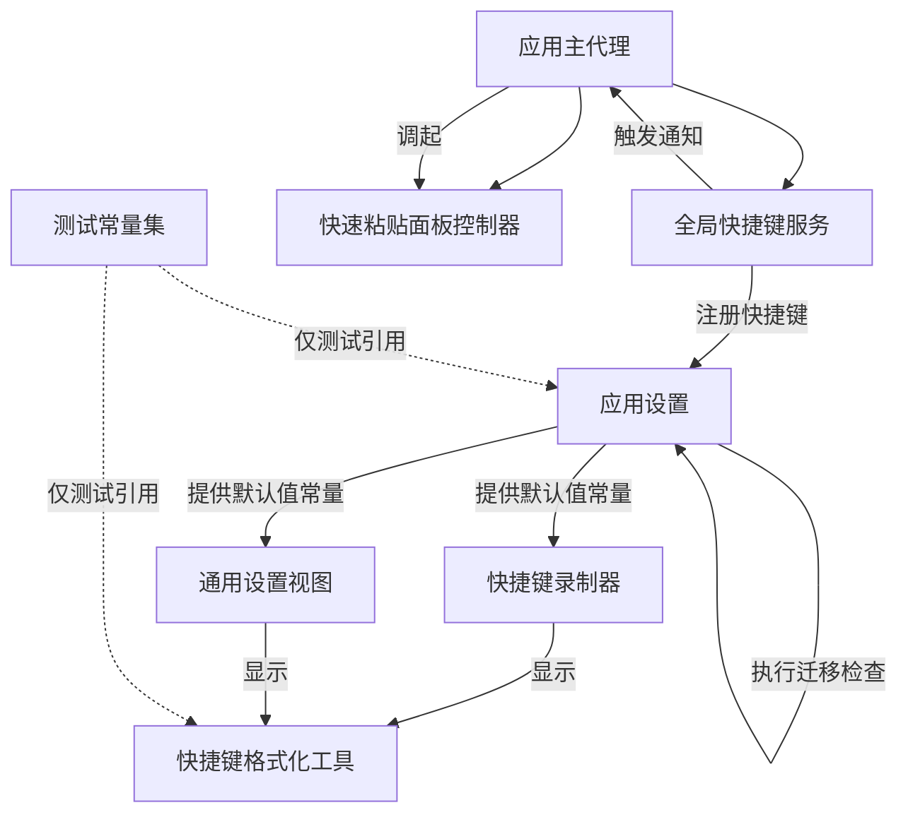
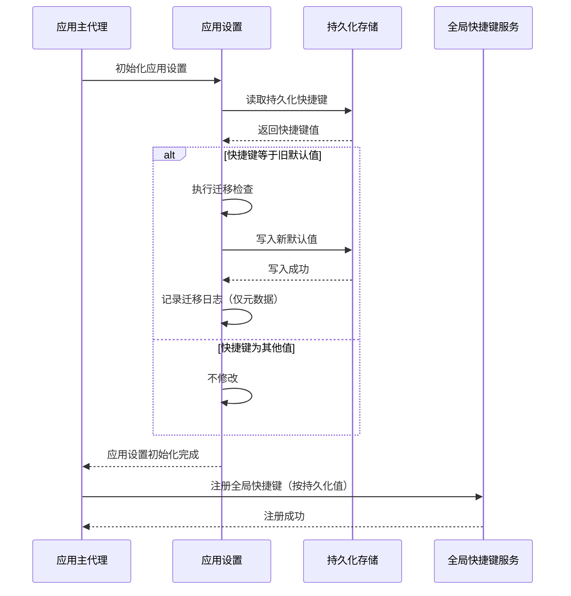
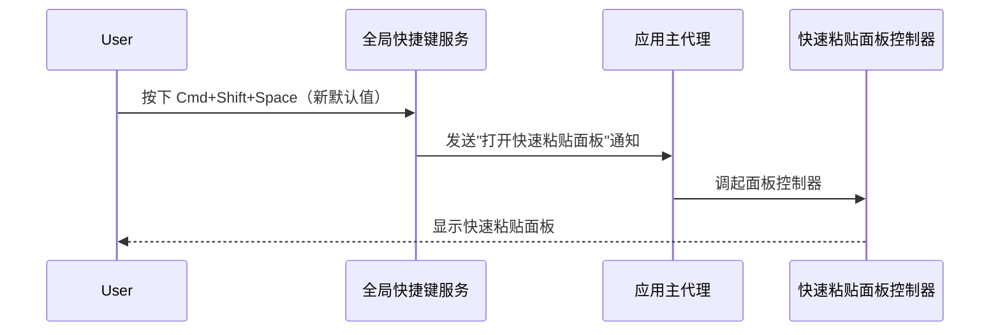
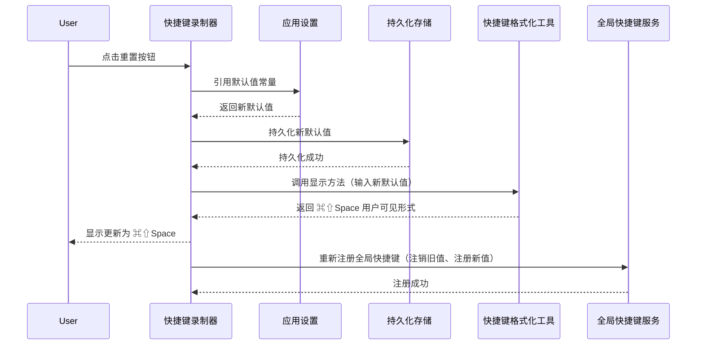
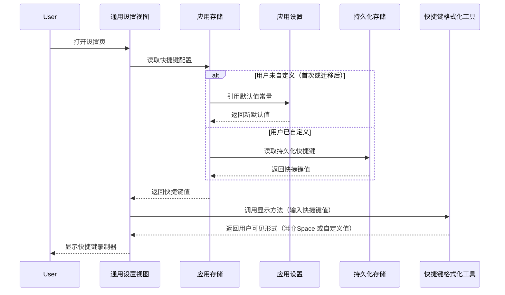
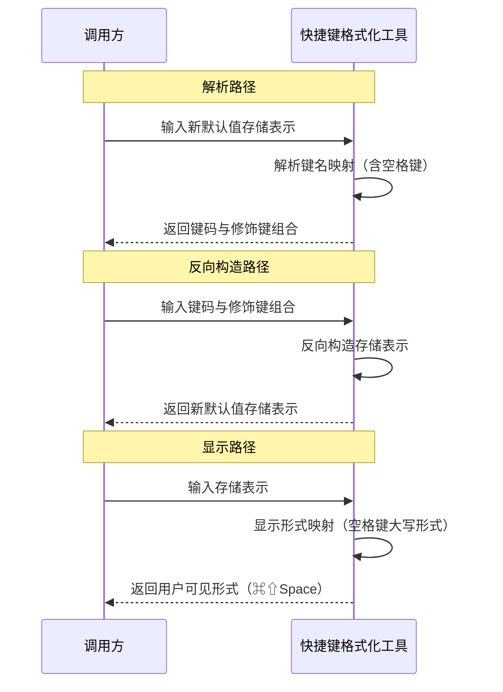
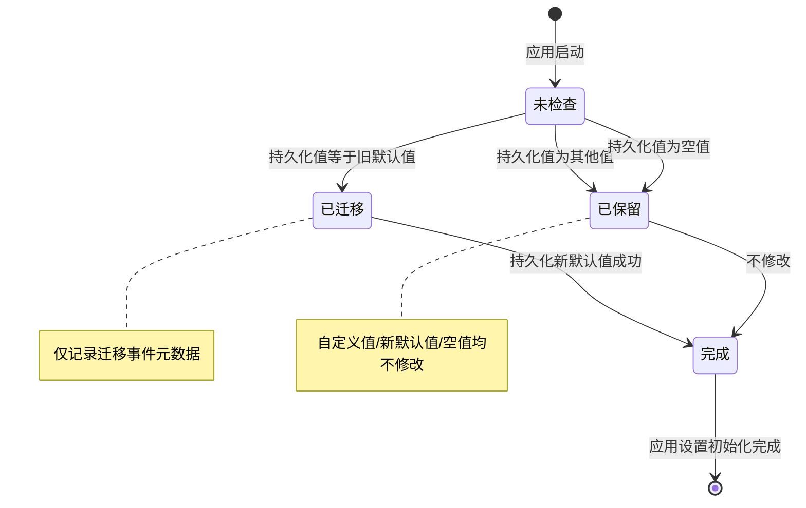
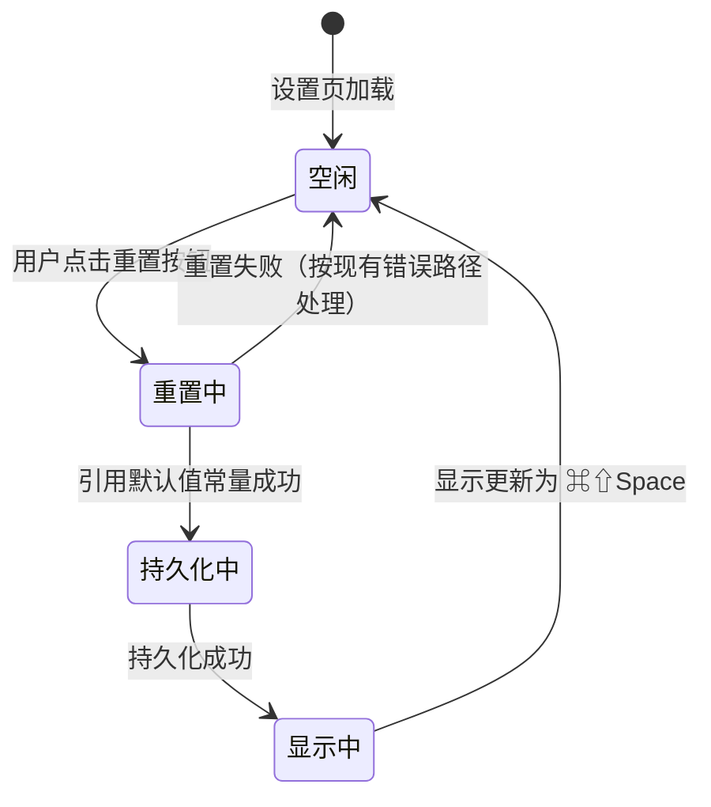

> 最后更新：2026-07-25 | 版本：v1.0

# F1.10 快捷键默认值修改 设计文档

**功能编号**：F1.10
**优先级**：P0
**文档存放路径**：`docs/planning/P0/F1/F1.10_快捷键默认值修改_设计文档.md`
**关联需求文档**：`docs/planning/P0/F1/F1.10_快捷键默认值修改_需求文档.md` v1.0
**关联视觉原型**：`docs/planning/P0/F1/F1.10_快捷键默认值修改_视觉原型.html`
**关联测试用例表**：`docs/planning/P0/F1/F1.10_快捷键默认值修改_测试用例表.md`
**关联主设计规范**：`docs/planning/P0/F1/F1_ClipMind_设计规范.md` v1.10（待同步更新）
**关联 F1.9**：`docs/planning/P0/F1/F1.9_快捷粘贴面板_设计文档.md` v1.1（F1.10 修改的快捷键默认值会触发 F1.9 的快速粘贴面板）

---

## 目录

1. [文档定位](#1-文档定位)
2. [模块划分](#2-模块划分)
3. [职责边界](#3-职责边界)
4. [数据流](#4-数据流)
5. [状态变化](#5-状态变化)
6. [协作关系](#6-协作关系)
7. [关键设计决策](#7-关键设计决策)
8. [非功能约束落地](#8-非功能约束落地)
9. [与 Requirements 的映射](#9-与-requirements-的映射)
10. [风险和待确认问题](#10-风险和待确认问题)

---

## 1. 文档定位

本文档是 F1.10 快捷键默认值修改的**架构契约**，定义模块边界、数据流、状态模型与协作关系，**不**包含具体代码实现（无类定义/方法签名/字段类型/枚举值/文件路径）、**不**包含验收标准（AC 已在需求文档）、**不**包含测试策略与 UI 可观测性矩阵（已迁移到测试用例表）、**不**包含分阶段设计（属于实现规划）。

设计文档遵循 dd-write-design 的 P0 铁律：仅描述"谁负责什么、模块如何协作、状态如何流转、数据如何流动"，不描述"用什么语言、用什么框架 API、用什么并发原语"。

### 1.1 设计目标

- 把 ClipMind 的默认全局快捷键从冲突区（旧默认值，与主流剪贴板工具冲突）移出，新默认值避开主流剪贴板工具的常见组合。
- 为已注册的老用户执行无感迁移：仅迁移使用旧默认值的老用户，保留自定义值。
- 扩展快捷键格式化工具对空格键的支持（解析、反向构造、显示），让新默认值可在设置页正确显示与重新录制。
- 为后续再次修改默认值建立"测试常量集"基础设施，让后续修改只需调整一处。
- 保持 App Store 合规：本特性仅修改默认值与扩展键名映射，不改变全局快捷键的注册流程与权限模型，主 Scheme ClipMind 仍完全合规。

### 1.2 设计约束（来自需求文档）

- macOS 13+ 兼容（与项目基线一致，不使用 macOS 14+ 专有 API）。
- 不修改快捷键配置 UI 的交互、视觉、配置能力。
- 不改变 F1.9 触发行为：快捷键按下后仍发送"打开快速粘贴面板"信号，不唤起主窗口。
- 不引入新的快捷键功能、不修改数据模型或持久化方案、不引入新的依赖或框架。
- 不删除旧默认值的解析路径（回归保护）。

---

## 2. 模块划分

F1.10 在 F1 主设计规范与 F1.9 的模块结构基础上，新增 1 个模块（位于测试目录下），修改 4 个现有模块，复用 4 个现有模块。所有新增与修改均在现有架构边界内，不引入新的模块层级，遵循 `UI → 业务模块 → Models/Utils` 的依赖方向。

### 2.1 新增模块

| 模块名 | 所属层级 | 职责概述 |
|--------|---------|---------|
| 测试常量集 | 测试目录 | 集中管理"当前默认值"、"历史默认值"、"任意有效值"三个常量，供测试代码引用，不污染生产代码 |

### 2.2 修改的现有模块

| 现有模块 | 修改内容 |
|---------|---------|
| 快捷键格式化工具 | 键名映射扩展空格键的解析、反向构造与显示；空格键的显示形式为大写形式，与字母键显示风格一致 |
| 应用设置 | 默认快捷键字面值从旧默认值改为新默认值；默认值常量集中管理，通用设置视图与快捷键录制器重置按钮通过引用获取；新增老用户迁移检查在应用设置初始化阶段执行 |
| 通用设置视图 | 快捷键配置的应用存储引用改为引用应用设置中的默认值常量，不再独立硬编码 |
| 快捷键录制器 | 重置按钮的目标值改为引用应用设置中的默认值常量；录制器显示通过快捷键格式化工具的显示方法生成 |

### 2.3 复用的现有模块（不修改）

| 现有模块 | 复用方式 |
|---------|---------|
| 全局快捷键服务 | 注册机制不变，仅注册的快捷键值从旧默认值变为新默认值；触发行为沿用 F1.9（呼出快速粘贴面板） |
| 应用主代理 | 监听"打开快速粘贴面板"通知逻辑不变（沿用 F1.9），新默认值注册成功后按下时仍触发同一通知 |
| 快速粘贴面板控制器 | F1.9 交付的面板控制器不变，由应用主代理按现有路径调起 |
| 系统全局快捷键注册机制 | 沿用现有系统全局快捷键 API，不引入新的注册路径 |

### 2.4 模块依赖图

> 注：图中节点名为业务模块名（非类名），仅用于展示模块协作关系，不约束实现时的具体类型命名。虚线表示测试目录下的常量集对生产代码的引用关系（仅测试代码使用，不污染生产代码）。

---

## 3. 职责边界

### 3.1 测试常量集

**负责**：

- 提供"当前默认值"常量，供测试断言应用设置的默认值与设置页显示。
- 提供"历史默认值"常量，供回归保护测试验证旧默认值仍可解析、反向构造与显示。
- 提供"任意有效值"常量，供服务层 fixture 测试中非断言目标的快捷键值使用（提升语义）。
- 集中管理三个常量，后续再次修改默认值时，仅修改本常量集中的"当前默认值"与"历史默认值"两个常量，所有测试引用处自动同步。

**不负责**：

- 不负责生产代码的默认值管理（由应用设置负责）。
- 不负责快捷键的解析、反向构造、显示（由快捷键格式化工具负责）。
- 不被生产代码引用（仅测试代码引用）。

### 3.2 快捷键格式化工具

**负责**：

- 解析新默认值的存储表示（含空格键标识），输出空格键的键码与命令、Shift 两个修饰键（根据 FR-002）。
- 反向构造新默认值：从命令修饰键 + Shift 修饰键 + 空格键码反向构造出存储表示，与解析路径互逆（根据 FR-003）。
- 显示新默认值为 ⌘⇧Space 大写形式，与字母键的大写显示风格一致（根据 FR-004）。
- 保留旧默认值的解析、反向构造与显示路径（根据 FR-011 回归保护），不删除键名映射。

**不负责**：

- 不负责默认值字面值的集中管理（由应用设置负责）。
- 不负责老用户迁移检查（由应用设置负责）。
- 不负责快捷键注册（由全局快捷键服务负责）。
- 不负责设置页 UI 渲染（由快捷键录制器与通用设置视图负责）。

### 3.3 应用设置

**负责**：

- 持有默认快捷键字面值常量，作为应用代码中默认值的唯一来源（根据 NFR-006 可维护性）。
- 在应用设置初始化阶段执行老用户迁移检查：检测持久化快捷键等于旧默认值时迁移为新默认值，其他值不修改（根据 FR-005、FR-006）。
- 迁移检查是幂等的：已迁移的快捷键不再被修改，多次执行不产生副作用（根据 NFR-003 稳定性）。
- 迁移过程不弹任何提示对话框，不打断用户首启流程（根据 FR-005）。
- 迁移日志仅记录迁移事件元数据，不记录快捷键字面值（根据 NFR-004 安全性）。
- 提供默认值常量的访问入口，供通用设置视图与快捷键录制器重置按钮引用。

**不负责**：

- 不负责快捷键的解析、反向构造、显示（由快捷键格式化工具负责）。
- 不负责快捷键注册（由全局快捷键服务负责）。
- 不负责测试常量集管理（由测试常量集负责）。
- 不负责设置页 UI 渲染（由快捷键录制器与通用设置视图负责）。

### 3.4 通用设置视图

**负责**：

- 通过应用存储引用快捷键配置，应用存储的默认值引用应用设置中的默认值常量（根据 NFR-006）。
- 设置页加载时显示快捷键的用户可见形式，显示通过快捷键格式化工具的显示方法生成（根据 FR-008）。

**不负责**：

- 不负责默认值字面值的集中管理（由应用设置负责）。
- 不负责快捷键的解析、反向构造、显示（由快捷键格式化工具负责）。
- 不负责老用户迁移检查（由应用设置负责）。
- 不负责快捷键重置按钮行为（由快捷键录制器负责）。

### 3.5 快捷键录制器

**负责**：

- 录制、修改、重置快捷键配置。
- 重置按钮点击后，快捷键值变更为新默认值（引用应用设置中的默认值常量），立即持久化（根据 FR-007）。
- 重置后显示更新为新默认值的用户可见形式（根据 FR-007）。
- 录制器显示通过快捷键格式化工具的显示方法生成（根据 FR-008）。

**不负责**：

- 不负责默认值字面值的集中管理（由应用设置负责）。
- 不负责快捷键的解析、反向构造、显示（由快捷键格式化工具负责）。
- 不负责老用户迁移检查（由应用设置负责）。
- 不负责快捷键注册（由全局快捷键服务负责）。

### 3.6 职责边界无冲突验证

| 职责 | 负责模块 | 是否有冲突 |
|------|---------|-----------|
| 默认值字面值集中管理 | 应用设置 | 无（唯一负责） |
| 老用户迁移检查 | 应用设置 | 无（唯一负责） |
| 快捷键解析、反向构造、显示 | 快捷键格式化工具 | 无（唯一负责） |
| 快捷键录制、修改、重置 | 快捷键录制器 | 无（唯一负责） |
| 设置页快捷键显示 | 通用设置视图 + 快捷键格式化工具 | 无（视图负责渲染，格式化工具负责生成显示形式） |
| 快捷键注册 | 全局快捷键服务 | 无（沿用 F1.9，F1.10 不修改注册逻辑） |
| 触发"打开快速粘贴面板"信号 | 全局快捷键服务 + 应用主代理 | 无（沿用 F1.9，F1.10 不修改触发行为） |
| 测试常量集管理 | 测试常量集 | 无（位于测试目录，仅测试代码引用） |
| 旧默认值解析路径保留 | 快捷键格式化工具 | 无（回归保护，不删除键名映射） |

---

## 4. 数据流

### 4.1 应用启动与老用户迁移数据流

### 4.2 快捷键呼出快速粘贴面板数据流（沿用 F1.9）

> 注：本数据流与 F1.9 的 4.1 节一致，仅快捷键字面值从旧默认值变为新默认值，触发行为与面板调起路径不变。

### 4.3 快捷键录制器重置按钮数据流

### 4.4 设置页快捷键显示数据流

### 4.5 快捷键格式化工具解析与反向构造数据流

---

## 5. 状态变化

### 5.1 老用户迁移状态机

**状态说明**：

| 状态 | 说明 | 持久化 | UI 表现 |
|------|------|--------|---------|
| 未检查 | 应用设置初始化尚未执行迁移检查 | 否 | 无 |
| 已迁移 | 检测到旧默认值，正在迁移 | 是（写入新默认值） | 无（迁移在初始化阶段完成，用户无感） |
| 已保留 | 检测到非旧默认值，不修改 | 否 | 无 |
| 完成 | 迁移检查完成，应用设置初始化结束 | 是（迁移时）或否（保留时） | 无 |

**状态转换补充说明**：迁移检查是幂等的——`已迁移` 状态在下次启动时，持久化快捷键已为新默认值，进入 `已保留` 状态（不再次迁移），满足 NFR-003 稳定性。

### 5.2 快捷键录制器重置状态机

**状态说明**：

| 状态 | 说明 | 持久化 | UI 表现 |
|------|------|--------|---------|
| 空闲 | 录制器空闲，等待用户操作 | 否 | 显示当前快捷键值 |
| 重置中 | 用户点击重置，正在引用默认值常量 | 否 | 短暂过渡（< 50ms） |
| 持久化中 | 正在持久化新默认值 | 是 | 短暂过渡（< 50ms） |
| 显示中 | 持久化成功，正在更新显示 | 否 | 显示更新为 ⌘⇧Space |

---

## 6. 协作关系

### 6.1 应用设置与通用设置视图、快捷键录制器的协作

- 应用设置持有默认值常量，作为默认值的唯一来源。
- 通用设置视图的应用存储引用应用设置中的默认值常量（不再独立硬编码）。
- 快捷键录制器的重置按钮引用应用设置中的默认值常量（不再独立硬编码）。
- 三处默认值字面值通过引用保持同步，满足 NFR-006 可维护性。

### 6.2 应用设置与全局快捷键服务的协作

- 应用设置初始化阶段执行迁移检查（若需要）并持久化最终快捷键值。
- 应用主代理在应用设置初始化完成后，调用全局快捷键服务注册持久化的快捷键值。
- 全局快捷键服务的注册逻辑不变（沿用 F1.9），仅注册的快捷键值从旧默认值变为新默认值。

### 6.3 快捷键格式化工具与快捷键录制器、通用设置视图的协作

- 快捷键录制器显示时调用快捷键格式化工具的显示方法生成用户可见形式。
- 通用设置视图显示时调用快捷键格式化工具的显示方法生成用户可见形式。
- 快捷键格式化工具对新默认值的显示结果为 ⌘⇧Space，对旧默认值的显示结果为 ⌘⇧V（回归保护）。

### 6.4 应用主代理与全局快捷键服务、快速粘贴面板控制器的协作（沿用 F1.9）

- 应用主代理监听"打开快速粘贴面板"通知（沿用 F1.9 6.1 节）。
- 全局快捷键服务按下快捷键时发送"打开快速粘贴面板"通知（沿用 F1.9 6.2 节）。
- 应用主代理收到通知后调起快速粘贴面板控制器（沿用 F1.9）。
- F1.10 不修改上述协作路径，仅快捷键字面值从旧默认值变为新默认值。

### 6.5 测试常量集与应用设置、快捷键格式化工具的协作

- 测试常量集位于测试目录下，仅测试代码引用。
- 测试代码引用"当前默认值"常量断言应用设置的默认值与设置页显示。
- 测试代码引用"历史默认值"常量验证快捷键格式化工具的回归保护（解析、反向构造、显示旧默认值）。
- 测试代码引用"任意有效值"常量在服务层 fixture 测试中作为非断言目标的快捷键值。
- 生产代码不引用测试常量集（满足 NFR-006 可维护性）。

---

## 7. 关键设计决策

### 7.1 为什么默认值集中管理在应用设置层？

**决策**：默认快捷键字面值在应用设置层集中管理为常量，通用设置视图与快捷键录制器重置按钮通过引用获取。

**理由**：

- 修改前默认值散落三处（应用设置、通用设置视图、快捷键录制器重置按钮），未来再次修改默认值需要多处同步，存在漂移风险（根据需求文档问题定义第 4 条）。
- 集中管理后，后续修改默认值仅需修改应用设置层一处，所有引用处自动同步，满足 NFR-006 可维护性。
- 应用设置层是持久化配置的天然归属地，默认值常量与持久化逻辑在同一模块内，职责内聚。

**代价**：通用设置视图与快捷键录制器需要增加对应用设置层的引用关系。

**为何可接受**：引用关系是单向的（UI 引用应用设置），不引入循环依赖；引用成本远低于多处硬编码的漂移风险。

### 7.2 为什么迁移检查在应用设置初始化阶段执行？

**决策**：老用户迁移检查在应用设置初始化阶段同步执行，而非延后到首启引导或快捷键注册时。

**理由**：

- 应用设置初始化阶段是持久化配置加载的天然时机，迁移检查与持久化逻辑在同一模块内，职责内聚。
- 在快捷键注册前完成迁移，确保注册的快捷键值是迁移后的最终值，避免注册旧默认值后再迁移导致的状态不一致。
- 迁移检查是单次字符串比较 + 必要时一次持久化写入，耗时 ≤ 5ms（根据 NFR-002 性能），不影响应用启动体验。
- 迁移是幂等的：已迁移的快捷键在下次启动时不再被修改（根据 NFR-003 稳定性）。

**代价**：应用设置初始化阶段增加一次迁移检查逻辑。

**为何可接受**：迁移检查逻辑轻量（单次字符串比较），不引入可感延迟；迁移在初始化阶段完成，用户无感。

### 7.3 为什么迁移检查仅迁移旧默认值，不迁移其他自定义值？

**决策**：迁移检查仅当持久化快捷键等于旧默认值时迁移为新默认值，自定义值、新默认值、空值均不修改。

**理由**：

- 自定义值是用户主动配置的快捷键，强制覆盖会破坏用户偏好（根据 FR-006）。
- 新默认值无需迁移（已是目标值）。
- 空值或无效值按现有失败路径处理，不强制覆盖（避免覆盖用户主动清空的配置，根据 FR-006）。
- 仅迁移旧默认值能精准识别"使用历史默认值的老用户"群体，避免误伤其他用户。

**代价**：使用自定义值的老用户不会自动享受到新默认值，需手动重置才能切换。

**为何可接受**：自定义值是用户主动选择，保留是尊重用户偏好；用户可通过重置按钮随时切换到新默认值。

### 7.4 为什么快捷键格式化工具扩展空格键映射而非重构？

**决策**：快捷键格式化工具仅扩展键名映射（增加空格键的解析、反向构造、显示），不重构解析逻辑。

**理由**：

- 现有解析逻辑已支持字母键、数字键、功能键，扩展空格键映射是增量修改，风险可控（根据 Constraints 兼容约束）。
- 重构解析逻辑会引入回归风险，可能破坏已持久化旧默认值的老用户路径（违反 FR-011 回归保护）。
- 增量扩展满足"解析、反向构造、显示互逆"约束，无需调整解析路径的整体结构。

**代价**：键名映射表增加一项，未来支持更多特殊键时仍需扩展。

**为何可接受**：键名映射表是数据驱动的，扩展成本低于重构；增量修改保持回归保护。

### 7.5 为什么测试常量集位于测试目录而非生产代码？

**决策**：测试常量集位于测试目录下，仅测试代码引用，不污染生产代码。

**理由**：

- 测试常量集是测试基础设施，仅服务于测试代码的断言与 fixture（根据 FR-010）。
- 若位于生产代码，会引入"生产代码为测试提供常量"的反模式，违反职责单一原则。
- 位于测试目录下，生产代码不依赖测试常量集，避免测试变更影响生产代码稳定性。
- 后续修改默认值时，生产代码修改一处（应用设置），测试代码修改一处（测试常量集），所有引用处自动同步（根据 NFR-006）。

**代价**：测试常量集与生产代码的默认值常量是两份独立常量，存在轻微重复。

**为何可接受**：测试常量集的语义是"测试断言目标"，与生产代码的"运行时默认值"语义不同；两份常量通过测试断言建立一致性约束（测试断言应用设置的默认值等于测试常量集的当前默认值），不会漂移。

### 7.6 为什么保留旧默认值的解析路径？

**决策**：本特性修改默认值后，旧默认值的键名映射不删除，确保旧默认值仍可被解析、反向构造与显示。

**理由**：

- 已持久化旧默认值的老用户在迁移前的解析路径必须正确（根据 FR-011 回归保护）。
- 迁移检查在应用设置初始化阶段执行，迁移前的瞬间旧默认值仍需被解析（用于读取、显示、注册）。
- 删除旧默认值的解析路径会导致迁移前老用户的快捷键录制器显示异常（无法解析旧默认值）。
- 保留解析路径是数据兼容性的基本要求，避免破坏已持久化的配置。

**代价**：键名映射表保留旧默认值的项，未来若有更多历史默认值，映射表会增长。

**为何可接受**：映射表的增长是线性的，每项历史默认值仅增加一项映射；保留成本远低于破坏老用户配置的代价。

### 7.7 为什么不修改快捷键配置 UI？

**决策**：保留现有设置页快捷键录制器的交互、视觉、配置能力，仅修改"默认值"与"显示形式"。

**理由**：

- 快捷键配置 UI 已在 F1.9 交付时稳定，本特性的目标是修改默认值，而非重构 UI（根据 Constraints 业务约束）。
- 修改 UI 会引入额外的视觉原型、测试用例、回归风险，超出本特性范围（根据 Out of Scope 9.1）。
- 用户对快捷键配置 UI 的认知已建立，修改会破坏用户认知一致性。

**代价**：本特性无法顺便改进 UI（如冲突提示、录制反馈等），需归入未来扩展（根据需求文档 12 章）。

**为何可接受**：本特性聚焦于"修改默认值 + 扩展解析器 + 老用户迁移"，范围清晰；UI 改进归入未来扩展（需求文档 12.1、12.7），不影响本特性交付。

---

## 8. 非功能约束落地

### 8.1 兼容性（NFR-001）

| 约束 | 落地方式 |
|------|---------|
| macOS 13+ 兼容 | 不使用 macOS 14+ 专有 API；快捷键格式化工具的键名映射扩展使用通用数据结构，无版本依赖 |
| Apple Silicon + Intel 兼容 | 不使用架构相关 API，Universal Binary 构建自动兼容 |
| 兼容现有快捷键注册机制 | 全局快捷键服务的注册逻辑不变，仅注册的快捷键值变更 |
| 兼容 F1.9 触发行为 | 快捷键按下后仍发送"打开快速粘贴面板"信号，不唤起主窗口 |
| 兼容现有快捷键配置 UI | 设置页快捷键录制器的交互、视觉、配置能力不变 |

### 8.2 性能（NFR-002）

| 约束 | 落地方式 |
|------|---------|
| 老用户迁移检查耗时 ≤ 5ms | 迁移检查是单次字符串比较 + 必要时一次持久化写入，在应用设置初始化阶段同步完成 |
| 新默认值注册耗时与旧默认值一致 | 注册耗时与具体键码无关，全局快捷键服务的注册逻辑不变 |
| 解析、反向构造、显示无可感延迟（< 1ms） | 快捷键格式化工具的键名映射是内存查表，无 IO |

### 8.3 稳定性（NFR-003）

| 约束 | 落地方式 |
|------|---------|
| 100 次连续升级无崩溃、无数据丢失 | 迁移检查是幂等的，已迁移的快捷键不再被修改；迁移失败时按现有错误路径处理，不影响应用启动 |
| 迁移逻辑幂等 | 持久化快捷键等于旧默认值时才迁移；新默认值不等于旧默认值，下次启动不再迁移 |
| 迁移失败不影响应用启动 | 迁移失败的错误按现有错误处理路径记录日志，应用设置初始化继续完成 |

### 8.4 安全性（NFR-004）

| 约束 | 落地方式 |
|------|---------|
| 不在日志中输出快捷键字面值 | 迁移日志仅记录迁移事件元数据（如"已迁移旧默认快捷键"），不记录原值与新值 |
| 快捷键格式化工具不读取或输出剪贴板内容 | 解析、反向构造、显示方法仅处理快捷键字面值与键码，不涉及剪贴板内容 |

### 8.5 合规性（NFR-005）

| 约束 | 落地方式 |
|------|---------|
| 主 Scheme ClipMind 仍完全合规 | 本特性仅修改默认值字面值与扩展键名映射，不改变快捷键注册流程的权限模型 |
| 不引入新的权限或 entitlement | 沿用现有快捷键注册所需的权限，不新增 entitlement |
| 不涉及敏感剪贴板内容的持久化 | 快捷键配置不属于敏感剪贴板内容，本特性不涉及剪贴板原文 |
| 无需暂存到 ClipMind-Dev Scheme | 仅修改默认值与扩展键名映射，无合规风险，可直接合入主 Scheme ClipMind |

### 8.6 可维护性（NFR-006）

| 约束 | 落地方式 |
|------|---------|
| 默认快捷键字面值在应用代码中仅出现一处 | 应用设置层持有默认值常量，通用设置视图与快捷键录制器重置按钮通过引用获取 |
| 测试常量集位于测试目录下 | 集中管理当前默认值、历史默认值、任意有效值三个常量 |
| 后续修改默认值仅需修改一处 | 生产代码修改应用设置层一处，测试代码修改测试常量集一处，所有引用处自动同步 |

---

## 9. 与 Requirements 的映射

### 9.1 FR 到模块映射表

| FR 编号 | FR 描述 | 负责模块 |
|---------|--------|---------|
| FR-001 | 默认全局快捷键改为 Cmd+Shift+Space | 应用设置（修改） + 全局快捷键服务（复用） + 应用主代理（复用，监听通知） |
| FR-002 | 快捷键格式化工具支持空格键解析 | 快捷键格式化工具（修改） |
| FR-003 | 快捷键格式化工具支持空格键反向构造 | 快捷键格式化工具（修改） |
| FR-004 | 快捷键格式化工具支持空格键显示 | 快捷键格式化工具（修改） |
| FR-005 | 老用户旧默认值自动迁移 | 应用设置（修改） |
| FR-006 | 老用户自定义值保留 | 应用设置（修改） |
| FR-007 | 快捷键录制器重置按钮重置为新默认值 | 快捷键录制器（修改） + 应用设置（修改，提供默认值常量） |
| FR-008 | 设置页快捷键录制器默认显示新默认值 | 通用设置视图（修改） + 快捷键录制器（修改） + 快捷键格式化工具（修改，生成显示形式） |
| FR-009 | 全局快捷键 Cmd+Shift+Space 可注册并触发快速粘贴面板 | 全局快捷键服务（复用） + 应用主代理（复用） + 快速粘贴面板控制器（复用） |
| FR-010 | 测试常量集抽取 | 测试常量集（新增） |
| FR-011 | 历史默认值解析回归保护 | 快捷键格式化工具（修改，保留旧默认值映射） |

### 9.2 NFR 落地映射

| NFR 编号 | NFR 描述 | 落地章节 |
|---------|---------|---------|
| NFR-001 | 兼容性 | 8.1 |
| NFR-002 | 性能 | 8.2 |
| NFR-003 | 稳定性 | 8.3 |
| NFR-004 | 安全性 | 8.4 |
| NFR-005 | 合规性 | 8.5 |
| NFR-006 | 可维护性 | 8.6 |

### 9.3 设计文档对需求建议的回应

| 需求审查建议 | 设计文档回应 |
|-------------|-------------|
| FR-005 迁移检查的执行时机需明确 | 第 4.1 节与第 5.1 节：迁移检查在应用设置初始化阶段同步执行，先于全局快捷键服务注册 |
| FR-007 重置按钮的注册流程需明确 | 第 4.3 节：重置按钮点击后，引用默认值常量 → 持久化 → 更新显示 → 重新注册全局快捷键（注销旧值、注册新值） |
| FR-010 测试常量集的位置需明确 | 第 3.1 节与第 6.5 节：测试常量集位于测试目录下，仅测试代码引用，不污染生产代码 |

---

## 10. 风险和待确认问题

### 10.1 技术风险

| 风险 | 影响 | 概率 | 缓解措施 |
|------|------|------|---------|
| 新默认值 Cmd+Shift+Space 与系统或其他应用冲突 | 全局快捷键注册失败或触发冲突 | 低 | Cmd+Shift+Space 是相对少见的组合，与主流剪贴板工具的常见组合不冲突；注册失败时按现有错误处理路径提示用户 |
| 老用户迁移检查在持久化写入失败时影响应用启动 | 迁移未完成，但应用启动受阻 | 低 | 迁移失败的错误按现有错误处理路径记录日志，应用设置初始化继续完成；下次启动时再次执行迁移检查（幂等） |
| 快捷键格式化工具扩展空格键映射引入回归 | 旧默认值的解析、反向构造、显示被破坏 | 低 | 保留旧默认值的键名映射（根据 FR-011）；测试常量集的"历史默认值"常量用于回归保护测试 |
| 默认值常量引用关系引入循环依赖 | 编译错误或运行时循环 | 低 | 引用关系是单向的（UI 引用应用设置），不引入循环；应用设置不引用 UI 模块 |
| 测试常量集与生产代码默认值常量漂移 | 测试断言与实际默认值不一致 | 低 | 测试断言应用设置的默认值等于测试常量集的当前默认值，建立一致性约束；后续修改默认值时同步修改两处 |

### 10.2 合规风险（App Store）

| 风险 | 影响 | 概率 | 缓解措施 |
|------|------|------|---------|
| 无 | 本特性仅修改默认值字面值与扩展键名映射，不改变快捷键注册流程的权限模型 | - | 主 Scheme ClipMind 仍完全合规，无需暂存到 ClipMind-Dev Scheme |

> 注：F1.10 不涉及辅助功能权限、模拟按键、跨应用读取等合规敏感能力，与 F1.9 的合规风险无关。本特性是"配置默认值修改 + 解析器扩展 + 老用户迁移"的局部增强，合规风险为零。

### 10.3 待确认问题

| 问题 | 影响范围 | 建议方案 | 决策时机 |
|------|---------|---------|---------|
| 空格键的键名标识具体形式 | 快捷键格式化工具的键名映射 | 由实现方决定，只要满足"解析、反向构造、显示互逆"约束；在测试常量集中保持一致 | 实现时 |
| 空格键显示形式的具体写法 | 快捷键格式化工具的显示方法 | 推荐"Space"（首字母大写，与字母键一致），由实现方在测试中固定 | 实现时 |
| 测试常量集的实现形式 | 测试常量集模块 | 由实现方决定，只要满足"集中管理、测试代码引用、不污染生产代码"约束 | 实现时 |
| 迁移方法的命名 | 应用设置模块 | 由实现方决定，只要在应用设置初始化阶段被调用且行为符合 FR-005 | 实现时 |
| 默认值常量的实现形式 | 应用设置模块 | 由实现方决定，只要满足"应用代码中仅出现一处"约束 | 实现时 |

---

## 版本记录

| 版本 | 日期 | 变更说明 |
|------|------|---------|
| v1.0 | 2026-07-25 | 初始版本，覆盖 F1.10 快捷键默认值修改设计，包含 10 章节（文档定位/模块划分/职责边界/数据流/状态变化/协作关系/关键设计决策/非功能约束落地/与 Requirements 的映射/风险和待确认问题），1 个新增模块 + 4 个修改模块 + 4 个复用模块，5 个数据流序列图，2 个状态机，7 项关键设计决策，6 项 NFR 落地，FR 到模块映射表全覆盖（11 条 FR），0 项合规风险，5 项待确认问题 |
