> 最后更新：2026-07-25 | 版本：v1.1

# F1.11 菜单栏弹窗双击粘贴 设计文档

**功能编号**：F1.11
**优先级**：P0
**文档存放路径**：`docs/planning/P0/F1/F1.11_菜单栏弹窗双击粘贴_设计文档.md`
**关联需求文档**：`docs/planning/P0/F1/F1.11_菜单栏弹窗双击粘贴_需求文档.md` v1.0
**关联视觉原型**：`docs/planning/P0/F1/F1.11_菜单栏弹窗双击粘贴_视觉原型.html`
**关联测试用例表**：`docs/planning/P0/F1/F1.11_菜单栏弹窗双击粘贴_测试用例表.md`
**关联主设计规范**：`docs/planning/P0/F1/F1_ClipMind_设计规范.md` v1.9
**关联 F1.9 设计文档**：`docs/planning/P0/F1/F1.9_快捷粘贴面板_设计文档.md` v1.1

---

## 目录

1. [文档定位](#1-文档定位)
2. [模块划分](#2-模块划分)
3. [职责边界](#3-职责边界)
4. [数据流](#4-数据流)
5. [状态变化](#5-状态变化)
6. [协作关系](#6-协作关系)
7. [关键设计决策](#7-关键设计决策)
8. [非功能约束落地](#8-非功能约束落地)
9. [与 Requirements 的映射](#9-与-requirements-的映射)
10. [风险和待确认问题](#10-风险和待确认问题)

---

## 1. 文档定位

本文档是 F1.11 菜单栏弹窗双击粘贴的**架构契约**，定义模块边界、数据流、状态模型与协作关系，**不**包含具体代码实现（无类定义/方法签名/字段类型/枚举值/文件路径）、**不**包含验收标准（AC 已在需求文档第 8 节）、**不**包含测试策略与 UI 可观测性矩阵（已迁移到测试用例表）、**不**包含分阶段设计（属于实现规划）。

设计文档遵循 dd-write-design 的 P0 铁律：仅描述「谁负责什么、模块如何协作、状态如何流转、数据如何流动」，不描述「用什么语言、用什么框架 API、用什么并发原语」。

### 1.1 设计目标

- 把菜单栏弹窗从「仅展示」升级为「完整剪贴复用入口」，与 F1.9 快捷键面板交互完全对齐（双击粘贴/回车粘贴/方向键导航/选中态/默认高亮第一行/Esc 关闭）。
- 通过视图层合并消除重复代码：菜单栏弹窗视图与快捷键面板视图合并为统一粘贴面板视图，由状态栏图标控制器（菜单栏弹窗场景）和快捷键面板控制器（快捷键场景）分别包装。
- 新增底部工具栏「查看全部/配置/退出」三按钮，仅在菜单栏弹窗场景显示，快捷键场景隐藏。
- 扩展 F1.9 已有的面板关闭协议，使状态栏图标控制器实现该协议，关闭菜单栏弹窗与关闭快捷键面板使用统一接口。
- 沿用 F1.9 已建立的粘贴协调器、系统粘贴权限检查器、剪贴板写入器、粘贴浮层控制器等基础设施，不引入新的权限申请流程，不修改持久化逻辑。

### 1.2 设计约束（来自需求文档）

- macOS 13.0+ 兼容（与项目主设计规范一致）。
- 不改动 F1.9 快捷键触发逻辑、不改 F1.9 已有的辅助功能标识符、不引入新权限申请流程、不改剪贴板存储的持久化逻辑。
- 仅支持文本类型自动粘贴；图片/文件路径双击提示「仅支持文本粘贴」。
- 禁止使用私有 API、禁止绕过沙盒、禁止缓存辅助功能权限状态、禁止弹 TCC 提示对话框、禁止在两个场景分别维护列表交互逻辑。
- App Store 合规：无权限降级方案纯沙盒内实现；有权限方案使用公开 API + 标准 TCC 权限流程，合规风险在第 10 节独立标注。

---

## 2. 模块划分

F1.11 在 F1.9 已建立的模块结构基础上，新增 1 个模块（统一粘贴面板视图），修改 4 个现有模块（状态栏图标控制器、列表行视图、应用主代理、菜单栏弹窗视图），复用 7 个 F1.9 已有模块（快捷键面板控制器、粘贴协调器、系统粘贴权限检查器、剪贴板写入器、粘贴浮层控制器、剪贴板消费监听器、应用设置）。所有新增与修改模块通过初始化器注入依赖，遵循 UI → 业务模块 → 数据模型层的依赖方向。

> 注：F1.9 已有的「快捷粘贴面板视图」与「快捷粘贴面板视图状态管理器」在 F1.11 中合并为「统一粘贴面板视图」与「统一粘贴面板视图状态管理器」（命名属于实现细节，由实现阶段决定）。本设计文档按合并后的单一模块描述。

### 2.1 新增模块

| 模块名 | 所属层级 | 职责概述 |
|--------|---------|---------|
| 底部工具栏组件 | UI | 菜单栏弹窗底部的按钮区域组件，包含「查看全部/配置/退出」三按钮，处理按钮点击事件转发 |
| 「打开设置窗口」信号 | App | 应用内新增的信号（若已有则复用），用于通知应用主代理打开设置窗口 |

### 2.2 修改的现有模块

| 现有模块 | 修改内容 |
|---------|---------|
| 状态栏图标控制器 | 新增实现面板关闭协议（关闭菜单栏弹窗）；新增在弹出弹窗前从剪贴板存储读取剪贴项列表并注入到视图；新增主线程隔离；新增注入统一粘贴面板视图与粘贴协调器回调 |
| 列表行视图 | 在菜单栏弹窗场景也绑定单击与双击回调（F1.9 已支持回调但菜单栏弹窗未传入）；保持 F1.9 已有的高亮选中、单击、双击回调机制不变 |
| 应用主代理 | 新增监听「打开设置窗口」信号并打开设置窗口；新增在初始化状态栏图标控制器时注入剪贴项数据源与粘贴协调器回调 |
| 菜单栏弹窗视图 | 重构为统一粘贴面板视图（吸收快捷键面板视图的交互逻辑）；新增底部工具栏条件渲染（菜单栏弹窗场景显示三按钮，快捷键场景隐藏）；改为通过外部注入接收剪贴项列表（不直接读取剪贴板存储） |

### 2.3 复用的现有模块（不修改）

| 现有模块 | 复用方式 |
|---------|---------|
| 快捷键面板控制器 | 复用其面板创建、定位、显示、关闭、键盘焦点管理、失焦监听、位置记忆能力；继续实现面板关闭协议（F1.9 已实现）；改为通过外部注入接收剪贴项列表（与状态栏图标控制器从同一剪贴板存储取） |
| 粘贴协调器 | 复用其粘贴流程编排能力（检测权限 → 写剪贴板 → 关闭面板 → 有权限/无权限分支）；通过面板关闭协议同时支持菜单栏弹窗与快捷键面板两个场景 |
| 系统粘贴权限检查器 | 复用其运行时辅助功能权限检测能力（不缓存、不弹 TCC 提示） |
| 剪贴板写入器 | 复用其将文本内容写入系统剪贴板的能力 |
| 粘贴浮层控制器 | 复用其降级浮层显示、消费监听、超时消失能力 |
| 剪贴板消费监听器 | 复用其监听剪贴板变化计数判定消费的能力 |
| 应用设置 | 复用其浮层超时兜底时长配置项（沿用 F1.9 默认 5 秒） |

### 2.4 模块依赖图

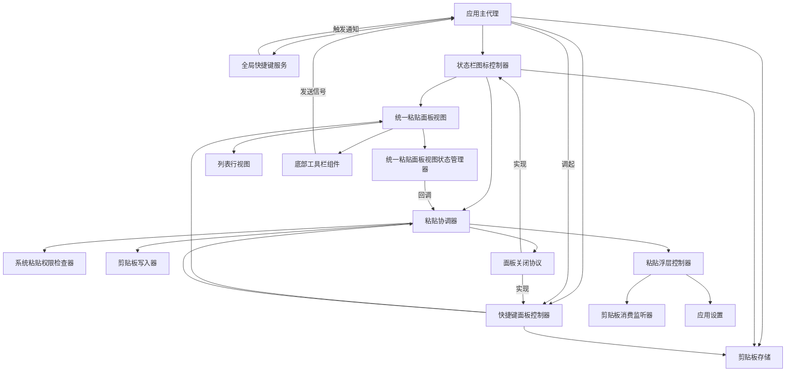

> 注：图中节点名为业务模块名（非类名），仅用于展示模块协作关系，不约束实现时的具体类型命名。「面板关闭协议」是业务接口，由状态栏图标控制器与快捷键面板控制器共同实现。

---

## 3. 职责边界

### 3.1 状态栏图标控制器（修改）

**负责**：

- 创建并持有菜单栏图标与菜单栏弹窗实例。
- 处理菜单栏图标 toggle 行为（点击图标弹出/关闭弹窗）。
- 在弹出弹窗前从剪贴板存储读取剪贴项列表，注入到统一粘贴面板视图。
- 实现面板关闭协议：调用接口后关闭菜单栏弹窗。
- 主线程隔离，确保 UI 状态更新在主线程完成。

**不负责**：

- 不负责剪贴板写入（由粘贴协调器负责）。
- 不负责模拟粘贴按键（由粘贴协调器在有权限路径中委托模拟粘贴按键模块负责，沿用 F1.9）。
- 不负责列表内容渲染（由统一粘贴面板视图负责）。
- 不负责快捷键面板的创建或定位（由快捷键面板控制器负责）。
- 不负责面板位置记忆（菜单栏弹窗绑定在菜单栏图标位置，无需记忆位置）。

### 3.2 统一粘贴面板视图（合并后）

**负责**：

- 渲染搜索框、列表、底部工具栏（菜单栏弹窗场景显示，快捷键场景隐藏）。
- 管理高亮选中状态（单选模式），默认高亮第一行。
- 处理单击选中、双击触发回调、回车键触发回调。
- 处理方向键上下移动高亮（必要时自动滚动以保持高亮行可见）。
- 处理 Esc 键关闭回调（通过回调传递给包装控制器）。
- 通过回调将「双击/回车某行」事件传递给粘贴协调器。
- 通过外部参数控制底部工具栏显隐（菜单栏弹窗场景显示，快捷键场景隐藏）。
- 通过外部注入接收剪贴项列表（不直接读取剪贴板存储）。

**不负责**：

- 不负责剪贴板写入或粘贴按键模拟。
- 不负责面板窗口的创建、定位或关闭（由包装控制器负责）。
- 不负责权限检测。
- 不负责「打开主窗口」或「打开设置窗口」信号的发送（由底部工具栏组件负责转发，应用主代理负责接收）。

### 3.3 统一粘贴面板视图状态管理器（合并后）

**负责**：

- 持有剪贴项列表数据（由外部注入）。
- 管理当前高亮选中行索引（默认 0，即第一行）。
- 处理选中状态查询、单击选中、方向键移动、回车触发、双击触发等业务逻辑。
- 暴露可观察属性供视图订阅（如当前选中索引、是否显示「仅支持文本粘贴」提示）。
- 通过回调将「双击/回车某行」事件传递给上层（视图或控制器，由实现阶段决定）。
- 处理图片/文件路径类型双击时显示「仅支持文本粘贴」提示（不进入粘贴流程）。

**不负责**：

- 不负责剪贴板写入或粘贴流程编排（由粘贴协调器负责）。
- 不负责面板窗口的创建或关闭。
- 不负责权限检测。
- 不负责搜索过滤逻辑（由视图层处理，过滤后选中索引重置为第一行）。

### 3.4 底部工具栏组件（新增）

**负责**：

- 渲染「查看全部/配置/退出」三按钮（菜单栏弹窗场景）。
- 处理按钮点击事件：
  - 「查看全部」：发送「打开主窗口」信号（沿用 F1.9 已有信号）。
  - 「配置」：发送「打开设置窗口」信号（新增信号，若已有则复用）。
  - 「退出」：触发退出应用回调（由包装控制器调用 `NSApp.terminate`）。
- 通过外部参数控制可见性（菜单栏弹窗场景可见，快捷键场景隐藏）。

**不负责**：

- 不负责实际打开主窗口或设置窗口（由应用主代理接收信号后处理）。
- 不负责关闭菜单栏弹窗（由状态栏图标控制器通过面板关闭协议处理）。
- 不负责剪贴板写入或粘贴流程。

### 3.5 列表行视图（修改）

**负责**：

- 渲染单条剪贴项（类型标签、内容预览、来源应用、时间）。
- 支持「高亮选中」状态视觉差异（背景色 + 边框）。
- 支持单击回调（更新选中状态）。
- 支持双击回调（触发粘贴流程）。

**不负责**：

- 不负责选中状态管理（由统一粘贴面板视图状态管理器负责）。
- 不负责粘贴流程编排（由粘贴协调器负责）。
- 不负责搜索过滤（由视图层负责）。

### 3.6 应用主代理（修改）

**负责**：

- 应用启动时初始化状态栏图标控制器、快捷键面板控制器、全局快捷键服务（沿用 F1.9）。
- 在初始化状态栏图标控制器时注入剪贴项数据源（剪贴板存储）与粘贴协调器回调。
- 监听「打开主窗口」信号（沿用 F1.9 已有）。
- 监听「打开设置窗口」信号（新增），收到后打开设置窗口并获得键盘焦点。
- 监听「打开快速粘贴面板」信号（沿用 F1.9 已有）。

**不负责**：

- 不负责菜单栏弹窗或快捷键面板的内部交互（由各自控制器与视图负责）。
- 不负责剪贴板写入或粘贴流程编排。
- 不负责权限检测。

### 3.7 复用模块的职责边界（沿用 F1.9，不修改）

以下模块的职责边界与 F1.9 设计文档第 3 节一致，本节仅列出模块名与 F1.11 中的复用要点：

| 模块 | F1.11 复用要点 |
|------|---------------|
| 快捷键面板控制器 | 继续实现面板关闭协议；改为通过外部注入接收剪贴项列表（与状态栏图标控制器从同一剪贴板存储取） |
| 粘贴协调器 | 通过面板关闭协议同时支持菜单栏弹窗与快捷键面板两个场景（同一协调器实例可服务两个控制器，或每个控制器各持有一个协调器实例，由实现阶段决定） |
| 系统粘贴权限检查器 | 沿用 F1.9，运行时检测不缓存 |
| 剪贴板写入器 | 沿用 F1.9 |
| 粘贴浮层控制器 | 沿用 F1.9，菜单栏弹窗无权限降级路径与快捷键面板共用同一浮层控制器 |
| 剪贴板消费监听器 | 沿用 F1.9 |
| 应用设置 | 沿用 F1.9 浮层超时兜底时长配置项 |

### 3.8 职责边界无冲突验证

| 职责 | 负责模块 | 是否有冲突 |
|------|---------|-----------|
| 菜单栏弹窗窗口创建与显示 | 状态栏图标控制器 | 无（唯一负责） |
| 快捷键面板窗口创建与定位 | 快捷键面板控制器 | 无（唯一负责，与菜单栏弹窗是两个独立入口） |
| 统一粘贴面板视图渲染与交互 | 统一粘贴面板视图 + 统一粘贴面板视图状态管理器 | 无（合并后单一实现，支撑两个场景） |
| 面板内容数据源 | 剪贴板存储（外部注入到视图） | 无（视图不直接读取存储） |
| 粘贴流程编排 | 粘贴协调器 | 无（唯一负责，通过面板关闭协议服务两个场景） |
| 权限检测 | 系统粘贴权限检查器 | 无（沿用 F1.9） |
| 剪贴板写入 | 剪贴板写入器 | 无（沿用 F1.9） |
| 剪贴板消费监听 | 剪贴板消费监听器 | 无（沿用 F1.9） |
| 降级浮层显示与消失 | 粘贴浮层控制器 | 无（沿用 F1.9） |
| 底部工具栏渲染与按钮事件转发 | 底部工具栏组件 | 无（新增唯一负责） |
| 「打开主窗口」信号发送 | 底部工具栏组件「查看全部」按钮 | 无（沿用 F1.9 已有信号） |
| 「打开设置窗口」信号发送 | 底部工具栏组件「配置」按钮 | 无（新增信号） |
| 「打开主窗口」信号接收 | 应用主代理 | 无（沿用 F1.9） |
| 「打开设置窗口」信号接收 | 应用主代理 | 无（新增） |
| 「退出」按钮退出应用 | 状态栏图标控制器（直接调用 `NSApp.terminate`） | 无（与「Esc 关闭」路径分离，独立退出路径） |
| 菜单栏图标 toggle 行为 | 状态栏图标控制器 | 无（沿用 F1.x） |
| 全局快捷键触发 | 全局快捷键服务 | 无（沿用 F1.9，不修改触发逻辑） |

---

## 4. 数据流

### 4.1 菜单栏图标点击弹出弹窗数据流

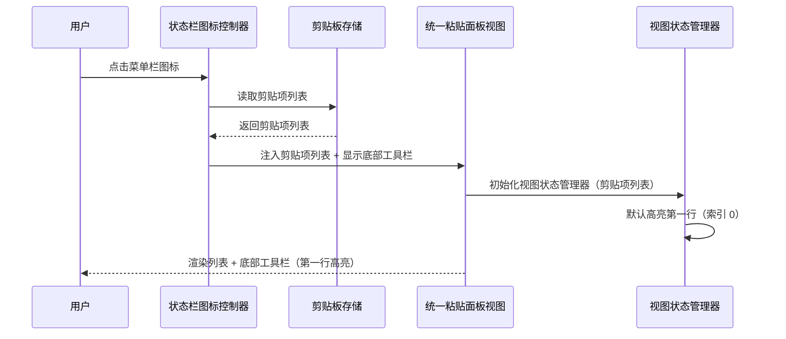

### 4.2 双击/回车触发粘贴数据流（菜单栏弹窗场景，有权限路径）

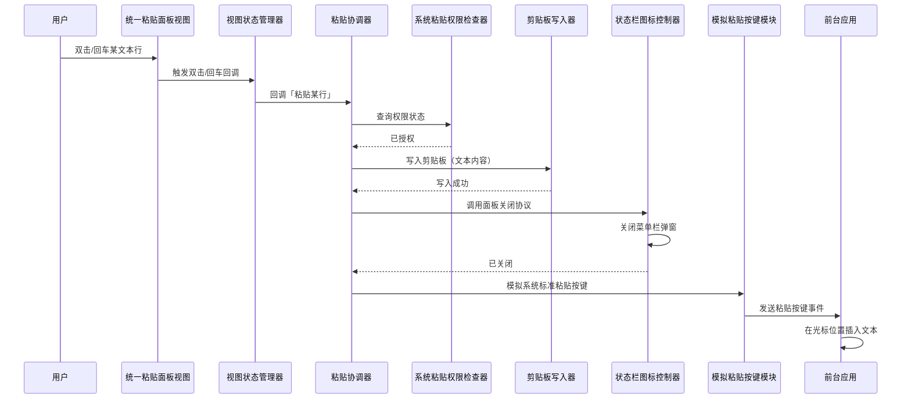

### 4.3 双击/回车触发粘贴数据流（菜单栏弹窗场景，无权限降级路径）

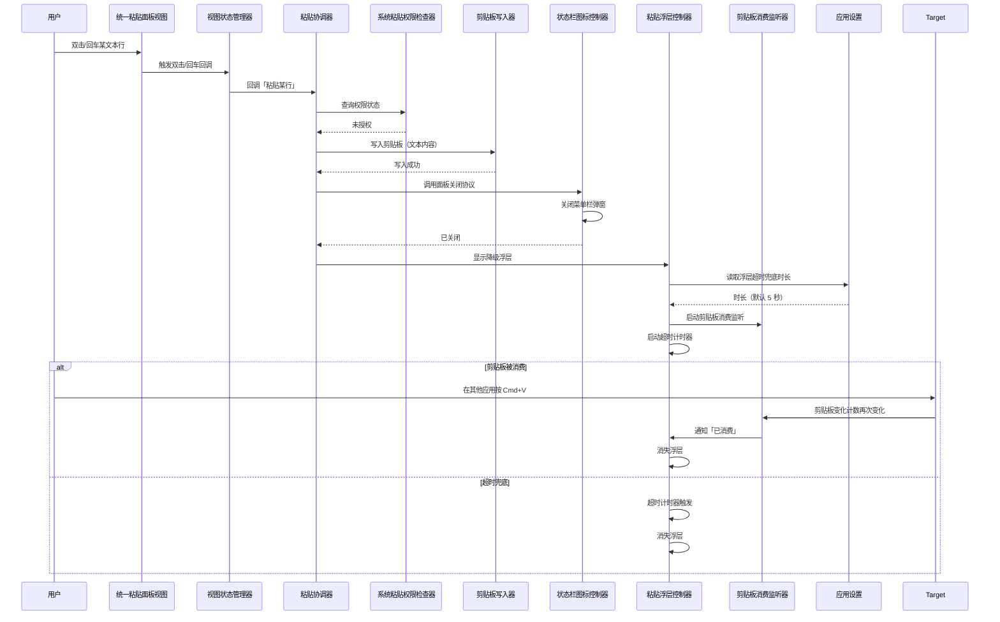

### 4.4 图片/文件路径双击提示数据流（菜单栏弹窗场景）

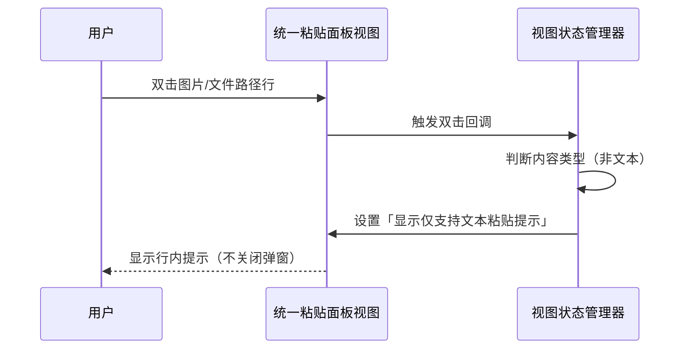

### 4.5 底部三按钮数据流（菜单栏弹窗场景）

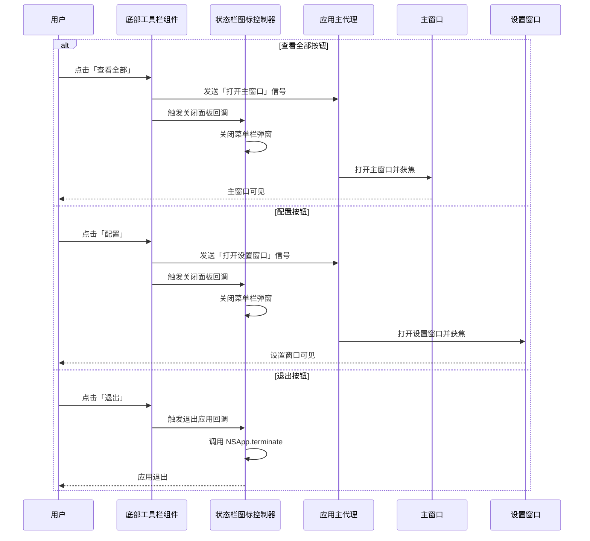

### 4.6 关闭弹窗数据流（三种路径）

> **v1.1 变更**：原「退出按钮关闭」路径已移除（退出按钮现改为退出整个应用，见 4.5 退出按钮路径），关闭弹窗路径由四种减少为三种。

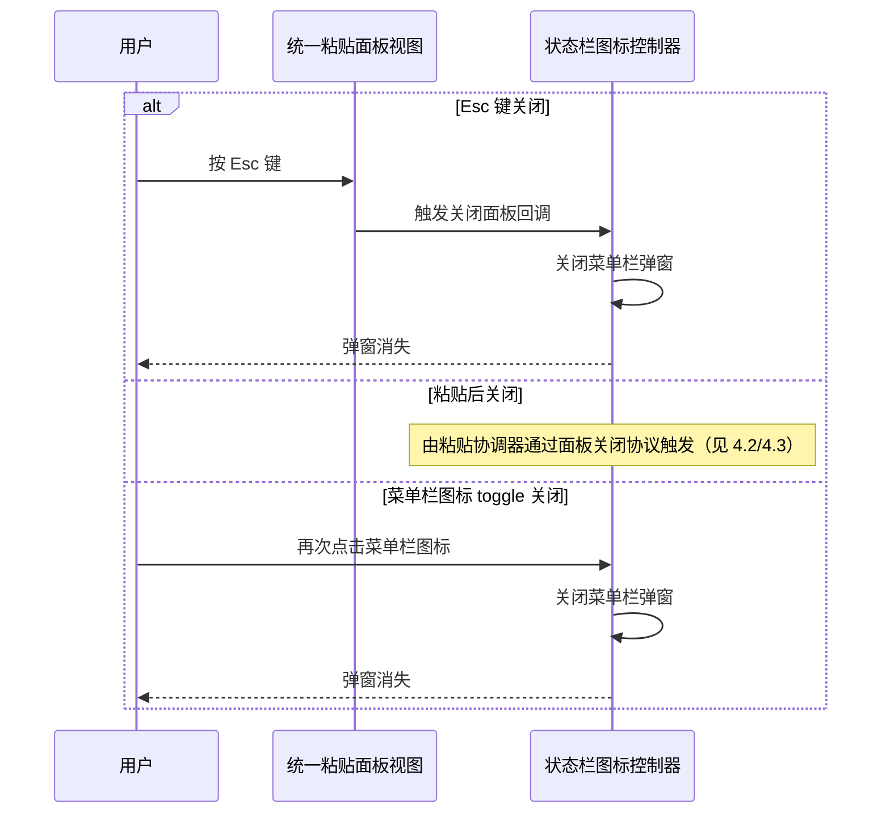

### 4.7 快捷键场景数据流（回归保护，与 F1.9 一致）

快捷键场景的数据流与 F1.9 设计文档第 4 节完全一致，本节不重复绘制。F1.11 的视图层合并不改变快捷键场景的数据流，仅把「快捷粘贴面板视图」替换为「统一粘贴面板视图」（隐藏底部工具栏），其余流程不变。

---

## 5. 状态变化

### 5.1 菜单栏弹窗状态机

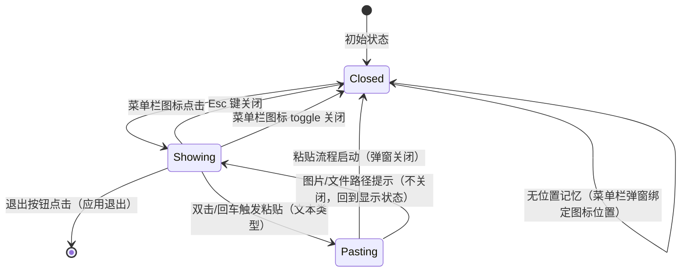

**状态说明**：

| 状态 | 说明 | 持久化 | UI 表现 |
|------|------|--------|---------|
| Closed | 弹窗未显示 | 否（菜单栏弹窗无需记忆位置） | 无 |
| Showing | 弹窗已显示，等待用户交互 | 否（内存） | 弹窗可见，第一行高亮，底部工具栏可见 |
| Pasting | 正在执行粘贴流程 | 否（内存） | 弹窗即将关闭（文本类型）或回到 Showing（图片/文件路径类型） |

**状态转换补充说明**：

- `Pasting --> Showing` 转换仅在用户双击/回车图片或文件路径类型行时触发，此时显示「仅支持文本粘贴」提示，弹窗不关闭，用户可继续操作其他行。文本类型行的粘贴流程则走 `Pasting --> Closed` 转换。
- `Showing --> [*]` 转换在用户点击「退出」按钮时触发，应用立即退出（调用 `NSApp.terminate`），无 Closed 状态过渡。v1.1 新增（原 v1.0 走 `Showing --> Closed` 退出按钮关闭路径，行为已变更为退出整个应用）。

### 5.2 统一粘贴面板视图状态管理器状态机（合并后）

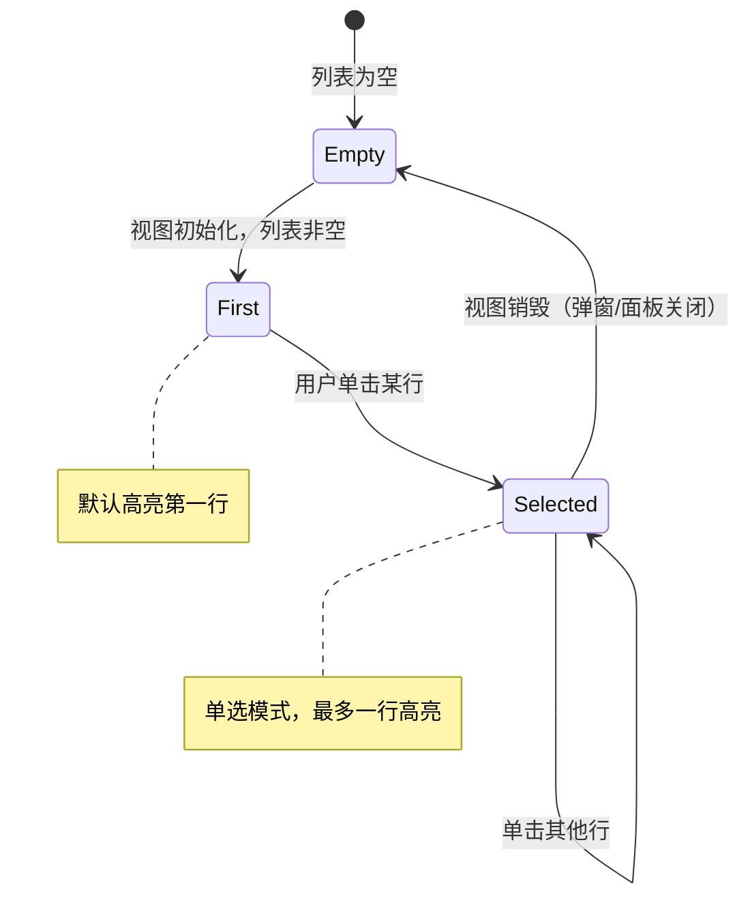

**状态说明**：

| 状态 | 说明 | 持久化 | UI 表现 |
|------|------|--------|---------|
| Empty | 无高亮选中（列表空） | 否 | 无 |
| First | 默认高亮第一行 | 否 | 第一行高亮 |
| Selected | 用户选中某行 | 否 | 选中行高亮，其他行取消高亮 |

### 5.3 辅助功能权限状态（运行时检测，不缓存，沿用 F1.9）

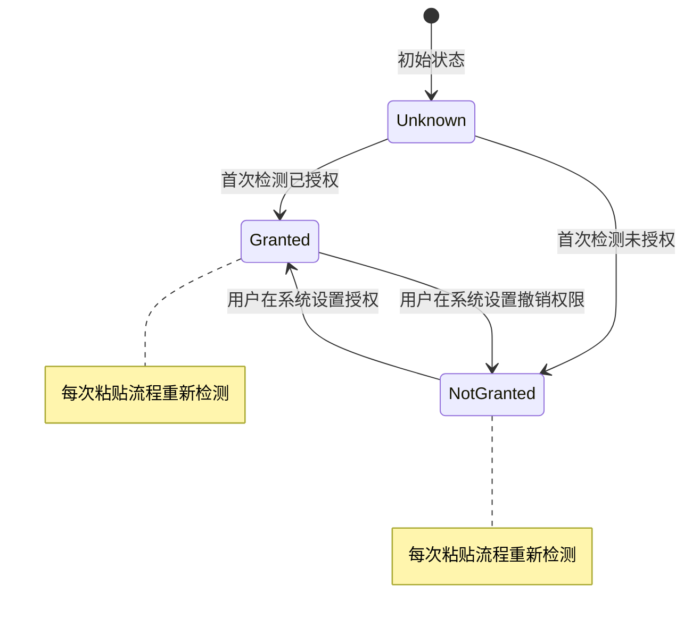

**说明**：辅助功能权限状态由系统管理，F1.11 沿用 F1.9 不缓存策略。每次粘贴流程启动时重新检测，确保权限被撤销后自动降级。

### 5.4 底部工具栏可见性状态

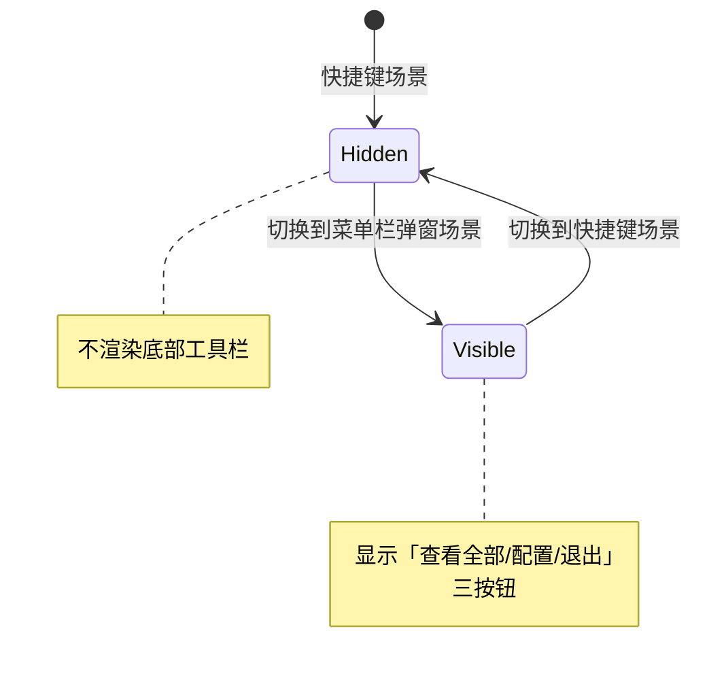

**说明**：底部工具栏可见性由包装控制器在初始化视图时通过外部参数注入，运行期间不切换（每个控制器实例对应一个固定场景）。

---

## 6. 协作关系

### 6.1 应用主代理的协作

应用主代理（现有模块，修改）在 F1.11 中新增两项协作：

1. **初始化状态栏图标控制器时注入依赖**：注入剪贴板存储（作为剪贴项数据源）与粘贴协调器回调。状态栏图标控制器在弹出弹窗前从剪贴板存储读取剪贴项列表并注入到统一粘贴面板视图。
2. **监听「打开设置窗口」信号**：收到信号后打开设置窗口并获得键盘焦点（与现有监听「打开主窗口」信号并行存在）。

应用主代理继续沿用 F1.9 的协作：
- 监听「打开快速粘贴面板」信号并调起快捷键面板控制器。
- 监听「打开主窗口」信号并打开主窗口。
- 初始化快捷键面板控制器与全局快捷键服务。

### 6.2 状态栏图标控制器与统一粘贴面板视图的协作

- 控制器在弹出弹窗前创建视图实例，注入剪贴项列表与底部工具栏可见性参数（菜单栏弹窗场景为可见）。
- 控制器注入粘贴协调器回调到视图状态管理器（或视图本身，由实现阶段决定）。
- 视图通过回调将「双击/回车某行」「Esc 键」事件传递给控制器或粘贴协调器。
- 控制器将「Esc 键」事件转化为弹窗关闭。

### 6.3 状态栏图标控制器与面板关闭协议的协作

- 控制器实现面板关闭协议的「关闭当前面板」接口。
- 接口被调用时，控制器关闭菜单栏弹窗（与菜单栏图标 toggle 关闭共用同一关闭路径）。
- 粘贴协调器在粘贴流程中调用面板关闭协议接口时，菜单栏弹窗能正确关闭（与快捷键面板共用同一协议接口）。

### 6.4 快捷键面板控制器与统一粘贴面板视图的协作（沿用 F1.9，仅替换视图）

- 控制器创建视图实例，注入剪贴项列表与底部工具栏可见性参数（快捷键场景为隐藏）。
- 控制器注入粘贴协调器回调到视图状态管理器。
- 视图通过回调将「双击/回车某行」「Esc 键」「失焦」事件传递给控制器。
- 控制器将「双击/回车某行」事件委托给粘贴协调器，将「Esc 键」和「失焦」事件转化为面板关闭。

### 6.5 粘贴协调器与各子模块的协作（沿用 F1.9，扩展到两个场景）

- 协调器接收控制器（状态栏图标控制器或快捷键面板控制器）的「双击/回车某行」事件。
- 协调器委托系统粘贴权限检查器查询权限状态。
- 协调器委托剪贴板写入器写入剪贴板。
- 协调器通过面板关闭协议委托控制器关闭面板（菜单栏弹窗或快捷键面板）。
- 有权限路径：协调器委托模拟粘贴按键模块发送粘贴按键（沿用 F1.9，主 Scheme 下回退到显示浮层）。
- 无权限路径：协调器委托粘贴浮层控制器显示浮层。

### 6.6 底部工具栏组件与应用主代理的协作

- 底部工具栏组件在「查看全部」按钮点击时发送「打开主窗口」信号（沿用 F1.9 已有信号）。
- 底部工具栏组件在「配置」按钮点击时发送「打开设置窗口」信号（新增信号）。
- 底部工具栏组件在「退出」按钮点击时触发关闭面板回调（由包装控制器处理）。
- 应用主代理接收信号后执行对应操作（打开主窗口/打开设置窗口）。

### 6.7 列表行视图与统一粘贴面板视图的协作

- 列表行视图（现有模块，F1.9 已修改）继续支持「高亮选中」状态与「单击/双击」回调。
- 统一粘贴面板视图管理「当前高亮选中行」状态，通过列表行视图的「高亮选中」属性同步状态。
- 列表行视图通过回调将「双击」和「单击」事件传递给统一粘贴面板视图。
- F1.11 的修改点：菜单栏弹窗场景也传入回调（F1.9 已支持但菜单栏弹窗未传入），快捷键场景保持不变。

### 6.8 数据源统一协作

- 状态栏图标控制器在弹出弹窗前从剪贴板存储读取剪贴项列表。
- 快捷键面板控制器在弹出面板前从同一剪贴板存储读取剪贴项列表。
- 两个控制器注入到视图的剪贴项列表与剪贴板存储当前状态同步（无延迟、无缺失、无重复）。
- 视图本身不直接读取剪贴板存储，仅消费外部注入的列表。

---

## 7. 关键设计决策

### 7.1 为什么合并视图层而非保持两套独立视图？

**决策**：把菜单栏弹窗视图与快捷键面板视图合并为统一粘贴面板视图，由两个控制器分别包装。

**理由**：

- 两套视图存在大量重复代码（列表渲染、键盘事件、选中态逻辑），后续维护与扩展需要双倍成本（根据 FR-014、NFR-007）。
- 合并后列表渲染、键盘交互、选中态逻辑只在一处实现，后续修改只需改一处，菜单栏弹窗与快捷键面板同步生效（根据 NFR-007）。
- 通过外部参数控制底部工具栏显隐，保留两个场景的视觉差异（菜单栏弹窗显示三按钮，快捷键面板隐藏）。
- 上游需求摘要已确认此架构决策（用户在步骤 0 需求拷问中连续三次未明确选择，基于其他选择推断为视图层合并，用户在出口判定中确认接受）。

**代价**：合并需要重构现有菜单栏弹窗视图与快捷键面板视图，可能影响 F1.9 已有的自动化测试用例。

**为何可接受**：F1.9 已有的辅助功能标识符保持不变（根据 Out of Scope 9.2），自动化测试用例向后兼容；合并后视图通过外部参数区分场景，不影响已有用例的标识符。

### 7.2 为什么状态栏图标控制器实现面板关闭协议？

**决策**：扩展 F1.9 已有的面板关闭协议，使状态栏图标控制器实现该协议，关闭菜单栏弹窗与关闭快捷键面板使用统一接口。

**理由**：

- 粘贴协调器在粘贴流程中需要关闭面板，若菜单栏弹窗与快捷键面板使用不同关闭接口，协调器需要区分场景调用不同接口，增加复杂度（根据 FR-013）。
- 面板关闭协议已由快捷键面板控制器实现（F1.9 已有），扩展到状态栏图标控制器仅需新增一个实现，不修改协议本身（根据 NFR-007 可维护性）。
- 统一接口使粘贴协调器能同时服务两个场景，无需场景判断逻辑（根据 FR-014 数据源统一的精神延伸到关闭接口统一）。

**代价**：状态栏图标控制器需要新增实现协议方法，增加少量代码。

**为何可接受**：协议方法实现简单（关闭菜单栏弹窗），且与现有 toggle 关闭路径共用同一关闭逻辑，无额外维护成本。

### 7.3 为什么底部工具栏通过外部参数控制显隐而非运行时切换？

**决策**：底部工具栏可见性由包装控制器在初始化视图时通过外部参数注入，运行期间不切换。

**理由**：

- 每个控制器实例对应一个固定场景（状态栏图标控制器对应菜单栏弹窗场景，快捷键面板控制器对应快捷键场景），运行期间不会切换场景。
- 外部参数注入使视图本身无需感知场景上下文，降低耦合（根据 NFR-007）。
- 视图初始化时确定可见性，避免运行时切换导致的重绘与状态不一致。

**代价**：若未来需要支持「运行时切换场景」（如菜单栏弹窗内动态切换为快捷键模式），需要重构为运行时切换。

**为何可接受**：当前无此需求（Out of Scope 未提及），外部参数注入满足当前所有 FR。

### 7.4 为什么数据源通过外部注入而非视图直接读取存储？

**决策**：统一粘贴面板视图不直接读取剪贴板存储，剪贴项列表由包装控制器从剪贴板存储读取后注入到视图。

**理由**：

- 视图直接读取存储会导致视图与存储耦合，违反 UI → 业务模块 → 数据模型层的依赖方向（视图属于 UI 层，存储属于业务模块层，视图直接读取存储是合理的，但视图直接持有存储实例会限制可测试性）。
- 外部注入使视图可通过注入 mock 数据进行单元测试，无需依赖真实存储（根据 NFR-007 可维护性、CODING_STANDARDS.md 测试规范「Mock 只模拟外部依赖，不 mock 被测对象本身」）。
- 两个控制器从同一剪贴板存储读取数据，确保数据源统一（根据 FR-014）。

**代价**：控制器需要新增读取存储并注入到视图的逻辑，增加少量代码。

**为何可接受**：控制器读取存储是合理的依赖方向（控制器属于 UI 层，可访问业务模块），且注入逻辑简单（一次性读取 + 注入）。

### 7.5 为什么「打开设置窗口」信号需要新增而非复用现有信号？

**决策**：新增「打开设置窗口」信号（若已有则复用），与现有「打开主窗口」信号并行存在。

**理由**：

- 现有信号仅有「打开主窗口」（F1.9 已有），无「打开设置窗口」专用信号。
- 主窗口与设置窗口是两个独立窗口，使用同一信号会导致接收方需要判断「是打开主窗口还是设置窗口」，增加复杂度。
- 新增专用信号使接收方（应用主代理）能直接对应处理，无需判断。

**代价**：新增一个信号定义（少量代码）。

**为何可接受**：信号定义简单（一个常量），且与现有「打开主窗口」信号同类型，无额外维护成本。

**待确认**：实现阶段需先确认是否已有「打开设置窗口」信号（如主窗口内的设置入口可能已用过类似信号），避免重复创建。决策时机为 Phase 3 实现时（见第 10.4 节）。

### 7.6 为什么菜单栏弹窗状态机不记忆位置？

**决策**：菜单栏弹窗状态机的 Closed 状态不记录面板位置（与快捷键面板状态机的 Closed 状态记录位置不同）。

**理由**：

- 菜单栏弹窗绑定在菜单栏图标位置（由系统弹窗行为决定），每次弹出位置固定，无需记忆。
- 快捷键面板需要记忆位置是因为无权限时定位到「屏幕中央或上次关闭位置」（F1.9 FR-002），菜单栏弹窗无此需求。
- 不记忆位置简化状态机，减少持久化逻辑。

**代价**：菜单栏弹窗与快捷键面板的状态机略有差异（Closed 状态的持久化内容不同）。

**为何可接受**：两个状态机的差异仅在 Closed 状态的持久化内容，不影响其他状态的转换逻辑，可维护性可接受。

### 7.7 为什么「退出」按钮退出整个应用？（v1.1 修订）

**决策**：「退出」按钮点击后退出整个应用（调用 `NSApp.terminate`）。

**理由**：

- 用户期望「退出」按钮退出整个应用，而非仅关闭弹窗。用户反馈「点击退出按钮没反应」，根因是语义误解——v1.0 设计文档将「退出」按钮定义为「退出弹窗」（仅关闭 popover），与用户期望不符。
- 应用退出由「退出」按钮承担更直观，符合 macOS 应用菜单栏弹窗的常见交互习惯。
- 通过 `onExitApp` 回调抽象退出动作，由 `StatusItemController` 注入 `NSApp.terminate(nil)`，便于在 UITEST 模式下由 `PopoverPreviewWindowFactory` 注入测试 stub（`window?.close()`），避免真的退出测试进程。

**代价**：

- 与系统菜单栏的「退出 ClipMind」入口重复（macOS 标准行为），但用户期望优先。
- 真实退出行为无法直接自动化测试（会终止测试进程），需通过 UITEST stub 间接验证按钮被触发。

**为何可接受**：

- 「退出」按钮文案明确表示退出应用，避免用户混淆。系统菜单栏入口仍保留（macOS 标准）。
- UITEST 模式下注入 stub 保证测试可执行性，关键断言（`onExitApp` 回调可被设置与触发）已由 XCTest 覆盖。

**历史**：

- v1.0 决策为「不退出应用而只关闭弹窗」，理由是「应用退出由系统菜单栏承担」。
- v1.1 修订为「退出整个应用」（基于用户反馈与 Bug Fix commit edb9688）。原决策的「代价」（用户可能期望退出应用）被用户反馈证实，触发决策调整。

---

## 8. 非功能约束落地

### 8.1 响应性能（NFR-001）

| 约束 | 落地方式 |
|------|---------|
| 菜单栏图标点击到弹窗出现 ≤ 200ms | 状态栏图标控制器在收到点击事件后同步读取剪贴板存储 + 创建视图 + 显示弹窗，读取存储 ≤ 50ms，创建视图 ≤ 50ms，显示 ≤ 100ms |
| 双击/回车到剪贴板写入 ≤ 100ms | 协调器同步调用剪贴板写入器，写入是系统 API 调用，通常 < 50ms（沿用 F1.9） |
| 有权限路径模拟粘贴 ≤ 300ms | 弹窗关闭回调触发模拟粘贴按键，模拟是系统 API 调用，通常 < 100ms，受前台应用响应速度影响（沿用 F1.9） |
| 列表交互 ≤ 16ms | 视图使用声明式 UI 框架的高效列表渲染，单击/方向键导航是本地状态变更，无网络/磁盘 IO |
| 默认高亮第一行无延迟 | 视图状态管理器在初始化时设置选中索引为 0，与视图渲染同步完成 |

### 8.2 稳定性（NFR-002）

| 约束 | 落地方式 |
|------|---------|
| 100 次连续操作无崩溃、无内存泄漏 | 控制器在弹窗关闭时释放视图与子模块引用（沿用 F1.9）；视图状态管理器随视图销毁释放 |
| 四种关闭路径互不冲突 | 控制器维护单一「弹窗状态」（见 5.1 状态机），关闭后忽略后续关闭事件；与 F1.9 快捷键面板的状态机策略一致 |
| 权限检测在循环中状态正确 | 每次粘贴流程重新检测，不缓存状态（沿用 F1.9） |
| 视图层合并后两场景行为一致 | 统一粘贴面板视图通过外部参数区分场景，列表交互逻辑只在一处实现，两场景行为天然一致 |

### 8.3 安全性（NFR-003）

| 约束 | 落地方式 |
|------|---------|
| 不输出剪贴板原文 | 所有日志仅记录元数据（如「已写入剪贴板，长度 256」），使用现有日志分类与隐私修饰符（沿用 F1.9） |
| 仅发送系统标准粘贴按键 | 模拟粘贴按键模块仅发送系统标准粘贴按键事件，不发送其他按键（沿用 F1.9） |
| 浮层不显示原文 | 浮层提示使用硬编码通用文案「已复制，按 Cmd+V 粘贴」（沿用 F1.9） |
| 写入剪贴板不绕过敏感识别 | 剪贴板写入器仅写入用户选中的条目内容，敏感识别在捕获阶段已处理（沿用 F1.9） |

### 8.4 兼容性（NFR-004）

| 约束 | 落地方式 |
|------|---------|
| macOS 13.0+ | 不使用 macOS 13 以下专有 API；声明式 UI 框架的按键事件修饰符在 macOS 13 可用 |
| Apple Silicon + Intel | 不使用架构相关 API，Universal Binary 构建自动兼容 |
| 保留菜单栏图标 toggle 行为 | 状态栏图标控制器的 toggle 行为不变，与快捷键面板是两个独立入口 |
| 保留 F1.9 快捷键入口行为 | 全局快捷键服务的注册与触发逻辑不变；快捷键面板控制器不变（仅替换视图）；F1.9 已有的辅助功能标识符保持不变 |
| 老用户无感知迁移 | 菜单栏图标点击行为升级，无需用户重新配置；快捷键入口行为完全一致 |

### 8.5 可访问性（NFR-005）

| 约束 | 落地方式 |
|------|---------|
| VoiceOver 朗读 | 所有交互元素设置无障碍标签（如「剪贴项列表」「搜索框」「查看全部按钮」「配置按钮」「退出按钮」「已复制提示」） |
| 键盘导航完整覆盖 | 单击/双击/方向键/回车/Esc 全部支持键盘操作；底部三按钮支持键盘 Tab 焦点切换与回车激活 |
| 高亮对色盲用户可识别 | 高亮状态不仅依赖颜色，辅以边框或形状差异（沿用 F1.9） |

### 8.6 合规性（NFR-006）

| 约束 | 落地方式 |
|------|---------|
| App Sandbox 启用 | 所有模块在沙盒内运行，不通过外部进程或脚本绕过 |
| 无权限降级方案纯沙盒内 | 剪贴板写入、浮层显示、消费监听全部使用沙盒内公开 API（沿用 F1.9） |
| 有权限方案公开 API | 辅助功能 API、模拟按键 API 均为公开 API，使用标准 TCC 权限流程（沿用 F1.9） |
| 合规风险标注 | 详见第 10 节风险章节，方案1（有权限路径）标注「合规待定」（沿用 F1.9 风险章节） |

### 8.7 可维护性（NFR-007）

| 约束 | 落地方式 |
|------|---------|
| 视图层合并后单一实现 | 统一粘贴面板视图承载列表渲染、键盘事件、选中态逻辑，菜单栏弹窗与快捷键面板共用同一实现 |
| 后续修改同步生效 | 修改列表交互只需改一处，两个场景同步生效（外部参数控制场景差异） |
| 模块依赖方向保持 | UI 层 → 业务模块 → 数据模型层，不引入反向依赖；视图通过外部注入接收数据，不直接持有存储实例 |

---

## 9. 与 Requirements 的映射

### 9.1 FR 到模块映射表

| FR 编号 | FR 描述 | 负责模块 |
|---------|--------|---------|
| FR-001 | 菜单栏弹窗打开后默认高亮第一行 | 状态栏图标控制器（修改） + 统一粘贴面板视图 + 统一粘贴面板视图状态管理器 |
| FR-002 | 列表行双击触发粘贴流程 | 统一粘贴面板视图 + 统一粘贴面板视图状态管理器 + 列表行视图（修改） + 粘贴协调器 |
| FR-003 | 回车键粘贴 | 统一粘贴面板视图 + 统一粘贴面板视图状态管理器 + 粘贴协调器 |
| FR-004 | 键盘方向键导航 | 统一粘贴面板视图 + 统一粘贴面板视图状态管理器 |
| FR-005 | Esc 键关闭菜单栏弹窗 | 统一粘贴面板视图 + 状态栏图标控制器（实现面板关闭协议） |
| FR-006 | 底部「查看全部」按钮 | 底部工具栏组件（新增） + 状态栏图标控制器（关闭弹窗） + 应用主代理（监听「打开主窗口」信号） |
| FR-007 | 底部「配置」按钮 | 底部工具栏组件（新增） + 状态栏图标控制器（关闭弹窗） + 应用主代理（监听「打开设置窗口」信号） |
| FR-008 | 底部「退出」按钮 | 底部工具栏组件（新增） + 状态栏图标控制器（直接调用 `NSApp.terminate` 退出应用） |
| FR-009 | 图片/文件路径类型双击提示 | 统一粘贴面板视图状态管理器 + 统一粘贴面板视图 |
| FR-010 | 有辅助功能权限时自动粘贴 | 粘贴协调器 + 系统粘贴权限检查器 + 剪贴板写入器 + 模拟粘贴按键模块（沿用 F1.9） + 状态栏图标控制器（实现面板关闭协议） |
| FR-011 | 无辅助功能权限时降级粘贴流程 | 粘贴协调器 + 系统粘贴权限检查器 + 剪贴板写入器 + 粘贴浮层控制器 + 剪贴板消费监听器（沿用 F1.9） + 状态栏图标控制器（实现面板关闭协议） |
| FR-012 | 快捷键入口行为与 F1.9 完全一致 | 快捷键面板控制器（不变） + 统一粘贴面板视图（隐藏底部工具栏） + 粘贴协调器（沿用 F1.9） |
| FR-013 | 面板关闭协议扩展与状态栏图标控制器实现 | 面板关闭协议（沿用 F1.9） + 状态栏图标控制器（新增实现） + 快捷键面板控制器（继续实现） |
| FR-014 | 数据源统一与外部注入 | 状态栏图标控制器（修改） + 快捷键面板控制器（修改） + 剪贴板存储（外部注入到视图） + 统一粘贴面板视图（消费注入数据） |

### 9.2 NFR 落地映射

| NFR 编号 | NFR 描述 | 落地章节 |
|---------|---------|---------|
| NFR-001 | 响应性能 | 8.1 |
| NFR-002 | 稳定性 | 8.2 |
| NFR-003 | 安全性 | 8.3 |
| NFR-004 | 兼容性 | 8.4 |
| NFR-005 | 可访问性 | 8.5 |
| NFR-006 | 合规性 | 8.6 + 10 |
| NFR-007 | 可维护性 | 8.7 |

### 9.3 Constraints 落地映射

| Constraints 编号 | 约束描述 | 落地方式 |
|----------------|---------|---------|
| 7.1 业务约束 | 不改 F1.9 快捷键触发逻辑 | 快捷键面板控制器与全局快捷键服务不变（第 2.3 节） |
| 7.1 业务约束 | 不改 F1.9 已有辅助功能标识符 | 统一粘贴面板视图沿用 F1.9 标识符（第 8.4 节） |
| 7.1 业务约束 | 不引入新权限申请流程 | 沿用 F1.9 系统粘贴权限检查器（第 2.3 节） |
| 7.1 业务约束 | 不改剪贴板存储持久化逻辑 | 剪贴板存储不变，仅外部注入到视图（第 2.3 节、第 6.8 节） |
| 7.1 业务约束 | 不改动主窗口功能 | 应用主代理仅新增监听「打开设置窗口」信号（第 6.1 节） |
| 7.1 业务约束 | 不删除菜单栏 toggle 行为 | 状态栏图标控制器保留 toggle 行为（第 3.1 节） |
| 7.2 兼容约束 | macOS 13.0+ | 第 8.4 节 |
| 7.2 兼容约束 | 老用户无感知迁移 | 第 8.4 节 |
| 7.2 兼容约束 | F1.9 测试用例回归 | 第 8.4 节、第 10.1 节 |
| 7.3 合规约束 | App Store 主方案合规 | 第 8.6 节、第 10 节 |
| 7.3 合规约束 | 辅助功能权限依赖标注 | 第 10.3 节 |

---

## 10. 风险和待确认问题

### 10.1 技术风险

| 风险 | 影响 | 概率 | 缓解措施 |
|------|------|------|---------|
| 视图层合并影响 F1.9 已有的自动化测试用例 | F1.9 回归测试失败 | 中 | 保持 F1.9 已有辅助功能标识符不变（根据 Out of Scope 9.2）；合并后视图通过外部参数区分场景，不影响已有用例的标识符；Phase 4 实现时运行 F1.9 全部用例验证回归 |
| 状态栏图标控制器实现面板关闭协议时与现有 toggle 关闭路径冲突 | 重复关闭事件 | 低 | 控制器维护单一「弹窗状态」（见 5.1 状态机），关闭后忽略后续关闭事件；与 F1.9 快捷键面板的状态机策略一致 |
| 菜单栏弹窗的键盘事件监听与系统弹窗行为冲突 | 键盘事件不生效 | 中 | F1.9 已验证快捷键面板的键盘事件监听方案有效，菜单栏弹窗沿用同一方案；Phase 2 实现时需验证菜单栏弹窗场景的键盘事件监听（系统弹窗行为为 transient，可能影响事件路由） |
| 底部工具栏按钮点击与列表双击事件冲突 | 误触发 | 低 | 底部工具栏按钮与列表行是独立 UI 元素，事件不冲突；Phase 3 实现时验证 |
| 数据源注入时机延迟（控制器读取存储慢于弹窗显示） | 弹窗显示时列表为空 | 低 | 控制器在弹出弹窗前同步读取存储（≤ 50ms），读取完成后再显示弹窗；Phase 1 实现时验证 |
| 「打开设置窗口」信号与主窗口内设置入口冲突 | 重复打开设置窗口 | 低 | Phase 3 实现时先确认是否已有信号，避免重复创建；若已有则复用，应用主代理去重处理 |

### 10.2 合规风险（App Store，沿用 F1.9）

| 风险 | 影响 | 概率 | 缓解措施 |
|------|------|------|---------|
| **方案1（有权限路径）依赖辅助功能权限，App Store 审核可能拒绝** | 有权限路径无法上架主 Scheme | 中 | **合规待定**：方案1使用公开 API（辅助功能 API + 模拟按键 API）+ 标准 TCC 权限流程，理论上合规；但 App Store 审核对辅助功能权限的审核较严，存在被拒风险。若被拒，方案1暂存到开发验证 Scheme，主 Scheme 仅保留方案3（无权限降级）。沿用 F1.9 第 10.2 节风险章节 |
| **方案1模拟粘贴按键可能被视为「自动化用户输入」** | App Store 审核拒绝 | 低 | 模拟粘贴按键仅发送系统标准粘贴按键，不发送任意按键序列，符合「响应用户双击操作」的语义；在审核备注中说明「用户主动双击触发粘贴，非自动化批量操作」。沿用 F1.9 |
| **方案1获取前台应用光标位置可能被视为「跨应用读取用户输入」** | App Store 审核拒绝 | 低 | 光标位置仅用于面板定位（快捷键场景），不读取光标处的文本内容；菜单栏弹窗场景不使用光标定位。沿用 F1.9 |

### 10.3 「合规待定」标注（针对方案1，沿用 F1.9）

**方案1（有权限路径）状态**：合规待定

**依据**：

- 方案1使用公开 API：辅助功能 API 系列查询权限状态、系统事件 API 系列模拟粘贴按键。
- 方案1使用标准 TCC 权限流程：通过辅助功能权限检测 API 检测权限状态，权限请求由首次启动引导承担。
- 方案1不使用私有 API、不绕过沙盒、不发送任意按键序列、不读取用户输入内容。

**风险**：

- App Store 审核对辅助功能权限的审核较严，可能要求详细说明权限用途。
- 模拟粘贴按键可能被视为「自动化用户输入」，需在审核备注中明确「响应用户双击操作」。

**回退方案**：

- 若 App Store 审核拒绝方案1，则方案1暂存到开发验证 Scheme（开发验证用），主 Scheme 仅保留方案3（无权限降级）。
- 主 Scheme 仅保留方案3时，用户体验略有下降（需手动按 Cmd+V 粘贴），但功能完整、合规无风险。
- 一旦为方案1找到合规实现（如通过 App Store 审核的类似应用案例佐证），立即迁移回主 Scheme，并在提交信息中说明合规方案。

**审核备注模板**（提交 App Store 时使用，沿用 F1.9）：

> ClipMind 的菜单栏弹窗双击粘贴功能使用辅助功能权限用于：
> 1. 模拟系统标准粘贴按键（仅 Cmd+V，不发送任意按键序列），响应用户双击剪贴项的粘贴操作。
> 2. （快捷键场景）获取前台应用光标位置（仅坐标，不读取文本内容），用于面板定位。
>
> 该功能不读取用户输入内容、不发送任意按键序列、不批量自动化操作，仅在用户主动双击剪贴项时触发一次粘贴按键。

### 10.4 待确认问题

| 问题 | 影响范围 | 建议方案 | 决策时机 |
|------|---------|---------|---------|
| 统一粘贴面板视图与视图状态管理器的具体命名 | Phase 1 视图层合并 | 命名属于实现细节，由实现阶段决定（如「统一粘贴面板视图」「合并粘贴视图」等）。本设计文档按合并后的单一模块描述，不约束具体类型命名 | Phase 1 实现时 |
| 粘贴协调器实例的服务方式（单实例服务两个控制器 vs 每控制器各持有一个实例） | Phase 1 协调器接入 | 单实例服务两个控制器可减少对象数量，但需要确保协调器无状态；每控制器各持有一个实例更安全，但增加对象数量。建议每控制器各持有一个实例（协调器轻量，无共享状态风险） | Phase 1 实现时 |
| 「打开设置窗口」信号是否已有 | Phase 3 信号新增 | 实现阶段先搜索代码库是否已有此信号（如主窗口内设置入口可能已用过类似信号）；若已有则复用，若未有则新增 | Phase 3 实现时 |
| 菜单栏弹窗的键盘事件监听方案是否需要调整 | Phase 2 键盘交互 | F1.9 快捷键面板使用本地事件监听器（应用工具包的事件监听公开 API），菜单栏弹窗场景需验证是否生效（系统弹窗 transient 行为可能影响事件路由）。若不生效，改用声明式 UI 框架的按键事件修饰符或其他公开 API | Phase 2 实现时 |
| 底部工具栏组件的视觉风格（按钮排列、间距、图标、配色） | Phase 3 底部工具栏 | 视觉风格属于实现细节，由视觉原型（步骤 5b）与实现阶段决定。建议与 F1.9 快捷键面板视觉一致，仅按钮文案与图标不同 | 步骤 5b 视觉原型 + Phase 3 实现时 |
| 列表行视图在菜单栏弹窗场景传入回调是否影响现有菜单栏 popover 行为 | Phase 1 列表行修改 | F1.9 已通过可选回调实现，菜单栏弹窗不传入回调即不触发新交互。F1.11 需在菜单栏弹窗场景传入回调，需验证现有菜单栏 popover 行为不受影响（如点击行不再有其他副作用） | Phase 1 实现时 |

---

## 版本记录

| 版本 | 日期 | 变更说明 |
|------|------|---------|
| v1.0 | 2026-07-25 | 初始版本，覆盖 F1.11 菜单栏弹窗双击粘贴设计，包含 10 章节（文档定位/模块划分/职责边界/数据流/状态变化/协作关系/关键设计决策/非功能约束落地/与 Requirements 的映射/风险和待确认问题），2 个新增模块（底部工具栏组件 + 「打开设置窗口」信号）+ 4 个修改模块（状态栏图标控制器/列表行视图/应用主代理/菜单栏弹窗视图）+ 7 个复用模块（快捷键面板控制器/粘贴协调器/系统粘贴权限检查器/剪贴板写入器/粘贴浮层控制器/剪贴板消费监听器/应用设置），7 个数据流序列图，4 个状态机，7 项关键设计决策，7 项 NFR 落地，FR 到模块映射表全覆盖（14 条 FR），6 项技术风险 + 3 项合规风险 + 1 项合规待定标注 + 6 项待确认问题。严格遵守 dd-write-design P0 铁律：mermaid 图节点全部使用中文业务术语（无英文类名）。 |
| v1.1 | 2026-07-25 | Bug Fix（commit edb9688）：将「退出」按钮行为从「关闭弹窗」调整为「退出整个应用」（调用 `NSApp.terminate`）。同步更新 3.4 底部工具栏组件、3.8 职责边界无冲突验证、4.5 底部三按钮数据流（退出按钮路径）、4.6 关闭弹窗数据流（四种路径→三种路径）、5.1 菜单栏弹窗状态机（新增 `Showing --> [*]` 退出应用转换）、7.7 关键设计决策（原决策被颠覆，重写为退出整个应用）、9.1 FR 到模块映射表（FR-008）。新增 `onExitApp` 回调抽象便于测试隔离（生产环境注入 `NSApp.terminate`，UITEST 模式注入 `window?.close()` stub）。 |
