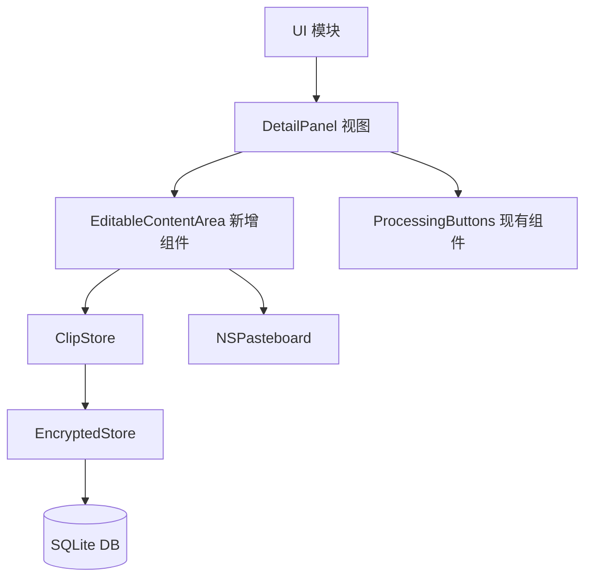
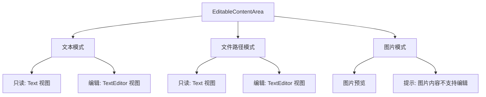
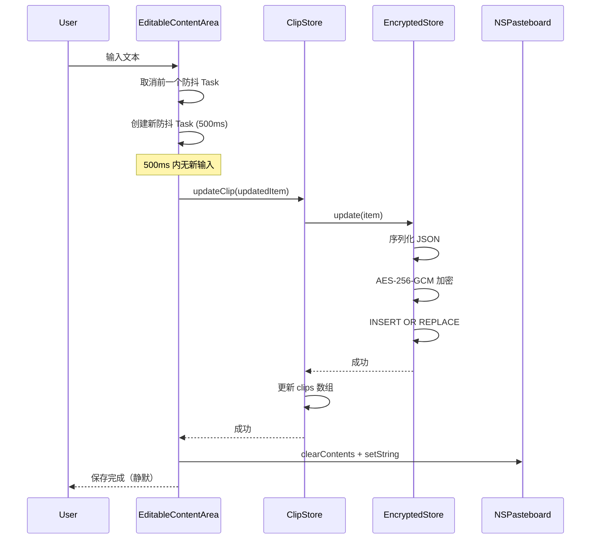
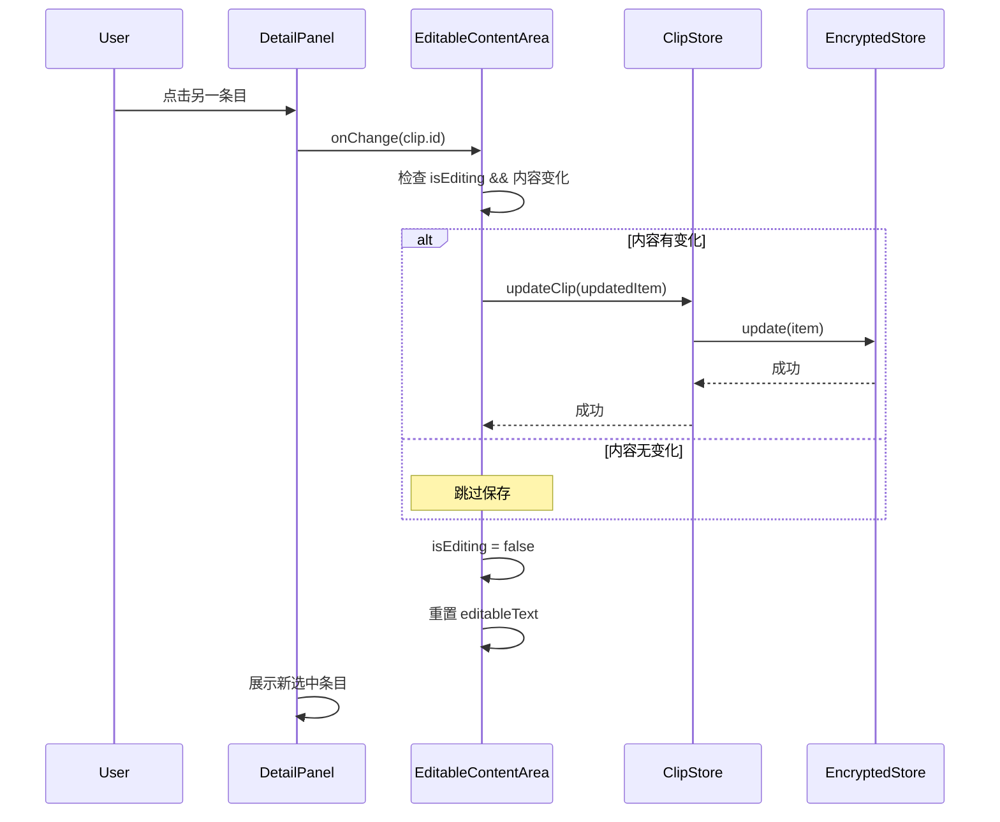
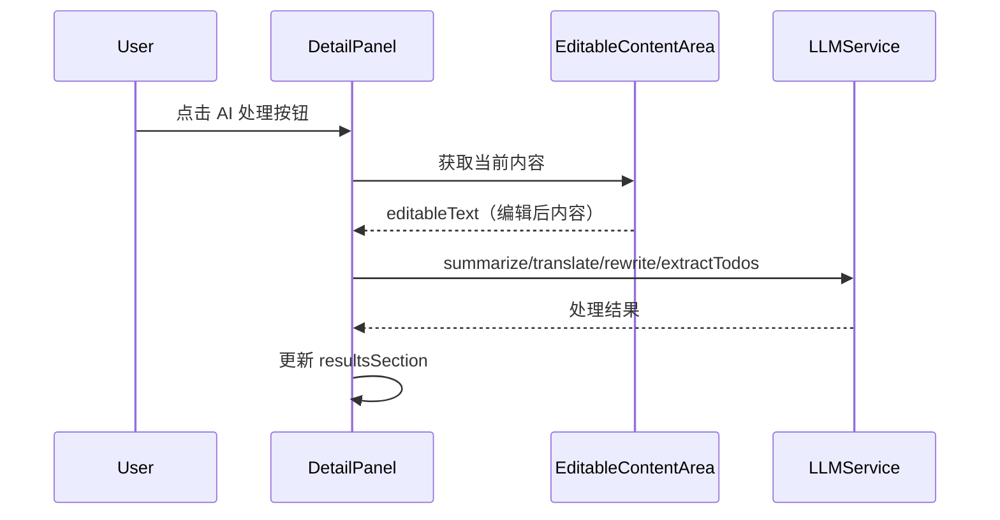

> 最后更新：2026-07-27 | 版本：v1.0

# F1.12 详细窗口内容可编辑 设计文档

**功能编号**：F1.12
**优先级**：P0
**文档存放路径**：`docs/planning/P0/F1/F1.12_详细窗口内容可编辑_设计文档.md`
**关联需求文档**：`docs/planning/P0/F1/F1.12_详细窗口内容可编辑_需求文档.md` v1.0
**关联视觉原型**：`docs/planning/P0/F1/F1.12_详细窗口内容可编辑_视觉原型.html`
**关联测试用例表**：`docs/planning/P0/F1/F1.12_详细窗口内容可编辑_测试用例表.md`
**关联主设计规范**：`docs/planning/P0/F1/F1_ClipMind_设计规范.md` v1.10

---

## 目录

1. [Architecture Overview（架构概览）](#1-architecture-overview架构概览)
2. [Component Design（组件设计）](#2-component-design组件设计)
3. [Data Flow（数据流）](#3-data-flow数据流)
4. [API Contracts（接口契约）](#4-api-contracts接口契约)
5. [Error Handling（错误处理）](#5-error-handling错误处理)
6. [Concurrency（并发）](#6-concurrency并发)
7. [Security & Privacy（安全与隐私）](#7-security--privacy安全与隐私)
8. [Testing Strategy（测试策略）](#8-testing-strategy测试策略)
9. [Migration & Compatibility（迁移与兼容）](#9-migration--compatibility迁移与兼容)
10. [Risks & Mitigations（风险与缓解）](#10-risks--mitigations风险与缓解)

---

## 1. Architecture Overview（架构概览）

### 1.1 模块关系

F1.12 在现有架构中涉及以下模块：



### 1.2 变更范围

| 模块 | 变更类型 | 说明 |
|------|---------|------|
| `UI/MainWindow/DetailPanel.swift` | 修改 | 替换只读 Text 为可编辑 EditableContentArea 组件 |
| `UI/MainWindow/EditableContentArea.swift` | 新增 | 封装编辑模式切换、自动保存、剪贴板同步逻辑 |
| `Storage/EncryptedStore.swift` | 修改 | 新增 `update(_ item: ClipItem)` 方法 |
| `UI/ClipStore.swift` | 修改 | 新增 `updateClip(_ item: ClipItem)` 方法 |
| `Models/ClipItem.swift` | 不变 | content 字段已有 var 语义（通过 copy-on-write） |
| `Models/ClipContent.swift` | 不变 | 枚举 case 已支持值修改 |

### 1.3 依赖方向

保持现有依赖方向不变：`UI` → 业务模块 → `Models` / `Utils`。

- `EditableContentArea`（UI 层）→ `ClipStore`（UI 层）→ `EncryptedStore`（Storage 层）
- `EditableContentArea`（UI 层）→ `NSPasteboard`（系统框架）
- 不引入反向依赖，不引入跨层直接调用。

---

## 2. Component Design（组件设计）

### 2.1 EditableContentArea

新增 SwiftUI 视图组件，负责详情面板内容区域的编辑逻辑。

**职责**：

- 根据 ClipContent 类型选择展示模式：文本/文件路径可编辑，图片只读+提示。
- 管理编辑模式状态（只读/编辑切换）。
- 编辑内容变化时触发防抖自动保存。
- 保存后同步内容到系统剪贴板。
- 切换条目时保存当前编辑。

**状态**：

| 状态 | 类型 | 说明 |
|------|------|------|
| `isEditing` | `@State Bool` | 是否处于编辑模式 |
| `editableText` | `@State String` | 当前编辑的文本内容 |
| `saveTask` | `@State Task<Void, Never>?` | 当前防抖保存任务 |
| `saveError` | `@State String?` | 保存失败时的错误信息 |

**视图层级**：



**点击交互**：

- 文本/文件路径类型：点击内容区域 → `isEditing = true` → Text 替换为 TextEditor → 通过 `@FocusState` 自动聚焦。
- 图片类型：不响应点击，始终显示提示。

**自动保存防抖**：

- 内容变化 → 取消前一个 `saveTask` → 创建新 `Task`（延迟 500ms）→ 500ms 内无新变化 → 执行保存。
- 保存流程：`editableText` → 构造更新后的 `ClipItem` → `ClipStore.updateClip()` → `EncryptedStore.update()` → 成功后同步 `NSPasteboard.general`。

**切换条目保存**：

- `.onChange(of: clip.id)` 触发时，若 `isEditing` 且内容有变化 → 立即保存（无防抖）→ 切换到新条目。
- 保存完成后重置 `isEditing = false`，清空 `editableText`。

### 2.2 DetailPanel 修改

**现有结构**：

```swift
// 现有：只读 Text 展示
Text(contentPreview(for: clip))
    .font(.body)
```

**修改后**：

```swift
// 新增：可编辑内容区域
EditableContentArea(
    clip: clip,
    onUpdateClip: onUpdateClip,
    onContentSaved: handleContentSaved
)
```

**修改要点**：

- 移除 `contentPreview(for:)` 方法的只读文本渲染（保留方法供非编辑场景使用）。
- 新增 `handleContentSaved` 回调：编辑保存后触发系统剪贴板同步。
- AI 处理按钮区域保持不变，`textContent(for:)` 方法改为读取 `editableText`（编辑模式下）或原始内容（只读模式下）。
- 新增 `@FocusState` 管理 TextEditor 聚焦状态。

### 2.3 EncryptedStore update 方法

**新增方法**：

```swift
/// 更新已存储的 ClipItem：序列化为 JSON → AES-256-GCM 加密 → 写入 SQLite（替换）
func update(_ item: ClipItem) throws
```

**实现策略**：

- 使用 SQLite `INSERT OR REPLACE` 语句，以 `id` 为主键。
- 序列化、加密逻辑与现有 `save` 方法完全一致（复用 `encodeJSON` + `encrypt` 方法）。
- 不修改现有 `save` 方法签名和行为。

### 2.4 ClipStore updateClip 方法

**新增方法**：

```swift
/// 更新指定 ClipItem 到数据库，并刷新 clips 列表
func updateClip(_ item: ClipItem)
```

**实现策略**：

- 调用 `EncryptedStore.update(item)` 保存到数据库。
- 更新 `clips` 数组中对应条目（通过 `id` 匹配）。
- 更新 `@Published var clips` 触发 SwiftUI 视图刷新。
- 错误处理：保存失败时记录日志，抛出错误给调用方。

---

## 3. Data Flow（数据流）

### 3.1 编辑保存流程



### 3.2 切换条目保存流程



### 3.3 编辑后 AI 处理流程



---

## 4. API Contracts（接口契约）

### 4.1 EditableContentArea 视图接口

```swift
struct EditableContentArea: View {
    let clip: ClipItem
    var onUpdateClip: ((ClipItem) -> Void)?
    var onContentSaved: ((ClipItem) -> Void)?

    // 内部状态
    @State private var isEditing: Bool = false
    @State private var editableText: String = ""
    @State private var saveTask: Task<Void, Never>?
    @State private var saveError: String?
    @FocusState private var isEditorFocused: Bool
}
```

**参数说明**：

| 参数 | 类型 | 说明 |
|------|------|------|
| `clip` | `ClipItem` | 当前展示的剪贴项，用于读取内容和类型 |
| `onUpdateClip` | `((ClipItem) -> Void)?` | 编辑保存后的回调，通知 DetailPanel 更新 |
| `onContentSaved` | `((ClipItem) -> Void)?` | 保存成功后的回调，用于触发系统剪贴板同步 |

### 4.2 EncryptedStore.update 接口

```swift
/// 更新已存储的 ClipItem。
/// - Parameter item: 包含更新内容的 ClipItem，以 id 为主键匹配
/// - Throws: 数据库写入错误、加密错误
func update(_ item: ClipItem) throws
```

**行为契约**：

- 若数据库中存在相同 `id` 的记录，替换整条记录（content_blob + content_type + timestamp + source_app + embeddings_blob + is_sample 全部更新）。
- 若数据库中不存在相同 `id` 的记录，插入新记录（行为与 `save` 一致）。
- 加密方式与 `save` 方法完全一致：序列化为 JSON → AES-256-GCM 加密 → 写入 SQLite。
- 不修改 `save` 方法的签名和行为。

### 4.3 ClipStore.updateClip 接口

```swift
/// 更新指定 ClipItem 到数据库并刷新 clips 列表。
/// - Parameter item: 包含更新内容的 ClipItem
/// - Throws: 数据库写入错误
func updateClip(_ item: ClipItem) throws
```

**行为契约**：

- 调用 `EncryptedStore.update(item)` 保存到数据库。
- 更新 `clips` 数组中匹配 `id` 的条目。
- 更新 `@Published var clips` 触发 SwiftUI 视图刷新。
- 保存失败时抛出错误，不更新 `clips` 数组。

---

## 5. Error Handling（错误处理）

### 5.1 自动保存失败

| 错误场景 | 处理方式 | 用户感知 |
|---------|---------|---------|
| 数据库写入失败 | 记录日志 + 在详情面板显示错误提示（非阻塞） | 红色错误文本「保存失败，请重试」 |
| 加密失败 | 记录日志 + 在详情面板显示错误提示 | 红色错误文本「保存失败，请重试」 |
| 内容序列化失败 | 记录日志 + 在详情面板显示错误提示 | 红色错误文本「保存失败，请重试」 |

**错误提示交互**：

- 错误提示显示在编辑区域下方，非阻塞（用户可继续编辑）。
- 下次保存成功时自动清除错误提示。
- 用户也可手动点击错误提示关闭。

### 5.2 系统剪贴板同步失败

| 错误场景 | 处理方式 | 用户感知 |
|---------|---------|---------|
| NSPasteboard 写入失败 | 记录日志，不影响编辑和自动保存 | 无感知（静默失败） |

### 5.3 切换条目保存失败

| 错误场景 | 处理方式 | 用户感知 |
|---------|---------|---------|
| 保存失败 | 记录日志 + 显示错误提示，但仍然切换到新条目 | 短暂红色错误提示，随后切换到新条目 |

---

## 6. Concurrency（并发）

### 6.1 自动保存防抖

- 使用 Swift Structured Concurrency（`Task`）实现防抖。
- 每次内容变化时取消前一个 `saveTask`，创建新 `Task`。
- `Task` 内部先 `try await Task.sleep(nanoseconds: 500_000_000)`（500ms），再执行保存。
- 保存操作（数据库写入）在 `Task` 内执行，不阻塞主线程。
- 保存完成后，UI 更新（清除错误提示、更新状态）通过 `@MainActor` 完成。

### 6.2 数据库访问

- EncryptedStore 的 `update` 方法与现有 `save` 方法使用相同的 SQLite Connection。
- SQLite Connection 不是线程安全的，需确保 `update` 与 `save` 不并发访问。
- 通过串行 `DispatchQueue`（沿用现有方案）序列化数据库访问。
- 不引入新的并发问题。

### 6.3 NSPasteboard 访问

- `NSPasteboard.general` 操作必须在主线程执行。
- 剪贴板同步在自动保存成功后，通过 `MainActor.run` 在主线程执行。

---

## 7. Security & Privacy（安全与隐私）

### 7.1 日志安全

- 自动保存日志仅记录元数据：`[Storage] Clip updated: id={uuid}, contentLength={N}`。
- 不记录编辑内容原文。
- 不记录剪贴板原文。
- 不记录文件路径原文（仅记录路径数量）。

### 7.2 加密存储

- 编辑内容的加密方式与原始内容完全一致（AES-256-GCM）。
- `update` 方法使用与 `save` 方法相同的密钥派生和加密流程。
- 不降低加密强度。

### 7.3 系统剪贴板

- 系统剪贴板同步仅写入文本内容（NSString），不写入其他类型。
- 系统剪贴板是公开资源，任何应用均可读取，用户需自行注意敏感内容。
- 不绕过现有的敏感识别机制（敏感内容不会因编辑而变成非敏感）。

---

## 8. Testing Strategy（测试策略）

### 8.1 单元测试（XCTest）

| 测试用例 | 验证点 | 对应 AC |
|---------|--------|---------|
| `testEncryptedStoreUpdateExistingItem` | update 方法正确更新已存在条目 | AC-F1.12-2 |
| `testEncryptedStoreUpdateNewItem` | update 方法对不存在条目等同于 insert | AC-F1.12-2 |
| `testEncryptedStoreUpdateEncryptionConsistent` | update 与 save 使用相同加密方式 | AC-F1.12-2 |
| `testClipStoreUpdateClipSuccess` | updateClip 正确更新 clips 数组 | AC-F1.12-2 |
| `testClipStoreUpdateClipFailure` | updateClip 失败时不更新 clips 数组 | AC-F1.12-2 |
| `testClipboardSyncAfterSave` | 保存成功后 NSPasteboard 内容更新 | AC-F1.12-5 |
| `testClipboardSyncFailureDoesNotBlock` | 剪贴板同步失败不影响保存 | AC-F1.12-5 |

### 8.2 UI 测试（XCUITest）

| 测试用例 | 验证点 | 对应 AC |
|---------|--------|---------|
| `testClickTextAreaEnterEditMode` | 点击文本区域进入编辑模式 | AC-F1.12-1 |
| `testEditTextAutoSave` | 编辑文本后自动保存到数据库 | AC-F1.12-2 |
| `testCmdZUndo` | Cmd+Z 撤销编辑 | AC-F1.12-3 |
| `testSwitchItemAutoSave` | 切换条目时自动保存 | AC-F1.12-4 |
| `testFilePathEditable` | 文件路径类型可编辑 | AC-F1.12-6 |
| `testImageTypeShowsHint` | 图片类型显示不可编辑提示 | AC-F1.12-7 |
| `testAIProcessingAfterEdit` | 编辑后 AI 处理按钮可用 | AC-F1.12-8 |

### 8.3 辅助功能标识符

| 标识符 | 用途 |
|--------|------|
| `detailContentEditor` | TextEditor 视图，用于 XCUITest 定位编辑区域 |
| `detailContentText` | 只读 Text 视图，用于 XCUITest 定位只读内容 |
| `imageEditHintText` | 图片类型不可编辑提示文本 |
| `editSaveErrorText` | 保存失败错误提示文本 |

---

## 9. Migration & Compatibility（迁移与兼容）

### 9.1 数据库兼容

- `update` 方法使用 `INSERT OR REPLACE`，不修改数据库 Schema。
- 已有数据无需迁移，老条目默认只读模式展示，点击后进入编辑模式。
- 不新增数据库表、不新增字段。

### 9.2 接口兼容

- `EncryptedStore.save` 方法签名和行为不变，新增 `update` 方法。
- `ClipStore` 新增 `updateClip` 方法，不修改现有方法。
- `DetailPanel` 的 `init(clip:onUpdateClip:)` 签名不变，内部实现调整。
- `onUpdateClip` 回调签名不变，调用方无需修改。

### 9.3 UI 兼容

- 详情面板的元信息区域、AI 处理按钮、结果展示区域保持不变。
- 新增的编辑功能不影响只读场景下的展示效果。
- 编辑模式下的辅助功能标识符使用新前缀，不与现有标识符冲突。

---

## 10. Risks & Mitigations（风险与缓解）

### 10.1 技术风险

| 风险 | 影响 | 概率 | 缓解措施 |
|------|------|------|---------|
| SwiftUI TextEditor 在 macOS 13.0 上存在性能问题（大文本卡顿） | 编辑体验差 | 中 | 限制 TextEditor 显示行数（虚拟滚动），或对超长文本截断展示；性能测试覆盖 10KB+ 文本 |
| 防抖自动保存导致频繁数据库写入 | 写入性能差、数据库锁 | 低 | 防抖延迟 500ms，避免高频写入；数据库使用 WAL 模式 |
| TextEditor 的 Undo 管理与自定义保存逻辑冲突 | 撤销行为异常 | 中 | 依赖 SwiftUI TextEditor 内置 Undo，不自定义 UndoManager；测试覆盖 Cmd+Z 场景 |
| 编辑后 ClipStore.clips 更新触发不必要的视图刷新 | 性能浪费 | 低 | 使用 `identifiable` + `id` 比较避免全量刷新；XCTest 验证刷新次数 |
| INSERT OR REPLACE 导致 embeddings 字段丢失 | 搜索结果异常 | 低 | update 方法必须包含所有字段（包括 embeddings），不允许部分更新 |

### 10.2 用户体验风险

| 风险 | 影响 | 概率 | 缓解措施 |
|------|------|------|---------|
| 用户误触进入编辑模式 | 内容被意外修改 | 中 | 编辑模式需要明确点击内容区域才进入，滑动或单击不影响 |
| 自动保存失败后用户以为已保存 | 数据丢失感知延迟 | 低 | 保存失败时显示明确错误提示，不清除编辑内容 |
| 文件路径编辑后路径无效 | 后续操作引用无效路径 | 低 | 设计文档已约束不验证路径有效性，用户自行负责；未来扩展路径验证 |

### 10.3 合规风险

| 风险 | 影响 | 概率 | 缓解措施 |
|------|------|------|---------|
| 无合规风险 | — | — | 本特性不使用私有 API，不绕过沙盒，不引入新权限，完全合规 |

---

## 版本记录

| 版本 | 日期 | 变更说明 |
|------|------|---------|
| v1.0 | 2026-07-27 | 初始版本，覆盖 F1.12 详细窗口内容可编辑设计，包含 10 章节：架构概览、组件设计（EditableContentArea / DetailPanel / EncryptedStore.update / ClipStore.updateClip）、数据流（3 条序列图）、接口契约、错误处理、并发、安全与隐私、测试策略、迁移与兼容、风险与缓解。 |
