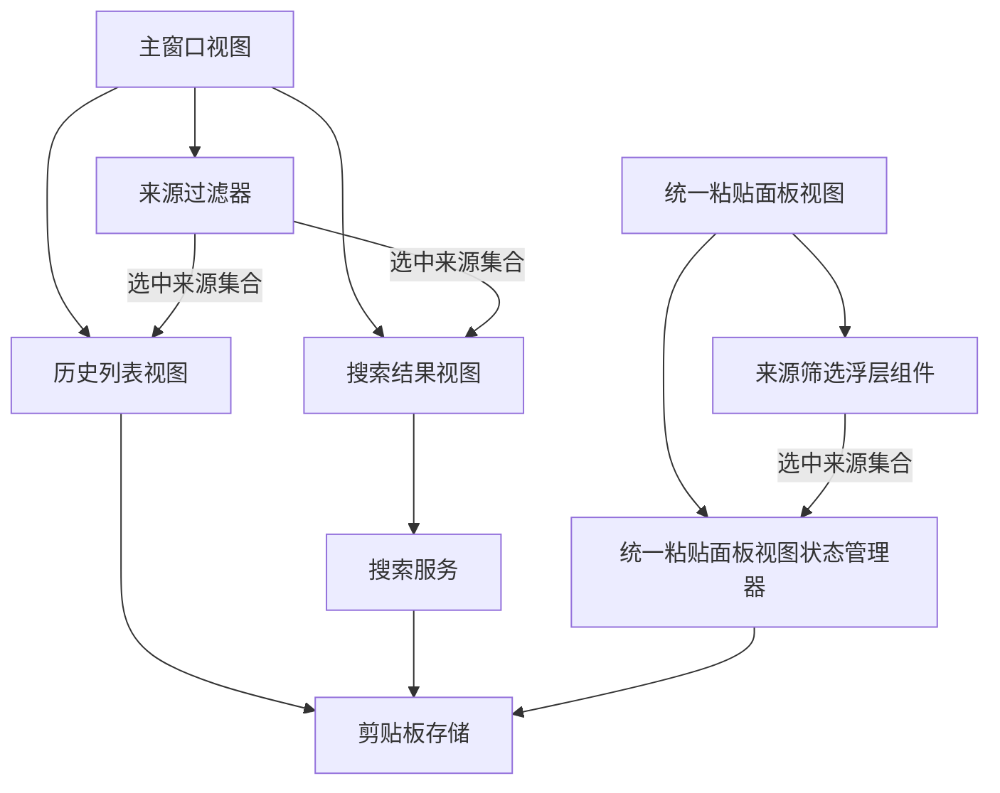
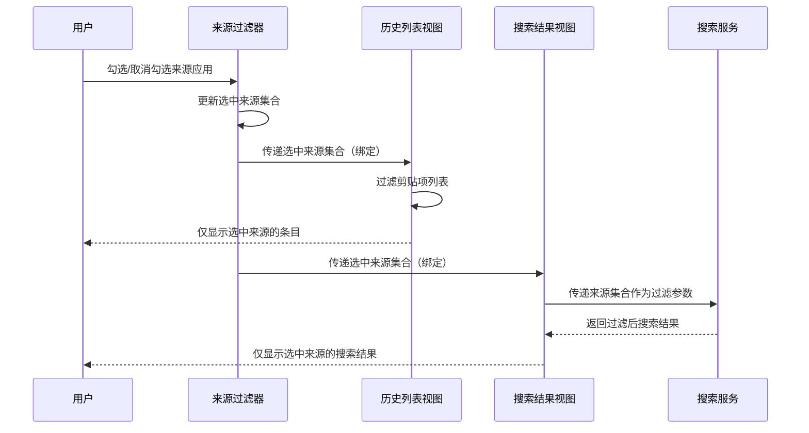
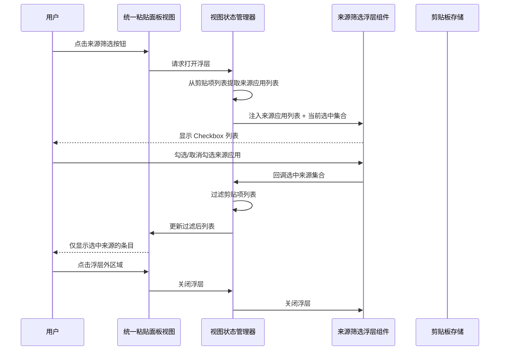
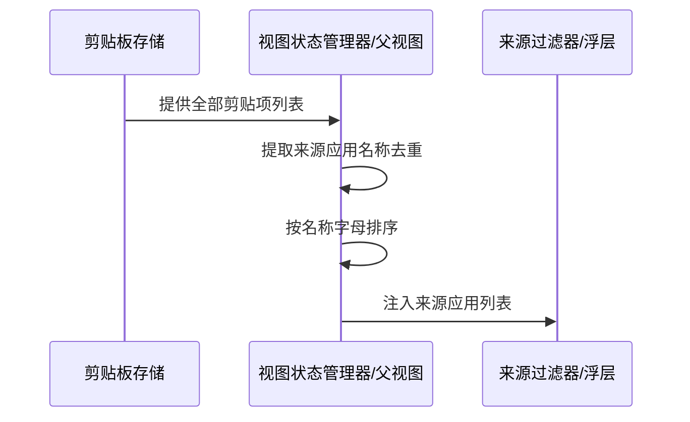
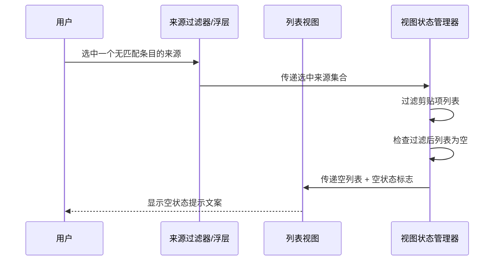
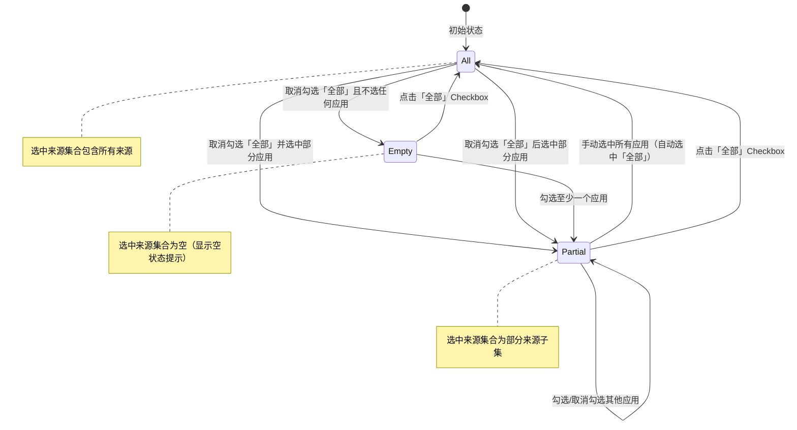
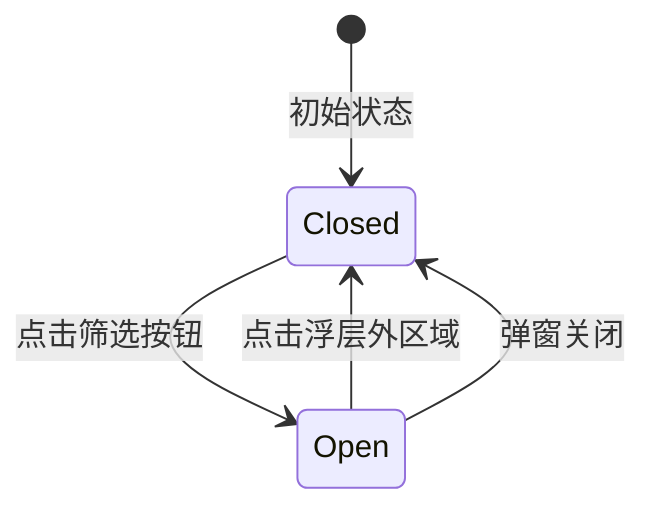

> 最后更新：2026-07-27 | 版本：v1.0

# F1.13 来源过滤 设计文档

**功能编号**：F1.13
**优先级**：P0
**文档存放路径**：`docs/planning/P0/F1/F1.13_来源过滤_设计文档.md`
**关联需求文档**：`docs/planning/P0/F1/F1.13_来源过滤_需求文档.md` v1.0
**关联视觉原型**：`docs/planning/P0/F1/F1.13_来源过滤_视觉原型.html`
**关联测试用例表**：`docs/planning/P0/F1/F1.13_来源过滤_测试用例表.md`
**关联主设计规范**：`docs/planning/P0/F1/F1_ClipMind_设计规范.md` v1.9

---

## 目录

1. [文档定位](#1-文档定位)
2. [模块划分](#2-模块划分)
3. [职责边界](#3-职责边界)
4. [数据流](#4-数据流)
5. [状态变化](#5-状态变化)
6. [协作关系](#6-协作关系)
7. [关键设计决策](#7-关键设计决策)
8. [非功能约束落地](#8-非功能约束落地)
9. [与 Requirements 的映射](#9-与-requirements-的映射)
10. [风险和待确认问题](#10-风险和待确认问题)

---

## 1. 文档定位

本文档是 F1.13 来源过滤的**架构契约**，定义模块边界、数据流、状态模型与协作关系，**不**包含具体代码实现（无类定义/方法签名/字段类型/枚举值/文件路径）、**不**包含验收标准（AC 已在需求文档第 8 节）、**不**包含测试策略与 UI 可观测性矩阵（已迁移到测试用例表）、**不**包含分阶段设计（属于实现规划）。

设计文档遵循 dd-write-design 的 P0 铁律：仅描述「谁负责什么、模块如何协作、状态如何流转、数据如何流动」，不描述「用什么语言、用什么框架 API、用什么并发原语」。

### 1.1 设计目标

- 将主窗口来源过滤器从单选模式升级为多选 Checkbox 模式，支持同时选中多个来源应用。
- 将来源过滤从「仅影响搜索结果」升级为「同时影响历史列表和搜索结果」。
- 为弹窗（菜单栏弹窗和快捷粘贴面板）新增来源筛选按钮和 App 多选浮层，使弹窗列表也受来源过滤影响。
- 来源应用列表从当前数据动态提取，无需手动配置。
- 主窗口与弹窗的过滤状态独立，互不影响。
- 过滤状态不持久化，每次打开默认「全部」。

### 1.2 设计约束（来自需求文档）

- macOS 13.0+ 兼容（与项目主设计规范一致）。
- 不改变剪贴项数据模型，不新增字段。
- 不获取 App 图标，仅使用来源应用名称文字。
- 不在详细面板加来源过滤。
- 不持久化过滤选择。
- 禁止使用私有 API、禁止绕过沙盒、禁止使用固定 sleep 等待过滤生效。
- 来源过滤器 API 从单选引用变更为集合引用，所有调用方需适配。

---

## 2. 模块划分

F1.13 在现有模块结构基础上，新增 1 个模块（来源筛选浮层组件），修改 4 个现有模块（来源过滤器、历史列表视图、统一粘贴面板视图、统一粘贴面板视图状态管理器），复用 2 个现有模块（剪贴板存储、搜索服务）。

### 2.1 新增模块

| 模块名 | 所属层级 | 职责概述 |
|--------|---------|---------|
| 来源筛选浮层组件 | UI | 弹窗场景下的来源应用多选浮层，包含「全部」选项和各来源应用名称的 Checkbox 列表，处理 Checkbox 状态变化并通知父视图 |

### 2.2 修改的现有模块

| 现有模块 | 修改内容 |
|---------|---------|
| 来源过滤器 | 从单选模式改为多选 Checkbox 模式；选中状态从单选引用改为集合引用；新增「全部」选项与各应用 Checkbox 的联动逻辑 |
| 历史列表视图 | 新增来源过滤参数，根据过滤条件过滤显示的剪贴项；过滤后无匹配结果时显示空状态提示 |
| 统一粘贴面板视图 | 新增来源筛选按钮（漏斗图标）；点击筛选按钮弹出来源筛选浮层组件；列表根据过滤条件过滤；过滤后无匹配结果时显示空状态提示 |
| 统一粘贴面板视图状态管理器 | 新增来源过滤状态（选中来源集合）；新增来源应用列表动态提取；新增过滤后的剪贴项列表计算；管理筛选浮层的开关状态 |

### 2.3 复用的现有模块（不修改）

| 现有模块 | 复用方式 |
|---------|---------|
| 剪贴板存储 | 提供全部剪贴项列表，作为来源应用列表动态提取的数据源；提供过滤前的完整剪贴项列表 |
| 搜索服务 | 已支持来源过滤参数，需适配从单值到集合的变更；搜索结果根据过滤集合过滤 |

### 2.4 模块依赖图

> 注：图中节点名为业务模块名（非类名），仅用于展示模块协作关系，不约束实现时的具体类型命名。

---

## 3. 职责边界

### 3.1 来源过滤器（修改）

**负责**：

- 渲染多选 Checkbox 列表，包含「全部」选项和各来源应用名称。
- 管理「全部」选项与各应用 Checkbox 的联动逻辑（全选时自动选中「全部」，取消任一时自动取消「全部」）。
- 维护当前选中来源集合，通过绑定机制通知父视图。
- 从外部注入来源应用列表（不直接读取剪贴板存储）。

**不负责**：

- 不负责列表内容的过滤（由历史列表视图和搜索结果视图根据选中集合自行过滤）。
- 不负责来源应用列表的动态提取（由父视图或数据层提供）。
- 不负责搜索服务的来源过滤参数传递（由父视图负责）。

### 3.2 来源筛选浮层组件（新增）

**负责**：

- 渲染多选 Checkbox 列表，包含「全部」选项和各来源应用名称。
- 管理「全部」选项与各应用 Checkbox 的联动逻辑（与来源过滤器一致）。
- 维护浮层内选中来源集合，通过回调通知统一粘贴面板视图状态管理器。
- 点击浮层外区域关闭浮层。
- 从外部注入来源应用列表。

**不负责**：

- 不负责弹窗列表的过滤（由统一粘贴面板视图状态管理器根据选中集合过滤）。
- 不负责来源应用列表的动态提取（由统一粘贴面板视图状态管理器提供）。
- 不负责弹窗列表的渲染（由统一粘贴面板视图负责）。

### 3.3 历史列表视图（修改）

**负责**：

- 渲染历史剪贴项列表，根据来源过滤条件过滤显示。
- 过滤后无匹配结果时显示空状态提示。
- 从外部接收过滤条件（选中来源集合）和剪贴项列表。

**不负责**：

- 不负责来源过滤状态的管理（由来源过滤器持有，通过绑定传递）。
- 不负责来源应用列表的提取（由数据层提供）。

### 3.4 统一粘贴面板视图（修改）

**负责**：

- 渲染搜索框、来源筛选按钮、列表、底部工具栏。
- 点击来源筛选按钮弹出/关闭来源筛选浮层组件。
- 列表根据过滤条件过滤显示。
- 过滤后无匹配结果时显示空状态提示。
- 来源筛选按钮在有过滤生效时显示激活态。

**不负责**：

- 不负责来源过滤状态的管理（由视图状态管理器持有）。
- 不负责来源应用列表的提取（由视图状态管理器提供）。
- 不负责剪贴板写入或粘贴流程。

### 3.5 统一粘贴面板视图状态管理器（修改）

**负责**：

- 持有来源过滤状态（选中来源集合），初始为「全部」。
- 从剪贴项列表中动态提取来源应用列表（去重、按名称排序）。
- 根据来源过滤状态过滤剪贴项列表，提供过滤后的列表供视图渲染。
- 管理来源筛选浮层的开关状态。

**不负责**：

- 不负责搜索服务的来源过滤（搜索结果由搜索服务独立过滤）。
- 不负责剪贴板写入或粘贴流程。
- 不负责面板窗口的创建或关闭。

### 3.6 职责边界无冲突验证

| 职责 | 负责模块 | 是否有冲突 |
|------|---------|-----------|
| 主窗口来源过滤状态管理 | 来源过滤器 | 无（唯一负责） |
| 弹窗来源过滤状态管理 | 统一粘贴面板视图状态管理器 | 无（唯一负责） |
| 来源应用列表提取（主窗口） | 主窗口视图/数据层 | 无（由父视图提供） |
| 来源应用列表提取（弹窗） | 统一粘贴面板视图状态管理器 | 无（唯一负责） |
| 历史列表过滤 | 历史列表视图 | 无（根据过滤条件自行过滤） |
| 搜索结果过滤 | 搜索服务 | 无（根据过滤参数过滤） |
| 弹窗列表过滤 | 统一粘贴面板视图状态管理器 | 无（计算过滤后列表） |
| 来源筛选浮层渲染 | 来源筛选浮层组件 | 无（唯一负责） |
| 来源筛选浮层开关 | 统一粘贴面板视图 | 无（唯一负责） |
| 空状态提示渲染 | 历史列表视图 / 统一粘贴面板视图 | 无（各自负责自己视图的空状态） |
| Checkbox 联动逻辑 | 来源过滤器 / 来源筛选浮层组件 | 无（两处逻辑一致但独立维护） |

---

## 4. 数据流

### 4.1 主窗口来源过滤数据流

### 4.2 弹窗来源筛选数据流

### 4.3 来源应用列表动态提取数据流

### 4.4 过滤后无匹配结果显示数据流

---

## 5. 状态变化

### 5.1 来源过滤状态机（主窗口与弹窗各自独立）

**状态说明**：

| 状态 | 说明 | 持久化 | UI 表现 |
|------|------|--------|---------|
| All | 「全部」选中，等同于无过滤 | 否 | 所有剪贴项显示 |
| Partial | 部分来源选中 | 否 | 仅选中来源的剪贴项显示 |
| Empty | 无来源选中 | 否 | 空状态提示 |

### 5.2 来源筛选浮层开关状态

**状态说明**：

| 状态 | 说明 | 持久化 | UI 表现 |
|------|------|--------|---------|
| Closed | 浮层未显示 | 否 | 筛选按钮默认态 |
| Open | 浮层已显示 | 否 | 筛选按钮激活态，浮层可见 |

### 5.3 主窗口与弹窗过滤状态独立性

主窗口来源过滤状态与弹窗过滤状态各自独立维护：

- 主窗口：来源过滤器持有独立的选中来源集合。
- 弹窗：统一粘贴面板视图状态管理器持有独立的选中来源集合。
- 菜单栏弹窗与快捷粘贴面板共享同一视图状态管理器（同一视图的两个场景包装），因此共享同一过滤状态。

---

## 6. 协作关系

### 6.1 来源过滤器与历史列表视图的协作

- 来源过滤器维护选中来源集合，通过绑定机制传递给历史列表视图。
- 历史列表视图根据选中来源集合过滤剪贴项列表。
- 来源过滤器选中状态变化时，历史列表视图立即更新（绑定自动触发）。

### 6.2 来源过滤器与搜索结果视图的协作

- 来源过滤器维护选中来源集合，通过绑定机制传递给搜索结果视图。
- 搜索结果视图将选中来源集合传递给搜索服务作为过滤参数。
- 来源过滤器选中状态变化时，搜索结果视图立即更新。

### 6.3 统一粘贴面板视图与来源筛选浮层组件的协作

- 统一粘贴面板视图在用户点击筛选按钮时弹出来源筛选浮层组件。
- 来源筛选浮层组件在 Checkbox 状态变化时通过回调通知视图状态管理器。
- 视图状态管理器更新选中来源集合，过滤剪贴项列表，通知视图重新渲染。
- 用户点击浮层外区域时，统一粘贴面板视图关闭浮层。

### 6.4 统一粘贴面板视图状态管理器与剪贴板存储的协作

- 视图状态管理器从剪贴板存储提供的剪贴项列表中提取来源应用列表。
- 来源应用列表随剪贴项数据变化而更新（当剪贴项列表变化时重新提取）。

### 6.5 主窗口与弹窗过滤状态独立协作

- 主窗口来源过滤状态由来源过滤器持有，弹窗过滤状态由视图状态管理器持有。
- 两者互不引用、互不影响。
- 各自在创建时初始化为「全部」，关闭时丢弃状态。

---

## 7. 关键设计决策

### 7.1 为什么来源过滤器与来源筛选浮层组件是两个独立模块而非一个？

**决策**：主窗口的来源过滤器和弹窗的来源筛选浮层组件是两个独立模块，各自维护 Checkbox 列表渲染和联动逻辑。

**理由**：

- 主窗口来源过滤器是常驻组件（嵌入在主窗口布局中），弹窗来源筛选浮层是按需弹出组件（浮层形式），两者交互模式不同。
- 主窗口来源过滤器通过绑定机制与父视图双向通信，弹窗浮层通过回调与视图状态管理器单向通信。
- 独立模块使各自的职责边界更清晰，避免一个模块同时处理两种交互模式。

**代价**：Checkbox 联动逻辑（「全部」与各应用的互斥/联动）在两个模块中各实现一份。

**为何可接受**：联动逻辑简单（选中全部时自动选中「全部」，取消任一时自动取消「全部」），重复代码量极少。未来可考虑抽取共享逻辑为内部工具方法。

### 7.2 为什么历史列表视图在视图层过滤而非在数据层过滤？

**决策**：历史列表视图直接根据选中来源集合过滤剪贴项列表，不通过数据层（剪贴板存储）过滤。

**理由**：

- 来源过滤是临时性的 UI 过滤（不持久化），在视图层过滤更符合「过滤状态不持久化」的需求。
- 剪贴板存储提供全量剪贴项列表，历史列表视图在内存中过滤延迟 ≤ 50ms，无需数据层参与。
- 视图层过滤使过滤逻辑与 UI 状态紧密绑定，减少跨层数据传递。

**代价**：每次来源过滤变化时，历史列表视图需要重新计算过滤后的列表。

**为何可接受**：过滤计算是内存中的集合包含判断，计算量与剪贴项数量线性相关，在合理数据量下（数千条以内）性能可接受。

### 7.3 为什么主窗口与弹窗的过滤状态独立而非共享？

**决策**：主窗口的来源过滤状态与弹窗的来源过滤状态各自独立维护。

**理由**：

- 主窗口和弹窗是两个独立入口，用户在两个场景下的过滤需求可能不同（如主窗口筛选「Xcode」，弹窗筛选「Safari」）。
- 共享状态会增加耦合：弹窗关闭时是否重置状态？主窗口修改过滤是否影响正在使用的弹窗？独立状态避免这些设计决策。
- 独立状态使两个场景的初始化逻辑一致：每次打开默认「全部」。

**代价**：如果用户希望在两个场景间保持一致的过滤，需要手动分别设置。

**为何可接受**：需求文档明确要求「主窗口与弹窗过滤状态独立」，且「过滤状态不持久化」意味着每次打开都是全新状态。

### 7.4 为什么来源应用列表按名称字母排序而非按剪贴项数量排序？

**决策**：来源应用列表按来源应用名称字母顺序排序。

**理由**：

- 字母排序是确定性的、无歧义的排序方式，用户可预测列表顺序。
- 按剪贴项数量排序需要额外的统计计算，增加复杂度，且用户难以预测列表顺序。
- 字母排序对国际化友好（各语言的字母表顺序一致）。

**代价**：常用来源应用可能不在列表顶部。

**为何可接受**：来源应用列表通常较短（5~15 个应用），字母排序已足够用户快速定位。智能排序可留作未来扩展（12.6 智能来源推荐）。

### 7.5 为什么弹窗使用浮层而非下拉菜单实现来源筛选？

**决策**：弹窗使用浮层（点击筛选按钮弹出浮层组件）实现来源筛选，而非下拉菜单。

**理由**：

- 弹窗空间有限，下拉菜单可能被弹窗边界截断。
- 浮层可灵活定位（筛选按钮下方或右侧），不受弹窗边界限制。
- 浮层支持点击外部关闭，交互体验与弹窗场景一致。
- 主窗口的来源过滤器可继续使用下拉菜单（主窗口空间充足），弹窗使用浮层（空间受限）。

**代价**：浮层需要额外的定位逻辑（相对于筛选按钮的位置计算）。

**为何可接受**：定位逻辑简单（获取按钮位置 + 偏移），且声明式 UI 框架的浮层定位机制可直接使用。

---

## 8. 非功能约束落地

### 8.1 响应性能（NFR-001）

| 约束 | 落地方式 |
|------|---------|
| Checkbox 切换后列表更新 ≤ 50ms | 来源过滤在内存中进行集合包含判断，视图层直接过滤，无磁盘/网络 IO |
| 来源应用列表提取 ≤ 50ms | 从已有剪贴项列表提取来源应用名称去重排序，纯内存操作 |
| 弹窗筛选按钮点击到浮层弹出 ≤ 100ms | 浮层组件预创建或轻量创建，弹出时仅设置可见性 |

### 8.2 稳定性（NFR-002）

| 约束 | 落地方式 |
|------|---------|
| 过滤状态变化与列表更新无竞态 | Checkbox 切换与列表过滤在同一线程/同步域完成，绑定自动触发更新 |
| 主窗口与弹窗过滤状态独立不互相干扰 | 两者各自持有独立的选中来源集合，互不引用 |
| 100 次连续过滤操作无崩溃、无内存泄漏 | 过滤状态为值类型集合，无循环引用风险；列表过滤不创建额外对象 |

### 8.3 安全性（NFR-003）

| 约束 | 落地方式 |
|------|---------|
| 不输出剪贴板原文 | 所有日志仅记录元数据（如「来源过滤选中 2 个应用」），使用现有日志分类与隐私修饰符 |
| 来源应用名称可安全记录 | 来源应用名称属于元数据，不涉及剪贴板原文 |

### 8.4 兼容性（NFR-004）

| 约束 | 落地方式 |
|------|---------|
| macOS 13.0+ | 不使用 macOS 13 以下专有 API |
| Apple Silicon + Intel | 不使用架构相关 API |
| 来源过滤器 API 变更适配 | 从单选引用改为集合引用，所有调用方适配 |
| 搜索服务适配 | 从单值过滤参数改为集合过滤参数 |
| 不改变剪贴项数据模型和持久化格式 | 剪贴板存储不变，仅读取已有字段 |

### 8.5 可访问性（NFR-005）

| 约束 | 落地方式 |
|------|---------|
| Checkbox 列表支持 VoiceOver | 所有 Checkbox 设置无障碍标签（来源应用名称 + 勾选状态） |
| 筛选按钮支持辅助功能标签 | 按钮设置无障碍标签「来源筛选」 |
| 浮层支持键盘导航 | 浮层内 Checkbox 支持 Tab 焦点切换与空格键勾选 |
| 空状态提示支持 VoiceOver | 提示文案设置无障碍标签 |

### 8.6 合规性（NFR-006）

| 约束 | 落地方式 |
|------|---------|
| App Store 合规 | 所有模块在沙盒内运行，不通过外部进程或脚本绕过 |
| 不引入新权限 | 来源过滤不涉及新的系统权限申请 |
| 来源应用名称无隐私风险 | 来源应用名称属于元数据，不涉及用户敏感信息 |

### 8.7 可维护性（NFR-007）

| 约束 | 落地方式 |
|------|---------|
| 过滤逻辑复用 | 主窗口和弹窗的 Checkbox 联动逻辑虽在两处实现，但逻辑简单且一致 |
| 来源应用列表提取集中 | 提取逻辑在数据层集中实现，各视图共享提取结果 |
| 模块依赖方向保持 | UI 层 → 业务模块 → 数据模型层，不引入反向依赖 |

---

## 9. 与 Requirements 的映射

### 9.1 FR 到模块映射表

| FR 编号 | FR 描述 | 负责模块 |
|---------|--------|---------|
| FR-001 | 主窗口来源过滤器多选 Checkbox | 来源过滤器（修改） |
| FR-002 | 主窗口历史列表受来源过滤影响 | 历史列表视图（修改） + 来源过滤器 |
| FR-003 | 主窗口搜索结果受来源过滤影响 | 搜索结果视图 + 搜索服务（复用，适配集合） + 来源过滤器 |
| FR-004 | 弹窗来源筛选按钮 | 统一粘贴面板视图（修改） |
| FR-005 | 弹窗 App 多选浮层 | 来源筛选浮层组件（新增） + 统一粘贴面板视图 |
| FR-006 | 弹窗列表受来源过滤影响 | 统一粘贴面板视图状态管理器（修改） + 统一粘贴面板视图 |
| FR-007 | 过滤后无匹配结果显示空状态提示 | 历史列表视图 + 统一粘贴面板视图 |
| FR-008 | 来源应用列表动态提取 | 统一粘贴面板视图状态管理器 + 主窗口父视图 |
| FR-009 | 主窗口与弹窗过滤状态独立 | 来源过滤器 + 统一粘贴面板视图状态管理器 |
| FR-010 | 过滤状态不持久化 | 来源过滤器 + 统一粘贴面板视图状态管理器 |

### 9.2 NFR 落地映射

| NFR 编号 | NFR 描述 | 落地章节 |
|---------|---------|---------|
| NFR-001 | 响应性能 | 8.1 |
| NFR-002 | 稳定性 | 8.2 |
| NFR-003 | 安全性 | 8.3 |
| NFR-004 | 兼容性 | 8.4 |
| NFR-005 | 可访问性 | 8.5 |
| NFR-006 | 合规性 | 8.6 |
| NFR-007 | 可维护性 | 8.7 |

### 9.3 Constraints 落地映射

| Constraints 编号 | 约束描述 | 落地方式 |
|----------------|---------|---------|
| 7.1 业务约束 | 不改变剪贴项数据模型 | 剪贴板存储不变，仅读取已有字段（第 2.3 节） |
| 7.1 业务约束 | 不持久化过滤选择 | 来源过滤器和视图状态管理器仅在内存中维护状态（第 3.1 节、第 3.5 节） |
| 7.1 业务约束 | 不获取 App 图标 | 来源过滤器和浮层组件仅渲染来源应用名称文字（第 3.1 节、第 3.2 节） |
| 7.1 业务约束 | 不影响 DetailPanel | 详细面板不变，始终显示选中的单条剪贴项 |
| 7.2 兼容约束 | macOS 13.0+ | 第 8.4 节 |
| 7.2 兼容约束 | 来源过滤器 API 适配 | 从单选引用改为集合引用，所有调用方适配（第 2.2 节） |
| 7.3 合规约束 | App Store 合规 | 第 8.6 节 |

---

## 10. 风险和待确认问题

### 10.1 技术风险

| 风险 | 影响 | 概率 | 缓解措施 |
|------|------|------|---------|
| 来源过滤器 API 变更影响现有调用方 | 编译错误 | 中 | Phase 0 实现时集中修改所有调用方，编译即可发现遗漏 |
| 弹窗浮层定位在极端屏幕尺寸下异常 | 浮层位置不正确 | 低 | 浮层定位使用筛选按钮相对位置，声明式 UI 框架的浮层定位机制自动处理 |
| 大量剪贴项（>1000）时过滤性能下降 | 列表更新延迟 | 低 | 内存中集合包含判断复杂度 O(n)，1000 条以内 ≤ 50ms；后续可优化为预计算索引 |
| Checkbox 联动逻辑在两个模块中重复 | 维护不一致 | 低 | 逻辑简单且固定，未来可抽取共享逻辑 |

### 10.2 合规风险（App Store）

| 风险 | 影响 | 概率 | 缓解措施 |
|------|------|------|---------|
| 无合规风险 | 来源过滤不涉及新权限、不使用私有 API、不绕过沙盒 | — | — |

### 10.3 待确认问题

| 问题 | 影响范围 | 建议方案 | 决策时机 |
|------|---------|---------|---------|
| 来源过滤器展开方式（下拉菜单 vs 侧边栏） | 主窗口布局 | 建议沿用现有下拉菜单样式，仅从单选改为多选 Checkbox | Phase 0 实现时 |
| 来源筛选浮层定位（按钮下方 vs 右侧） | 弹窗交互 | 建议筛选按钮下方弹出浮层，与弹窗搜索栏对齐 | Phase 1 实现时 |
| 搜索服务适配多选集合的具体方式 | 搜索服务 API 变更 | 建议从单值参数改为集合参数，搜索服务内部判断集合为空或包含全部时不过滤 | Phase 0 实现时 |
| 来源应用列表中无来源信息的剪贴项如何处理 | 过滤边界情况 | 建议将无来源信息的剪贴项归入「未知」分类，或默认通过过滤（等同于选中「全部」时显示） | Phase 0 实现时 |
| Checkbox 联动逻辑是否抽取为共享工具 | 代码复用 | 建议初期两处独立实现，若后续发现不一致再抽取 | Phase 1 实现后 |

---

## 版本记录

| 版本 | 日期 | 变更说明 |
|------|------|---------|
| v1.0 | 2026-07-27 | 初始版本，覆盖 F1.13 来源过滤设计，包含 10 章节（文档定位/模块划分/职责边界/数据流/状态变化/协作关系/关键设计决策/非功能约束落地/与 Requirements 的映射/风险和待确认问题），1 个新增模块（来源筛选浮层组件）+ 4 个修改模块（来源过滤器/历史列表视图/统一粘贴面板视图/统一粘贴面板视图状态管理器）+ 2 个复用模块（剪贴板存储/搜索服务），4 个数据流序列图，2 个状态机，5 项关键设计决策，7 项 NFR 落地，FR 到模块映射表全覆盖（10 条 FR），4 项技术风险 + 5 项待确认问题。严格遵守 dd-write-design P0 铁律：mermaid 图节点全部使用中文业务术语（无英文类名）。 |
