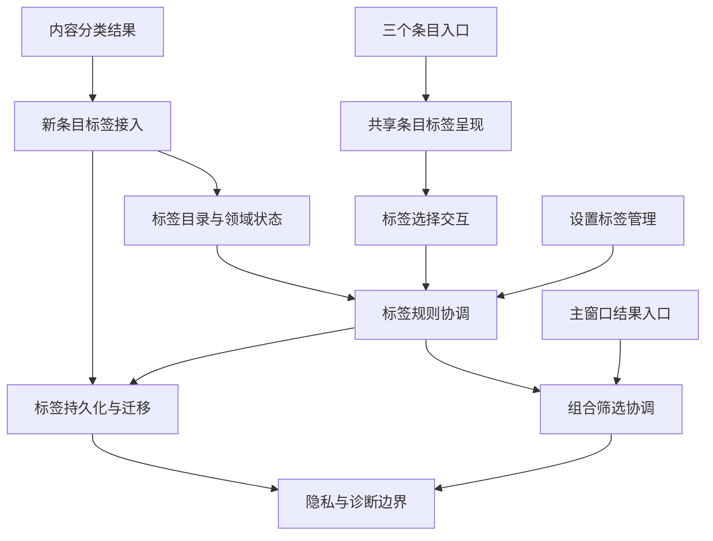
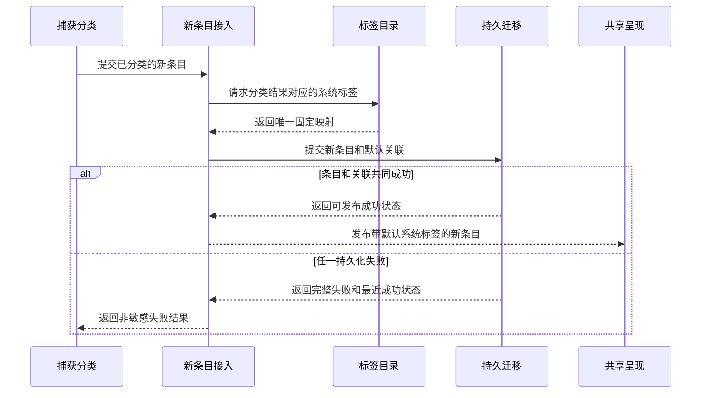
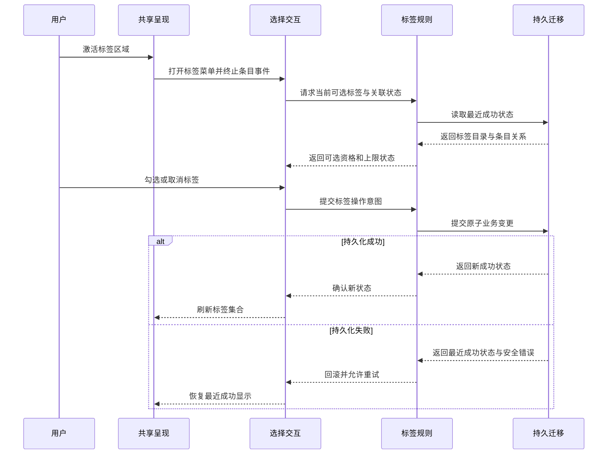
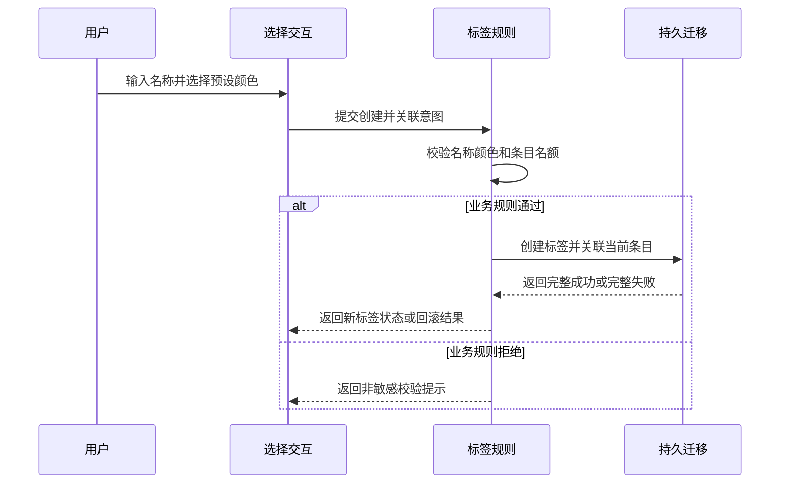
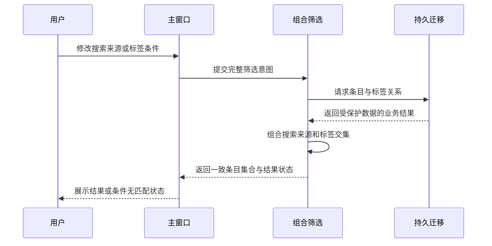
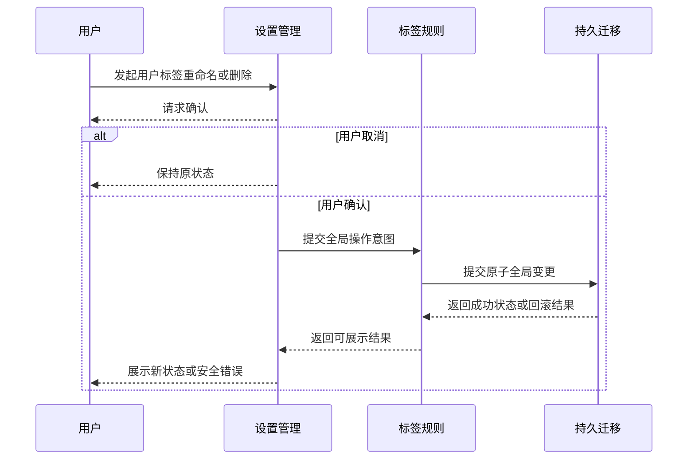
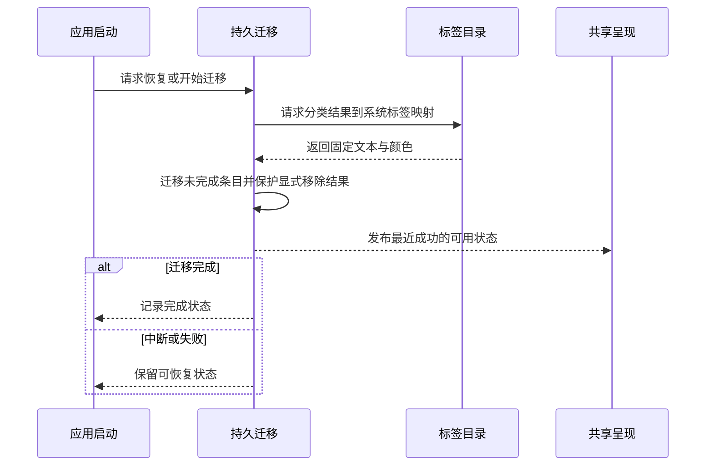
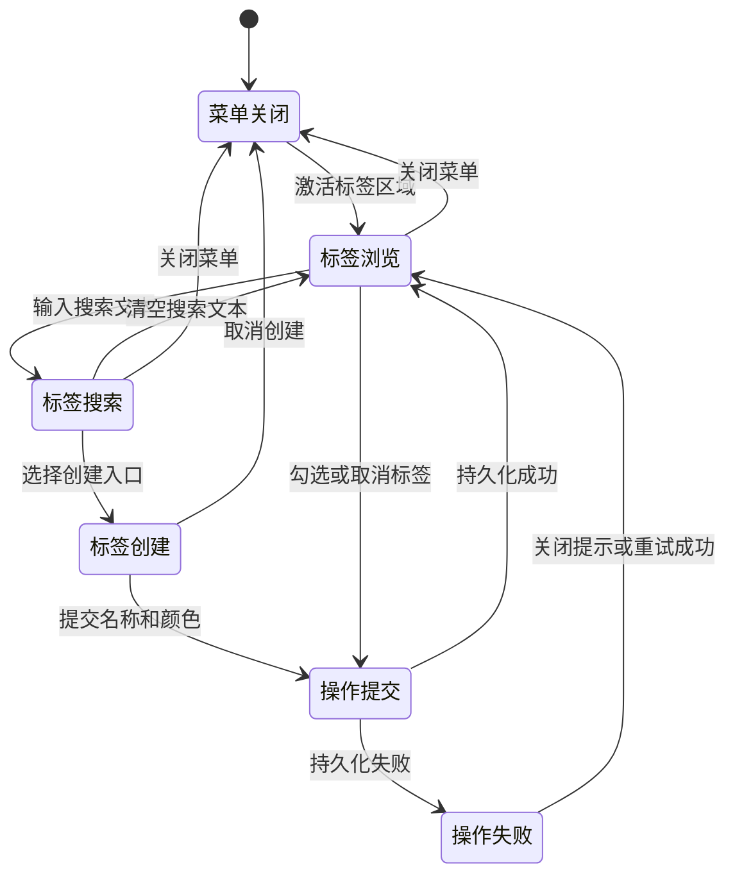
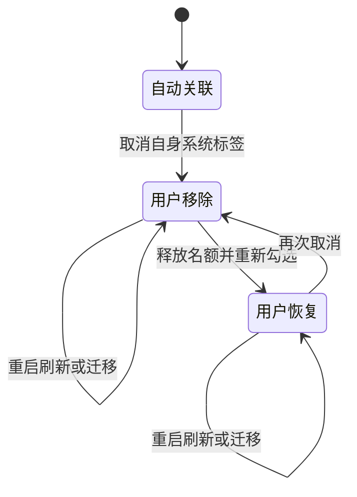
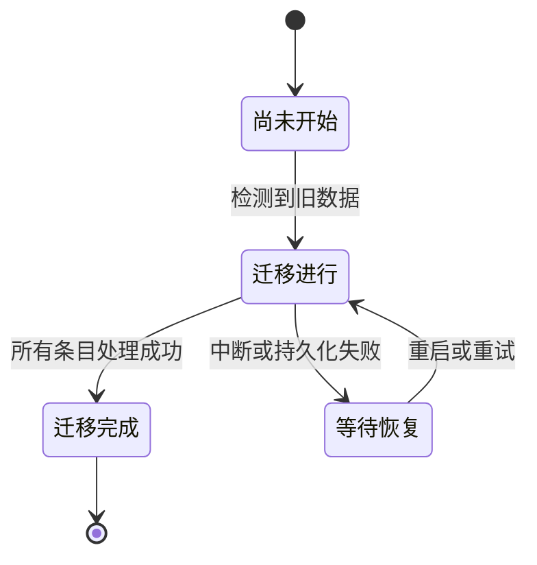

# F1.14 用户自定义标签设计文档

> 最后更新：2026-07-28 | 版本：v2.1

**功能编号**：F1.14
**文档类型**：Design 架构契约
**需求基线**：已确认的 Requirements v1.2
**当前状态**：独立审查已通过，待用户确认

---

## 目录

1. [文档定位](#1-文档定位)
2. [模块划分](#2-模块划分)
3. [职责边界](#3-职责边界)
4. [数据流](#4-数据流)
5. [状态变化](#5-状态变化)
6. [协作关系](#6-协作关系)
7. [关键设计决策](#7-关键设计决策)
8. [非功能约束落地](#8-非功能约束落地)
9. [与 Requirements 的映射](#9-与-requirements-的映射)
10. [风险和待确认问题](#10-风险和待确认问题)

---

## 1. 文档定位

本文档定义 F1.14 的内部职责、模块边界、数据流、状态模型与关键架构决策。Requirements v1.2 是唯一需求来源；本文仅通过 FR、NFR 和 Constraints 编号说明由谁负责，不复制验收标准，也不规定类、接口、文件、框架、并发原语或存储结构。

### 1.1 既有架构接入点

F1.14 复用以下既有职责边界：

- 内容分类职责继续产出每条剪贴项的分类结果，F1.14 不改变分类规则。
- 新条目标签接入职责在既有分类完成后消费分类结果，不改变捕获输入、分类方法或分类输出。
- 加密持久化职责继续保护用户数据，标签敏感数据纳入同一安全边界。
- 共享条目呈现职责继续服务主窗口、菜单栏弹窗和快捷粘贴面板。
- 搜索与来源筛选职责继续提供既有条件，F1.14 只增加标签条件的组合。
- 设置容器继续承载全局偏好入口，F1.14 增加标签管理分区。
- 项目级平台兼容与发布合规边界继续拥有 macOS 版本、处理器架构、沙盒、公开系统能力和最小权限合同。

### 1.2 架构不变量

1. 标签来源差异只影响可选资格与全局管理权限，不产生两套展示、选择或筛选语义。
2. 标签规则由单一业务边界裁决，任何入口不得自行复制上限、重名、来源或权限规则。
3. 标签名称、颜色、来源和条目关联均处于加密持久化边界内，不产生可识别明文副本。
4. 已持久化状态是标签界面的事实来源；失败时恢复到最近一次成功状态。
5. 搜索、来源与标签条件由同一组合筛选职责解释，历史列表与搜索结果不得各自实现不同语义。
6. 标签区域的交互事件在共享条目呈现边界内终止，不传播为条目选择、详情打开或粘贴动作。
7. 用户对自动分类标签的显式移除优先于迁移、刷新和后续分类结果。
8. 新捕获条目只有在条目本身与默认系统标签关联共同形成成功事实后，才能向下游发布为可见条目。

---

## 2. 模块划分

### 2.1 模块结构

### 2.2 模块清单

| 模块 | 核心职责 | 主要需求 |
|------|---------|---------|
| 标签目录与领域状态 | 定义标签身份、来源、颜色、条目关联和自动标签处置状态的统一语义 | FR-008、FR-012、FR-013、FR-014 |
| 新条目标签接入 | 消费既有分类结果，为新条目建立默认系统标签关联并协调成功发布 | FR-008、FR-015 |
| 标签规则协调 | 统一裁决标签资格、名称校验、数量上限和全局管理权限 | FR-004～FR-008、FR-010～FR-012 |
| 标签持久化与迁移 | 保存标签事实、恢复最近成功状态、执行可恢复的旧数据迁移 | FR-013、FR-015 |
| 共享条目标签呈现 | 在三个条目入口一致呈现标签，并隔离标签区域与条目动作 | FR-001、FR-002 |
| 标签选择交互 | 管理标签浏览、搜索、创建、多选、提交与错误反馈状态 | FR-003～FR-007、FR-014、FR-015 |
| 组合筛选协调 | 统一组合搜索、来源和多标签交集条件 | FR-009 |
| 设置标签管理 | 呈现全局标签目录并协调用户标签的确认式重命名与删除 | FR-010～FR-012 |
| 隐私与诊断边界 | 保证加密落盘、日志脱敏和发布合规边界 | NFR-003、NFR-006 |

### 2.3 领域信息契约

| 信息 | 必须表达的业务含义 | 权威职责 |
|------|------------------|---------|
| 标签 | 稳定身份、显示名称、预设颜色和来源类别 | 标签目录与领域状态 |
| 条目标签关系 | 条目与标签的当前关联，以及用户对自动标签的显式移除或恢复结果 | 标签目录与领域状态 |
| 系统标签映射 | 分类结果对应的固定系统标签名称与颜色 | 标签目录与领域状态 |
| 标签操作意图 | 创建、关联、移除、重命名、删除或迁移 | 标签规则协调 |
| 标签操作结果 | 最近成功状态、失败类别和可重试状态，不包含敏感原文 | 标签持久化与迁移 |
| 组合筛选意图 | 当前搜索、来源和全部选中标签条件 | 组合筛选协调 |

### 2.4 继承的项目级边界

| 既有边界 | F1.14 的协作方式 | F1.14 不负责 |
|---------|----------------|-------------|
| 内容捕获与分类边界 | 向新条目标签接入提供已分类条目和分类结果 | 不改变捕获条件、敏感内容跳过规则或分类算法 |
| 平台兼容边界 | 将全部 F1.14 模块纳入 macOS 13.0+ 与双处理器架构支持合同 | 不建立独立平台分支或降低项目支持范围 |
| 发布合规边界 | 将标签持久化、界面和诊断纳入主发布方案的沙盒、公开系统能力和最小权限合同 | 不新增独立发布方案或绕过项目合规检查 |
| 加密数据边界 | 为标签敏感信息提供与剪贴项一致的保护能力 | 不在 F1.14 内重定义密钥或加密策略 |

---

## 3. 职责边界

### 3.1 标签目录与领域状态

**负责**：

- 维护自动分类标签与用户自定义标签共用的业务语义。
- 维护分类结果到 11 个固定系统标签的唯一映射，并保持既有文本与颜色。
- 表达用户对单条剪贴项自动标签的移除和恢复结果。
- 为所有入口提供确定且一致的标签显示顺序。

**不负责**：

- 不裁决创建、重命名、删除或数量上限。
- 不执行持久化、迁移、筛选或界面交互。
- 不改变内容分类结果。

### 3.2 新条目标签接入

**负责**：

- 在既有内容分类完成后接收新条目及其分类结果。
- 向标签目录请求该分类结果对应的唯一系统标签。
- 协调新条目与默认系统标签关联形成同一个可发布成功状态。
- 成功后通知既有条目刷新边界；失败时不发布缺少默认系统标签的半完成条目，并返回非敏感失败结果。
- 对图片、文件路径和未命中特定类型的内容使用既有分类结果对应的系统标签，不自行重新分类。

**不负责**：

- 不监听剪贴板、不判断敏感内容，也不执行内容分类。
- 不改变已分类条目的内容类型。
- 不处理旧数据迁移、用户标签编辑或自动标签移除。

### 3.3 标签规则协调

**负责**：

- 根据 FR-007 统一裁决每条目 5 个标签的总上限。
- 根据 FR-008 只允许条目选择自身分类结果对应的自动标签。
- 根据 FR-010～FR-012 区分用户标签的全局管理权限与自动标签的只读权限。
- 在标签名称去除首尾空白后执行非空和全局唯一校验。
- 在从条目入口创建标签前同时检查名称、颜色和可关联名额。
- 将一次用户意图组织成不可部分成功的业务变更。

**不负责**：

- 不持久化标签数据。
- 不控制确认对话框、菜单布局或列表呈现。
- 不解释搜索和来源条件。

### 3.4 标签持久化与迁移

**负责**：

- 在加密边界内保存标签目录、来源、颜色、关联和自动标签处置状态。
- 为创建、关联、移除、重命名和删除提供原子业务结果。
- 为新条目及其默认系统标签关联提供完整成功或完整失败的持久化结果。
- 保存最近一次成功状态，失败时向上游返回可恢复结果。
- 根据 FR-013 迁移已有条目，并保证中断后继续且不重复。
- 保证迁移不覆盖用户已经持久化的自动标签移除结果。

**不负责**：

- 不决定标签名称是否合法或用户是否有权执行操作。
- 不选择迁移调度、分批大小或具体存储组织。
- 不向日志输出标签名称、剪贴板内容或可推导的条目关系。

### 3.5 共享条目标签呈现

**负责**：

- 在主窗口、菜单栏弹窗和快捷粘贴面板使用同一标签呈现语义。
- 有标签时呈现标签集合，无标签时呈现添加入口。
- 将标签区域的点击与键盘激活路由给标签选择交互。
- 阻止标签区域事件触发条目选择、详情打开或粘贴。
- 保持自动分类标签既有文本、颜色和基础辅助功能语义。

**不负责**：

- 不读取持久化数据或复制标签规则。
- 不决定标签是否可选或操作是否成功。
- 不拥有所在条目的选择和粘贴状态。

### 3.6 标签选择交互

**负责**：

- 管理菜单打开、标签浏览、名称搜索、创建输入、颜色选择和多选状态。
- 展示标签规则协调返回的可选、不可选和上限状态。
- 在操作提交期间表达待完成状态，失败时恢复最近成功快照并提供安全提示。
- 创建成功后回到完整标签列表，并反映当前条目关联。

**不负责**：

- 不自行判断重名、上限或自动标签资格。
- 不直接写入持久化边界。
- 不承担设置页的全局重命名和删除确认。

### 3.7 组合筛选协调

**负责**：

- 将搜索、来源和全部选中标签解释为同一组合条件。
- 对多个标签使用交集语义。
- 向历史列表和搜索结果提供一致的条目标识集合。
- 区分无剪贴历史与条件无匹配两类结果状态。

**不负责**：

- 不改变既有搜索排序或来源筛选语义。
- 不提供条目标签编辑。
- 不修复 F1.13 当前实现基线的编译缺口。

### 3.8 设置标签管理

**负责**：

- 展示自动分类标签与用户自定义标签的来源差异。
- 对用户标签发起带确认的全局重命名和删除。
- 取消确认时保持名称、目录和关联不变。
- 对自动分类标签仅展示只读状态，不提供全局修改动作。
- 展示持久化失败后的回滚状态与安全提示。

**不负责**：

- 不自行判定权限、重名或全局变更结果。
- 不允许编辑标签颜色。
- 不提供单条剪贴项的标签关联操作。

### 3.9 隐私与诊断边界

**负责**：

- 确保标签敏感信息只在受保护的数据边界内持久化和恢复。
- 允许诊断信息表达操作类型、结果、错误类别和数量。
- 阻止标签名称、剪贴板内容、关联细节或其可识别片段进入日志。
- 保持主发布方案使用公开系统能力与既有最小权限。

**不负责**：

- 不改变项目既有密钥和权限策略。
- 不承担业务校验或用户提示文案。

---

## 4. 数据流

### 4.1 新捕获条目的默认系统标签关联

该接入发生在既有分类结果产生之后，不改变捕获或分类规则。失败分支不向界面发布缺少默认系统标签的半完成条目。

### 4.2 条目标签浏览与修改

### 4.3 从条目入口创建标签

### 4.4 主窗口组合筛选

### 4.5 设置页全局管理

### 4.6 旧数据迁移

---

## 5. 状态变化

### 5.1 标签选择交互状态

### 5.2 自动分类标签处置状态

标签目录与领域状态拥有该状态；迁移、刷新和分类职责只能读取，不能覆盖用户移除或恢复的持久化结果。

### 5.3 迁移状态

迁移处于任何状态时，最近一次成功持久化的数据仍可供界面使用。

---

## 6. 协作关系

### 6.1 协作矩阵

| 发起模块 | 协作模块 | 输入 | 输出 | 边界约束 |
|---------|---------|------|------|---------|
| 内容捕获与分类边界 | 新条目标签接入 | 已分类的新条目 | 可发布成功或非敏感失败 | 不改变捕获与分类规则 |
| 新条目标签接入 | 标签目录与领域状态、标签持久化与迁移 | 分类结果和新条目 | 带默认系统标签的完整成功状态 | 不发布缺少默认关联的半完成条目 |
| 共享条目标签呈现 | 标签选择交互 | 条目身份和标签区域激活 | 菜单生命周期 | 不传递条目选择或粘贴动作 |
| 标签选择交互 | 标签规则协调 | 搜索、创建、多选和移除意图 | 可选状态、成功状态或安全错误 | 不复制业务规则 |
| 设置标签管理 | 标签规则协调 | 已确认的重命名或删除意图 | 全局变更结果 | 自动标签没有全局变更入口 |
| 标签规则协调 | 标签持久化与迁移 | 已通过业务校验的操作 | 最近成功状态或失败结果 | 变更不可部分成功 |
| 组合筛选协调 | 标签持久化与迁移 | 完整筛选意图 | 匹配条目集合 | 不暴露明文关联 |
| 标签持久化与迁移 | 标签目录与领域状态 | 分类结果与迁移条目 | 固定系统标签映射 | 不改变分类规则 |
| 各业务模块 | 隐私与诊断边界 | 操作类型、结果和数量 | 安全诊断信息 | 不接收用户输入原文 |

### 6.2 三个入口的共享与差异

| 入口 | 共享职责 | 保留的入口职责 |
|------|---------|---------------|
| 主窗口 | 标签呈现、菜单状态、业务规则和持久化结果 | 条目选择、详情打开和主窗口标签筛选 |
| 菜单栏弹窗 | 标签呈现、菜单状态、业务规则和持久化结果 | 原有条目浏览和粘贴生命周期 |
| 快捷粘贴面板 | 标签呈现、菜单状态、业务规则和持久化结果 | 原有键盘选择和粘贴生命周期 |

共享条目标签呈现只接管标签区域；三个入口原有的条目动作保持在各自边界内。

### 6.3 标签显示顺序

- 自动分类标签在关联存在时排在用户自定义标签之前。
- 用户自定义标签按稳定的关联顺序展示。
- 三个入口使用相同顺序，重命名不改变顺序。
- 显示顺序只影响呈现，不影响筛选或关联语义。

---

## 7. 关键设计决策

### D-01：统一标签目录并保留来源权限差异

- **决策**：自动分类标签与用户自定义标签共享标签目录、呈现和筛选语义；来源只参与资格与全局权限裁决。
- **原因**：FR-008 与 FR-012 同时要求统一条目交互和不同全局权限。
- **替代方案**：为两类标签建立彼此独立的目录与界面。
- **代价**：规则协调必须始终携带来源语义。
- **为何可接受**：集中来源规则比维护两套易漂移的行为更符合 NFR-007。

### D-02：标签规则由单一协调边界裁决

- **决策**：三个入口和设置页都请求同一标签规则协调职责，不自行实现重名、上限、资格或权限判断。
- **原因**：FR-007、FR-008、FR-010～FR-012 在多个入口共享同一约束。
- **替代方案**：各界面自行判断并直接持久化。
- **代价**：所有标签操作多一个业务协调边界。
- **为何可接受**：统一裁决降低入口间行为漂移，并使失败回滚有唯一责任方。

### D-03：显式保存自动标签处置结果

- **决策**：条目对自身自动标签的用户移除和恢复是持久化领域事实，不再仅由分类结果临时推导。
- **原因**：FR-008 要求重启、刷新与迁移不得自行恢复已移除标签。
- **替代方案**：每次加载都根据分类结果重建自动标签。
- **代价**：条目标签关系需要表达额外处置状态。
- **为何可接受**：这是尊重用户显式操作并保证迁移幂等的必要成本。

### D-04：条目入口创建与关联是一个原子业务操作

- **决策**：从条目入口创建新标签时，名称校验、名额校验、创建和关联共同成功或共同失败。
- **原因**：FR-005、FR-007 与 FR-015 禁止因名额或持久化失败产生孤立标签。
- **替代方案**：先创建标签，再尝试关联条目。
- **代价**：创建流程必须等待完整业务结果。
- **为何可接受**：避免用户看到无法解释的半完成状态。

### D-05：共享标签呈现拥有事件隔离

- **决策**：三个入口复用同一标签呈现与激活边界，标签区域消费自己的点击和键盘事件。
- **原因**：FR-001 与 FR-002 要求标签交互不得触发选择、详情或粘贴。
- **替代方案**：每个入口单独拦截事件。
- **代价**：共享呈现需要适配不同条目容器。
- **为何可接受**：集中隔离能保持三个入口一致，并降低既有条目动作回归风险。

### D-06：组合筛选只有一个解释职责

- **决策**：搜索、来源和标签条件由组合筛选协调统一解释，历史列表与搜索结果消费同一业务结果。
- **原因**：FR-009 与 NFR-007 要求标签交集并与既有条件一致组合。
- **替代方案**：历史列表与搜索结果各自追加标签判断。
- **代价**：既有结果入口需要接入共同筛选意图。
- **为何可接受**：消除同一条件在两个结果入口产生不同集合的风险。

### D-07：标签敏感信息整体进入加密边界

- **决策**：名称、颜色、来源和关联作为一个受保护领域整体持久化；诊断边界只接收非敏感结果元数据。
- **原因**：NFR-003 明确关联与标签名称可能暴露项目或客户信息。
- **替代方案**：只加密标签名称，其他属性和关联保留明文。
- **代价**：标签查询和迁移必须经过受保护数据边界。
- **为何可接受**：安全合同优先于简化查询，性能由 NFR-001 单独约束。

### D-08：迁移以固定映射和用户处置优先

- **决策**：旧数据迁移使用标签目录的唯一系统映射；已有用户处置状态优先于迁移推导。
- **原因**：FR-013 要求保持文本与颜色，FR-008 要求移除结果不被重建覆盖。
- **替代方案**：迁移自行构造系统标签并覆盖现有关联。
- **代价**：迁移需要协调标签目录与现有处置状态。
- **为何可接受**：避免重复标签、显示漂移和用户操作失效。

### D-09：所有入口使用确定的标签顺序

- **决策**：自动分类标签优先，用户标签使用稳定关联顺序，三个入口一致。
- **原因**：Requirements 将顺序留给 Design；稳定顺序有助于识别同一条目并减少界面跳动。
- **替代方案**：每次按名称或颜色动态排序。
- **代价**：关联需要保留稳定顺序语义。
- **为何可接受**：顺序只影响呈现，不改变筛选与管理规则。

### D-10：新条目与默认系统标签作为一个发布单元

- **决策**：既有分类完成后，由新条目标签接入协调条目持久化与默认系统标签关联；两者共同成功后才发布新条目。
- **原因**：FR-008 的初始自动关联和 FR-015 的失败回滚共同禁止新条目以缺失系统标签的半完成状态出现。
- **替代方案**：先发布新条目，再在后续独立步骤补充默认系统标签。
- **代价**：新条目发布需要等待标签关联的业务结果。
- **为何可接受**：该边界不改变捕获和分类规则，并避免界面闪烁、无标签窗口期和失败后的不一致状态。

---

## 8. 非功能约束落地

| 约束 | 负责模块 | 设计责任 |
|------|---------|---------|
| NFR-001 响应性能 | 新条目标签接入、标签选择交互、组合筛选协调、标签持久化与迁移 | 保持新条目发布、交互、筛选和迁移职责可独立测量；界面不等待迁移整体完成才可使用 |
| NFR-002 稳定性 | 新条目标签接入、标签规则协调、标签持久化与迁移、组合筛选协调 | 保证新条目和默认关联共同成功、操作不可部分成功、迁移可恢复、筛选清除后可回到既有结果 |
| NFR-003 安全性 | 标签持久化与迁移、隐私与诊断边界 | 标签敏感信息无明文副本，日志只接收安全元数据 |
| NFR-004 兼容性 | 项目级平台兼容边界、标签目录与领域状态、标签持久化与迁移、共享条目标签呈现、组合筛选协调 | 继承 macOS 13.0+ 与双处理器架构支持，完成老用户迁移，并保持系统标签文本颜色、既有入口行为和未选标签时的筛选结果 |
| NFR-005 可访问性 | 共享条目标签呈现、标签选择交互、设置标签管理 | 统一提供名称、角色、状态、键盘操作和非颜色唯一表达 |
| NFR-006 合规性 | 项目级发布合规边界、隐私与诊断边界 | 主发布方案保持沙盒、公开系统能力、既有依赖和最小权限 |
| NFR-007 可维护性 | 标签规则协调、组合筛选协调、共享条目标签呈现 | 规则、筛选解释和标签呈现均只有一个权威职责 |

### 8.1 Constraints 责任映射

| 约束 | 负责模块 | 边界 |
|------|---------|------|
| 不改捕获与分类逻辑 | 内容捕获与分类边界、新条目标签接入 | 分类边界继续产生既有结果，接入职责只在其后建立默认标签关联 |
| 每条目最多 5 个标签 | 标签规则协调 | 自动标签和用户标签共同计数 |
| 仅使用预设色板 | 标签目录与领域状态、标签选择交互 | 目录提供固定色板，交互不接受自定义色值 |
| 标签名称全局唯一 | 标签规则协调 | 自动标签和用户标签共同参与比较 |
| 自动分类标签全局只读 | 标签规则协调、设置标签管理 | 业务边界拒绝，设置边界不提供入口 |
| macOS 13.0+ | 项目级平台兼容边界 | 所有 F1.14 模块继承项目支持范围 |
| 老用户无感知迁移 | 标签持久化与迁移、共享条目标签呈现 | 界面保持可用，迁移成功后既有条目获得系统标签 |
| 现有标签显示兼容 | 标签目录与领域状态、共享条目标签呈现 | 保持系统标签文本、颜色和基础辅助功能语义 |
| F1.13 前置基线 | 组合筛选协调 | 实现和完整验收前必须先恢复既有来源筛选基线 |
| App Store 主方案合规 | 项目级发布合规边界、隐私与诊断边界 | 继承沙盒、隐私、公开系统能力和最小权限合同 |

---

## 9. 与 Requirements 的映射

| FR | 负责模块 | 架构责任 |
|----|---------|---------|
| FR-001 | 共享条目标签呈现、标签选择交互 | 统一打开菜单并隔离条目动作 |
| FR-002 | 共享条目标签呈现、标签选择交互 | 无标签时提供同一菜单入口 |
| FR-003 | 标签选择交互、标签规则协调 | 管理搜索状态并返回一致候选集合 |
| FR-004 | 标签选择交互、标签规则协调、标签持久化与迁移 | 多选意图经统一规则后保存 |
| FR-005 | 标签选择交互、标签规则协调、标签持久化与迁移 | 创建与当前条目关联共同成功或失败 |
| FR-006 | 标签选择交互、标签规则协调、标签持久化与迁移 | 无确认移除条目关联并保存结果 |
| FR-007 | 标签规则协调、标签选择交互 | 统一裁决总上限并表达不可选状态 |
| FR-008 | 新条目标签接入、标签目录与领域状态、标签规则协调、标签持久化与迁移 | 新条目建立默认系统关联，并保存自身系统标签的移除与恢复状态 |
| FR-009 | 组合筛选协调、标签持久化与迁移 | 统一标签交集及与搜索来源的组合 |
| FR-010 | 设置标签管理、标签规则协调、标签持久化与迁移 | 确认后全局删除用户标签并完整回滚失败 |
| FR-011 | 设置标签管理、标签规则协调、标签持久化与迁移 | 确认后全局重命名并统一刷新 |
| FR-012 | 设置标签管理、标签规则协调、标签目录与领域状态 | 自动标签可见但没有全局修改权限 |
| FR-013 | 标签持久化与迁移、标签目录与领域状态 | 使用固定映射执行幂等且可恢复迁移 |
| FR-014 | 标签目录与领域状态、标签选择交互、共享条目标签呈现 | 统一提供和呈现 11 种预设颜色 |
| FR-015 | 新条目标签接入、标签规则协调、标签持久化与迁移、各交互模块 | 新条目与标签操作失败均返回完整失败、最近成功状态、安全提示和重试入口 |

所有 15 条 FR 均有唯一主责边界和明确协作方，没有由界面独立实现的业务规则。

---

## 10. 风险和待确认问题

### 10.1 风险

| 风险 | 影响范围 | 缓解责任 | 当前状态 |
|------|---------|---------|---------|
| 新捕获条目保存成功但默认系统标签关联失败 | FR-008、FR-015 | 新条目标签接入只在条目与默认关联共同成功后发布，失败返回完整失败结果 | 设计已约束 |
| F1.13 来源筛选实现基线无法编译 | FR-009 与 NFR-007 的组合筛选接入和完整验收 | 在 Implementation 前恢复既有来源筛选合同；不混入 F1.14 Design | 阻止 Implementation，不阻止 Design 确认 |
| 标签关系整体加密后筛选成本上升 | NFR-001、NFR-003 | 组合筛选协调与持久化边界共同提供可测量结果，具体优化留给 Implementation Plan | 需在 Test Matrix 固定性能数据集 |
| 三个条目入口的事件生命周期不同 | FR-001、FR-002 | 共享条目标签呈现集中隔离事件，各入口只保留原条目动作 | 需在 Visual 与 Test Matrix 覆盖三个入口 |
| 迁移与用户移除自动标签发生交错 | FR-008、FR-013、FR-015 | 用户处置状态优先，迁移只处理尚无成功事实的条目 | 设计已约束 |
| 全局重命名或删除失败造成跨入口显示漂移 | FR-010、FR-011、FR-015 | 原子业务结果与最近成功快照由规则和持久化边界共同保证 | 需在 Test Matrix 覆盖失败注入 |
| 标签名称和关系泄露到诊断信息 | NFR-003 | 隐私与诊断边界只接收非敏感结果元数据 | 需在 Test Matrix 使用哨兵验证 |

### 10.2 已关闭决策

| 决策 | 结论 | 来源 |
|------|------|------|
| 自动分类标签全局管理权限 | 设置页只读，只允许按条目移除或恢复 | 用户确认的 F1.14-D01 |
| 自动分类标签可选资格 | 每条目只能恢复自身分类结果对应的系统标签 | FR-008 |
| 自动分类标签被用户移除后的优先级 | 重启、刷新、分类和迁移均不得自行恢复 | FR-008、FR-013 |
| 预设色板 | 精确复用现有 11 种系统标签颜色 | FR-014 |
| 标签显示顺序 | 自动标签优先，用户标签使用稳定关联顺序 | Design D-09 |

### 10.3 待确认问题

当前无阻止 Design 审查的架构问题。以下细节必须留给下游，不在本 Design 决定：

- 持久化组织、迁移调度、错误类型与恢复机制的具体实现进入 Implementation Plan。
- 菜单尺寸、布局、动效、文案和视觉层级进入 Visual Prototype。
- 性能基准环境、内存采样窗口、失败注入和 UI 证据进入 Test Matrix。

---

## 版本记录

| 版本 | 日期 | 变更说明 |
|------|------|---------|
| v1.0 | 2026-07-27 | 初始草稿，基于未确认的 Requirements v1.0，包含具体存储与实现方案，现已废止。 |
| v2.0 | 2026-07-28 | 基于已确认的 Requirements v1.2 完整重写；建立 8 个业务模块、3 个状态模型、9 项设计决策、NFR 与 Constraints 责任映射，并覆盖全部 15 条 FR。 |
| v2.1 | 2026-07-28 | 根据独立审查补齐新捕获条目的默认系统标签接入与完整失败边界，并完善平台、迁移、显示兼容和 App Store 合规责任映射；扩展为 9 个业务模块和 10 项设计决策。 |
