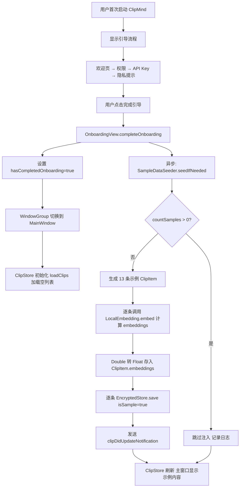
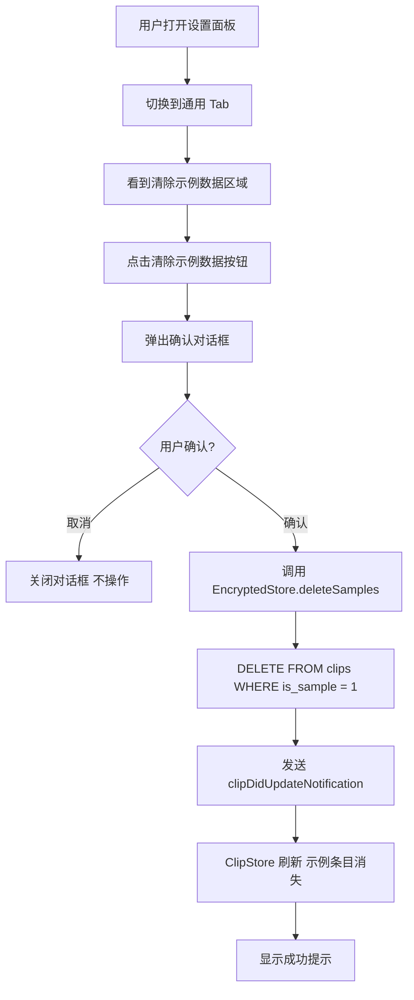
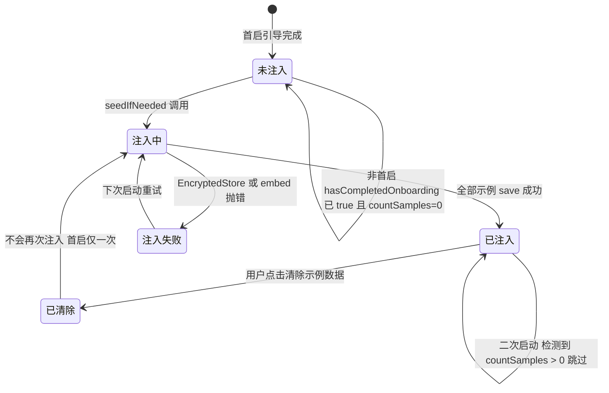

> 最后更新：2026-07-14 | 版本：v1.3

# F1.8 内置示例数据 设计规范

**功能编号**：F1.8（Phase 01 · P0 · 初赛体验增强）
**文档存放路径**：`docs/planning/P0/F1/F1.8_内置示例数据_设计规范.md`
**父规范**：`docs/planning/P0/F1/F1_ClipMind_设计规范.md`（v1.5）
**适用阶段**：TRAE AI 创造力大赛初赛（2026-07-15 截止）

---

## 目录

1. [背景与目标](#1-背景与目标)
2. [非目标](#2-非目标)
3. [用户流程和交互入口](#3-用户流程和交互入口)
4. [行为规则和状态机](#4-行为规则和状态机)
5. [数据模型、接口、配置、持久化影响](#5-数据模型接口配置持久化影响)
6. [兼容性、迁移和回滚策略](#6-兼容性迁移和回滚策略)
7. [可观测性](#7-可观测性)
8. [验收标准 AC](#8-验收标准-ac)
9. [测试策略](#9-测试策略)
10. [UI 可观测性矩阵](#10-ui-可观测性矩阵)
11. [分阶段设计](#11-分阶段设计)
12. [风险和待确认问题](#12-风险和待确认问题)

---

## 1. 背景与目标

### 1.1 用户问题

评审下载 `.app` 后首次启动，剪贴板历史为空。为了体验分类、语义搜索、一键处理等核心功能，评审必须先自行切换到其他 App 复制若干内容，再回到 ClipMind 查看。这一"冷启动空窗期"导致：

1. **价值不可见**：首启主窗口空白，评审无法一眼看懂 ClipMind 能做什么
2. **体验断裂**：需在多个 App 间切换复制不同类型内容（代码、链接、报错等）才能验证分类标签
3. **搜索无法验证**：语义搜索依赖 embeddings，空库无法体验"输入自然语言找内容"的核心卖点

### 1.2 解决方案

在首次启动引导完成后，自动注入一批覆盖 11 种 `ContentType` 的示例剪贴内容，每条带实时计算的 embeddings，让评审立即看到：

- 主窗口历史列表已有 ≥ 10 条带类型标签的真实内容
- 语义搜索"报错/代码/链接"等关键词能立即命中对应示例
- 选中示例可一键处理（走真实 LLM API）
- 设置面板可一键清除示例数据，真实复制内容不受影响

### 1.3 成功标准

| 维度 | 成功标准 | 验证方式 |
|------|---------|---------|
| 示例覆盖 | 首启引导完成后主窗口显示 ≥ 10 条示例，覆盖 11 种 ContentType | XCUITest + 单元测试 |
| 语义可搜 | 示例带 embeddings，搜索"报错/代码/链接"命中对应类型 | XCTest |
| 可清除 | 设置面板"清除示例数据"按钮可一键删除所有示例，真实数据保留 | XCUITest + XCTest |
| 幂等 | 二次启动不重复注入 | XCTest |
| 兼容 | 旧数据库迁移后 isSample 列存在，旧数据不丢失 | XCTest |

### 1.4 范围边界

**做**：
- `ClipItem` 新增 `isSample: Bool` 字段（默认 false）
- `EncryptedStore` 新增 `is_sample` 列 + 迁移 + `deleteSamples()` / `countSamples()` 方法
- 新增 `SampleDataSeeder` 负责生成示例内容、调用 `LocalEmbeddingService` 实时计算 embeddings、注入 EncryptedStore
- 扩展 `ClipTestData` 为完整示例集（≥ 12 条，覆盖 11 种类型）
- `OnboardingView.completeOnboarding()` 触发注入
- `GeneralSettingsView` 新增"清除示例数据"按钮 + 确认对话框
- `HistoryListView` 新增 `historyList` 和 `historyEmptyState` accessibilityIdentifier（供 XCUITest 定位）

**不做**（见第 2 节）

---

## 2. 非目标

### 2.1 示例数据不预置处理结果

- 示例 ClipItem 的 `summary` / `translation` / `rewrite` / `todos` 字段均为 nil
- 一键处理仍走真实 LLM API（需用户配置 API Key），不预置处理结果
- **理由**：预置处理结果会让评审误以为"一键处理是假的"，且无法验证真实 API 调用链路

### 2.2 不涉及 Web 交互预览页

- F1.8 仅修改原生 .app，不修改 `docs/ClipMind.html` 或 GitHub Pages 预览页
- Web 预览页的示例数据由前端独立维护，不在本特性范围

### 2.3 不做示例数据编辑

- 示例数据不支持原地编辑、删除单条、重新生成
- 仅提供"一键清除全部示例"（`deleteSamples()`），不支持逐条管理
- **理由**：示例是引导性内容，编辑需求属于 YAGNI

### 2.4 不修改捕获管线

- 示例数据注入不走 `PasteboardWatcher` / `ClipCaptureService` 捕获流程
- 示例数据直接通过 `EncryptedStore.save()` 写入，不经过敏感识别、黑名单、去重检查
- **理由**：示例内容已人工审核，无需重复过滤

### 2.5 不预置图片/文件路径示例

- 13 条示例全部为文本内容（`ClipContent.text`），不含 `.image` / `.filePath`
- **理由**：图片需内置二进制资源增加包体，文件路径示例无实际文件指向，文本已足够覆盖 11 种类型

---

## 3. 用户流程和交互入口

### 3.1 首启注入流程



**关键时序说明**：
- `completeOnboarding()` 同步设置 `hasCompletedOnboarding=true`，触发 WindowGroup 重建显示 MainWindow
- 注入在 `DispatchQueue.global(qos: .userInitiated)` 异步执行，不阻塞 UI 切换
- MainWindow 的 `ClipStore` 初始化时 `loadClips()` 可能返回空（注入尚未完成）；注入完成后发送 `clipDidUpdateNotification`，`ClipStore` 监听该通知自动刷新
- embeddings 计算总耗时 < 1s（13 条 × < 100ms/条），用户几乎无感

### 3.2 清除示例数据流程



### 3.3 真实复制与示例共存流程


**说明**：真实复制内容 `isSample=false`，与示例数据共存于同一张 `clips` 表。清除示例数据时仅删除 `is_sample=1` 的行，`is_sample=0` 的真实数据不受影响。

### 3.4 交互入口汇总

| 入口 | 触发方式 | 功能 |
|------|---------|------|
| 首启引导完成 | 用户在隐私提示页点击"完成" | 自动异步注入示例数据 |
| 设置 → 通用 → 清除示例数据 | 用户点击按钮 | 弹出确认对话框，确认后删除所有示例 |

---

## 4. 行为规则和状态机

### 4.1 示例数据注入状态机



**状态说明**：

| 状态 | 说明 | 持久化 | UI 表现 |
|------|------|--------|---------|
| 未注入 | 首启完成但示例尚未写入 | 否（内存） | 主窗口可能短暂为空 |
| 注入中 | 正在计算 embeddings 并写入 | 否（内存） | 主窗口逐步出现示例 |
| 已注入 | 13 条示例已入库 | 是（is_sample=1） | 主窗口显示示例内容 |
| 已清除 | 用户已清除全部示例 | 是（行已删除） | 主窗口示例消失 |
| 注入失败 | embed 或 save 异常 | 否 | 日志记录，下次启动重试 |

### 4.2 注入行为规则

| 规则 | 描述 |
|------|------|
| **触发时机** | 仅在 `OnboardingView.completeOnboarding()` 中触发，即首启引导完成那一刻 |
| **幂等性** | 注入前调用 `EncryptedStore.countSamples()`，若 > 0 则跳过并记录 info 日志 |
| **不重复注入** | 二次启动时 `completeOnboarding()` 不会被调用（hasCompletedOnboarding 已 true），且即使被调用也有幂等检查 |
| **失败不阻塞且可重试** | 注入失败记录 error 日志并调用 `deleteSamples()` 清理已写入的部分示例数据，不阻塞主窗口显示，不影响真实捕获，下次启动 `countSamples() == 0` 可重试注入 |
| **不触发捕获通知** | 每条 save 后不发通知，全部注入完成后统一发一次 `clipDidUpdateNotification` |

### 4.3 清除行为规则

| 规则 | 描述 |
|------|------|
| **删除范围** | 仅删除 `is_sample=1` 的行（`DELETE FROM clips WHERE is_sample = 1`） |
| **真实数据保护** | `is_sample=0` 的真实复制内容不受影响 |
| **刷新机制** | 删除后发送 `clipDidUpdateNotification`，ClipStore 自动 loadClips 刷新 |
| **确认对话框** | 必须二次确认，防止误删 |
| **不可撤销** | 清除后无法恢复，示例数据需重新安装 App 才能再次注入（首启仅一次） |

---

## 5. 数据模型、接口、配置、持久化影响

### 5.1 ClipItem 数据模型变更

#### 5.1.1 新增 isSample 字段

```swift
struct ClipItem: Identifiable, Codable, Equatable {
    let id: UUID
    let content: ClipContent
    var contentType: ContentType
    let sourceApp: String
    let sourceAppName: String
    let timestamp: Date
    var summary: String?
    var translation: String?
    var rewrite: String?
    var todos: [TodoItem]?
    var embeddings: [Float]?
    var isSample: Bool          // 新增：是否示例数据，默认 false
}
```

#### 5.1.2 Codable 向后兼容

旧数据（无 `isSample` 字段）解码时需默认 false。由于现有 `ClipItem` 依赖合成 Codable，添加字段后旧 JSON 解码会因 key 缺失而抛错。因此必须实现自定义 `init(from decoder:)`：

```swift
extension ClipItem {
    enum CodingKeys: String, CodingKey {
        case id, content, contentType, sourceApp, sourceAppName
        case timestamp, summary, translation, rewrite, todos, embeddings
        case isSample
    }

    init(from decoder: Decoder) throws {
        let c = try decoder.container(keyedBy: CodingKeys.self)
        id = try c.decode(UUID.self, forKey: .id)
        content = try c.decode(ClipContent.self, forKey: .content)
        contentType = try c.decode(ContentType.self, forKey: .contentType)
        sourceApp = try c.decode(String.self, forKey: .sourceApp)
        sourceAppName = try c.decode(String.self, forKey: .sourceAppName)
        timestamp = try c.decode(Date.self, forKey: .timestamp)
        summary = try c.decodeIfPresent(String.self, forKey: .summary)
        translation = try c.decodeIfPresent(String.self, forKey: .translation)
        rewrite = try c.decodeIfPresent(String.self, forKey: .rewrite)
        todos = try c.decodeIfPresent([TodoItem].self, forKey: .todos)
        embeddings = try c.decodeIfPresent([Float].self, forKey: .embeddings)
        // 向后兼容：旧数据无 isSample 字段时默认 false
        isSample = try c.decodeIfPresent(Bool.self, forKey: .isSample) ?? false
    }
}
```

**约束**：
- `encode(to:)` 使用默认合成实现（新字段自动编入），无需自定义
- 工厂方法 `makeText` / `makeImage` / `makeFilePath` 增加 `isSample` 参数（默认 false），保持现有调用点无需改动

```swift
static func makeText(
    _ text: String,
    contentType: ContentType,
    sourceApp: String,
    sourceAppName: String,
    isSample: Bool = false        // 新增，默认 false
) -> ClipItem
```

### 5.2 EncryptedStore 变更

#### 5.2.1 新增 is_sample 列

```swift
private let isSampleColumn = Expression<Bool>("is_sample")
```

`createTables()` 中为新表添加列（仅对全新数据库生效）：

```swift
private func createTables() throws {
    try database.run(clips.create(ifNotExists: true) { table in
        table.column(idColumn, primaryKey: true)
        table.column(contentBlob)
        table.column(contentTypeColumn)
        table.column(timestampColumn)
        table.column(sourceAppColumn)
        table.column(embeddingsBlob)
        table.column(isSampleColumn, defaultValue: false)   // 新增
    })
    // 索引略
    try migrateSchemaIfNeeded()   // 新增：对已有表迁移
}
```

#### 5.2.2 迁移逻辑（ALTER TABLE）

SQLite.swift 的 `create(ifNotExists: true)` 不会给已有表添加新列。需独立迁移：

```swift
/// 迁移：为已有 clips 表补充 is_sample 列
private func migrateSchemaIfNeeded() throws {
    // PRAGMA table_info(clips) 返回每列的元信息，第 2 列（index 1）为列名
    let pragma = try database.prepare("PRAGMA table_info(clips)")
    var hasIsSample = false
    for row in pragma {
        let name = row[1] as? String
        if name == "is_sample" {
            hasIsSample = true
            break
        }
    }
    if !hasIsSample {
        try database.run("ALTER TABLE clips ADD COLUMN is_sample INTEGER DEFAULT 0")
        LogCategory.storage.info("迁移: 已添加 clips.is_sample 列")
    }
}
```

**说明**：SQLite 无独立 BOOLEAN 类型，用 INTEGER（0/1）表示。SQLite.swift 的 `Expression<Bool>` 自动映射 0/1。

#### 5.2.3 save() 更新

`save()` 需写入 `is_sample` 列（与 content_blob 中的 isSample 字段冗余存储，列用于 SQL 过滤，JSON 用于完整还原）：

```swift
func save(_ item: ClipItem) throws {
    // ... 现有序列化与加密逻辑不变 ...
    let isSample = item.isSample

    let insert = clips.insert(
        idColumn <- id,
        contentBlob <- encryptedContent,
        contentTypeColumn <- contentType,
        timestampColumn <- timestamp,
        sourceAppColumn <- sourceApp,
        embeddingsBlob <- embeddingsData,
        isSampleColumn <- isSample          // 新增
    )
    try database.run(insert)
}
```

#### 5.2.4 新增 countSamples()

```swift
/// 统计示例数据条数（用于幂等检查）
func countSamples() throws -> Int {
    try database.scalar(clips.filter(isSampleColumn == true).count)
}
```

#### 5.2.5 新增 deleteSamples()

```swift
/// 删除所有示例数据（is_sample=1），真实数据不受影响
/// - Returns: 实际删除的行数
@discardableResult
func deleteSamples() throws -> Int {
    let changes = try database.run(clips.filter(isSampleColumn == true).delete())
    LogCategory.storage.info("已删除 \(changes) 条示例数据")
    return changes
}
```

**说明**：`database.run(...delete())` 返回受影响行数（Int），可用于日志或 UI 提示。

#### 5.2.6 loadAll() 无需改动

`loadAll()` 从 `content_blob` 解密反序列化为 `ClipItem`，`isSample` 字段通过自定义 `init(from:)` 解码。SQL 列仅用于过滤，不影响加载。

### 5.3 SampleDataSeeder（新增类）

```swift
import Foundation

/// 示例数据注入器。
///
/// 在首启引导完成后调用，生成覆盖 11 种 ContentType 的示例 ClipItem，
/// 通过 LocalEmbeddingService 实时计算 embeddings，写入 EncryptedStore。
///
/// 幂等：注入前检查 countSamples()，已有示例则跳过。
final class SampleDataSeeder {
    /// 注入示例数据（幂等）
    /// - Parameters:
    ///   - store: 加密存储
    ///   - embeddingService: 嵌入服务（用于实时计算 embeddings）
    static func seedIfNeeded(store: EncryptedStore, embeddingService: LocalEmbeddingService) {
        do {
            let existing = try store.countSamples()
            if existing > 0 {
                LogCategory.app.info("示例数据已存在（\(existing) 条），跳过注入")
                return
            }

            let samples = ClipTestData.sampleClipsForSeeding
            LogCategory.app.info("开始注入示例数据，共 \(samples.count) 条")

            let startTime = Date()

            for item in samples {
                // 实时计算 embeddings，保证与设备 CoreML/NLEmbedding 模型一致
                // 示例数据全部为 .text，通过模式匹配提取文本
                var seededItem = item
                if case .text(let text) = item.content {
                    if let doubleEmbeddings = embeddingService.embed(text) {
                        seededItem.embeddings = doubleEmbeddings.map { Float($0) }
                    } else {
                        LogCategory.app.warning("示例数据 embeddings 计算失败: \(item.id)")
                    }
                }
                try store.save(seededItem)
            }

            let elapsed = Date().timeIntervalSince(startTime) * 1000
            LogCategory.app.info("示例数据注入完成，耗时 \(Int(elapsed))ms")

            // 通知 UI 刷新
            NotificationCenter.default.post(
                name: ClipCaptureService.clipDidUpdateNotification,
                object: nil
            )
        } catch {
            // 注入失败：清理已写入的部分示例数据，确保下次启动可重试（设计规范 4.1 状态机）
            LogCategory.app.error("示例数据注入失败，清理已写入数据: \(error.localizedDescription)")
            try? store.deleteSamples()
        }
    }
}
```

**关键设计**：
- `static` 方法，无状态，无需持有实例
- embeddings 实时计算（不硬编码），保证与设备 `NLEmbedding.sentenceEmbedding(for: .english)` 模型一致
- `[Double]` → `[Float]` 转换：`doubleEmbeddings.map { Float($0) }`
- 单条 embeddings 失败不阻塞，仅 warning 日志，该条仍入库（搜索时跳过无 embeddings 的条目）
- 全部完成后统一发一次 `clipDidUpdateNotification`（非每条发一次）
- **注入失败清理**：catch 块中调用 `try? store.deleteSamples()` 清理已写入的部分示例数据，确保下次启动时 `countSamples() == 0` 可重试注入（对应 4.1 状态机"注入失败 → 注入中"迁移）

### 5.4 ClipTestData 扩展

新增 `sampleClipsForSeeding` 静态属性，提供 13 条示例内容（覆盖 11 种类型），时间戳递减分布。现有 `previewClips`（UI 预览用）保持不变。

**makeSample 辅助方法结构**（每条示例通过此方法构造）：

```swift
extension ClipTestData {
    /// 首启注入用示例数据（13 条，覆盖 11 种 ContentType）
    /// 时间戳从当前时间递减，模拟真实复制历史
    /// 完整内容定义见下方"13 条示例内容清单"表格，实现时按表格逐条构造
    static var sampleClipsForSeeding: [ClipItem] {
        // 按"13 条示例内容清单"表格逐条调用 makeSample 构造
        // 示例（第 1 条）:
        // makeSample(text: "func fetchUser(id: UUID) async throws -> User { ... }",
        //            contentType: .code,
        //            sourceApp: "com.apple.dt.Xcode", sourceAppName: "Xcode",
        //            minutesAgo: 5)
        // 其余 12 条按表格同理构造，最终 return [item1, item2, ..., item13]
        return [
            // 按"13 条示例内容清单"表格的 #1 ~ #13 顺序构造
        ]
    }

    private static func makeSample(
        text: String,
        contentType: ContentType,
        sourceApp: String,
        sourceAppName: String,
        minutesAgo: Int
    ) -> ClipItem {
        ClipItem(
            id: UUID(),
            content: .text(text),
            contentType: contentType,
            sourceApp: sourceApp,
            sourceAppName: sourceAppName,
            timestamp: Date().addingTimeInterval(-Double(minutesAgo) * 60),
            summary: nil,
            translation: nil,
            rewrite: nil,
            todos: nil,
            embeddings: nil,        // 由 SampleDataSeeder 实时计算
            isSample: true
        )
    }
}
```

**13 条示例内容清单**（每种类型至少 1 条，code/error 各 2 条，实现时按此表格填充 `text` / `contentType` / `sourceApp` / `minutesAgo`）：

| # | 类型 | 来源 App | 时间偏移 | 内容摘要 |
|---|------|---------|---------|---------|
| 1 | code | Xcode | 5 min | Swift async 函数：`func fetchUser(id: UUID) async throws -> User` |
| 2 | code | Terminal | 12 min | Python requests 脚本：`def get_weather(city: str) -> dict` |
| 3 | link | Safari | 18 min | Apple SwiftUI 文档链接 |
| 4 | error | Xcode | 25 min | `Thread 1: Fatal error: Unexpectedly found nil while unwrapping` |
| 5 | error | Terminal | 32 min | Python traceback：`IndexError: list index out of range` |
| 6 | article | Safari | 45 min | AI 改变软件开发的中文章落（~150 字） |
| 7 | todo | Notes | 60 min | Markdown 待办清单（4 项，含 1 项已完成） |
| 8 | meeting | Notes | 90 min | 产品评审会会议纪要（含参会人、议题、决议） |
| 9 | translation | Safari | 120 min | 英文段落（含全字母句，适合翻译演示） |
| 10 | requirement | Notes | 150 min | 用户故事 + 验收标准（语义搜索需求） |
| 11 | apiDoc | Xcode | 180 min | REST API 文档（GET /api/v1/clips 含参数与响应） |
| 12 | englishDoc | Safari | 210 min | SwiftUI 介绍英文段落 |
| 13 | other | Terminal | 240 min | md5sum 输出（哈希值 + 文件名） |

**内容设计原则**：
- 真实可读，非占位符（"lorem ipsum"）
- 每条内容能被语义搜索关键词命中（如"报错"命中 #4/#5，"代码"命中 #1/#2，"链接"命中 #3）
- 时间戳递减分布，模拟用户在过去 4 小时内陆续复制

### 5.5 注入触发点：OnboardingView.completeOnboarding()

```swift
private func completeOnboarding() {
    hasCompletedOnboarding = true
    currentStep = .completed
    LogCategory.app.info("首次启动引导完成")

    // 异步注入示例数据
    DispatchQueue.global(qos: .userInitiated).async {
        do {
            let store = try EncryptedStore()
            let embeddingService = LocalEmbeddingService()
            SampleDataSeeder.seedIfNeeded(store: store, embeddingService: embeddingService)
        } catch {
            LogCategory.app.error("示例数据注入初始化失败: \(error.localizedDescription)")
        }
    }
}
```

**选择 OnboardingView 而非 AppDelegate 的理由**：
- 首启时 `AppDelegate.configureActivationPolicy()` 走 `else` 分支（hasCompletedOnboarding=false），不调用 `setupServices()`
- `completeOnboarding()` 是 hasCompletedOnboarding 从 false 变为 true 的唯一定义点
- AppDelegate 在首启完成时不会收到任何回调，无法感知"引导刚刚完成"
- `SampleDataSeeder` 独立创建 `EncryptedStore` 和 `LocalEmbeddingService`，不依赖 AppDelegate 已初始化的 services

**异步执行理由**：
- embeddings 计算总耗时 < 1s，但避免阻塞主线程导致 UI 切换卡顿
- `DispatchQueue.global(qos: .userInitiated)` 保持较高优先级（用户正在等待看到内容）

### 5.6 GeneralSettingsView 新增清除按钮

在现有"开机启动"和"快捷键" Section 之后新增"示例数据" Section：

```swift
private var sampleDataSection: some View {
    Section("示例数据") {
        Button("清除示例数据") {
            showDeleteConfirmation = true
        }
        .accessibilityIdentifier("clearSampleDataButton")

        Text("清除首启注入的示例剪贴内容，真实复制内容不受影响。")
            .font(.caption)
            .foregroundColor(.secondary)
    }
    .confirmationDialog(
        "确定清除所有示例数据吗？",
        isPresented: $showDeleteConfirmation,
        titleVisibility: .visible
    ) {
        Button("清除示例数据", role: .destructive) {
            clearSampleData()
        }
        Button("取消", role: .cancel) {}
    } message: {
        Text("此操作将删除所有标记为示例的剪贴条目，不可撤销。真实复制的内容将保留。")
    }
}

private func clearSampleData() {
    do {
        let store = try EncryptedStore()
        try store.deleteSamples()
        NotificationCenter.default.post(
            name: ClipCaptureService.clipDidUpdateNotification,
            object: nil
        )
        LogCategory.app.info("用户已清除示例数据")
    } catch {
        LogCategory.storage.error("清除示例数据失败: \(error.localizedDescription)")
    }
}
```

**UI 细节**：
- 按钮使用默认样式（非 Prominent），避免误触
- `confirmationDialog` 提供"清除（destructive）"和"取消"两个选项
- 清除后发送 `clipDidUpdateNotification` 刷新主窗口
- `accessibilityIdentifier("clearSampleDataButton")` 供 XCUITest 定位

### 5.7 HistoryListView accessibilityIdentifier 新增

为支持 XCUITest 定位历史列表元素，`HistoryListView.swift` 需新增 2 个 accessibilityIdentifier：

```swift
// HistoryListView.swift 修改后
var body: some View {
    if clips.isEmpty {
        VStack(spacing: 8) {
            // ... 现有空状态内容 ...
        }
        .frame(maxWidth: .infinity, maxHeight: .infinity)
        .accessibilityIdentifier("historyEmptyState")    // 新增
    } else {
        List(clips) { clip in
            ClipRowView(clip: clip)
                .contentShape(Rectangle())
                .onTapGesture { selectedClip = clip }
        }
        .accessibilityIdentifier("historyList")          // 新增
    }
}
```

**用途**：
- `historyList`：XCUITest 通过 `app.lists["historyList"]` 定位历史列表，断言 `cells.count >= 10`（AC3）或 `cells.count` 从 15 变为 2（AC4）
- `historyEmptyState`：XCUITest 通过 `app.staticTexts["historyEmptyState"]` 判断空状态是否显示

### 5.8 配置项影响

| 配置项 | 类型 | 默认值 | 存储位置 | 变更 |
|--------|------|--------|---------|------|
| hasCompletedOnboarding | Bool | false | UserDefaults | 无变更（已有） |
| isSample（ClipItem 字段） | Bool | false | content_blob（加密） + is_sample 列 | 新增 |
| sampleClipsForSeeding | [ClipItem] | 13 条 | 代码内常量 | 新增 |

**无新增 UserDefaults 配置项**。示例数据注入状态由 `EncryptedStore.countSamples()` 查询决定，不单独持久化"是否已注入"标记（避免标记与实际数据不一致）。

---

## 6. 兼容性、迁移和回滚策略

### 6.1 旧数据库迁移

#### 6.1.1 迁移场景

| 场景 | 迁移行为 |
|------|---------|
| 全新安装（无 clipmind.db） | `createTables()` 创建含 `is_sample` 列的完整表，无需 ALTER |
| 旧版数据库（有 clips 表，无 is_sample 列） | `migrateSchemaIfNeeded()` 执行 `ALTER TABLE clips ADD COLUMN is_sample INTEGER DEFAULT 0` |
| 已迁移数据库（有 is_sample 列） | `migrateSchemaIfNeeded()` 检测到列已存在，跳过 |

#### 6.1.2 迁移时机

`migrateSchemaIfNeeded()` 在 `createTables()` 内部、表创建后调用（`createTables()` 由 `init(dbPath:key:)` 调用）。确保每次创建 EncryptedStore 实例时都检查并迁移。

#### 6.1.3 迁移安全性

- `ALTER TABLE ADD COLUMN` 是 SQLite 原生支持的 DDL，不会锁表长时间
- `DEFAULT 0` 确保所有现有行自动获得 `is_sample=0`（非示例）
- 迁移失败抛错由调用方捕获（AppDelegate.setupServices 已有 do-catch）

### 6.2 旧 ClipItem 解码兼容

#### 6.2.1 场景

`content_blob` 中的 ClipItem JSON 由旧版本写入（无 `isSample` 字段）。新版本 `loadAll()` 解码时：

- 合成 Codable 会因 key 缺失抛 `keyNotFound` 错误
- 自定义 `init(from decoder:)` 使用 `decodeIfPresent` + `?? false`，安全降级

#### 6.2.2 验证

单元测试构造无 `isSample` 字段的 JSON，解码后断言 `isSample == false`（见 9.2 节）。

### 6.3 回滚策略

| 场景 | 回滚方式 |
|------|---------|
| F1.8 代码回滚到无 isSample 版本 | 旧版本读取新数据库：`is_sample` 列被忽略（旧代码不查询该列），`content_blob` 中多出的 `isSample` 字段被旧 Codable 忽略（合成 Codable 忽略未知 key）。向前兼容安全 |
| 示例数据注入异常导致数据库损坏 | 设置面板"重置应用"清空 `~/Library/Application Support/ClipMind/`，重启重建 |
| 误清除了示例数据 | 无法恢复（首启仅一次）。需删除 UserDefaults `hasCompletedOnboarding` 并重启 App 触发首启流程（仅测试场景） |

### 6.4 不影响现有真实数据

- 真实复制内容 `isSample=false`，存储在 `content_blob` 和 `is_sample=0` 列
- `deleteSamples()` 仅删除 `is_sample=1` 的行
- `loadAll()` 加载全部内容（示例 + 真实），用户看到合并列表
- 迁移 `DEFAULT 0` 确保旧真实数据标记为非示例

---

## 7. 可观测性

### 7.1 日志

使用现有 `LogCategory.app`（应用生命周期）和 `LogCategory.storage`（持久化），不新增 LogCategory。

#### 7.1.1 注入日志

| 事件 | 级别 | Category | 示例 |
|------|------|---------|------|
| 注入开始 | info | app | `[App] 开始注入示例数据，共 13 条` |
| 注入完成 | info | app | `[App] 示例数据注入完成，耗时 823ms` |
| 跳过注入（已有示例） | info | app | `[App] 示例数据已存在（13 条），跳过注入` |
| 单条 embeddings 失败 | warning | app | `[App] 示例数据 embeddings 计算失败: <uuid>` |
| 注入失败 | error | app | `[App] 示例数据注入失败: SQLite error` |
| 初始化失败 | error | app | `[App] 示例数据注入初始化失败: <error>` |

#### 7.1.2 清除日志

| 事件 | 级别 | Category | 示例 |
|------|------|---------|------|
| 用户清除 | info | app | `[App] 用户已清除示例数据` |
| 删除完成 | info | storage | `[Storage] 已删除 13 条示例数据` |
| 清除失败 | error | storage | `[Storage] 清除示例数据失败: <error>` |

#### 7.1.3 迁移日志

| 事件 | 级别 | Category | 示例 |
|------|------|---------|------|
| 列已添加 | info | storage | `[Storage] 迁移: 已添加 clips.is_sample 列` |

### 7.2 无埋点

F1.8 不新增性能埋点。注入耗时通过日志记录（`耗时 Xms`），无需 MetricsRecorder。清除操作为低频用户触发，无需统计。

### 7.3 调试

- 注入逻辑通过日志可观测，无需额外调试开关
- 测试环境下可通过 `--UITEST_RESET_ONBOARDING` 重置首启状态，触发重新注入（需先 `deleteAll()` 清空数据库）
- `EncryptedStore.countSamples()` 可在调试时手动调用检查示例数量

---

## 8. 验收标准 AC

> **格式约定**：每条 AC 包含「场景 + 预期 + 验证方式」，验证方式必须包含测试框架（XCTest/XCUITest）。

### F1.8-AC1：首启注入示例数据覆盖 11 种类型

- **场景**：用户首次启动 ClipMind，完成引导流程
- **预期**：引导完成后，EncryptedStore 中存在 ≥ 10 条 `isSample=true` 的示例数据，覆盖全部 11 种 ContentType（code/link/error/article/todo/meeting/translation/requirement/apiDoc/englishDoc/other）
- **验证方式**：
  - XCTest：构造全新 EncryptedStore（临时 dbPath），调用 `SampleDataSeeder.seedIfNeeded(store:embeddingService:)`，断言 `store.countSamples() >= 10`，断言 `store.loadAll().filter { $0.isSample }.map { $0.contentType }` 包含全部 11 种 ContentType
  - 测试位置：`ClipMindTests/SampleData/SampleDataSeederTests.swift`

### F1.8-AC2：示例数据带 embeddings，语义搜索可命中

- **场景**：首启注入完成后，用户在搜索框输入"报错"/"代码"/"链接"等关键词
- **预期**：语义搜索 Top-5 结果中包含对应类型的示例条目（"报错"命中 error 类型，"代码"命中 code 类型，"链接"命中 link 类型）
- **验证方式**：
  - XCTest：注入示例数据后，调用 `SearchService.search(query: "error crash", limit: 5)`，断言结果中至少 1 条 `contentType == .error`；同理验证 "code function"→`.code`、"link url"→`.link`
  - **关键词 fallback 决策**：原计划使用中文关键词（"报错"/"代码"/"链接"），但 `NLEmbedding.sentenceEmbedding(for: .english)` 对中文匹配度不足（Top-5 未命中对应类型条目）。按实施计划 8.2 节 fallback 方案，改用英文关键词验证语义搜索命中。中文关键词的语义搜索验证待后续接入多语言 embedding 模型后补充
  - 测试位置：`ClipMindTests/SampleData/SampleDataSearchTests.swift`

### F1.8-AC3：主窗口显示示例内容且类型标签正确

- **场景**：用户首启完成引导，主窗口打开
- **预期**：主窗口历史列表显示 ≥ 10 条示例内容，每条带正确的类型标签（CODE/LINK/ERROR 等）
- **验证方式**：
  - XCUITest：启动 App（`--UITEST_RESET_ONBOARDING` + 预置空数据库），完成引导流程，打开主窗口，断言历史列表 cell 数量 ≥ 10，断言存在类型标签元素
  - 测试位置：`ClipMindUITests/SampleDataUITests.swift`

### F1.8-AC4：设置面板清除示例数据按钮可用

- **场景**：用户打开设置 → 通用 Tab，看到"清除示例数据"按钮，点击后弹出确认对话框，确认后示例被删除
- **预期**：
  1. 通用 Tab 存在 accessibilityIdentifier 为 `clearSampleDataButton` 的按钮
  2. 点击按钮弹出确认对话框，包含"清除"和"取消"选项
  3. 点击"清除"后，主窗口示例条目消失，真实数据保留
- **验证方式**：
  - XCUITest（UI 可见行为）：预置数据库含 13 条 isSample=true + 2 条 isSample=false，打开设置→通用，点击 `clearSampleDataButton`，点击确认，断言主窗口历史列表 cell 数量从 15 变为 2（通过可见列表数量变化间接验证示例已被清除，UI 层不访问内部 store）
  - XCTest（内部状态补充）：预置同样数据，调用 `store.deleteSamples()`，断言 `store.countSamples() == 0`、`store.loadAll().count == 2`（测试位置：`ClipMindTests/Storage/EncryptedStoreSampleTests.swift`，对应 TC-F18-013/014）
  - 测试位置：`ClipMindUITests/SampleDataUITests.swift`

### F1.8-AC5：真实复制内容不受清除影响

- **场景**：数据库中同时存在示例数据（isSample=true）和真实复制数据（isSample=false），用户点击"清除示例数据"
- **预期**：清除后 isSample=false 的真实数据全部保留
- **验证方式**：
  - XCTest：预置 3 条 isSample=true + 3 条 isSample=false，调用 `store.deleteSamples()`，断言 `store.loadAll().count == 3`，断言剩余条目 `isSample == false`
  - 测试位置：`ClipMindTests/Storage/EncryptedStoreSampleTests.swift`

### F1.8-AC6：二次启动不重复注入

- **场景**：首次启动注入示例数据后，关闭 App 再次启动
- **预期**：第二次启动不产生新的示例条目，`countSamples()` 保持不变
- **验证方式**：
  - XCTest：第一次调用 `seedIfNeeded`，记录 `countSamples()`；第二次调用 `seedIfNeeded`，断言 `countSamples()` 未变化
  - 测试位置：`ClipMindTests/SampleData/SampleDataSeederTests.swift`

### F1.8-AC7：旧数据库迁移后 is_sample 列存在且旧数据保留

- **场景**：存在旧版 clips 表（无 is_sample 列）的数据库，新版本启动
- **预期**：
  1. 迁移后 clips 表包含 `is_sample` 列
  2. 旧数据行 `is_sample=0`（默认值）
  3. 旧数据 `loadAll()` 正常解码，`isSample` 字段为 false，无数据丢失
- **验证方式**：
  - XCTest：手动创建旧 schema 数据库（`CREATE TABLE clips (id TEXT PRIMARY KEY, content_blob BLOB, content_type TEXT, timestamp REAL, source_app TEXT, embeddings_blob BLOB)`），插入 2 条测试数据，用新 EncryptedStore 打开，断言 `PRAGMA table_info(clips)` 包含 `is_sample`，断言 `loadAll().count == 2`，断言所有条目 `isSample == false`
  - 测试位置：`ClipMindTests/Storage/EncryptedStoreMigrationTests.swift`

### 8.1 AC 覆盖矩阵

| AC 编号 | 对应功能 | 测试框架 | 自动化 | 手动 |
|---------|---------|---------|--------|------|
| F1.8-AC1 | 注入覆盖 | XCTest | 是 | 否 |
| F1.8-AC2 | 语义搜索命中 | XCTest | 是 | 否 |
| F1.8-AC3 | 主窗口显示示例 | XCUITest | 是 | 是 |
| F1.8-AC4 | 清除按钮可用 | XCUITest | 是 | 是 |
| F1.8-AC5 | 真实数据保护 | XCTest | 是 | 否 |
| F1.8-AC6 | 幂等不重复 | XCTest | 是 | 否 |
| F1.8-AC7 | 旧库迁移 | XCTest | 是 | 否 |

---

## 9. 测试策略

### 9.1 测试框架

沿用 F1 设计规范 9.1 节：XCTest（单元）+ XCUITest（UI）+ SwiftLint + GitHub Actions CI。**禁止本地执行测试**，所有测试在 CI 上运行。

### 9.2 单元测试（XCTest）

#### 9.2.1 覆盖目标

| 模块 | 覆盖率目标 | 关键测试点 |
|------|-----------|-----------|
| SampleDataSeeder | 90% | 注入成功、幂等跳过、embeddings 非空、通知发送 |
| EncryptedStore（新增方法） | 90% | countSamples、deleteSamples、is_sample 列写入、迁移 |
| ClipItem（Codable 兼容） | 95% | 旧 JSON 解码 isSample 默认 false、新 JSON 解码 isSample 正确 |
| ClipTestData.sampleClipsForSeeding | 80% | 数量 ≥ 12、覆盖 11 种类型、时间戳递减、isSample=true |

#### 9.2.2 测试组织

```
ClipMindTests/
├── SampleData/
│   ├── SampleDataSeederTests.swift          # 注入、幂等、embeddings、通知
│   └── SampleDataSearchTests.swift          # 语义搜索命中验证
├── Storage/
│   ├── EncryptedStoreSampleTests.swift      # countSamples、deleteSamples、isSample 列
│   └── EncryptedStoreMigrationTests.swift   # 旧库迁移、向后兼容
└── Models/
    └── ClipItemDecodingTests.swift          # Codable 向后兼容
```

#### 9.2.3 关键测试用例

**SampleDataSeederTests**：

| 测试方法 | 场景 | 断言 |
|---------|------|------|
| `testSeedIfNeededInjectsSamples` | 空库注入 | `countSamples() == 13`，`loadAll().count == 13` |
| `testSeedIfNeededIsIdempotent` | 已有示例再次调用 | `countSamples()` 不变（仍为 13） |
| `testSeedIfNeededSendsNotification` | 注入完成 | `clipDidUpdateNotification` 被发送一次 |
| `testSeededSamplesHaveEmbeddings` | 注入后检查 | 每条 `item.embeddings != nil && count > 0` |
| `testSeededSamplesCoverAllContentTypes` | 注入后检查 | 11 种 ContentType 全部覆盖 |
| `testSeededSamplesHaveIsSampleTrue` | 注入后检查 | 每条 `item.isSample == true` |
| `testSeededSamplesTimestampsDescending` | 注入后检查 | `loadAll()` 按时间戳降序，时间戳递减 |

**EncryptedStoreSampleTests**：

| 测试方法 | 场景 | 断言 |
|---------|------|------|
| `testCountSamplesReturnsZeroOnEmptyDB` | 空库 | `countSamples() == 0` |
| `testCountSamplesReturnsCorrectCount` | 3 示例 + 2 真实 | `countSamples() == 3` |
| `testDeleteSamplesRemovesOnlySamples` | 3 示例 + 3 真实 | 删除后 `loadAll().count == 3`，剩余全 `isSample == false` |
| `testDeleteSamplesReturnsRowCount` | 13 示例 | 返回值为 13 |
| `testSaveWritesIsSampleColumn` | 保存 isSample=true 条目 | SQL 查询 `is_sample == 1` 命中 |
| `testLoadAllDecodesIsSampleField` | 保存后加载 | `item.isSample` 与写入值一致 |

**EncryptedStoreMigrationTests**：

| 测试方法 | 场景 | 断言 |
|---------|------|------|
| `testMigrationAddsIsSampleColumn` | 旧 schema 数据库 | 迁移后 `PRAGMA table_info` 含 `is_sample` |
| `testMigrationPreservesExistingData` | 旧库 2 条数据 | 迁移后 `loadAll().count == 2`，无丢失 |
| `testMigrationDefaultsIsSampleToFalse` | 旧库数据 | 迁移后条目 `isSample == false` |
| `testMigrationIsIdempotent` | 重复打开 | 多次 init 不报错，列不重复添加 |

**ClipItemDecodingTests**：

| 测试方法 | 场景 | 断言 |
|---------|------|------|
| `testDecodeOldJSONWithoutIsSample` | 无 isSample 字段的 JSON | 解码成功，`isSample == false` |
| `testDecodeNewJSONWithIsSampleTrue` | 含 isSample=true 的 JSON | `isSample == true` |
| `testEncodeIncludesIsSampleField` | 编码 ClipItem | JSON 含 `isSample` key |

### 9.3 UI 测试（XCUITest）

#### 9.3.1 关键路径

| 测试用例 | 路径 | 验证点 |
|---------|------|--------|
| UI-SD-01 首启显示示例 | 启动（重置引导）→ 完成引导 → 主窗口 | 历史列表 ≥ 10 条，类型标签可见 |
| UI-SD-02 清除示例数据 | 设置 → 通用 → 清除按钮 → 确认 | 示例消失，列表刷新 |
| UI-SD-03 清除后真实数据保留 | 预置真实数据 → 清除示例 | 真实数据仍显示 |

#### 9.3.2 UI 测试代码组织

```
ClipMindUITests/
└── SampleDataUITests.swift
```

#### 9.3.3 UI 测试细节

**UI 元素 accessibilityIdentifier 清单**（XCUITest 定位依据）：

| UI 元素 | accessibilityIdentifier | 状态 | 说明 |
|---------|------------------------|------|------|
| 主窗口搜索框 | `mainSearchField` | 已存在 | SearchBar.swift |
| 搜索结果列表 | `searchResultsList` | 已存在 | SearchResultsView.swift |
| 搜索空状态 | `searchEmptyState` | 已存在 | SearchResultsView.swift |
| 类型标签 | `typeTag_\(contentType.rawValue)` | 已存在 | TypeTagView.swift（如 typeTag_code、typeTag_error） |
| 设置按钮 | `settingsButton` | 已存在 | MainWindow.swift |
| 通用 Tab | `generalTab` | 已存在 | SettingsView.swift |
| 清除示例数据按钮 | `clearSampleDataButton` | F1.8 新增 | GeneralSettingsView.swift |
| 历史列表 | `historyList` | F1.8 新增 | HistoryListView.swift 的 List 需添加 |
| 历史列表空状态 | `historyEmptyState` | F1.8 新增 | HistoryListView.swift 空状态 VStack 需添加 |

**UI 测试预置数据方式**：
- UI 测试不可使用 `--UITEST_PREVIEW_DATA` 启动参数（该参数使 MainWindow 使用 ClipTestData.previewClips，isSample=false，会绕过注入逻辑导致"假通过"）
- UI-SD-01 预置方式：使用 `--UITEST_RESET_ONBOARDING` 启动参数重置首启状态，测试中遍历引导流程（点击"开始使用"→"下一步"→"跳过"→"完成"），`completeOnboarding()` 异步触发 `SampleDataSeeder.seedIfNeeded` 注入示例
- UI-SD-02/03/04 预置方式：使用 `--UITEST_SHOW_MAIN_WINDOW` + `--UITEST_PREPOPULATE_SAMPLE_AND_REAL` 启动参数，`ClipMindApp.setupServices()` 中检测到该参数后调用 `prepopulateTestData(store:)` 同步预置 13 条示例（isSample=true）+ 2 条真实数据（isSample=false），共 15 条
- `--UITEST_PREPOPULATE_SAMPLE_AND_REAL` 启动参数说明：仅在 `--UITEST_SHOW_MAIN_WINDOW` 模式下生效（hasCompletedOnboarding=true 走 setupServices 分支），生产环境不调用。预置逻辑位于 `ClipMindApp.prepopulateTestData(store:)` 方法中

**UI 测试数据库清理**：
- F1.8 示例数据注入后可能残留到后续 UI 测试（如 PopoverUITests、MainWindowUITests 的空状态测试），因此所有 UI 测试类的 `setUp()` 中需调用 `cleanUpDatabase()` 删除 `~/Library/Application Support/ClipMind/clipmind.db` 及其 WAL/SHM 文件
- `tearDown()` 中调用 `XCUIApplication().terminate()` 确保 App 完全退出后再进行下一轮测试

**UI-SD-01 首启显示示例**：
- 启动参数：`--UITEST_RESET_ONBOARDING`（重置首启状态）
- 预置条件：临时数据库为空
- 操作：遍历引导流程（点击"开始使用" → "下一步" → "跳过"/"下一步" → 完成引导）
- 断言：主窗口历史列表（`historyList`）cell 数量 ≥ 10，存在类型标签元素（如 `typeTag_code`、`typeTag_error`）
- **注意**：注入异步执行，XCUITest 需等待 `clipDidUpdateNotification` 触发刷新（轮询断言 `historyList` cell 数量，超时 5s）

**UI-SD-02 清除示例数据**：
- 启动参数：`--UITEST_SHOW_MAIN_WINDOW`（跳过引导）+ 预置 13 条 isSample=true + 2 条 isSample=false
- 操作：打开设置（`settingsButton`）→ 点击"通用"Tab（`generalTab`）→ 点击 `clearSampleDataButton` → 点击确认
- 断言：主窗口历史列表 cell 数量从 15 变为 2（通过 `historyList` cell 数量变化验证示例已被清除）

### 9.4 SwiftLint

F1.8 新增代码遵循 `.swiftlint.yml` 现有配置，无额外规则。提交前 `swiftlint lint --strict` 通过。

---

## 10. UI 可观测性矩阵

### 10.1 UI AC 映射

| UI AC | 对应 AC | 真实入口 | 操作路径 | 可见结果 | 证据类型 |
|-------|---------|---------|---------|---------|---------|
| UI-AC-SD-01 首启后主窗口显示示例 | F1.8-AC3 | App 启动（首启） | 完成引导 → 主窗口自动打开 | 历史列表 ≥ 10 条，每条带类型标签（CODE/LINK/ERROR 等）+ 内容预览 + 来源 + 时间 | XCUITest + 截图 |
| UI-AC-SD-02 示例类型标签正确 | F1.8-AC3 | 主窗口历史列表 | 查看示例条目 | 每条左侧类型标签与 ContentType 对应（如 Swift 代码标 CODE，报错标 ERROR） | 截图 |
| UI-AC-SD-03 语义搜索命中示例 | F1.8-AC2 | 主窗口搜索框 | 输入"报错" → 查看结果 | 结果列表包含 error 类型示例条目 | XCUITest + 录屏 |
| UI-AC-SD-04 清除按钮存在 | F1.8-AC4 | 设置 → 通用 | 打开通用 Tab | 可见"清除示例数据"按钮（accessibilityIdentifier: clearSampleDataButton） | XCUITest + 截图 |
| UI-AC-SD-05 确认对话框弹出 | F1.8-AC4 | 设置 → 通用 → 清除按钮 | 点击按钮 | 弹出确认对话框，含"清除示例数据"（destructive）和"取消" | XCUITest + 截图 |
| UI-AC-SD-06 清除后示例消失 | F1.8-AC4 | 设置 → 通用 → 清除 → 确认 | 确认清除 | 主窗口历史列表 cell 数量从 15 变为 2（UI 不区分示例与真实数据，通过数量变化间接验证示例已被清除） | XCUITest + 录屏 |
| UI-AC-SD-07 真实数据保留 | F1.8-AC5 | 主窗口（清除后） | 查看历史列表 | 清除后列表剩余 2 条真实数据（与预置的 isSample=false 条目数量一致，间接证明真实数据保留） | XCUITest + 截图 |

### 10.2 证据收集规范

| 证据类型 | 命名规范 | 存储位置 |
|---------|---------|---------|
| 截图 | `UI-AC-SD-{编号}_{场景描述}.png` | `docs/planning/P0/F1/screenshots/` |
| 录屏 | `UI-AC-SD-{编号}_{场景描述}.mov` | `docs/planning/P0/F1/recordings/` |
| XCUITest | `SampleDataUITests.swift` | `ClipMindUITests/` |

> **手动验收证据延后说明**：与 F1 设计规范一致，手动验收证据（截图/录屏）延后至 Demo 帖准备时统一补充。开发期间通过 XCUITest 自动化证据覆盖 UI AC（Layer 1-2 证据层级）。

---

## 11. 分阶段设计

F1.8 为单一特性，规模较小，拆为 **1 个 Phase** 完成。

### 11.1 Phase F1.8：内置示例数据

**目标**：首启引导完成后自动注入示例数据，设置面板可清除，真实数据不受影响。

**范围**：
- ClipItem 新增 `isSample` 字段 + Codable 向后兼容
- EncryptedStore 新增 `is_sample` 列 + 迁移 + `countSamples()` / `deleteSamples()`
- SampleDataSeeder 新增类（生成示例 + 计算 embeddings + 注入 + 通知）
- ClipTestData 扩展 `sampleClipsForSeeding`（13 条，覆盖 11 种类型）
- OnboardingView.completeOnboarding 触发注入
- GeneralSettingsView 新增清除按钮 + 确认对话框
- 单元测试 + UI 测试

**交付物**：

| 交付物 | 说明 |
|--------|------|
| ClipItem.swift（修改） | 新增 isSample 字段 + 自定义 init(from:) + 工厂方法更新 |
| EncryptedStore.swift（修改） | 新增 is_sample 列 + 迁移 + countSamples/deleteSamples + save 更新 |
| SampleDataSeeder.swift（新增） | seedIfNeeded 静态方法 |
| ClipTestData.swift（修改） | 新增 sampleClipsForSeeding + makeSample 辅助 |
| OnboardingView.swift（修改） | completeOnboarding 中异步调用注入 |
| GeneralSettingsView.swift（修改） | 新增 sampleDataSection + clearSampleData |
| HistoryListView.swift（修改） | 新增 historyList 和 historyEmptyState accessibilityIdentifier |
| SampleDataSeederTests.swift | 注入、幂等、embeddings、通知测试 |
| EncryptedStoreSampleTests.swift | countSamples、deleteSamples 测试 |
| EncryptedStoreMigrationTests.swift | 旧库迁移测试 |
| ClipItemDecodingTests.swift | Codable 向后兼容测试 |
| SampleDataUITests.swift | 首启显示示例、清除按钮测试 |

**验证方式**：
- 单元测试：F1.8-AC1、AC2、AC5、AC6、AC7
- UI 测试：F1.8-AC3、AC4
- 手动：首启完成后观察主窗口示例内容、搜索"报错"验证命中、清除示例数据验证

**完成标志**：
- 首启引导完成后主窗口显示 ≥ 10 条示例，覆盖 11 种 ContentType
- 语义搜索"报错/代码/链接"命中对应类型示例
- 设置面板可清除示例数据，真实数据保留
- 二次启动不重复注入
- 旧数据库迁移后 is_sample 列存在，旧数据不丢失
- CI 全部测试通过 + SwiftLint 通过

---

## 12. 风险和待确认问题

### 12.1 技术风险

| 风险 | 影响 | 概率 | 缓解措施 |
|------|------|------|---------|
| NLEmbedding 模型首启时未加载完成 | embeddings 计算返回 nil，示例无向量无法被搜索 | 低 | 单条 embeddings 失败仅 warning 日志，条目仍入库；用户后续复制真实内容可正常搜索；NLEmbedding 为系统内建通常立即可用 |
| 注入耗时超 1s（老旧设备） | 用户看到主窗口空白时间延长 | 低 | 使用 `qos: .userInitiated` 优先级；日志记录耗时便于监控；13 条 < 1s 为预期值 |
| 首启完成时 AppDelegate services 未启动 | 注入使用独立 store/embedding 实例，与后续 services 实例无冲突（EncryptedStore 基于文件锁，SQLite Connection 可多实例） | 低 | SQLite.swift 默认开启 WAL 模式支持并发读；注入为写操作，与后续 captureService 的写操作通过 SQLite 串行化 |
| 示例数据与真实数据时间戳混淆 | 示例时间戳为"过去几小时"，可能与用户真实复制时间重叠 | 低 | isSample 字段区分；清除时仅删 is_sample=1；用户可一眼识别示例内容（来源 App 为 Xcode/Safari/Terminal/Notes） |
| ALTER TABLE 迁移在加密数据库上失败 | 旧数据库无法迁移，示例数据无法注入 | 低 | ALTER TABLE 修改的是表结构（明文），不涉及 content_blob 加密；迁移失败由 do-catch 捕获，不影响 App 启动 |

### 12.2 产品风险

| 风险 | 影响 | 概率 | 缓解措施 |
|------|------|------|---------|
| 评审误以为示例是真实复制内容 | 困惑"我没复制过这些" | 中 | 示例内容明显为演示用（含真实代码/报错/文章）；设置面板可一键清除；来源 App 标注清晰 |
| 示例内容过时或不相关 | 评审觉得内容质量低 | 低 | 内容选择贴近开发者日常（代码、报错、API 文档、会议纪要）；版本迭代时更新 |

### 12.3 待确认问题

| 问题 | 影响范围 | 建议方案 | 决策时机 |
|------|---------|---------|---------|
| 示例数据是否需要在 UI 上标注"示例"标记 | GeneralSettingsView / 主窗口列表 | 建议**不标注**：示例内容与真实内容混排更自然，避免视觉杂乱；用户可通过"清除示例数据"按钮识别 | 实现时确认 |
| 示例数据数量是否调整为更多（如 20 条） | ClipTestData / 注入耗时 | 建议**13 条**：覆盖 11 种类型即可，过多会增加注入耗时且主窗口列表过长 | 实现时确认 |
| 清除示例数据后是否允许重新注入 | OnboardingView / SampleDataSeeder | 建议**不允许**：首启仅一次，清除后需重装 App 才能再次体验；避免"清除-注入"循环 | 已确认不允许 |
| 注入失败后是否在 UI 提示用户 | OnboardingView / 主窗口 | 建议**不提示**：注入失败仅日志记录，主窗口显示空列表即可；避免首启弹窗打扰用户 | 已确认不提示 |

---

## 版本记录

| 版本 | 日期 | 变更说明 |
|------|------|---------|
| v1.0 | 2026-07-14 | 初始版本，F1.8 内置示例数据设计规范，覆盖 ClipItem.isSample 字段、EncryptedStore 迁移、SampleDataSeeder、ClipTestData 扩展、OnboardingView 注入触发、GeneralSettingsView 清除按钮，包含 7 条 AC、1 个 Phase、13 条示例内容 |
| v1.1 | 2026-07-14 | 审核修复：AC4 验证方式拆分（XCUITest 不访问内部 store）、补充 UI 元素 accessibilityIdentifier 清单、UI-AC-SD-06/07 改为数量变化间接验证、统一 migrateSchemaIfNeeded() 调用位置描述、补充 UI 测试预置方式说明、禁止使用 --UITEST_PREVIEW_DATA |
| v1.2 | 2026-07-14 | 复审修复：补充 HistoryListView.swift 到 1.4 范围和 11.1 交付物表、新增 5.7 节 HistoryListView accessibilityIdentifier 说明 |
| v1.3 | 2026-07-14 | 实现完成同步：5.3 节 SampleDataSeeder 代码示例 catch 块添加 `deleteSamples()` 清理逻辑（注入失败可重试）；4.2 节"失败不阻塞"规则更新为"失败不阻塞且可重试"；AC2 验证方式记录关键词 fallback 决策（中文→英文，NLEmbedding 英文模型对中文匹配度不足）；9.3.3 节补充 `--UITEST_PREPOPULATE_SAMPLE_AND_REAL` 启动参数说明和 UI 测试数据库清理规范 |
