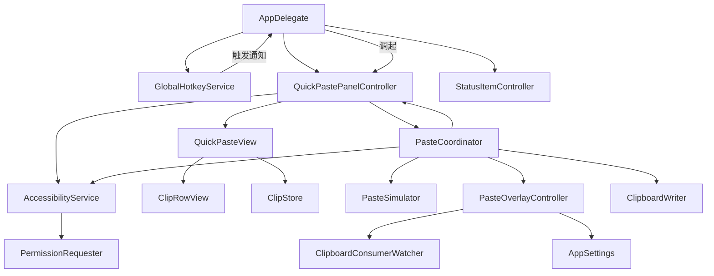
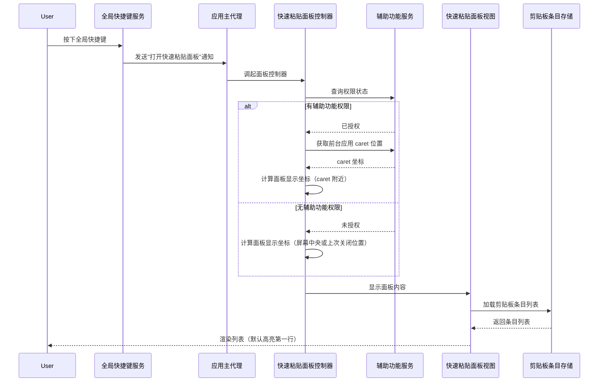
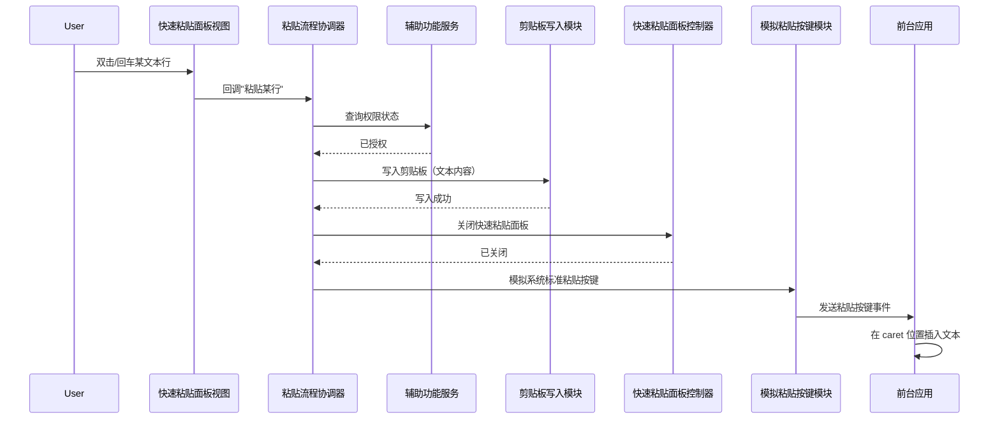
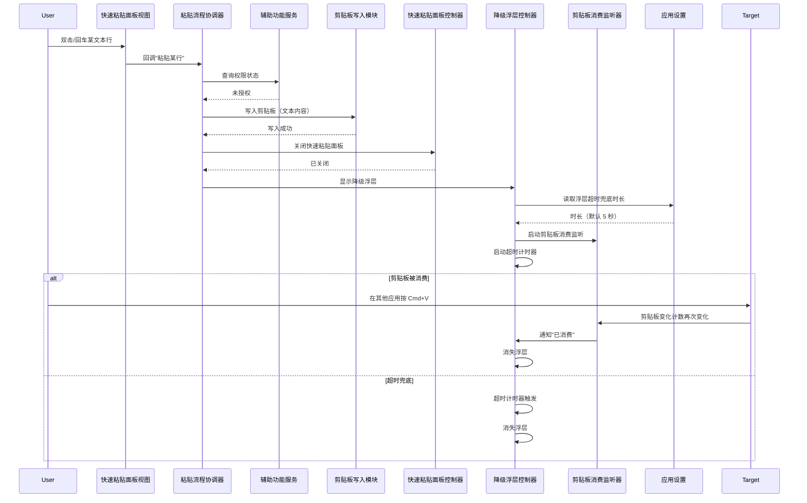
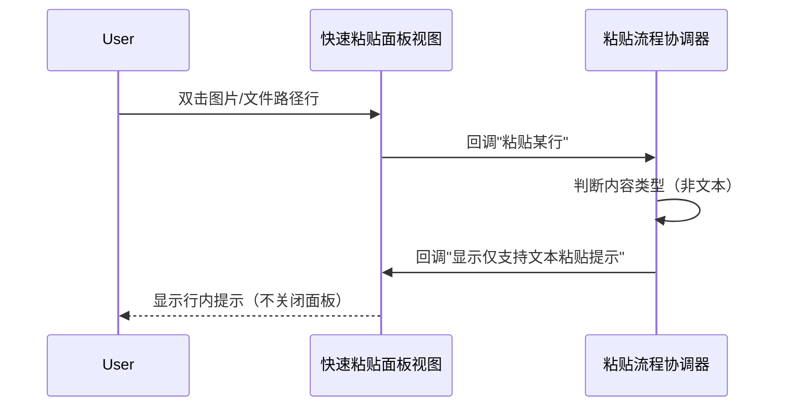
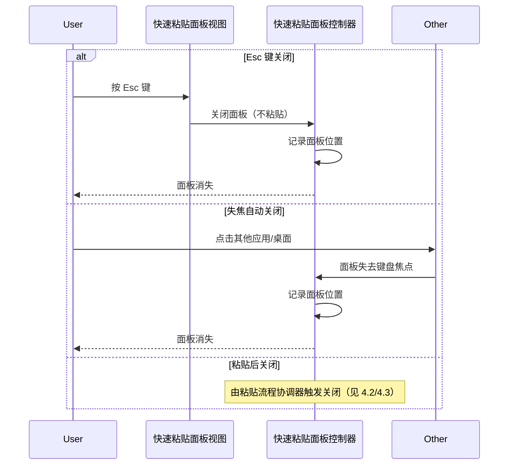
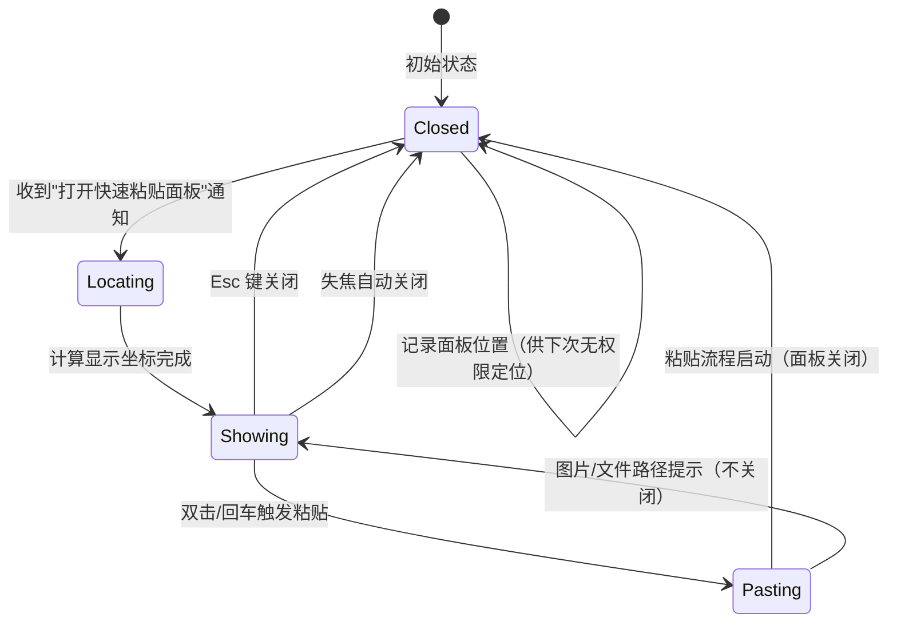
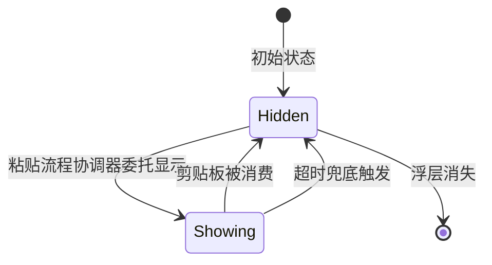
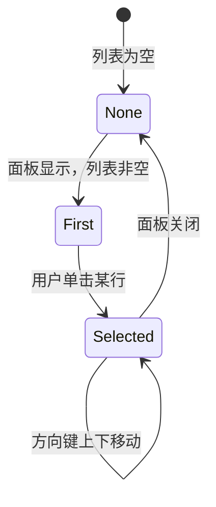
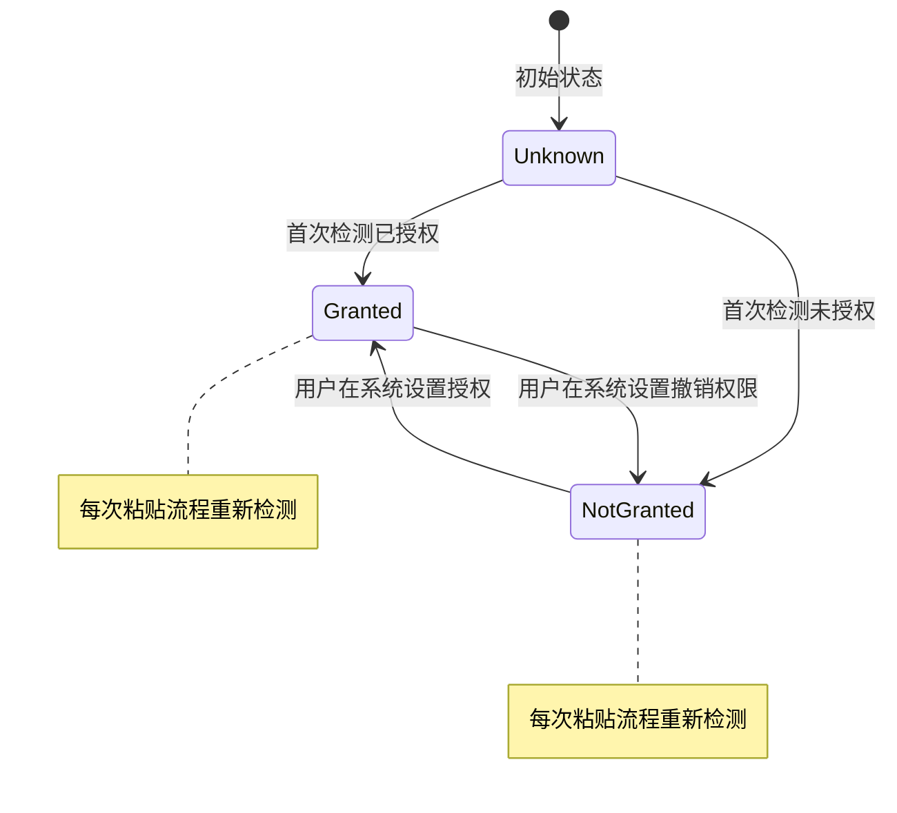

> 最后更新：2026-07-23 | 版本：v1.0

# F1.9 快捷粘贴面板 设计文档

**功能编号**：F1.9
**优先级**：P0
**文档存放路径**：`docs/planning/P0/F1/F1.9_快捷粘贴面板_设计文档.md`
**关联需求文档**：`docs/planning/P0/F1/F1.9_快捷粘贴面板_需求文档.md` v1.1
**关联视觉原型**：`docs/planning/P0/F1/F1.9_快捷粘贴面板_视觉原型.html`
**关联测试用例表**：`docs/planning/P0/F1/F1.9_快捷粘贴面板_测试用例表.md`
**关联主设计规范**：`docs/planning/P0/F1/F1_ClipMind_设计规范.md` v1.9

---

## 目录

1. [文档定位](#1-文档定位)
2. [模块划分](#2-模块划分)
3. [职责边界](#3-职责边界)
4. [数据流](#4-数据流)
5. [状态变化](#5-状态变化)
6. [协作关系](#6-协作关系)
7. [关键设计决策](#7-关键设计决策)
8. [非功能约束落地](#8-非功能约束落地)
9. [与 Requirements 的映射](#9-与-requirements-的映射)
10. [风险和待确认问题](#10-风险和待确认问题)

---

## 1. 文档定位

本文档是 F1.9 快捷粘贴面板的**架构契约**，定义模块边界、数据流、状态模型与协作关系，**不**包含具体代码实现（无类定义/方法签名/字段类型/枚举值/文件路径）、**不**包含验收标准（AC 已在需求文档）、**不**包含测试策略与 UI 可观测性矩阵（已迁移到测试用例表）、**不**包含分阶段设计（属于实现规划）。

设计文档遵循 dd-write-design 的 P0 铁律：仅描述"谁负责什么、模块如何协作、状态如何流转、数据如何流动"，不描述"用什么语言、用什么框架 API、用什么并发原语"。

### 1.1 设计目标

- 把"粘贴历史内容"从"切换应用上下文"中解放出来，用户在任意应用按全局快捷键直接在 caret 附近呼出快速粘贴面板。
- 沿用 F1 主设计规范的剪贴板捕获、加密存储、菜单栏基础设施，不引入新的数据模型或持久化方案。
- 保持 App Store 合规：无权限降级方案纯沙盒内实现；有权限方案使用公开 API + 标准 TCC 权限流程，合规风险独立标注。

### 1.2 设计约束（来自需求文档）

- macOS 12.4+ 兼容（与 F1 主设计规范一致）。
- 不改动主窗口功能、不删除菜单栏原 popover、不修改快捷键配置 UI。
- 仅支持文本类型自动粘贴；图片/文件路径双击提示"仅支持文本粘贴"。
- 禁止使用私有 API、禁止绕过沙盒、禁止缓存辅助功能权限状态、禁止弹 TCC 提示对话框。

---

## 2. 模块划分

F1.9 在 F1 主设计规范的模块结构基础上，新增 4 个模块（均位于 `UI` 模块下，与现有菜单栏 UI 平级），修改 3 个现有模块。所有新增模块通过初始化器注入依赖，遵循 `UI → 业务模块 → Models/Utils` 的依赖方向。

### 2.1 新增模块

| 模块名 | 所属层级 | 职责概述 |
|--------|---------|---------|
| 快速粘贴面板控制器 | UI | 独立窗口控制器，负责面板的创建、定位、显示、关闭、键盘焦点管理 |
| 快速粘贴面板视图 | UI | 面板内容视图，复用现有列表行视图骨架，增加单击/双击/键盘导航交互 |
| 粘贴流程协调器 | UI | 协调粘贴流程：检测权限 → 写剪贴板 → 关闭面板 → 有权限路径或无权限路径分支 |
| 降级浮层控制器 | UI | 无权限降级浮层窗口控制器，负责浮层的显示、消费监听、超时消失 |

### 2.2 修改的现有模块

| 现有模块 | 修改内容 |
|---------|---------|
| 全局快捷键服务 | 触发行为从"唤起主窗口"改为"呼出快速粘贴面板"（仅快捷键路径，菜单栏 toggle 行为不变） |
| 列表行视图 | 增加"高亮选中"状态、单击选中、双击触发回调、回车键支持 |
| 应用设置 | 新增"浮层超时兜底时长"设置项（默认 5 秒） |

### 2.3 复用的现有模块（不修改）

| 现有模块 | 复用方式 |
|---------|---------|
| 权限请求器 | 复用其辅助功能权限检测能力（仅查询当前状态，不弹 TCC 提示） |
| 剪贴板捕获服务与剪贴板条目模型 | 复用其剪贴板条目数据，作为列表数据源 |
| 加密存储 | 复用其持久化能力，不新增表或字段 |
| 菜单栏 StatusItem 控制器 | 复用其菜单栏 toggle popover 行为，与快速粘贴面板是两个独立入口 |
| 菜单栏 popover 视图 | 复用其搜索框 + 列表 + 底部按钮的视觉骨架，快速粘贴面板视图与其视觉一致 |

### 2.4 模块依赖图

> 注：图中节点名为业务模块名（非类名），仅用于展示模块协作关系，不约束实现时的具体类型命名。

---

## 3. 职责边界

### 3.1 快速粘贴面板控制器

**负责**：

- 创建并持有独立快速粘贴面板窗口实例。
- 根据权限状态与历史位置计算面板显示坐标（caret 附近 / 屏幕中央 / 上次关闭位置）。
- 显示面板、关闭面板、管理面板生命周期。
- 管理面板的键盘焦点（接收键盘事件并转发给视图）。
- 监听面板失焦事件，触发自动关闭。
- 在面板关闭时记录面板位置（供下次无权限定位使用）。

**不负责**：

- 不负责剪贴板写入（由粘贴流程协调器负责）。
- 不负责模拟粘贴按键（由粘贴流程协调器负责）。
- 不负责列表内容渲染（由快速粘贴面板视图负责）。
- 不负责菜单栏 popover 的 toggle（由菜单栏 StatusItem 控制器负责）。

### 3.2 快速粘贴面板视图

**负责**：

- 渲染搜索框、列表、底部按钮（视觉与现有菜单栏 popover 一致）。
- 管理高亮选中状态（单选模式）。
- 处理单击选中、双击触发回调、回车键触发回调。
- 处理方向键上下移动高亮（必要时自动滚动以保持高亮行可见）。
- 处理 Esc 键关闭回调。
- 通过回调将"双击/回车某行"事件传递给粘贴流程协调器。

**不负责**：

- 不负责剪贴板写入或粘贴按键模拟。
- 不负责面板窗口的创建或定位。
- 不负责权限检测。

### 3.3 粘贴流程协调器

**负责**：

- 接收"双击/回车某行"事件，启动粘贴流程。
- 运行时检测辅助功能权限状态（不缓存，每次重新检测）。
- 写入剪贴板（仅文本类型；图片/文件路径类型显示提示不写入）。
- 关闭快速粘贴面板。
- 分支：有权限路径 → 委托模拟粘贴按键模块；无权限路径 → 委托降级浮层控制器。
- 处理剪贴板写入失败的错误日志与浮层提示。

**不负责**：

- 不负责面板窗口的创建或定位。
- 不负责列表内容渲染或交互。
- 不负责菜单栏 popover 的 toggle。

### 3.4 降级浮层控制器

**负责**：

- 创建并持有降级浮层窗口实例。
- 显示"已复制，按 Cmd+V 粘贴"通用文案（不显示剪贴板原文）。
- 监听剪贴板被消费（变化计数再次变化即视为消费），触发浮层消失。
- 启动超时兜底计时器（时长来自应用设置），超时触发浮层消失。
- 浮层不抢夺前台应用焦点（保持在前台应用之上但不激活）。

**不负责**：

- 不负责剪贴板写入（由粘贴流程协调器负责）。
- 不负责面板窗口的关闭（由粘贴流程协调器负责）。
- 不负责权限检测。

### 3.5 辅助功能服务（新增）

**负责**：

- 运行时查询当前辅助功能权限状态（不弹 TCC 提示对话框）。
- 有权限时获取前台应用 caret 位置（用于面板定位）。
- 前台应用无 caret 时降级返回鼠标当前位置。

**不负责**：

- 不负责请求权限（请求权限仍由现有权限请求器负责，F1.9 不调用请求路径）。
- 不负责模拟粘贴按键（由模拟粘贴按键模块负责）。

### 3.6 模拟粘贴按键模块（新增）

**负责**：

- 接收粘贴流程协调器的委托，模拟系统标准粘贴按键到前台应用。
- 仅发送系统标准粘贴按键，不发送任意按键序列。

**不负责**：

- 不负责剪贴板写入。
- 不负责面板关闭。
- 不负责权限检测。

### 3.7 剪贴板写入模块（新增）

**负责**：

- 接收粘贴流程协调器的委托，将文本内容写入系统剪贴板。
- 写入失败时返回错误，由协调器处理。

**不负责**：

- 不负责剪贴板消费监听（由降级浮层控制器的剪贴板消费监听器负责）。
- 不负责面板关闭或浮层显示。

### 3.8 剪贴板消费监听器（新增）

**负责**：

- 监听系统剪贴板变化计数，当计数再次变化时判定为"被消费"，通知降级浮层控制器消失。

**不负责**：

- 不负责剪贴板写入。
- 不负责浮层窗口的创建或显示。

### 3.9 职责边界无冲突验证

| 职责 | 负责模块 | 是否有冲突 |
|------|---------|-----------|
| 面板窗口创建与定位 | 快速粘贴面板控制器 | 无（唯一负责） |
| 面板内容渲染与交互 | 快速粘贴面板视图 | 无（唯一负责） |
| 粘贴流程编排 | 粘贴流程协调器 | 无（唯一负责） |
| 权限检测 | 辅助功能服务 | 无（与现有权限请求器职责分离：检测 vs 请求） |
| 模拟粘贴按键 | 模拟粘贴按键模块 | 无（唯一负责） |
| 剪贴板写入 | 剪贴板写入模块 | 无（唯一负责） |
| 剪贴板消费监听 | 剪贴板消费监听器 | 无（唯一负责） |
| 降级浮层显示与消失 | 降级浮层控制器 | 无（唯一负责） |
| 菜单栏 popover toggle | 菜单栏 StatusItem 控制器 | 无（与快速粘贴面板是两个独立入口） |
| 主窗口唤起 | 应用主代理（监听"查看全部"或菜单栏点击） | 无（F1.9 不修改主窗口入口） |

---

## 4. 数据流

### 4.1 快捷键呼出面板数据流

### 4.2 双击/回车触发粘贴数据流（有权限路径）

### 4.3 双击/回车触发粘贴数据流（无权限降级路径）

### 4.4 图片/文件路径双击提示数据流

### 4.5 关闭面板数据流（三种路径）

---

## 5. 状态变化

### 5.1 快速粘贴面板状态机

**状态说明**：

| 状态 | 说明 | 持久化 | UI 表现 |
|------|------|--------|---------|
| Closed | 面板未显示 | 是（上次关闭位置） | 无 |
| Locating | 正在计算显示坐标 | 否（内存） | 无（< 50ms） |
| Showing | 面板已显示，等待用户交互 | 否（内存） | 面板可见，第一行高亮 |
| Pasting | 正在执行粘贴流程 | 否（内存） | 面板即将关闭 |

### 5.2 降级浮层状态机

**状态说明**：

| 状态 | 说明 | 持久化 | UI 表现 |
|------|------|--------|---------|
| Hidden | 浮层未显示 | 否 | 无 |
| Showing | 浮层已显示，等待消费或超时 | 否 | 浮层可见，"已复制，按 Cmd+V 粘贴" |

### 5.3 高亮选中状态机

**状态说明**：

| 状态 | 说明 | 持久化 | UI 表现 |
|------|------|--------|---------|
| None | 无高亮选中（列表空） | 否 | 无 |
| First | 默认高亮第一行 | 否 | 第一行高亮 |
| Selected | 用户选中某行 | 否 | 选中行高亮，其他行取消高亮 |

### 5.4 辅助功能权限状态（运行时检测，不缓存）

**说明**：辅助功能权限状态由系统管理，F1.9 不缓存。每次粘贴流程启动时重新检测，确保权限被撤销后自动降级。

---

## 6. 协作关系

### 6.1 应用主代理的协作

应用主代理（现有模块）在 F1.9 中新增两项协作：

1. **监听"打开快速粘贴面板"通知**：收到通知后调起快速粘贴面板控制器（与现有监听"打开主窗口"通知并行存在）。
2. **初始化快速粘贴面板控制器**：在应用启动完成首启引导后，初始化快速粘贴面板控制器并持有（与现有菜单栏 StatusItem 控制器、全局快捷键服务并行初始化）。

### 6.2 全局快捷键服务的协作

全局快捷键服务（现有模块，修改）的触发行为变更：

- **修改前**：触发时发送"打开主窗口"通知。
- **修改后**：触发时发送"打开快速粘贴面板"通知。
- **不变**：菜单栏 StatusItem 控制器的 toggle popover 行为仍发送"打开主窗口"通知（菜单栏点击进入主窗口入口）。

> 注：主窗口入口由"菜单栏点击 → popover → 查看全部按钮"或"菜单栏点击 → 主窗口"路径承担，F1.9 不修改主窗口入口。

### 6.3 快速粘贴面板控制器与视图的协作

- 控制器创建视图实例，注入剪贴板条目存储作为数据源。
- 视图通过回调将"双击/回车某行"、"Esc 键"、"失焦"事件传递给控制器。
- 控制器将"双击/回车某行"事件委托给粘贴流程协调器，将"Esc 键"和"失焦"事件转化为面板关闭。

### 6.4 粘贴流程协调器与各子模块的协作

- 协调器接收控制器的"双击/回车某行"事件。
- 协调器委托辅助功能服务查询权限状态。
- 协调器委托剪贴板写入模块写入剪贴板。
- 协调器委托控制器关闭面板。
- 有权限路径：协调器委托模拟粘贴按键模块发送粘贴按键。
- 无权限路径：协调器委托降级浮层控制器显示浮层。

### 6.5 降级浮层控制器与消费监听器的协作

- 浮层控制器创建消费监听器实例。
- 浮层控制器启动超时计时器（时长来自应用设置）。
- 消费监听器检测到剪贴板变化计数再次变化时，通知浮层控制器消失。
- 超时计时器触发时，浮层控制器自行消失。
- 两条消失路径互斥，先触发者生效，另一条路径被取消。

### 6.6 列表行视图与快速粘贴面板视图的协作

- 列表行视图（现有模块，修改）增加"高亮选中"状态与"双击/回车"回调。
- 快速粘贴面板视图管理"当前高亮选中行"状态，通过列表行视图的"高亮选中"属性同步状态。
- 列表行视图通过回调将"双击"和"单击"事件传递给快速粘贴面板视图。

### 6.7 应用设置的协作

应用设置（现有模块，修改）新增"浮层超时兜底时长"字段：

- 默认值：5 秒。
- 用户可在设置面板调整（范围 1~30 秒）。
- 降级浮层控制器在显示浮层时读取该字段，作为超时计时器时长。
- 设置变更立即生效（浮层控制器下次显示浮层时读取最新值）。

---

## 7. 关键设计决策

### 7.1 为什么独立窗口而非复用菜单栏 popover？

**决策**：新建独立快速粘贴面板窗口，不复用菜单栏 popover。

**理由**：

- 菜单栏 popover 强制绑定在菜单栏 StatusItem 按钮位置，无法定位到 caret 附近或屏幕中央。
- 菜单栏 popover 的失焦行为由系统控制，无法自定义"失焦自动关闭"逻辑。
- 独立窗口可自由定位、自定义失焦行为、自定义键盘焦点管理，满足 F1.9 的所有交互需求。
- 保留菜单栏 popover 作为"菜单栏入口"的独立路径，与快速粘贴面板是两个独立入口，互不影响。

### 7.2 为什么运行时检测权限而非缓存？

**决策**：每次粘贴流程启动时重新检测辅助功能权限状态，不缓存上一次结果。

**理由**：

- 用户可能在系统设置中随时撤销权限，缓存会导致权限被撤销后仍走有权限路径，违反 NFR-003 安全性。
- 权限检测是同步快速操作（< 1ms），对性能无影响。
- 运行时检测确保权限状态始终准确，满足 AC-F1.9-12（权限被撤销时自动降级）。

### 7.3 为什么不弹 TCC 提示对话框？

**决策**：快速粘贴面板触发粘贴流程时仅查询权限状态，不调用会弹 TCC 提示对话框的权限请求路径。

**理由**：

- TCC 提示对话框会打断用户工作流，破坏"双击即粘贴"的体验。
- 无权限路径已提供降级方案（浮层提示 + 手动 Cmd+V），用户体验完整。
- 权限请求由首次启动引导的权限请求器承担，F1.9 不重复请求。

### 7.4 为什么面板关闭后再模拟粘贴按键？

**决策**：有权限路径中，先关闭快速粘贴面板，再模拟粘贴按键到前台应用。

**理由**：

- 面板打开时持有键盘焦点，模拟粘贴按键会被面板拦截而非发送到前台应用。
- 关闭面板后，键盘焦点回到前台应用，模拟粘贴按键能正确发送到前台应用 caret 位置。
- 关闭面板与模拟粘贴按键之间不需要固定 sleep，使用面板关闭完成的回调触发模拟（避免用 sleep 掩盖竞态）。

### 7.5 为什么浮层提示不显示剪贴板原文？

**决策**：浮层提示仅显示"已复制，按 Cmd+V 粘贴"通用文案，不显示剪贴板原文。

**理由**：

- 剪贴板原文可能包含敏感信息（密码、Token、验证码），显示原文违反 NFR-003 安全性。
- 通用文案已足够引导用户完成粘贴，不需要预览。
- 用户已在快速粘贴面板中看到选中行的内容预览，浮层不需要重复显示。

### 7.6 为什么剪贴板消费监听用变化计数而非内容比对？

**决策**：剪贴板消费监听通过剪贴板变化计数再次变化判定为"被消费"，不比对剪贴板内容。

**理由**：

- 内容比对需要读取剪贴板原文，违反 NFR-003 安全性（不读取剪贴板原文）。
- 变化计数是剪贴板的元数据，不涉及原文，安全。
- 用户按 Cmd+V 粘贴后，前台应用读取剪贴板，部分应用会重新写入剪贴板（如富文本转纯文本），变化计数会再次变化，准确判定消费。
- 变化计数监听轻量（轮询间隔与现有剪贴板监听一致），对性能无影响。

### 7.7 为什么默认高亮第一行？

**决策**：面板显示时默认高亮第一行（若列表非空）。

**理由**：

- 第一行是最近复制的条目，最可能是用户想粘贴的内容。
- 默认高亮允许用户直接按回车粘贴，无需鼠标点击或方向键导航，加速高频粘贴场景。
- 满足 NFR-005 可访问性：键盘导航完整覆盖所有操作。

### 7.8 为什么面板尺寸固定？

**决策**：快速粘贴面板尺寸固定（与现有菜单栏 popover 视觉一致），不支持用户自定义尺寸。

**理由**：

- 固定尺寸降低实现复杂度，加快首版交付。
- 与菜单栏 popover 视觉一致，用户认知一致（两个入口的视觉相同，仅定位不同）。
- 自定义尺寸归入未来扩展（需求文档 12.6）。

---

## 8. 非功能约束落地

### 8.1 响应性能（NFR-001）

| 约束 | 落地方式 |
|------|---------|
| 快捷键触发到面板出现 ≤ 200ms | 面板控制器在收到通知后同步计算坐标 + 显示，坐标计算 ≤ 50ms，显示 ≤ 100ms，留 50ms 余量 |
| 双击/回车到剪贴板写入 ≤ 100ms | 协调器同步调用剪贴板写入模块，写入是系统 API 调用，通常 < 50ms |
| 有权限路径模拟粘贴 ≤ 300ms | 面板关闭回调触发模拟粘贴按键，模拟是系统 API 调用，通常 < 100ms，受前台应用响应速度影响 |
| 列表交互 ≤ 16ms | 视图使用声明式 UI 框架的高效列表渲染，单击/方向键导航是本地状态变更，无网络/磁盘 IO |

### 8.2 稳定性（NFR-002）

| 约束 | 落地方式 |
|------|---------|
| 100 次连续操作无崩溃、无内存泄漏 | 控制器在面板关闭时释放视图与子模块引用，浮层消失时取消计时器与监听器 |
| 三种关闭路径互不冲突 | 控制器维护单一"面板状态"（见 5.1 状态机），关闭后忽略后续关闭事件 |
| 权限检测在循环中状态正确 | 每次粘贴流程重新检测，不缓存状态，确保循环正确 |

### 8.3 安全性（NFR-003）

| 约束 | 落地方式 |
|------|---------|
| 不输出剪贴板原文 | 所有日志仅记录元数据（如"已写入剪贴板，长度 256"），使用现有日志分类与隐私修饰符 |
| 仅发送系统标准粘贴按键 | 模拟粘贴按键模块仅发送系统标准粘贴按键事件，不发送其他按键 |
| 浮层不显示原文 | 浮层提示使用硬编码通用文案"已复制，按 Cmd+V 粘贴" |
| 写入剪贴板不绕过敏感识别 | 剪贴板写入模块仅写入用户选中的条目内容，敏感识别在捕获阶段已处理（不入库的敏感内容不会出现在列表中） |

### 8.4 兼容性（NFR-004）

| 约束 | 落地方式 |
|------|---------|
| macOS 12.4+ | 不使用 macOS 13+ 专有 API（如无特殊必要）；声明式 UI 框架的按键事件修饰符在 macOS 12.4 可用 |
| Apple Silicon + Intel | 不使用架构相关 API，Universal Binary 构建自动兼容 |
| 保留菜单栏 StatusItem toggle | 菜单栏 StatusItem 控制器不变，与快速粘贴面板是两个独立入口 |
| 保留快捷键配置 | 全局快捷键服务的注册逻辑不变，仅触发行为变更 |
| 老用户无感知迁移 | 快捷键不变，行为升级，不要求用户重新配置 |

### 8.5 可访问性（NFR-005）

| 约束 | 落地方式 |
|------|---------|
| VoiceOver 朗读 | 所有交互元素设置无障碍标签（如"剪贴项列表"、"搜索框"、"已复制提示"） |
| 键盘导航完整覆盖 | 单击/双击/方向键/回车/Esc 全部支持键盘操作 |
| 高亮对色盲用户可识别 | 高亮状态不仅依赖颜色，辅以边框或形状差异 |

### 8.6 合规性（NFR-006）

| 约束 | 落地方式 |
|------|---------|
| App Sandbox 启用 | 所有模块在沙盒内运行，不通过外部进程或脚本绕过 |
| 无权限降级方案纯沙盒内 | 剪贴板写入、浮层显示、消费监听全部使用沙盒内公开 API |
| 有权限方案公开 API | 辅助功能 API、模拟按键 API 均为公开 API，使用标准 TCC 权限流程 |
| 合规风险标注 | 详见第 10 节风险章节，方案1（有权限路径）标注「合规待定」 |

---

## 9. 与 Requirements 的映射

### 9.1 FR 到模块映射表

| FR 编号 | FR 描述 | 负责模块 |
|---------|--------|---------|
| FR-001 | 全局快捷键触发呼出快速粘贴面板 | 全局快捷键服务（修改） + 应用主代理（监听通知） + 快速粘贴面板控制器 |
| FR-002 | 快速粘贴面板窗口独立定位 | 快速粘贴面板控制器 + 辅助功能服务（caret 定位） |
| FR-003 | 列表行单击高亮选中 | 快速粘贴面板视图 + 列表行视图（修改） |
| FR-004 | 键盘方向键导航 | 快速粘贴面板视图 |
| FR-005 | 列表行双击触发粘贴流程 | 快速粘贴面板视图 + 粘贴流程协调器 |
| FR-006 | 有辅助功能权限时自动粘贴 | 粘贴流程协调器 + 辅助功能服务 + 剪贴板写入模块 + 模拟粘贴按键模块 |
| FR-007 | 无辅助功能权限时降级粘贴流程 | 粘贴流程协调器 + 辅助功能服务 + 剪贴板写入模块 + 降级浮层控制器 + 剪贴板消费监听器 |
| FR-008 | 回车键粘贴 | 快速粘贴面板视图 + 粘贴流程协调器 |
| FR-009 | Esc 键关闭 | 快速粘贴面板视图 + 快速粘贴面板控制器 |
| FR-010 | 失焦自动关闭 | 快速粘贴面板控制器 |
| FR-011 | 粘贴后自动关闭 | 粘贴流程协调器 + 快速粘贴面板控制器 |
| FR-012 | 图片/文件路径类型双击提示 | 粘贴流程协调器 + 快速粘贴面板视图 |
| FR-013 | 辅助功能权限运行时检测与降级 | 粘贴流程协调器 + 辅助功能服务 |
| FR-014 | 浮层超时兜底时长可配置 | 应用设置（修改） + 降级浮层控制器 |

### 9.2 设计文档对需求建议的回应

| 需求审查建议 | 设计文档回应 |
|-------------|-------------|
| FR-002 "合理偏移"需明确具体范围 | 第 4.1 节：caret 附近定义为"距离 caret 不超过 50 像素，不遮挡 caret"，面板尺寸固定 360x480（与菜单栏 popover 一致） |
| FR-007 "剪贴板被消费"需明确判定标准 | 第 7.6 节：剪贴板变化计数再次变化即视为消费（不比对内容，避免读取原文） |

### 9.3 NFR 落地映射

| NFR 编号 | NFR 描述 | 落地章节 |
|---------|---------|---------|
| NFR-001 | 响应性能 | 8.1 |
| NFR-002 | 稳定性 | 8.2 |
| NFR-003 | 安全性 | 8.3 |
| NFR-004 | 兼容性 | 8.4 |
| NFR-005 | 可访问性 | 8.5 |
| NFR-006 | 合规性 | 8.6 + 10 |

---

## 10. 风险和待确认问题

### 10.1 技术风险

| 风险 | 影响 | 概率 | 缓解措施 |
|------|------|------|---------|
| 辅助功能 API 在某些应用无法获取 caret 位置 | 有权限路径定位失败 | 中 | 降级到鼠标当前位置（NSEvent.mouseLocation），与无权限路径的屏幕中央定位形成二级降级 |
| 模拟粘贴按键在某些应用不生效（如终端、远程桌面） | 有权限路径粘贴失败 | 中 | 降级到无权限路径（显示浮层提示），用户手动按 Cmd+V；日志记录降级事件 |
| 剪贴板消费监听误判（系统后台进程读取剪贴板触发计数变化） | 浮层提前消失 | 低 | 监听器仅在浮层显示期间启动，浮层消失即停止监听；超时兜底确保最终消失 |
| 面板失焦与粘贴后关闭竞态（双击触发关闭同时触发失焦） | 重复关闭事件 | 低 | 控制器维护单一"面板状态"，关闭后忽略后续关闭事件（见 5.1 状态机） |
| 列表行视图修改影响菜单栏 popover 的现有列表 | 菜单栏 popover 行为变化 | 低 | 列表行视图的新交互（单击/双击/回车）通过可选回调实现，菜单栏 popover 不传入回调即不触发新交互 |

### 10.2 合规风险（App Store）

| 风险 | 影响 | 概率 | 缓解措施 |
|------|------|------|---------|
| **方案1（有权限路径）依赖辅助功能权限，App Store 审核可能拒绝** | 有权限路径无法上架主 Scheme | 中 | **合规待定**：方案1使用公开 API（辅助功能 API + 模拟按键 API）+ 标准 TCC 权限流程，理论上合规；但 App Store 审核对辅助功能权限的审核较严，存在被拒风险。若被拒，方案1暂存到 `ClipMind-Dev` Scheme，主 Scheme 仅保留方案3（无权限降级） |
| **方案1模拟粘贴按键可能被视为"自动化用户输入"** | App Store 审核拒绝 | 低 | 模拟粘贴按键仅发送系统标准粘贴按键，不发送任意按键序列，符合"响应用户双击操作"的语义；在审核备注中说明"用户主动双击触发粘贴，非自动化批量操作" |
| **方案1获取前台应用 caret 位置可能被视为"跨应用读取用户输入"** | App Store 审核拒绝 | 低 | caret 位置仅用于面板定位，不读取 caret 处的文本内容；在审核备注中说明"仅获取光标坐标用于面板定位，不读取用户输入内容" |

### 10.3 「合规待定」标注（针对方案1）

**方案1（有权限路径）状态**：合规待定

**依据**：

- 方案1使用公开 API：辅助功能 API（`AXUIElement` 系列）查询 caret 位置、系统事件 API（`CGEvent` 系列）模拟粘贴按键。
- 方案1使用标准 TCC 权限流程：通过 `AXIsProcessTrustedWithOptions` 检测权限状态，权限请求由首次启动引导承担。
- 方案1不使用私有 API、不绕过沙盒、不发送任意按键序列、不读取用户输入内容。

**风险**：

- App Store 审核对辅助功能权限的审核较严，可能要求详细说明权限用途。
- 模拟粘贴按键可能被视为"自动化用户输入"，需在审核备注中明确"响应用户双击操作"。

**回退方案**：

- 若 App Store 审核拒绝方案1，则方案1暂存到 `ClipMind-Dev` Scheme（开发验证用），主 Scheme `ClipMind` 仅保留方案3（无权限降级）。
- 主 Scheme 仅保留方案3时，用户体验略有下降（需手动按 Cmd+V 粘贴），但功能完整、合规无风险。
- 一旦为方案1找到合规实现（如通过 App Store 审核的类似应用案例佐证），立即迁移回主 Scheme，并在提交信息中说明合规方案。

**审核备注模板**（提交 App Store 时使用）：

> ClipMind 的快捷粘贴面板功能使用辅助功能权限用于：
> 1. 获取前台应用光标位置（仅坐标，不读取文本内容），用于面板定位。
> 2. 模拟系统标准粘贴按键（仅 Cmd+V，不发送任意按键序列），响应用户双击剪贴项的粘贴操作。
>
> 该功能不读取用户输入内容、不发送任意按键序列、不批量自动化操作，仅在用户主动双击剪贴项时触发一次粘贴按键。

### 10.4 待确认问题

| 问题 | 影响范围 | 建议方案 | 决策时机 |
|------|---------|---------|---------|
| 面板定位的"caret 附近"具体偏移（50 像素是否合适） | Phase 1 面板定位 | 50 像素（不遮挡 caret，距离适中），可在 Phase 1 实现时根据实际效果调整 | Phase 1 实现时 |
| 浮层超时兜底时长的范围（1~30 秒是否合适） | Phase 3 浮层配置 | 1~30 秒（覆盖快速粘贴到慢速确认场景），默认 5 秒 | Phase 3 实现时 |
| 列表行视图的新交互是否影响菜单栏 popover 现有行为 | Phase 2 列表行修改 | 通过可选回调实现，菜单栏 popover 不传入回调即不触发新交互，需在 Phase 2 验证 | Phase 2 实现时 |
| 面板出现时是否需要动画（淡入/缩放） | Phase 1 面板显示 | 首版不做动画（≤ 200ms 出现已足够快），动画归入未来扩展 | Phase 1 实现时 |
| 多显示器场景下面板定位 | Phase 1 面板定位 | 首版仅在主屏幕定位，多显示器支持归入未来扩展（需求文档 12.7） | Phase 1 实现时 |

---

## 版本记录

| 版本 | 日期 | 变更说明 |
|------|------|---------|
| v1.0 | 2026-07-23 | 初始版本，覆盖 F1.9 快捷粘贴面板设计，包含 10 章节（文档定位/模块划分/职责边界/数据流/状态变化/协作关系/关键设计决策/非功能约束落地/与 Requirements 的映射/风险和待确认问题），4 个新增模块 + 3 个修改模块 + 5 个复用模块，5 个数据流序列图，4 个状态机，8 项关键设计决策，6 项 NFR 落地，FR 到模块映射表全覆盖，3 项合规风险 + 1 项合规待定标注 + 5 项待确认问题 |
