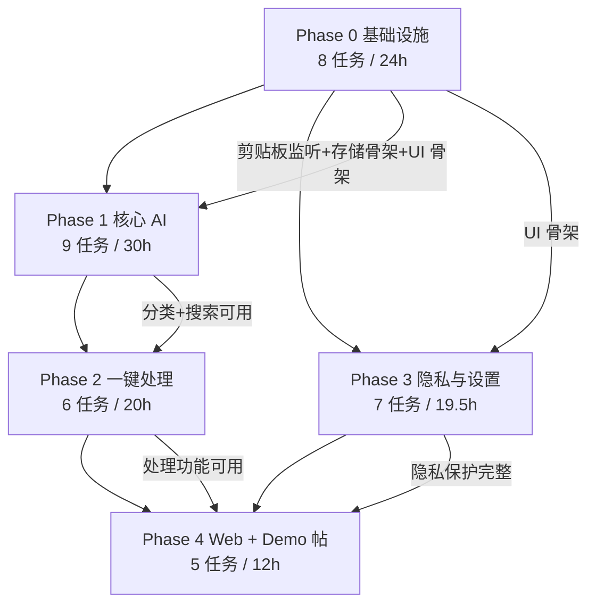
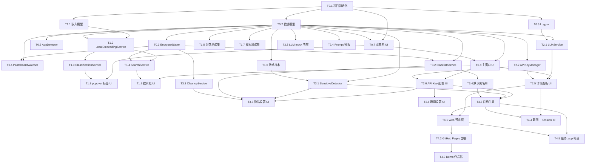
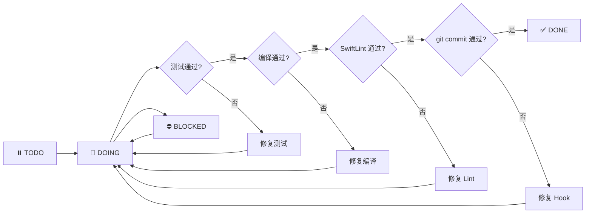

> 最后更新：2026-07-12 | 版本：v1.0（基于设计规范 v1.3）

# ClipMind 初赛 MVP 实施计划

**功能编号**：F1.x（Phase 01 · P0 · 初赛必做）
**文档存放路径**：`docs/planning/P0/F1/F1_ClipMind_实施计划.md`
**上游输入**：设计规范 v1.3、测试用例表 v1.1、视觉原型
**适用阶段**：TRAE AI 创造力大赛初赛（2026-07-15 截止）

---

## 目录

1. [背景与目标](#1-背景与目标)
2. [实施总览](#2-实施总览)
3. [环境与工具要求](#3-环境与工具要求)
4. [任务分解](#4-任务分解)
5. [任务依赖与执行顺序](#5-任务依赖与执行顺序)
6. [MVP 兜底路径](#6-mvp-兜底路径)
7. [风险与应对](#7-风险与应对)
8. [验收与交付清单](#8-验收与交付清单)
9. [执行跟踪机制](#9-执行跟踪机制)
10. [版本记录](#版本记录)

---

## 1. 背景与目标

### 1.1 背景

引用设计规范 v1.3 第 1.1 节：macOS 用户每天复制大量信息（代码、链接、报错、文案、会议内容、资料），普通剪贴板只是临时容器，存在信息被覆盖、无法被理解、需手动整理、隐私无保护四大痛点。ClipMind 是一款 macOS 原生桌面 App（Swift/SwiftUI），把系统剪贴板升级为会自动分类、总结、搜索和复用的 AI 信息库。

初赛总目标（对齐设计规范 1.3 节）：交付可交互、能体验的 Demo，让评审一眼看懂 ClipMind 的价值，晋级复赛。成功标准包含 4 个维度：核心功能可体验（F1.1-F1.7 全部跑通）、TRAE 开发过程（Session ID ≥ 3 个，截图 ≥ 3 张）、作品帖完整（4 部分齐全）、赛道标签（学习工作）。

### 1.2 实施计划目标

本实施计划将设计规范 v1.3 和测试用例表 v1.1 转化为可执行任务，供 TRAE IDE 逐任务执行：

- 将 5 个 Phase 拆解为 35 个细粒度任务（每个任务 = 1 个 Swift 文件/模块 + 对应测试）
- 每个任务可在 1 个 TRAE Session 内完成
- 每个任务标注工时估算、依赖关系、AC 映射、测试用例映射、验证方式
- 采用 TDD 开发方法（测试先行）
- 定义 MVP 兜底路径（时间不足时的最小任务集）
- 覆盖设计规范全部 25 条 AC 和测试用例表全部 69 个测试用例

### 1.3 关键决策（grill 确认）

| 决策项 | 选择 | 理由 |
|--------|------|------|
| 任务粒度 | 细粒度（按文件/模块） | 每个 Session 目标明确，便于 TRAE 执行和审查 |
| Phase 执行顺序 | 串行：P0→P1→P2→P3→P4 | 核心功能优先，Phase 2 依赖 Phase 1 无等待 |
| Session 映射 | 每任务 1 Session | 每个 Session 聚焦单一任务，上下文清晰 |
| 嵌入模型 | all-MiniLM-L6-v2 + CoreML（ONNX→CoreML 转换） | 设计规范推荐，模型小（22MB）、推理快（<100ms） |
| 工时估算 | 包含 | 便于进度管控，在截止前可调整优先级 |
| 开发方法 | TDD（测试先行） | 符合设计规范测试策略，AC 验证明确 |
| MVP 兜底 | P0 全部 + P1 全部 + P2 全部 + P3 简化 + P4 全部 | 核心功能完整，隐私体验简化 |

---

## 2. 实施总览

### 2.1 Phase 依赖图



**说明**：
- 本计划采用串行执行：P0 → P1 → P2 → P3 → P4
- 设计规范允许 P1 与 P3 并行（均仅依赖 P0），但为保证专注和审查质量，本计划选择串行
- P2 严格依赖 P1（处理需要分类后的内容）
- P4 依赖 P2 和 P3（需完整功能才能提交 Demo）

### 2.2 里程碑表

| Phase | 目标 | AC 覆盖 | 任务数 | 预计工时 | 完成标志 |
|-------|------|---------|--------|---------|---------|
| Phase 0 | 基础设施：剪贴板监听 + 加密存储 + UI 骨架 | AC-01, AC-02, AC-03, AC-04, AC-18, AC-23 | 8 | 24h | .app 能启动，复制文本后 popover 显示，数据库加密存储可读写 |
| Phase 1 | 核心 AI：分类 + 搜索 | AC-05, AC-06, AC-07, AC-08, AC-09, AC-10, AC-11, AC-12 | 9 | 30h | 11 种入库类型分类准确率 ≥ 80%，搜索响应 < 500ms |
| Phase 2 | 一键处理：4 种处理 + API Key | AC-13, AC-14, AC-15, AC-16, AC-17, AC-19 | 6 | 20h | 4 种处理在配置 API Key 后可用，未配置时置灰 |
| Phase 3 | 隐私与设置：敏感识别 + 黑名单 + 清理 + 设置 | AC-08, AC-20, AC-21, AC-22, AC-24 | 7 | 19.5h | 敏感内容自动识别，黑名单生效，30 天自动清理 |
| Phase 4 | Web + Demo 帖 | AC-25 | 5 | 12h | Web 页面可访问，Demo 帖发布，截图 + Session ID 齐全 |
| **合计** | — | **25 条 AC 全覆盖** | **35** | **105.5h** | 初赛 MVP 交付 |

### 2.3 MVP 兜底路径说明

当工时超出预期或临近截止日期时，切换到 MVP 兜底路径：

- **Phase 0**：完整完成（24h）— 基础设施不可省
- **Phase 1**：完整完成（30h）— 核心 AI 价值不可省
- **Phase 2**：完整完成（20h）— 一键处理是核心卖点
- **Phase 3**：简化为仅 T3.1 SensitiveDetector + T3.2 BlacklistService + T3.4 默认黑名单预置（6h）— 跳过清理服务、完整设置面板、首启引导
- **Phase 4**：完整完成（12h）— Demo 帖和 Web 预览页是初赛硬性要求

**MVP 总工时**：24 + 30 + 20 + 6 + 12 = **92h**（节省 13.5h）

**MVP 跳过的 AC**：AC-21（30 天清理）、AC-24（首启引导）
**MVP 跳过的 TC**：TC-21-01~04、TC-22-03、TC-24-01~03

详见 [第 6 章 MVP 兜底路径](#6-mvp-兜底路径)。

---

## 3. 环境与工具要求

### 3.1 开发环境

| 工具 | 版本要求 | 用途 |
|------|---------|------|
| Xcode | 15.0+ | Swift 编译、UI 开发、测试运行 |
| macOS | 14.0（Sonoma）+ | 部署目标，SwiftUI 新特性（NavigationStack/@Observable） |
| Swift | 5.9+ | 随 Xcode 15 提供 |
| TRAE IDE | 最新版 | 开发过程工具，Session ID 收集 |

### 3.2 SwiftLint 配置

**配置文件**（`.swiftlint.yml`，项目根目录）：

```yaml
included:
  - ClipMind
  - ClipMindTests
  - ClipMindUITests

excluded:
  - Pods
  - ClipMind/Models/Generated

opt_in_rules:
  - empty_count
  - closure_end_indentation
  - first_where
  - operator_usage_whitespace
  - sorted_imports
  - vertical_whitespace_closing_braces

disabled_rules:
  - trailing_whitespace

line_length:
  warning: 120
  error: 200

type_body_length:
  warning: 300
  error: 500

function_body_length:
  warning: 50
  error: 100

file_length:
  warning: 500
  error: 1000
```

**Git pre-commit hook**（`.githooks/pre-commit`）：

```bash
#!/bin/bash
if ! command -v swiftlint &> /dev/null; then
    echo "Warning: SwiftLint not installed"
    exit 0
fi
swiftlint lint --strict
if [ $? -ne 0 ]; then
    echo "SwiftLint check failed. Please fix issues before committing."
    exit 1
fi
```

启用 hook：`git config core.hooksPath .githooks`

### 3.3 依赖库

| 依赖 | 版本 | 用途 | 引入方式 |
|------|------|------|---------|
| SQLite.swift | 0.15.3+ | SQLite 数据库操作 | Swift Package Manager |
| CryptoKit | 系统内置 | AES-256-GCM 加密 | Apple 框架（无需安装） |

### 3.4 CoreML 模型转换工具

| 工具 | 版本 | 用途 |
|------|------|------|
| coremltools | 7.0+ | ONNX → CoreML 模型转换 |
| onnxruntime | 1.16+ | ONNX 模型验证（可选） |

转换流程：HuggingFace `all-MiniLM-L6-v2` → ONNX → CoreML `.mlmodelc`

### 3.5 测试与部署工具

| 工具 | 用途 |
|------|------|
| XCTest | 单元测试 + 性能测试 |
| XCUITest | UI 自动化测试 |
| SwiftLint | 代码风格检查（`--strict`） |
| GitHub Pages | Web 交互预览页部署 |
| curl | Web 页面可访问性验证 |

---

## 4. 任务分解

### 4.1 Phase 0：基础设施（8 任务，24h）

基于设计规范 11.1 节，搭建可运行的 .app 骨架，实现剪贴板监听 + 本地加密存储 + 菜单栏 UI 骨架。

#### T0.1 Xcode 项目初始化 + SwiftLint 配置

| 字段 | 内容 |
|------|------|
| 任务编号 | T0.1 |
| 任务名称 | Xcode 项目初始化 + SwiftLint 配置 + .swiftlint.yml + git pre-commit hook |
| 依赖 | 无 |
| 输入 | 设计规范 9.4 节 SwiftLint 配置、3.3 节 .swiftlint.yml 模板 |
| 输出 | `ClipMind.xcodeproj`、`.swiftlint.yml`、`.githooks/pre-commit`、`ClipMind/App/ClipMindApp.swift`、`ClipMindTests/`、`ClipMindUITests/` 目录骨架 |
| AC 映射 | AC-23（间接，项目能启动是菜单栏常驻的前提） |
| 测试用例映射 | TC-23-01（间接，菜单栏图标常驻需要项目能编译运行） |
| 验证方式 | `xcodebuild build -project ClipMind.xcodeproj -scheme ClipMind -destination 'platform=macOS'` 编译成功；`swiftlint lint --strict` 通过；`git commit` 触发 pre-commit hook |
| 工时估算 | 3h |
| Session | Session-01 |
| MVP | ✅ 必做 |

#### T0.2 数据模型定义

| 字段 | 内容 |
|------|------|
| 任务编号 | T0.2 |
| 任务名称 | 数据模型定义（ClipItem, ClipContent, ContentType, TodoItem, AppSettings, APIProvider, RewriteMode, BlacklistEntry） |
| 依赖 | T0.1 |
| 输入 | 设计规范 5.1 节数据模型定义 |
| 输出 | `ClipMind/Models/ClipItem.swift`、`ClipMind/Models/ClipContent.swift`、`ClipMind/Models/ContentType.swift`、`ClipMind/Models/TodoItem.swift`、`ClipMind/Models/AppSettings.swift`、`ClipMind/Models/APIProvider.swift`、`ClipMind/Models/RewriteMode.swift`、`ClipMind/Models/BlacklistEntry.swift`、`ClipMindTests/Models/ClipItemModelTests.swift` |
| AC 映射 | AC-01（ClipItem 模型支持文本捕获）、AC-13~16（TodoItem/RewriteMode 支持处理功能） |
| 测试用例映射 | TC-01-01（间接，文本捕获需要 ClipItem 模型）、TC-16-01（间接，待办提取需要 TodoItem 模型） |
| 验证方式 | `xcodebuild test -project ClipMind.xcodeproj -scheme ClipMind -destination 'platform=macOS' -only-testing:ClipMindTests/ClipItemModelTests` |
| 工时估算 | 2h |
| Session | Session-02 |
| MVP | ✅ 必做 |

#### T0.3 EncryptedStore.swift

| 字段 | 内容 |
|------|------|
| 任务编号 | T0.3 |
| 任务名称 | EncryptedStore.swift（AES-256-GCM 加密 SQLite + schema 建表） |
| 依赖 | T0.2 |
| 输入 | 设计规范 5.4 节持久化方案、5.4.2 节数据库 Schema |
| 输出 | `ClipMind/Storage/EncryptedStore.swift`、`ClipMindTests/Storage/EncryptedStoreTests.swift`、`ClipMindTests/Storage/EncryptionTests.swift` |
| AC 映射 | AC-18（AES-256 加密，数据文件无法直接读取） |
| 测试用例映射 | TC-18-01（加密后数据库文件无明文）、TC-18-02（SQLite Browser 无法打开）、TC-18-03（十六进制查看器显示乱码） |
| 验证方式 | `xcodebuild test -project ClipMind.xcodeproj -scheme ClipMind -destination 'platform=macOS' -only-testing:ClipMindTests/EncryptedStoreTests`；`xcodebuild test -project ClipMind.xcodeproj -scheme ClipMind -destination 'platform=macOS' -only-testing:ClipMindTests/EncryptionTests` |
| 工时估算 | 4h |
| Session | Session-03 |
| MVP | ✅ 必做 |

#### T0.4 PasteboardWatcher.swift

| 字段 | 内容 |
|------|------|
| 任务编号 | T0.4 |
| 任务名称 | PasteboardWatcher.swift（NSPasteboard.changeCount 轮询 + 内容读取 + 去重） |
| 依赖 | T0.2, T0.3 |
| 输入 | 设计规范 5.2.1 节 NSPasteboard 接口、3.3 节复制捕获流程 |
| 输出 | `ClipMind/Capture/PasteboardWatcher.swift`、`ClipMind/Capture/ContentReader.swift`、`ClipMindTests/Capture/PasteboardWatcherTests.swift`、`ClipMindTests/Capture/ContentReaderTests.swift`、`ClipMindTests/Capture/DeduplicationTests.swift` |
| AC 映射 | AC-01（复制文本 3 秒内出现）、AC-02（图片缩略图捕获）、AC-03（文件路径捕获）、AC-04（相同内容不重复入库） |
| 测试用例映射 | TC-01-01（复制文本出现在 popover）、TC-01-03（文本捕获手动验证）、TC-02-01（图片被捕获为缩略图）、TC-03-01（文件路径被捕获）、TC-04-01（连续复制相同内容不重复入库） |
| 验证方式 | `xcodebuild test -project ClipMind.xcodeproj -scheme ClipMind -destination 'platform=macOS' -only-testing:ClipMindTests/PasteboardWatcherTests`；`xcodebuild test -project ClipMind.xcodeproj -scheme ClipMind -destination 'platform=macOS' -only-testing:ClipMindTests/ContentReaderTests`；`xcodebuild test -project ClipMind.xcodeproj -scheme ClipMind -destination 'platform=macOS' -only-testing:ClipMindTests/DeduplicationTests` |
| 工时估算 | 4h |
| Session | Session-04 |
| MVP | ✅ 必做 |

#### T0.5 AppDetector.swift

| 字段 | 内容 |
|------|------|
| 任务编号 | T0.5 |
| 任务名称 | AppDetector.swift（NSWorkspace 前台 App 识别） |
| 依赖 | T0.2 |
| 输入 | 设计规范 5.2.2 节 NSWorkspace 接口 |
| 输出 | `ClipMind/Capture/AppDetector.swift`、`ClipMindTests/Capture/AppDetectorTests.swift` |
| AC 映射 | AC-12（间接，来源 App 识别支持搜索过滤） |
| 测试用例映射 | TC-12-01（间接，来源 App 过滤需要 AppDetector 识别 bundleId） |
| 验证方式 | `xcodebuild test -project ClipMind.xcodeproj -scheme ClipMind -destination 'platform=macOS' -only-testing:ClipMindTests/AppDetectorTests` |
| 工时估算 | 1.5h |
| Session | Session-05 |
| MVP | ✅ 必做 |

#### T0.6 Logger.swift

| 字段 | 内容 |
|------|------|
| 任务编号 | T0.6 |
| 任务名称 | Logger.swift（os.Logger 日志系统 + LogCategory 枚举） |
| 依赖 | T0.1 |
| 输入 | 设计规范 7.1 节日志系统、7.1.1 节日志级别、7.1.2 节关键日志点 |
| 输出 | `ClipMind/Utils/Logger.swift`、`ClipMind/Utils/LogCategory.swift`、`ClipMindTests/Utils/LoggerTests.swift` |
| AC 映射 | AC-01（间接，捕获流程需要日志记录可观测性）、AC-19（间接，日志系统支持数据不出本机的可观测性验证） |
| 测试用例映射 | TC-01-01（间接，捕获流程日志辅助验证）、TC-19-01（间接，URLProtocol 拦截验证需要日志辅助） |
| 验证方式 | `xcodebuild test -project ClipMind.xcodeproj -scheme ClipMind -destination 'platform=macOS' -only-testing:ClipMindTests/LoggerTests` |
| 工时估算 | 1.5h |
| Session | Session-06 |
| MVP | ✅ 必做 |

#### T0.7 菜单栏 UI 骨架

| 字段 | 内容 |
|------|------|
| 任务编号 | T0.7 |
| 任务名称 | 菜单栏 UI 骨架（NSStatusItem + popover 空列表 + 搜索框 + 查看全部按钮） |
| 依赖 | T0.1, T0.2 |
| 输入 | 设计规范 3.9 节交互入口、10.3 节 UI 设计风格 |
| 输出 | `ClipMind/UI/MenuBar/StatusItemController.swift`、`ClipMind/UI/MenuBar/PopoverView.swift`、`ClipMind/UI/MenuBar/ClipRowView.swift`、`ClipMindUITests/PopoverUITests.swift` |
| AC 映射 | AC-23（菜单栏图标常驻，点击弹出 popover） |
| 测试用例映射 | TC-01-01（复制文本后 3 秒内出现在 popover）、TC-01-02（复制文本后主窗口历史同步出现）、TC-23-01（菜单栏图标常驻）、TC-23-02（点击菜单栏图标弹出 popover）、TC-23-03（popover 手动验证） |
| 验证方式 | `xcodebuild test -project ClipMind.xcodeproj -scheme ClipMind -destination 'platform=macOS' -only-testing:ClipMindUITests/PopoverUITests` |
| 工时估算 | 4h |
| Session | Session-07 |
| MVP | ✅ 必做 |

#### T0.8 主窗口 UI 骨架

| 字段 | 内容 |
|------|------|
| 任务编号 | T0.8 |
| 任务名称 | 主窗口 UI 骨架（SwiftUI WindowGroup + 空历史列表 + 设置入口） |
| 依赖 | T0.2, T0.7 |
| 输入 | 设计规范 3.9 节交互入口、10.3 节 UI 设计风格 |
| 输出 | `ClipMind/UI/MainWindow/MainWindow.swift`、`ClipMind/UI/MainWindow/HistoryListView.swift`、`ClipMind/UI/MainWindow/DetailPanel.swift`、`ClipMindUITests/MainWindowUITests.swift` |
| AC 映射 | AC-01（主窗口历史同步出现）、AC-02（图片缩略图 UI 展示）、AC-03（文件路径 UI 展示） |
| 测试用例映射 | TC-01-02（复制文本后主窗口历史同步出现）、TC-02-02（复制图片被捕获为缩略图 UI 手动验证）、TC-03-02（复制文件路径 UI 验证） |
| 验证方式 | `xcodebuild test -project ClipMind.xcodeproj -scheme ClipMind -destination 'platform=macOS' -only-testing:ClipMindUITests/MainWindowUITests` |
| 工时估算 | 4h |
| Session | Session-08 |
| MVP | ✅ 必做 |

---

### 4.2 Phase 1：核心 AI（9 任务，30h）

基于设计规范 11.2 节，实现 11 种入库类型自动分类 + 敏感内容识别 + 自然语言语义搜索。

#### T1.1 嵌入模型准备

| 字段 | 内容 |
|------|------|
| 任务编号 | T1.1 |
| 任务名称 | 嵌入模型准备（all-MiniLM-L6-v2 ONNX → CoreML 转换脚本 + .mlmodelc 文件） |
| 依赖 | T0.1 |
| 输入 | 设计规范 5.2.3 节本地嵌入模型、HuggingFace all-MiniLM-L6-v2 模型 |
| 输出 | `ClipMind/ML/convert_onnx_to_coreml.py`、`ClipMind/ML/MiniLM-L6-v2.mlmodelc`、`ClipMind/ML/ModelLoader.swift`、`ClipMindTests/ML/ModelLoaderTests.swift` |
| AC 映射 | AC-05（间接，嵌入模型支持分类准确率）、AC-09（间接，嵌入模型支持搜索响应） |
| 测试用例映射 | TC-05-01（间接，分类测试集需要模型加载）、TC-09-01（间接，搜索性能测试需要模型加载） |
| 验证方式 | `python3 ClipMind/ML/convert_onnx_to_coreml.py` 转换成功；`xcodebuild test -project ClipMind.xcodeproj -scheme ClipMind -destination 'platform=macOS' -only-testing:ClipMindTests/ModelLoaderTests` |
| 工时估算 | 3h |
| Session | Session-09 |
| MVP | ✅ 必做 |

#### T1.2 LocalEmbeddingService.swift

| 字段 | 内容 |
|------|------|
| 任务编号 | T1.2 |
| 任务名称 | LocalEmbeddingService.swift（CoreML 嵌入模型封装 + embed() + classify()） |
| 依赖 | T1.1, T0.2 |
| 输入 | 设计规范 5.2.3 节 EmbeddingService 协议、T1.1 产出的 .mlmodelc 文件 |
| 输出 | `ClipMind/ML/LocalEmbeddingService.swift`、`ClipMind/ML/EmbeddingService.swift`、`ClipMindTests/ClassifyTests/LocalEmbeddingServiceTests.swift` |
| AC 映射 | AC-05（11 种入库类型分类准确率 ≥ 80%）、AC-06（代码片段识别为 code）、AC-07（报错日志识别为 error） |
| 测试用例映射 | TC-06-01（Swift 代码片段识别为 code）、TC-06-02（Python 代码片段识别为 code）、TC-07-01（Swift 报错识别为 error）、TC-07-02（Python 堆栈报错识别为 error） |
| 验证方式 | `xcodebuild test -project ClipMind.xcodeproj -scheme ClipMind -destination 'platform=macOS' -only-testing:ClipMindTests/LocalEmbeddingServiceTests` |
| 工时估算 | 4h |
| Session | Session-10 |
| MVP | ✅ 必做 |

#### T1.3 ClassificationService.swift

| 字段 | 内容 |
|------|------|
| 任务编号 | T1.3 |
| 任务名称 | ClassificationService.swift（11 种入库类型向量匹配 + 阈值判断） |
| 依赖 | T1.2 |
| 输入 | 设计规范 3.4 节分类入库流程、12 种分类类型定义 |
| 输出 | `ClipMind/Classify/ClassificationService.swift`、`ClipMind/Classify/TypeEmbeddings.swift`、`ClipMindTests/ClassifyTests/ClassificationAccuracyTests.swift`、`ClipMindTests/ClassifyTests/ContentTypeTests.swift` |
| AC 映射 | AC-05（11 种入库类型分类准确率 ≥ 80%）、AC-06（代码片段识别为 code）、AC-07（报错日志识别为 error） |
| 测试用例映射 | TC-05-01（11 种入库类型分类准确率 ≥ 80%） |
| 验证方式 | `xcodebuild test -project ClipMind.xcodeproj -scheme ClipMind -destination 'platform=macOS' -only-testing:ClipMindTests/ClassificationAccuracyTests`；`xcodebuild test -project ClipMind.xcodeproj -scheme ClipMind -destination 'platform=macOS' -only-testing:ClipMindTests/ContentTypeTests` |
| 工时估算 | 3h |
| Session | Session-11 |
| MVP | ✅ 必做 |

**TypeEmbeddings.swift 实现说明**：该文件包含 11 种入库类型的预计算嵌入向量常量。实现方式：使用 T1.1 转换后的 CoreML 模型，对每种 ContentType 的代表性文本（如 code 类型用 "func viewDidLoad() { super.viewDidLoad() }"，error 类型用 "Thread 1: Fatal error: Unexpectedly found nil"）生成嵌入向量，将结果硬编码为 Swift 静态常量数组 `[ContentType: [Float]]`。分类时计算输入向量与 11 个类型向量的余弦相似度，取最高分（低于阈值返回 .other）。

| 字段 | 内容 |
|------|------|
| 任务编号 | T1.4 |
| 任务名称 | SearchService.swift（余弦相似度 + Top-N + 跨语言 + 来源过滤） |
| 依赖 | T1.2, T0.3 |
| 输入 | 设计规范 3.5 节搜索流程、5.4.1 节 EncryptedStore.search 接口 |
| 输出 | `ClipMind/Search/SearchService.swift`、`ClipMindTests/SearchTests/SearchServiceTests.swift`、`ClipMindTests/SearchTests/CrossLanguageSearchTests.swift`、`ClipMindTests/SearchTests/SourceFilterTests.swift` |
| AC 映射 | AC-09（搜索返回结果 < 500ms）、AC-10（Top-5 命中率 ≥ 70%）、AC-11（跨语言搜索）、AC-12（来源 App 过滤） |
| 测试用例映射 | TC-09-01（搜索响应时间 < 500ms）、TC-10-01（Top-5 命中率 ≥ 70%）、TC-11-01（中文查询匹配英文内容）、TC-11-02（英文查询匹配中文内容）、TC-12-01（来源 App 过滤生效） |
| 验证方式 | `xcodebuild test -project ClipMind.xcodeproj -scheme ClipMind -destination 'platform=macOS' -only-testing:ClipMindTests/SearchServiceTests`；`xcodebuild test -project ClipMind.xcodeproj -scheme ClipMind -destination 'platform=macOS' -only-testing:ClipMindTests/CrossLanguageSearchTests`；`xcodebuild test -project ClipMind.xcodeproj -scheme ClipMind -destination 'platform=macOS' -only-testing:ClipMindTests/SourceFilterTests` |
| 工时估算 | 4h |
| Session | Session-12 |
| MVP | ✅ 必做 |

#### T1.5 分类测试集准备

| 字段 | 内容 |
|------|------|
| 任务编号 | T1.5 |
| 任务名称 | 分类测试集准备（classification_samples.json，220 条，11 种类型 × 20 条） |
| 依赖 | T0.2 |
| 输入 | 设计规范 9.2.4 节测试数据集准备、测试用例表 4.1 节分类测试集 |
| 输出 | `ClipMindTests/Fixtures/classification_samples.json` |
| AC 映射 | AC-05（分类准确率测试需要测试集） |
| 测试用例映射 | TC-05-01（11 种入库类型分类准确率 ≥ 80%，依赖此测试集） |
| 验证方式 | `python3 -c "import json; d=json.load(open('ClipMindTests/Fixtures/classification_samples.json')); assert len(d['samples'])==220; print('OK')"` 校验 220 条样本；双人交叉抽查 10% 样本标注质量 |
| 工时估算 | 4h |
| Session | Session-13 |
| MVP | ✅ 必做 |

#### T1.6 敏感内容样本准备

| 字段 | 内容 |
|------|------|
| 任务编号 | T1.6 |
| 任务名称 | 敏感内容样本准备（sensitive_samples.json，20 条，6 种模式） |
| 依赖 | T0.2 |
| 输入 | 设计规范 4.2 节敏感模式正则规则、测试用例表 4.2 节敏感内容样本 |
| 输出 | `ClipMindTests/Fixtures/sensitive_samples.json` |
| AC 映射 | AC-08（敏感内容识别测试需要样本集） |
| 测试用例映射 | TC-08-01~TC-08-06（6 种敏感模式识别测试，依赖此样本集） |
| 验证方式 | `python3 -c "import json; d=json.load(open('ClipMindTests/Fixtures/sensitive_samples.json')); assert len(d['samples'])==20; print('OK')"` 校验 20 条样本；覆盖 6 种模式正则边界用例 |
| 工时估算 | 2h |
| Session | Session-14 |
| MVP | ✅ 必做 |

#### T1.7 搜索测试集准备

| 字段 | 内容 |
|------|------|
| 任务编号 | T1.7 |
| 任务名称 | 搜索测试集准备（search_queries.json，50 个查询 + 标注答案） |
| 依赖 | T0.2 |
| 输入 | 设计规范 9.2.4 节测试数据集准备、测试用例表 4.3 节搜索测试集 |
| 输出 | `ClipMindTests/Fixtures/search_queries.json` |
| AC 映射 | AC-10（搜索命中率测试需要查询测试集） |
| 测试用例映射 | TC-10-01（Top-5 命中率 ≥ 70%，依赖此测试集） |
| 验证方式 | `python3 -c "import json; d=json.load(open('ClipMindTests/Fixtures/search_queries.json')); assert len(d['queries'])==50; print('OK')"` 校验 50 个查询；双人交叉抽查 10% 查询标注一致性 |
| 工时估算 | 3h |
| Session | Session-15 |
| MVP | ✅ 必做 |

#### T1.8 popover 分类标签 UI

| 字段 | 内容 |
|------|------|
| 任务编号 | T1.8 |
| 任务名称 | popover 分类标签 UI（类型标签展示 + 内容预览 + 来源 + 时间） |
| 依赖 | T0.7, T1.3 |
| 输入 | 设计规范 10.3 节 UI 设计风格（类型标签颜色）、3.4 节分类类型 |
| 输出 | `ClipMind/UI/MenuBar/TypeTagView.swift`、`ClipMind/UI/MenuBar/ClipRowView.swift`（增强）、`ClipMindUITests/PopoverUITests.swift`（增强） |
| AC 映射 | AC-06（间接，分类标签在 UI 正确显示） |
| 测试用例映射 | TC-23-03（popover 手动验证，含类型标签 + 内容预览 + 来源 + 时间） |
| 验证方式 | `xcodebuild test -project ClipMind.xcodeproj -scheme ClipMind -destination 'platform=macOS' -only-testing:ClipMindUITests/PopoverUITests`；手动复制代码/链接/报错，观察 popover 分类标签正确显示 |
| 工时估算 | 3h |
| Session | Session-16 |
| MVP | ✅ 必做 |

#### T1.9 主窗口搜索框 UI

| 字段 | 内容 |
|------|------|
| 任务编号 | T1.9 |
| 任务名称 | 主窗口搜索框 UI（搜索输入 + 防抖 300ms + 结果列表 + 来源筛选器） |
| 依赖 | T0.8, T1.4 |
| 输入 | 设计规范 3.5 节搜索流程、10.1 节 UI-AC-06 搜索交互 |
| 输出 | `ClipMind/UI/MainWindow/SearchBar.swift`、`ClipMind/UI/MainWindow/SearchResultsView.swift`、`ClipMind/UI/MainWindow/SourceFilter.swift`、`ClipMindUITests/SearchUITests.swift` |
| AC 映射 | AC-09（搜索交互）、AC-12（来源 App 筛选 UI） |
| 测试用例映射 | TC-12-02（来源 App 筛选 UI 验证） |
| 验证方式 | `xcodebuild test -project ClipMind.xcodeproj -scheme ClipMind -destination 'platform=macOS' -only-testing:ClipMindUITests/SearchUITests`；手动输入查询，观察结果列表与来源筛选器 |
| 工时估算 | 4h |
| Session | Session-17 |
| MVP | ✅ 必做 |

---

### 4.3 Phase 2：一键处理（6 任务，20h）

基于设计规范 11.3 节，实现智能总结/即时翻译/智能改写/提取待办 + API Key 多提供商配置。

#### T2.1 LLMService.swift

| 字段 | 内容 |
|------|------|
| 任务编号 | T2.1 |
| 任务名称 | LLMService.swift（协议 + MultiProviderLLMService 多提供商路由 + 4 种处理方法） |
| 依赖 | T0.2, T0.6 |
| 输入 | 设计规范 5.2.4 节云端 LLM API 接口、3.6 节一键处理流程 |
| 输出 | `ClipMind/LLM/LLMService.swift`、`ClipMind/LLM/MultiProviderLLMService.swift`、`ClipMind/LLM/LLMError.swift`、`ClipMindTests/LLMTests/LLMServiceTests.swift`、`ClipMindTests/LLMTests/SummarizeTests.swift`、`ClipMindTests/LLMTests/TranslateTests.swift`、`ClipMindTests/LLMTests/RewriteTests.swift`、`ClipMindTests/LLMTests/ExtractTodoTests.swift`、`ClipMindTests/Helpers/MockLLMService.swift` |
| AC 映射 | AC-13（智能总结 3-5 句）、AC-14（即时翻译中英对照）、AC-15（智能改写 3 模式）、AC-16（提取待办结构化）、AC-19（数据不出本机，URLProtocol 拦截验证） |
| 测试用例映射 | TC-13-01（智能总结 mock）、TC-13-04（总结 API 错误不阻塞）、TC-14-01（翻译 mock）、TC-14-04（翻译超时不阻塞）、TC-15-01（改写 3 模式 mock）、TC-15-04（改写限流处理）、TC-16-01（待办 mock）、TC-16-04（待办解析失败处理）、TC-19-01（数据不出本机 URLProtocol 拦截） |
| 验证方式 | `xcodebuild test -project ClipMind.xcodeproj -scheme ClipMind -destination 'platform=macOS' -only-testing:ClipMindTests/LLMServiceTests`；`xcodebuild test -project ClipMind.xcodeproj -scheme ClipMind -destination 'platform=macOS' -only-testing:ClipMindTests/SummarizeTests`；`xcodebuild test -project ClipMind.xcodeproj -scheme ClipMind -destination 'platform=macOS' -only-testing:ClipMindTests/TranslateTests`；`xcodebuild test -project ClipMind.xcodeproj -scheme ClipMind -destination 'platform=macOS' -only-testing:ClipMindTests/RewriteTests`；`xcodebuild test -project ClipMind.xcodeproj -scheme ClipMind -destination 'platform=macOS' -only-testing:ClipMindTests/ExtractTodoTests` |
| 工时估算 | 5h |
| Session | Session-18 |
| MVP | ✅ 必做 |

#### T2.2 APIKeyManager.swift

| 字段 | 内容 |
|------|------|
| 任务编号 | T2.2 |
| 任务名称 | APIKeyManager.swift（Keychain 加密存储 + 验证逻辑） |
| 依赖 | T0.2 |
| 输入 | 设计规范 5.3 节配置项（API Key 存储到 Keychain）、5.4.3 节加密方案 |
| 输出 | `ClipMind/LLM/APIKeyManager.swift`、`ClipMindTests/LLMTests/APIKeyManagerTests.swift` |
| AC 映射 | AC-17（间接，API Key 管理支持未配置时置灰判断） |
| 测试用例映射 | TC-17-01（间接，未配置 API Key 时按钮置灰需要 APIKeyManager 判断状态）、TC-17-02（间接，未配置时点击提示） |
| 验证方式 | `xcodebuild test -project ClipMind.xcodeproj -scheme ClipMind -destination 'platform=macOS' -only-testing:ClipMindTests/APIKeyManagerTests` |
| 工时估算 | 2h |
| Session | Session-19 |
| MVP | ✅ 必做 |

#### T2.3 LLM mock 响应准备

| 字段 | 内容 |
|------|------|
| 任务编号 | T2.3 |
| 任务名称 | LLM mock 响应准备（llm_mock_responses.json，16 条含 4 条错误响应） |
| 依赖 | T0.2 |
| 输入 | 设计规范 9.2.4 节 LLM mock 响应、测试用例表 4.4 节 LLM mock 响应 |
| 输出 | `ClipMindTests/Fixtures/llm_mock_responses.json` |
| AC 映射 | AC-13（总结 mock 测试需要响应数据）、AC-14（翻译 mock 测试需要响应数据）、AC-15（改写 mock 测试需要响应数据）、AC-16（待办 mock 测试需要响应数据） |
| 测试用例映射 | TC-13-01（智能总结 mock）、TC-13-04（总结 API 错误响应）、TC-14-01（翻译 mock）、TC-14-04（翻译超时响应）、TC-15-01（改写 mock）、TC-15-04（改写限流响应）、TC-16-01（待办 mock）、TC-16-04（待办解析失败响应） |
| 验证方式 | `python3 -c "import json; d=json.load(open('ClipMindTests/Fixtures/llm_mock_responses.json')); r=d['responses']; assert len(r['summarize'])==3 and len(r['translate'])==3 and len(r['rewrite'])==3 and len(r['extract_todo'])==3; print('OK')"` 校验 12 条正常响应；额外校验 4 条错误响应配置 |
| 工时估算 | 3h |
| Session | Session-20 |
| MVP | ✅ 必做 |

#### T2.4 处理 Prompt 模板

| 字段 | 内容 |
|------|------|
| 任务编号 | T2.4 |
| 任务名称 | 处理 Prompt 模板（4 种处理的 system prompt：summarize/translate/rewrite/extract_todo） |
| 依赖 | T0.2 |
| 输入 | 设计规范 3.6 节一键处理流程、4 种处理类型 Prompt 设计要点 |
| 输出 | `ClipMind/LLM/PromptTemplates.swift`、`ClipMindTests/LLMTests/PromptTemplateTests.swift` |
| AC 映射 | AC-13（总结 Prompt 指导 3-5 句输出）、AC-14（翻译 Prompt 指导中英对照 + 术语保留）、AC-15（改写 Prompt 支持 3 种模式）、AC-16（待办 Prompt 指导结构化 JSON 输出） |
| 测试用例映射 | TC-13-01（间接，总结 mock 验证 Prompt 输出格式）、TC-14-01（间接，翻译 mock 验证术语保留）、TC-15-01（间接，改写 mock 验证 3 模式）、TC-16-01（间接，待办 mock 验证结构化输出） |
| 验证方式 | `xcodebuild test -project ClipMind.xcodeproj -scheme ClipMind -destination 'platform=macOS' -only-testing:ClipMindTests/PromptTemplateTests` |
| 工时估算 | 2h |
| Session | Session-21 |
| MVP | ✅ 必做 |

#### T2.5 详情面板 UI

| 字段 | 内容 |
|------|------|
| 任务编号 | T2.5 |
| 任务名称 | 详情面板 UI（一键处理按钮 + 加载动画 + 结果展示区块 + 复制结果按钮） |
| 依赖 | T0.8, T2.1, T2.2 |
| 输入 | 设计规范 3.6 节一键处理流程、10.1 节 UI-AC-08~13 详情面板交互 |
| 输出 | `ClipMind/UI/MainWindow/DetailPanel.swift`（增强）、`ClipMind/UI/MainWindow/ProcessingButtons.swift`、`ClipMind/UI/MainWindow/ResultBlockView.swift`、`ClipMindUITests/ProcessingUITests.swift` |
| AC 映射 | AC-13（总结结果展示）、AC-14（翻译结果展示）、AC-15（改写模式选择 UI）、AC-16（待办结果展示）、AC-17（未配置 API Key 时按钮置灰） |
| 测试用例映射 | TC-13-02（总结结果写入 ClipItem.summary 持久化验证）、TC-13-03（总结真实 API 集成手动验证）、TC-14-02（翻译结果写入 ClipItem.translation）、TC-14-03（翻译真实 API 集成手动验证）、TC-15-02（改写模式选择 UI）、TC-15-03（改写真实 API 集成手动验证）、TC-16-02（待办结果写入 ClipItem.todos）、TC-16-03（待办真实 API 集成手动验证）、TC-17-01（未配置 API Key 时按钮置灰）、TC-17-02（未配置 API Key 时点击提示）、TC-17-03（未配置 API Key 手动验证） |
| 验证方式 | `xcodebuild test -project ClipMind.xcodeproj -scheme ClipMind -destination 'platform=macOS' -only-testing:ClipMindUITests/ProcessingUITests`；手动配置真实 API Key，点击 4 种处理，观察结果 |
| 工时估算 | 5h |
| Session | Session-22 |
| MVP | ✅ 必做 |

#### T2.6 API Key 配置 UI

| 字段 | 内容 |
|------|------|
| 任务编号 | T2.6 |
| 任务名称 | API Key 配置 UI（提供商选择 + Key 输入 + 验证按钮 + 状态显示） |
| 依赖 | T0.8, T2.2 |
| 输入 | 设计规范 3.8 节设置配置流程、4.4 节 API Key 配置状态机、10.1 节 UI-AC-16 API Key 配置 |
| 输出 | `ClipMind/UI/Settings/APIKeyConfigView.swift`、`ClipMind/UI/Settings/SettingsView.swift`、`ClipMindUITests/SettingsUITests.swift` |
| AC 映射 | AC-17（API Key 配置 UI 支持未配置状态判断） |
| 测试用例映射 | TC-17-01（未配置 API Key 时按钮置灰，依赖配置 UI 状态）、TC-17-02（未配置时点击提示，依赖配置 UI）、TC-17-03（未配置 API Key 手动验证） |
| 验证方式 | `xcodebuild test -project ClipMind.xcodeproj -scheme ClipMind -destination 'platform=macOS' -only-testing:ClipMindUITests/SettingsUITests`；手动打开设置面板，输入 API Key，点击验证，观察状态显示 |
| 工时估算 | 3h |
| Session | Session-23 |
| MVP | ✅ 必做 |

---

### 4.4 Phase 3：隐私与设置（7 任务，19.5h）

基于设计规范 11.4 节，实现敏感识别 + 应用黑名单 + 自动清理 + 完整设置面板 + 首次启动引导。

#### T3.1 SensitiveDetector.swift

| 字段 | 内容 |
|------|------|
| 任务编号 | T3.1 |
| 任务名称 | SensitiveDetector.swift（6 种敏感模式正则 + Luhn 校验 + 身份证校验） |
| 依赖 | T0.2, T1.6 |
| 输入 | 设计规范 4.2 节敏感模式正则规则、T1.6 产出的 sensitive_samples.json |
| 输出 | `ClipMind/Privacy/SensitiveDetector.swift`、`ClipMindTests/PrivacyTests/SensitiveDetectorTests.swift` |
| AC 映射 | AC-08（密码 Token 被识别为敏感内容且不入库）、AC-22（敏感识别开关可关闭） |
| 测试用例映射 | TC-08-01（Token 被识别为敏感内容且不入库）、TC-08-02（密码模式被识别）、TC-08-03（银行卡号被识别）、TC-08-04（身份证号被识别）、TC-08-05（验证码被识别）、TC-08-06（敏感关键词被识别）、TC-08-07（复制 Token 弹出通知提示）、TC-22-01（关闭敏感识别后 Token 入库）、TC-22-02（开启敏感识别后 Token 不入库） |
| 验证方式 | `xcodebuild test -project ClipMind.xcodeproj -scheme ClipMind -destination 'platform=macOS' -only-testing:ClipMindTests/SensitiveDetectorTests`；手动复制 Token，观察通知弹出 |
| 工时估算 | 3h |
| Session | Session-24 |
| MVP | ✅ 必做 |

#### T3.2 BlacklistService.swift

| 字段 | 内容 |
|------|------|
| 任务编号 | T3.2 |
| 任务名称 | BlacklistService.swift（黑名单增删查 + bundleId 匹配） |
| 依赖 | T0.2, T0.3 |
| 输入 | 设计规范 4.3 节应用黑名单状态机、5.1.3 节 BlacklistEntry 模型 |
| 输出 | `ClipMind/Privacy/BlacklistService.swift`、`ClipMindTests/PrivacyTests/BlacklistServiceTests.swift` |
| AC 映射 | AC-20（应用黑名单中的 App 复制内容自动忽略） |
| 测试用例映射 | TC-20-01（1Password 黑名单忽略）、TC-20-02（钥匙串访问黑名单忽略）、TC-20-03（自定义黑名单添加与生效） |
| 验证方式 | `xcodebuild test -project ClipMind.xcodeproj -scheme ClipMind -destination 'platform=macOS' -only-testing:ClipMindTests/BlacklistServiceTests` |
| 工时估算 | 2h |
| Session | Session-25 |
| MVP | ✅ 必做 |

#### T3.3 CleanupService.swift

| 字段 | 内容 |
|------|------|
| 任务编号 | T3.3 |
| 任务名称 | CleanupService.swift（定时清理 + 30 天周期 + 启动触发） |
| 依赖 | T0.3 |
| 输入 | 设计规范 4.1 节状态机（已清理状态）、5.4.1 节 EncryptedStore.cleanup 接口 |
| 输出 | `ClipMind/Storage/CleanupService.swift`、`ClipMindTests/Storage/CleanupServiceTests.swift` |
| AC 映射 | AC-21（30 天前内容自动清理） |
| 测试用例映射 | TC-21-01（30 天前内容自动清理）、TC-21-02（29 天前内容不被清理）、TC-21-03（应用启动时自动触发清理）、TC-21-04（恰好 30 天前内容被清理边界用例） |
| 验证方式 | `xcodebuild test -project ClipMind.xcodeproj -scheme ClipMind -destination 'platform=macOS' -only-testing:ClipMindTests/CleanupServiceTests` |
| 工时估算 | 2.5h |
| Session | Session-26 |
| MVP | ⚡ 可简化（MVP 跳过） |

#### T3.4 默认黑名单预置

| 字段 | 内容 |
|------|------|
| 任务编号 | T3.4 |
| 任务名称 | 默认黑名单预置（1Password / 钥匙串 / 5 家银行 App） |
| 依赖 | T3.2 |
| 输入 | 设计规范 4.3 节默认黑名单应用、12.4 节银行类 App 黑名单范围（工商/招商/建设/农业/中国银行） |
| 输出 | `ClipMind/Privacy/DefaultBlacklist.swift`、`ClipMindTests/PrivacyTests/DefaultBlacklistTests.swift` |
| AC 映射 | AC-20（默认黑名单预置后自动忽略） |
| 测试用例映射 | TC-20-01（1Password 黑名单忽略，依赖默认预置）、TC-20-02（钥匙串访问黑名单忽略，依赖默认预置） |
| 验证方式 | `xcodebuild test -project ClipMind.xcodeproj -scheme ClipMind -destination 'platform=macOS' -only-testing:ClipMindTests/DefaultBlacklistTests`；校验预置 7 个条目（1Password + 钥匙串 + 5 家银行） |
| 工时估算 | 1h |
| Session | Session-27 |
| MVP | ✅ 必做 |

#### T3.5 隐私设置 UI

| 字段 | 内容 |
|------|------|
| 任务编号 | T3.5 |
| 任务名称 | 隐私设置 UI（敏感识别开关 + 黑名单管理界面 + 清理周期选择 7/14/30/90 天） |
| 依赖 | T2.6, T3.1, T3.2, T3.3 |
| 输入 | 设计规范 3.8 节设置配置流程、10.1 节 UI-AC-17 黑名单管理、UI-AC-18 清理周期配置 |
| 输出 | `ClipMind/UI/Settings/PrivacySettingsView.swift`、`ClipMind/UI/Settings/BlacklistManagementView.swift`、`ClipMindUITests/PrivacyUITests.swift`（增强） |
| AC 映射 | AC-22（敏感识别开关 UI 切换）、AC-21（清理周期配置 UI） |
| 测试用例映射 | TC-22-03（敏感识别开关 UI 切换）、TC-21-03（间接，清理周期 UI 配置后启动触发） |
| 验证方式 | `xcodebuild test -project ClipMind.xcodeproj -scheme ClipMind -destination 'platform=macOS' -only-testing:ClipMindUITests/PrivacyUITests`；手动切换敏感识别开关，保存后复制 Token，查询数据库 |
| 工时估算 | 4h |
| Session | Session-28 |
| MVP | ⚡ 可简化（MVP 跳过） |

#### T3.6 通用设置 UI

| 字段 | 内容 |
|------|------|
| 任务编号 | T3.6 |
| 任务名称 | 通用设置 UI（开机启动开关 + 快捷键配置） |
| 依赖 | T2.6 |
| 输入 | 设计规范 3.8 节设置配置流程、5.3 节配置项（launchAtLogin/hotkey） |
| 输出 | `ClipMind/UI/Settings/GeneralSettingsView.swift`、`ClipMind/UI/Settings/HotkeyRecorder.swift`、`ClipMindUITests/SettingsUITests.swift`（增强） |
| AC 映射 | AC-23（间接，通用设置支持菜单栏图标常驻配置） |
| 测试用例映射 | TC-23-01（间接，菜单栏图标常驻需要通用设置支持开机启动） |
| 验证方式 | `xcodebuild test -project ClipMind.xcodeproj -scheme ClipMind -destination 'platform=macOS' -only-testing:ClipMindUITests/SettingsUITests`；手动切换开机启动开关，配置快捷键 |
| 工时估算 | 2h |
| Session | Session-29 |
| MVP | ⚡ 可简化（MVP 跳过） |

#### T3.7 首次启动引导

| 字段 | 内容 |
|------|------|
| 任务编号 | T3.7 |
| 任务名称 | 首次启动引导（欢迎页 + 辅助功能权限请求 + 通知权限请求 + API Key 配置引导 + 隐私默认值提示） |
| 依赖 | T2.6, T3.1, T3.4 |
| 输入 | 设计规范 3.2 节首次启动流程、6.1.3 节权限要求、10.1 节 UI-AC-01 首启引导 |
| 输出 | `ClipMind/UI/Onboarding/OnboardingView.swift`、`ClipMind/UI/Onboarding/WelcomeView.swift`、`ClipMind/UI/Onboarding/PermissionRequestView.swift`、`ClipMind/UI/Onboarding/APIKeyGuideView.swift`、`ClipMind/UI/Onboarding/PrivacyNoticeView.swift`、`ClipMindUITests/FirstLaunchUITests.swift` |
| AC 映射 | AC-24（首次启动引导流程完整） |
| 测试用例映射 | TC-24-01（首次启动引导流程完整 UI 自动化）、TC-24-02（API Key 配置引导可跳过）、TC-24-03（首次启动引导手动验证） |
| 验证方式 | `xcodebuild test -project ClipMind.xcodeproj -scheme ClipMind -destination 'platform=macOS' -only-testing:ClipMindUITests/FirstLaunchUITests`；手动删除 App 偏好后重新启动，观察引导流程 |
| 工时估算 | 5h |
| Session | Session-30 |
| MVP | ⚡ 可简化（MVP 跳过） |

---

### 4.5 Phase 4：Web + Demo 帖（5 任务，12h）

基于设计规范 11.5 节，完成 Web 交互预览页 + Demo 作品帖 + 截图 + Session ID + 最终 .app 构建。

#### T4.1 Web 交互预览页

| 字段 | 内容 |
|------|------|
| 任务编号 | T4.1 |
| 任务名称 | Web 交互预览页（基于 docs/ClipMind.html 增强，4 个交互流程可点击） |
| 依赖 | T2.5, T3.7（可选，MVP 跳过时自动解除） |
| 输入 | 设计规范 10.3 节 UI 设计风格、3.3~3.6 节用户流程、`docs/ClipMind.html` 视觉原型 |
| 输出 | `docs/web/index.html`、`docs/web/styles.css`、`docs/web/script.js` |
| AC 映射 | AC-25（Web 交互预览页可访问且模拟核心流程） |
| 测试用例映射 | TC-25-02（Web 预览页 4 个交互流程可点击）、TC-25-03（Web 预览页内容完整） |
| 验证方式 | 本地用浏览器打开 `docs/web/index.html`，点击 4 个核心流程按钮（复制演示内容/自动分类/搜索/一键处理），确认交互响应 |
| 工时估算 | 4h |
| Session | Session-31 |
| MVP | ✅ 必做 |

#### T4.2 GitHub Pages 部署

| 字段 | 内容 |
|------|------|
| 任务编号 | T4.2 |
| 任务名称 | GitHub Pages 部署（部署到 GitHub Pages，验证可访问） |
| 依赖 | T4.1 |
| 输入 | T4.1 产出的 Web 页面文件、GitHub 仓库 |
| 输出 | GitHub Pages 部署配置（`.github/workflows/deploy-web.yml` 或 `docs/` 目录配置）、可访问的 URL `https://<github-username>.github.io/ClipMind/` |
| AC 映射 | AC-25（Web 页面可访问，HTTP 200） |
| 测试用例映射 | TC-25-01（Web 预览页可访问 curl 验证） |
| 验证方式 | `curl -I https://<github-username>.github.io/ClipMind/` 返回 HTTP 200；浏览器打开 URL 确认页面加载 |
| 工时估算 | 1.5h |
| Session | Session-32 |
| MVP | ✅ 必做 |

#### T4.3 Demo 作品帖撰写

| 字段 | 内容 |
|------|------|
| 任务编号 | T4.3 |
| 任务名称 | Demo 作品帖撰写（4 部分：简介/创作思路/体验地址/TRAE 实践过程） |
| 依赖 | T4.2 |
| 输入 | 初赛要求（4 部分齐全）、设计规范 1.3 节成功标准、TRAE 开发过程记录 |
| 输出 | `docs/demo-post/ClipMind_作品帖.md`（4 部分完整文稿） |
| AC 映射 | AC-25（间接，Demo 作品帖是初赛交付物） |
| 测试用例映射 | TC-25-03（间接，Web 预览页内容完整包含作品帖链接） |
| 验证方式 | 检查作品帖 4 部分齐全：简介（产品价值）、创作思路（设计决策）、体验地址（Web URL + .app 下载）、TRAE 实践过程（Session ID + 截图说明）；发帖带"学习工作"赛道标签 |
| 工时估算 | 3h |
| Session | Session-33 |
| MVP | ✅ 必做 |

#### T4.4 截图 + Session ID 收集

| 字段 | 内容 |
|------|------|
| 任务编号 | T4.4 |
| 任务名称 | 截图 + Session ID 收集（≥ 3 张截图 + ≥ 3 个 Session ID） |
| 依赖 | T2.5, T3.7（可选，MVP 跳过时自动解除） |
| 输入 | 开发过程 TRAE Session 记录、各 Phase 完成状态 |
| 输出 | `docs/planning/P0/F1/screenshots/` 目录（≥ 3 张截图）、`docs/planning/P0/F1/session-ids.md`（≥ 3 个 Session ID 清单） |
| AC 映射 | AC-25（间接，截图和 Session ID 是初赛硬性要求） |
| 测试用例映射 | TC-25-02（间接，截图展示 Web 交互流程） |
| 验证方式 | `ls docs/planning/P0/F1/screenshots/ \| wc -l` 确认截图 ≥ 3 张；`cat docs/planning/P0/F1/session-ids.md` 确认 Session ID ≥ 3 个 |
| 工时估算 | 1.5h |
| Session | Session-34 |
| MVP | ✅ 必做 |

#### T4.5 最终 .app 构建

| 字段 | 内容 |
|------|------|
| 任务编号 | T4.5 |
| 任务名称 | 最终 .app 构建（Universal Binary + ad-hoc 签名） |
| 依赖 | T3.7（可选，MVP 跳过时自动解除）, T4.1 |
| 输入 | 完整 ClipMind 项目代码、设计规范 6.1.2 节架构支持（Universal Binary） |
| 输出 | `build/ClipMind.app`（Universal Binary，ad-hoc 签名） |
| AC 映射 | AC-25（间接，.app 是初赛交付物）、AC-19（间接，最终构建验证数据不出本机） |
| 测试用例映射 | TC-19-02（数据不出本机抓包验证，在最终 .app 上执行）、TC-25-01（间接，.app 下载链接包含在 Web 页面） |
| 验证方式 | `xcodebuild build -project ClipMind.xcodeproj -scheme ClipMind -destination 'generic/platform=macOS' -configuration Release` 构建 Universal Binary；`lipo -info build/ClipMind.app/Contents/MacOS/ClipMind` 验证包含 arm64 + x86_64；`codesign -s - build/ClipMind.app` ad-hoc 签名；手动用 Charles/Proxyman 抓包验证数据不出本机 |
| 工时估算 | 2h |
| Session | Session-35 |
| MVP | ✅ 必做 |

---

## 5. 任务依赖与执行顺序

### 5.1 拓扑排序的任务执行顺序

本计划采用串行执行，按以下顺序逐任务完成：



### 5.2 串行执行顺序列表

| 顺序 | 任务编号 | 任务名称 | 工时 | 累计工时 |
|------|---------|---------|------|---------|
| 1 | T0.1 | Xcode 项目初始化 + SwiftLint 配置 | 3h | 3h |
| 2 | T0.2 | 数据模型定义 | 2h | 5h |
| 3 | T0.3 | EncryptedStore.swift | 4h | 9h |
| 4 | T0.4 | PasteboardWatcher.swift | 4h | 13h |
| 5 | T0.5 | AppDetector.swift | 1.5h | 14.5h |
| 6 | T0.6 | Logger.swift | 1.5h | 16h |
| 7 | T0.7 | 菜单栏 UI 骨架 | 4h | 20h |
| 8 | T0.8 | 主窗口 UI 骨架 | 4h | 24h |
| 9 | T1.1 | 嵌入模型准备 | 3h | 27h |
| 10 | T1.2 | LocalEmbeddingService.swift | 4h | 31h |
| 11 | T1.3 | ClassificationService.swift | 3h | 34h |
| 12 | T1.4 | SearchService.swift | 4h | 38h |
| 13 | T1.5 | 分类测试集准备 | 4h | 42h |
| 14 | T1.6 | 敏感内容样本准备 | 2h | 44h |
| 15 | T1.7 | 搜索测试集准备 | 3h | 47h |
| 16 | T1.8 | popover 分类标签 UI | 3h | 50h |
| 17 | T1.9 | 主窗口搜索框 UI | 4h | 54h |
| 18 | T2.1 | LLMService.swift | 5h | 59h |
| 19 | T2.2 | APIKeyManager.swift | 2h | 61h |
| 20 | T2.3 | LLM mock 响应准备 | 3h | 64h |
| 21 | T2.4 | 处理 Prompt 模板 | 2h | 66h |
| 22 | T2.5 | 详情面板 UI | 5h | 71h |
| 23 | T2.6 | API Key 配置 UI | 3h | 74h |
| 24 | T3.1 | SensitiveDetector.swift | 3h | 77h |
| 25 | T3.2 | BlacklistService.swift | 2h | 79h |
| 26 | T3.3 | CleanupService.swift | 2.5h | 81.5h |
| 27 | T3.4 | 默认黑名单预置 | 1h | 82.5h |
| 28 | T3.5 | 隐私设置 UI | 4h | 86.5h |
| 29 | T3.6 | 通用设置 UI | 2h | 88.5h |
| 30 | T3.7 | 首次启动引导 | 5h | 93.5h |
| 31 | T4.1 | Web 交互预览页 | 4h | 97.5h |
| 32 | T4.2 | GitHub Pages 部署 | 1.5h | 99h |
| 33 | T4.3 | Demo 作品帖撰写 | 3h | 102h |
| 34 | T4.4 | 截图 + Session ID 收集 | 1.5h | 103.5h |
| 35 | T4.5 | 最终 .app 构建 | 2h | 105.5h |

### 5.3 关键路径标注

关键路径上的任务（任何延迟都会影响整体交付）：

| 任务编号 | 在关键路径上的理由 |
|---------|---------|
| T0.1 | 所有后续任务的基础 |
| T0.2 | 所有数据模型依赖 |
| T0.3 | 存储层基础，T0.4/T1.4/T3.2/T3.3 依赖 |
| T0.4 | 剪贴板监听是核心功能 F1.1 |
| T0.7 | UI 骨架，T0.8/T1.8 依赖 |
| T0.8 | 主窗口 UI，T1.9/T2.5/T2.6 依赖 |
| T1.1 | 嵌入模型，T1.2 依赖 |
| T1.2 | 嵌入服务，T1.3/T1.4 依赖 |
| T1.3 | 分类服务，T1.8 依赖 |
| T1.4 | 搜索服务，T1.9 依赖 |
| T2.1 | LLM 服务，T2.5 依赖 |
| T2.5 | 详情面板 UI，T4.1/T4.4 依赖 |
| T2.6 | API Key 配置 UI，T3.5/T3.6/T3.7 依赖 |
| T3.1 | 敏感识别，T3.5/T3.7 依赖 |
| T3.7 | 首启引导，T4.1/T4.4/T4.5 依赖 |
| T4.1 | Web 预览页，T4.2/T4.5 依赖 |
| T4.2 | GitHub Pages 部署，T4.3 依赖 |
| T4.5 | 最终 .app 构建，交付终点 |

### 5.4 并行机会标注

虽然本计划采用串行执行，但以下任务组在资源允许时可并行：

| 并行组 | 可并行任务 | 并行条件 |
|--------|---------|---------|
| Phase 0 并行组 1 | T0.5 AppDetector + T0.6 Logger | 均仅依赖 T0.1/T0.2，无相互依赖 |
| Phase 0 并行组 2 | T0.7 菜单栏 UI + T0.8 主窗口 UI（部分） | T0.8 依赖 T0.7，但 UI 组件可并行开发 |
| Phase 1 并行组 1 | T1.5 分类测试集 + T1.6 敏感样本 + T1.7 搜索测试集 | 三个测试集准备无相互依赖 |
| Phase 2 并行组 1 | T2.2 APIKeyManager + T2.3 LLM mock 响应 + T2.4 Prompt 模板 | 均仅依赖 T0.2，无相互依赖 |
| Phase 3 并行组 1 | T3.1 SensitiveDetector + T3.2 BlacklistService + T3.3 CleanupService | 均仅依赖 T0.2/T0.3，无相互依赖 |
| Phase 4 并行组 1 | T4.3 Demo 作品帖 + T4.4 截图 + T4.5 .app 构建 | T4.3 依赖 T4.2，T4.4/T4.5 依赖 T3.7/T4.1，可部分并行 |

---

## 6. MVP 兜底路径

### 6.1 MVP 任务清单

当工时超出预期或临近截止日期时，执行以下最小任务集：

| Phase | 任务编号 | 任务名称 | 工时 | MVP 状态 |
|-------|---------|---------|------|---------|
| Phase 0 | T0.1 | Xcode 项目初始化 + SwiftLint 配置 | 3h | ✅ |
| Phase 0 | T0.2 | 数据模型定义 | 2h | ✅ |
| Phase 0 | T0.3 | EncryptedStore.swift | 4h | ✅ |
| Phase 0 | T0.4 | PasteboardWatcher.swift | 4h | ✅ |
| Phase 0 | T0.5 | AppDetector.swift | 1.5h | ✅ |
| Phase 0 | T0.6 | Logger.swift | 1.5h | ✅ |
| Phase 0 | T0.7 | 菜单栏 UI 骨架 | 4h | ✅ |
| Phase 0 | T0.8 | 主窗口 UI 骨架 | 4h | ✅ |
| Phase 1 | T1.1 | 嵌入模型准备 | 3h | ✅ |
| Phase 1 | T1.2 | LocalEmbeddingService.swift | 4h | ✅ |
| Phase 1 | T1.3 | ClassificationService.swift | 3h | ✅ |
| Phase 1 | T1.4 | SearchService.swift | 4h | ✅ |
| Phase 1 | T1.5 | 分类测试集准备 | 4h | ✅ |
| Phase 1 | T1.6 | 敏感内容样本准备 | 2h | ✅ |
| Phase 1 | T1.7 | 搜索测试集准备 | 3h | ✅ |
| Phase 1 | T1.8 | popover 分类标签 UI | 3h | ✅ |
| Phase 1 | T1.9 | 主窗口搜索框 UI | 4h | ✅ |
| Phase 2 | T2.1 | LLMService.swift | 5h | ✅ |
| Phase 2 | T2.2 | APIKeyManager.swift | 2h | ✅ |
| Phase 2 | T2.3 | LLM mock 响应准备 | 3h | ✅ |
| Phase 2 | T2.4 | 处理 Prompt 模板 | 2h | ✅ |
| Phase 2 | T2.5 | 详情面板 UI | 5h | ✅ |
| Phase 2 | T2.6 | API Key 配置 UI | 3h | ✅ |
| Phase 3 | T3.1 | SensitiveDetector.swift | 3h | ✅ |
| Phase 3 | T3.2 | BlacklistService.swift | 2h | ✅ |
| Phase 3 | T3.4 | 默认黑名单预置 | 1h | ✅ |
| Phase 4 | T4.1 | Web 交互预览页 | 4h | ✅ |
| Phase 4 | T4.2 | GitHub Pages 部署 | 1.5h | ✅ |
| Phase 4 | T4.3 | Demo 作品帖撰写 | 3h | ✅ |
| Phase 4 | T4.4 | 截图 + Session ID 收集 | 1.5h | ✅ |
| Phase 4 | T4.5 | 最终 .app 构建 | 2h | ✅ |
| **合计** | **31 任务** | — | **92h** | — |

### 6.2 MVP 跳过的任务清单

| 任务编号 | 任务名称 | 跳过理由 |
|---------|---------|---------|
| T3.3 | CleanupService.swift | 自动清理非核心 Demo 功能，可后续补充 |
| T3.5 | 隐私设置 UI | 设置面板完整版非核心，敏感识别/黑名单逻辑已通过 T3.1/T3.2 实现 |
| T3.6 | 通用设置 UI | 开机启动/快捷键配置非核心 Demo 功能 |
| T3.7 | 首次启动引导 | 首启引导流程较长，Demo 可直接进入主界面 |

### 6.3 MVP 跳过的 AC 清单

| AC 编号 | AC 描述 | 跳过影响 | 补偿措施 |
|---------|---------|---------|---------|
| AC-21 | 30 天前内容自动清理 | 数据不会自动清理，但 Demo 期间数据量小，无实际影响 | 复赛阶段补充 |
| AC-24 | 首次启动引导流程完整 | 评审首次启动直接进入主界面，无引导流程 | Demo 作品帖中说明首启引导为复赛功能；Web 预览页展示首启引导设计 |

### 6.4 MVP 跳过的测试用例清单

| 测试用例编号 | 测试用例名称 | 跳过理由 |
|------------|------------|---------|
| TC-21-01 | 30 天前内容自动清理 | 依赖 T3.3 CleanupService |
| TC-21-02 | 29 天前内容不被清理 | 依赖 T3.3 CleanupService |
| TC-21-03 | 应用启动时自动触发清理 | 依赖 T3.3 CleanupService |
| TC-21-04 | 恰好 30 天前内容被清理（边界） | 依赖 T3.3 CleanupService |
| TC-22-03 | 敏感识别开关 UI 切换 | 依赖 T3.5 隐私设置 UI |
| TC-24-01 | 首次启动引导流程完整（UI 自动化） | 依赖 T3.7 首次启动引导 |
| TC-24-02 | API Key 配置引导可跳过 | 依赖 T3.7 首次启动引导 |
| TC-24-03 | 首次启动引导手动验证 | 依赖 T3.7 首次启动引导 |

### 6.5 MVP 工时汇总

| 项目 | 完整路径 | MVP 路径 | 节省 |
|------|---------|---------|------|
| Phase 0 | 24h | 24h | 0h |
| Phase 1 | 30h | 30h | 0h |
| Phase 2 | 20h | 20h | 0h |
| Phase 3 | 19.5h | 6h | 13.5h |
| Phase 4 | 12h | 12h | 0h |
| **合计** | **105.5h** | **92h** | **13.5h** |

### 6.6 MVP 依赖解除规则

当 MVP 路径跳过 T3.7（首次启动引导）时，原本依赖 T3.7 的下游任务需按以下规则自动解除依赖，无需人工干预：

| 下游任务 | 原依赖 | MVP 解除后依赖 | 解除说明 |
|---------|--------|--------------|---------|
| T4.1 Web 交互预览页 | T2.5, T3.7 | T2.5 | Web 预览页内容不依赖首启引导，可直接基于 T2.5 详情面板 UI 实现 |
| T4.4 截图 + Session ID 收集 | T2.5, T3.7 | T2.5 | 截图主要展示核心功能（复制/分类/搜索/处理），无需首启引导截图 |
| T4.5 最终 .app 构建 | T3.7, T4.1 | T4.1 | .app 构建仅需完整代码（T4.1 验证 Web 预览页完成），首启引导代码缺失不影响构建 |

**判定逻辑**：若 T3.7 任务状态为 ⏸️ TODO 且当前执行 MVP 路径，则 T4.1/T4.4/T4.5 自动按上表解除对 T3.7 的依赖；若 T3.7 已完成或非 MVP 路径，则保留原依赖关系。

**验证要求**：MVP 路径下执行 T4.1/T4.4/T4.5 前，需确认 T3.7 任务状态为 ⏸️ TODO（MVP 跳过），并在任务执行记录中标注"依赖解除：T3.7（MVP 跳过）"。

---

## 7. 风险与应对

### 7.1 技术风险（引用设计规范 12.1）

| 风险 | 影响 | 概率 | 缓解措施 |
|------|------|------|---------|
| 本地嵌入模型在 Intel Mac 上推理慢 | 搜索/分类延迟超标（>500ms） | 中 | 备选：降级为关键词搜索（TF-IDF）；限制 Intel Mac 性能测试；优先 Apple Silicon |
| Core ML 模型转换失败（ONNX → CoreML） | 无法本地推理 | 低 | 备选：使用 MLX 框架（支持 HuggingFace 模型直接加载）；使用 Apple 官方 NaturalLanguage 框架 |
| NSPasteboard 轮询性能差（CPU 占用高） | 系统卡顿 | 低 | 优化轮询间隔（0.5s → 1s 可调）；检测到无变化时降低频率；仅在前台 App 变化时高频轮询 |
| LLM API 不稳定（某提供商限流/宕机） | 一键处理不可用 | 中 | 多提供商切换；错误重试（指数退避）；本地缓存常见处理结果 |
| AES-256 加密性能差（大量数据时） | 捕获延迟超标 | 低 | 批量加密；仅加密敏感字段（content + embeddings），元数据明文 |
| SQLite 并发访问冲突（主线程 + 清理任务） | 数据库锁错误 | 低 | 使用串行队列（DispatchQueue）串行化数据库访问；WAL 模式 |
| 辅助功能权限被用户拒绝 | 无法获取来源 App | 中 | 降级处理：sourceApp 记录为 "unknown"；引导用户授权 |
| 内存占用过高（大量历史 + 向量） | 系统内存压力 | 中 | 分页加载历史；向量懒加载；定期清理超过阈值的向量 |

### 7.2 产品风险（引用设计规范 12.2）

| 风险 | 影响 | 概率 | 缓解措施 |
|------|------|------|---------|
| 分类准确率不达标（<80%） | 用户体验差 | 中 | 扩大测试集；优化类型向量；规则兜底（正则辅助分类） |
| 搜索命中率不达标（<70%） | 搜索体验差 | 中 | 调整嵌入模型；混合检索（向量 + 关键词） |
| LLM 处理结果质量不稳定 | 用户体验不一致 | 中 | 优化 Prompt；结果后处理（格式校验）；多模型对比选优 |
| 首启流程太长导致用户流失 | 用户放弃配置 | 低 | 精简首启步骤；API Key 可跳过；核心功能无需 API Key |
| Web 交互预览页与实际 .app 体验差异大 | 评审困惑 | 低 | Web 页明确标注"预览版"；.app 下载链接突出 |

### 7.3 初赛风险（引用设计规范 12.3）

| 风险 | 影响 | 概率 | 缓解措施 |
|------|------|------|---------|
| 截止日期前未完成所有 Phase | Demo 不完整 | 中 | 严格按 Phase 顺序开发；Phase 4 预留 2 天缓冲；优先保证 Phase 0-2；切换 MVP 兜底路径 |
| .app 在评审设备上无法运行（架构/权限） | 评审无法体验 | 中 | Universal Binary 构建；权限缺失时友好引导；Web 页作为 fallback |
| Web 页 GitHub Pages 访问受限 | 评审无法访问 | 低 | 备选：部署到 Vercel/Netlify；提供 HTML Zip 下载 |
| Session ID 不足 3 个 | 资格不符 | 低 | 开发过程保留所有 TRAE 对话；关键任务单独 Session（本计划 35 个 Session） |
| 截图不足 3 张 | 资格不符 | 低 | 每个 Phase 完成时截图存档；T4.4 专门收集 |
| 评审对"学习工作"赛道标签有异议 | 赛道不符 | 低 | 报名帖已确认；作品帖强调学习/工作场景 |

### 7.4 实施风险（新增）

| 风险 | 影响 | 概率 | 缓解措施 |
|------|------|------|---------|
| CoreML 模型转换失败（T1.1） | Phase 1 阻塞 | 中 | 备选 NaturalLanguage 框架（Apple 官方，无需转换）；coremltools 转换脚本预留 3h 工时 |
| 工时超预期（某 Phase 延迟） | 后续 Phase 压缩 | 高 | 每日检查工时进度；超预期 20% 时切换 MVP 兜底路径；Phase 3 优先简化 |
| 测试数据集准备耗时（T1.5/T1.6/T1.7） | Phase 1 延迟 | 中 | 优先准备核心类型样本（code/error/link 各 10 条）；双人并行标注 |
| XCUITest 菜单栏交互不稳定 | UI 测试失败 | 中 | 菜单栏 popover 测试增加重试机制；关键路径用手动验证补充 |
| SwiftLint 严格模式阻断提交 | 开发流程卡顿 | 低 | 提交前手动运行 `swiftlint lint --strict`；配置文件排除生成代码目录 |
| 多提供商 LLM API 兼容性问题 | 某提供商不可用 | 中 | 优先支持 OpenAI 兼容接口（DeepSeek/智谱均兼容）；每提供商单独测试 |

---

## 8. 验收与交付清单

### 8.1 AC 覆盖矩阵（25 条 AC × 任务映射）

| AC 编号 | AC 描述 | 覆盖任务 | 测试用例 | 验证框架 |
|---------|---------|---------|---------|---------|
| AC-01 | 复制文本后 3 秒内出现在 popover 与主窗口历史 | T0.2, T0.4, T0.6, T0.7, T0.8 | TC-01-01, TC-01-02, TC-01-03 | XCUITest + 手动 |
| AC-02 | 复制图片被捕获为缩略图 | T0.4, T0.8 | TC-02-01, TC-02-02 | XCTest + 手动 |
| AC-03 | 复制文件路径被捕获 | T0.4, T0.8 | TC-03-01, TC-03-02 | XCTest + 手动 |
| AC-04 | 连续复制相同内容不重复入库 | T0.4 | TC-04-01 | XCTest |
| AC-05 | 11 种入库类型自动分类准确率 ≥ 80% | T1.1, T1.2, T1.3, T1.5 | TC-05-01 | XCTest |
| AC-06 | 代码片段被识别为 code 类型 | T1.2, T1.3, T1.8 | TC-06-01, TC-06-02 | XCTest |
| AC-07 | 报错日志被识别为 error 类型 | T1.2, T1.3 | TC-07-01, TC-07-02 | XCTest |
| AC-08 | 密码 Token 被识别为敏感内容且不入库 | T1.6, T3.1 | TC-08-01~07 | XCTest + 手动 |
| AC-09 | 自然语言搜索返回结果 < 500ms | T1.4, T1.9 | TC-09-01 | XCTest |
| AC-10 | Top-5 命中率 ≥ 70% | T1.4, T1.7 | TC-10-01 | XCTest |
| AC-11 | 跨语言搜索（中文查询匹配英文内容） | T1.4 | TC-11-01, TC-11-02 | XCTest |
| AC-12 | 搜索支持来源 App 过滤 | T0.5, T1.4, T1.9 | TC-12-01, TC-12-02 | XCTest + XCUITest |
| AC-13 | 智能总结生成 3-5 句核心要点 | T2.1, T2.3, T2.4, T2.5 | TC-13-01~04 | XCTest + 手动 |
| AC-14 | 即时翻译生成中英对照且保留技术术语原文 | T2.1, T2.3, T2.4, T2.5 | TC-14-01~04 | XCTest + 手动 |
| AC-15 | 智能改写提供 3 种模式 | T2.1, T2.3, T2.4, T2.5 | TC-15-01~04 | XCTest + 手动 |
| AC-16 | 提取待办返回结构化任务列表 | T2.1, T2.3, T2.4, T2.5 | TC-16-01~04 | XCTest + 手动 |
| AC-17 | 未配置 API Key 时处理按钮置灰并提示 | T2.2, T2.5, T2.6 | TC-17-01~03 | XCUITest + 手动 |
| AC-18 | 本地存储使用 AES-256 加密，数据文件无法直接读取 | T0.3 | TC-18-01~03 | XCTest + 手动 |
| AC-19 | 数据默认不出本机 | T2.1, T4.5 | TC-19-01, TC-19-02 | XCTest + 手动 |
| AC-20 | 应用黑名单中的 App 复制内容自动忽略 | T3.2, T3.4 | TC-20-01~03 | XCTest |
| AC-21 | 30 天前内容自动清理 | T3.3, T3.5 | TC-21-01~04 | XCTest |
| AC-22 | 敏感识别开关可关闭 | T3.1, T3.5 | TC-22-01~03 | XCTest + XCUITest |
| AC-23 | 菜单栏图标常驻，点击弹出 popover | T0.1, T0.7, T3.6 | TC-23-01~03 | XCUITest + 手动 |
| AC-24 | 首次启动引导流程完整 | T3.7 | TC-24-01~03 | XCUITest + 手动 |
| AC-25 | Web 交互预览页可访问且模拟核心流程 | T4.1, T4.2, T4.3, T4.4, T4.5 | TC-25-01~03 | curl + 手动 |

### 8.2 测试用例覆盖矩阵（69 个 TC × 任务映射）

| TC 编号 | TC 名称 | 覆盖任务 |
|---------|---------|---------|
| TC-01-01 | 复制文本后 3 秒内出现在 popover | T0.4, T0.6, T0.7 |
| TC-01-02 | 复制文本后主窗口历史同步出现 | T0.7, T0.8 |
| TC-01-03 | 文本捕获手动验证 | T0.4 |
| TC-02-01 | 复制图片被捕获为缩略图（单元） | T0.4 |
| TC-02-02 | 复制图片被捕获为缩略图（UI） | T0.8 |
| TC-03-01 | 复制文件路径被捕获 | T0.4 |
| TC-03-02 | 复制文件路径 UI 验证 | T0.8 |
| TC-04-01 | 连续复制相同内容不重复入库 | T0.4 |
| TC-05-01 | 11 种入库类型分类准确率 ≥ 80% | T1.1, T1.2, T1.3, T1.5 |
| TC-06-01 | Swift 代码片段识别为 code 类型 | T1.2 |
| TC-06-02 | Python 代码片段识别为 code 类型 | T1.2 |
| TC-07-01 | Swift 报错识别为 error 类型 | T1.2 |
| TC-07-02 | Python 堆栈报错识别为 error 类型 | T1.2 |
| TC-08-01 | Token 被识别为敏感内容且不入库 | T1.6, T3.1 |
| TC-08-02 | 密码模式被识别为敏感内容 | T1.6, T3.1 |
| TC-08-03 | 银行卡号被识别为敏感内容 | T1.6, T3.1 |
| TC-08-04 | 身份证号被识别为敏感内容 | T1.6, T3.1 |
| TC-08-05 | 验证码被识别为敏感内容 | T1.6, T3.1 |
| TC-08-06 | 敏感关键词被识别 | T1.6, T3.1 |
| TC-08-07 | 复制 Token 弹出通知提示 | T3.1 |
| TC-09-01 | 搜索响应时间 < 500ms | T1.4 |
| TC-10-01 | Top-5 命中率 ≥ 70% | T1.4, T1.7 |
| TC-11-01 | 中文查询匹配英文内容 | T1.4 |
| TC-11-02 | 英文查询匹配中文内容 | T1.4 |
| TC-12-01 | 来源 App 过滤生效 | T0.5, T1.4 |
| TC-12-02 | 来源 App 筛选 UI 验证 | T1.9 |
| TC-13-01 | 智能总结生成 3-5 句核心要点（mock） | T2.1, T2.3 |
| TC-13-02 | 智能总结结果写入 ClipItem.summary | T2.5 |
| TC-13-03 | 智能总结真实 API 集成 | T2.5 |
| TC-13-04 | 智能总结 API 错误响应不阻塞本地 | T2.1, T2.3 |
| TC-14-01 | 即时翻译生成中英对照（mock） | T2.1, T2.3 |
| TC-14-02 | 即时翻译结果写入 ClipItem.translation | T2.5 |
| TC-14-03 | 即时翻译真实 API 集成 | T2.5 |
| TC-14-04 | 即时翻译 API 超时不阻塞本地 | T2.1, T2.3 |
| TC-15-01 | 智能改写提供 3 种模式（mock） | T2.1, T2.3 |
| TC-15-02 | 智能改写模式选择 UI | T2.5 |
| TC-15-03 | 智能改写真实 API 集成 | T2.5 |
| TC-15-04 | 智能改写 API 限流响应处理 | T2.1, T2.3 |
| TC-16-01 | 提取待办返回结构化任务列表（mock） | T2.1, T2.3 |
| TC-16-02 | 提取待办结果写入 ClipItem.todos | T2.5 |
| TC-16-03 | 提取待办真实 API 集成 | T2.5 |
| TC-16-04 | 提取待办 API 响应解析失败处理 | T2.1, T2.3 |
| TC-17-01 | 未配置 API Key 时按钮置灰 | T2.2, T2.5, T2.6 |
| TC-17-02 | 未配置 API Key 时点击提示 | T2.2, T2.5, T2.6 |
| TC-17-03 | 未配置 API Key 手动验证 | T2.5, T2.6 |
| TC-18-01 | AES-256 加密后数据库文件无明文 | T0.3 |
| TC-18-02 | SQLite Browser 无法直接打开 | T0.3 |
| TC-18-03 | 十六进制查看器显示乱码 | T0.3 |
| TC-19-01 | 数据不出本机（URLProtocol 拦截） | T2.1 |
| TC-19-02 | 数据不出本机（抓包验证） | T4.5 |
| TC-20-01 | 1Password 黑名单忽略 | T3.2, T3.4 |
| TC-20-02 | 钥匙串访问黑名单忽略 | T3.2, T3.4 |
| TC-20-03 | 自定义黑名单添加与生效 | T3.2 |
| TC-21-01 | 30 天前内容自动清理 | T3.3 |
| TC-21-02 | 29 天前内容不被清理 | T3.3 |
| TC-21-03 | 应用启动时自动触发清理 | T3.3, T3.5 |
| TC-21-04 | 恰好 30 天前内容被清理（边界） | T3.3 |
| TC-22-01 | 关闭敏感识别后 Token 入库 | T3.1 |
| TC-22-02 | 开启敏感识别后 Token 不入库 | T3.1 |
| TC-22-03 | 敏感识别开关 UI 切换 | T3.5 |
| TC-23-01 | 菜单栏图标常驻 | T0.1, T0.7, T3.6 |
| TC-23-02 | 点击菜单栏图标弹出 popover | T0.7 |
| TC-23-03 | popover 手动验证 | T0.7, T1.8 |
| TC-24-01 | 首次启动引导流程完整（UI 自动化） | T3.7 |
| TC-24-02 | API Key 配置引导可跳过 | T3.7 |
| TC-24-03 | 首次启动引导手动验证 | T3.7 |
| TC-25-01 | Web 预览页可访问（curl） | T4.2, T4.5 |
| TC-25-02 | Web 预览页 4 个交互流程可点击 | T4.1, T4.4 |
| TC-25-03 | Web 预览页内容完整 | T4.1, T4.3 |

### 8.3 交付物清单

#### 8.3.1 代码文件

| 类别 | 文件路径 | 产出任务 |
|------|---------|---------|
| App 入口 | `ClipMind/App/ClipMindApp.swift` | T0.1 |
| 数据模型 | `ClipMind/Models/ClipItem.swift` | T0.2 |
| 数据模型 | `ClipMind/Models/ClipContent.swift` | T0.2 |
| 数据模型 | `ClipMind/Models/ContentType.swift` | T0.2 |
| 数据模型 | `ClipMind/Models/TodoItem.swift` | T0.2 |
| 数据模型 | `ClipMind/Models/AppSettings.swift` | T0.2 |
| 数据模型 | `ClipMind/Models/APIProvider.swift` | T0.2 |
| 数据模型 | `ClipMind/Models/RewriteMode.swift` | T0.2 |
| 数据模型 | `ClipMind/Models/BlacklistEntry.swift` | T0.2 |
| 存储 | `ClipMind/Storage/EncryptedStore.swift` | T0.3 |
| 存储 | `ClipMind/Storage/CleanupService.swift` | T3.3 |
| 捕获 | `ClipMind/Capture/PasteboardWatcher.swift` | T0.4 |
| 捕获 | `ClipMind/Capture/ContentReader.swift` | T0.4 |
| 捕获 | `ClipMind/Capture/AppDetector.swift` | T0.5 |
| 工具 | `ClipMind/Utils/Logger.swift` | T0.6 |
| 工具 | `ClipMind/Utils/LogCategory.swift` | T0.6 |
| ML | `ClipMind/ML/convert_onnx_to_coreml.py` | T1.1 |
| ML | `ClipMind/ML/MiniLM-L6-v2.mlmodelc` | T1.1 |
| ML | `ClipMind/ML/ModelLoader.swift` | T1.1 |
| ML | `ClipMind/ML/EmbeddingService.swift` | T1.2 |
| ML | `ClipMind/ML/LocalEmbeddingService.swift` | T1.2 |
| 分类 | `ClipMind/Classify/ClassificationService.swift` | T1.3 |
| 分类 | `ClipMind/Classify/TypeEmbeddings.swift` | T1.3 |
| 搜索 | `ClipMind/Search/SearchService.swift` | T1.4 |
| LLM | `ClipMind/LLM/LLMService.swift` | T2.1 |
| LLM | `ClipMind/LLM/MultiProviderLLMService.swift` | T2.1 |
| LLM | `ClipMind/LLM/LLMError.swift` | T2.1 |
| LLM | `ClipMind/LLM/APIKeyManager.swift` | T2.2 |
| LLM | `ClipMind/LLM/PromptTemplates.swift` | T2.4 |
| 隐私 | `ClipMind/Privacy/SensitiveDetector.swift` | T3.1 |
| 隐私 | `ClipMind/Privacy/BlacklistService.swift` | T3.2 |
| 隐私 | `ClipMind/Privacy/DefaultBlacklist.swift` | T3.4 |
| UI 菜单栏 | `ClipMind/UI/MenuBar/StatusItemController.swift` | T0.7 |
| UI 菜单栏 | `ClipMind/UI/MenuBar/PopoverView.swift` | T0.7 |
| UI 菜单栏 | `ClipMind/UI/MenuBar/ClipRowView.swift` | T0.7, T1.8 |
| UI 菜单栏 | `ClipMind/UI/MenuBar/TypeTagView.swift` | T1.8 |
| UI 主窗口 | `ClipMind/UI/MainWindow/MainWindow.swift` | T0.8 |
| UI 主窗口 | `ClipMind/UI/MainWindow/HistoryListView.swift` | T0.8 |
| UI 主窗口 | `ClipMind/UI/MainWindow/DetailPanel.swift` | T0.8, T2.5 |
| UI 主窗口 | `ClipMind/UI/MainWindow/SearchBar.swift` | T1.9 |
| UI 主窗口 | `ClipMind/UI/MainWindow/SearchResultsView.swift` | T1.9 |
| UI 主窗口 | `ClipMind/UI/MainWindow/SourceFilter.swift` | T1.9 |
| UI 主窗口 | `ClipMind/UI/MainWindow/ProcessingButtons.swift` | T2.5 |
| UI 主窗口 | `ClipMind/UI/MainWindow/ResultBlockView.swift` | T2.5 |
| UI 设置 | `ClipMind/UI/Settings/SettingsView.swift` | T2.6 |
| UI 设置 | `ClipMind/UI/Settings/APIKeyConfigView.swift` | T2.6 |
| UI 设置 | `ClipMind/UI/Settings/PrivacySettingsView.swift` | T3.5 |
| UI 设置 | `ClipMind/UI/Settings/BlacklistManagementView.swift` | T3.5 |
| UI 设置 | `ClipMind/UI/Settings/GeneralSettingsView.swift` | T3.6 |
| UI 设置 | `ClipMind/UI/Settings/HotkeyRecorder.swift` | T3.6 |
| UI 首启 | `ClipMind/UI/Onboarding/OnboardingView.swift` | T3.7 |
| UI 首启 | `ClipMind/UI/Onboarding/WelcomeView.swift` | T3.7 |
| UI 首启 | `ClipMind/UI/Onboarding/PermissionRequestView.swift` | T3.7 |
| UI 首启 | `ClipMind/UI/Onboarding/APIKeyGuideView.swift` | T3.7 |
| UI 首启 | `ClipMind/UI/Onboarding/PrivacyNoticeView.swift` | T3.7 |

#### 8.3.2 测试文件

| 测试文件 | 产出任务 |
|---------|---------|
| `ClipMindTests/Models/ClipItemModelTests.swift` | T0.2 |
| `ClipMindTests/Storage/EncryptedStoreTests.swift` | T0.3 |
| `ClipMindTests/Storage/EncryptionTests.swift` | T0.3 |
| `ClipMindTests/Storage/CleanupServiceTests.swift` | T3.3 |
| `ClipMindTests/Capture/PasteboardWatcherTests.swift` | T0.4 |
| `ClipMindTests/Capture/ContentReaderTests.swift` | T0.4 |
| `ClipMindTests/Capture/DeduplicationTests.swift` | T0.4 |
| `ClipMindTests/Capture/AppDetectorTests.swift` | T0.5 |
| `ClipMindTests/Utils/LoggerTests.swift` | T0.6 |
| `ClipMindTests/ML/ModelLoaderTests.swift` | T1.1 |
| `ClipMindTests/ClassifyTests/LocalEmbeddingServiceTests.swift` | T1.2 |
| `ClipMindTests/ClassifyTests/ClassificationAccuracyTests.swift` | T1.3 |
| `ClipMindTests/ClassifyTests/ContentTypeTests.swift` | T1.3 |
| `ClipMindTests/SearchTests/SearchServiceTests.swift` | T1.4 |
| `ClipMindTests/SearchTests/CrossLanguageSearchTests.swift` | T1.4 |
| `ClipMindTests/SearchTests/SourceFilterTests.swift` | T1.4 |
| `ClipMindTests/LLMTests/LLMServiceTests.swift` | T2.1 |
| `ClipMindTests/LLMTests/SummarizeTests.swift` | T2.1 |
| `ClipMindTests/LLMTests/TranslateTests.swift` | T2.1 |
| `ClipMindTests/LLMTests/RewriteTests.swift` | T2.1 |
| `ClipMindTests/LLMTests/ExtractTodoTests.swift` | T2.1 |
| `ClipMindTests/LLMTests/APIKeyManagerTests.swift` | T2.2 |
| `ClipMindTests/LLMTests/PromptTemplateTests.swift` | T2.4 |
| `ClipMindTests/PrivacyTests/SensitiveDetectorTests.swift` | T3.1 |
| `ClipMindTests/PrivacyTests/BlacklistServiceTests.swift` | T3.2 |
| `ClipMindTests/PrivacyTests/DefaultBlacklistTests.swift` | T3.4 |
| `ClipMindTests/Helpers/TestDatabaseHelper.swift` | T0.3 |
| `ClipMindTests/Helpers/MockLLMService.swift` | T2.1 |
| `ClipMindUITests/FirstLaunchUITests.swift` | T3.7 |
| `ClipMindUITests/PopoverUITests.swift` | T0.7, T1.8 |
| `ClipMindUITests/MainWindowUITests.swift` | T0.8 |
| `ClipMindUITests/SearchUITests.swift` | T1.9 |
| `ClipMindUITests/ProcessingUITests.swift` | T2.5 |
| `ClipMindUITests/SettingsUITests.swift` | T2.6, T3.6 |
| `ClipMindUITests/PrivacyUITests.swift` | T3.5 |

#### 8.3.3 测试数据集

| 数据集文件 | 数量 | 产出任务 |
|---------|------|---------|
| `ClipMindTests/Fixtures/classification_samples.json` | 220 条 | T1.5 |
| `ClipMindTests/Fixtures/sensitive_samples.json` | 20 条 | T1.6 |
| `ClipMindTests/Fixtures/search_queries.json` | 50 个查询 | T1.7 |
| `ClipMindTests/Fixtures/llm_mock_responses.json` | 16 条（12 正常 + 4 错误） | T2.3 |

#### 8.3.4 Web 页面与 Demo 帖

| 文件 | 产出任务 |
|------|---------|
| `docs/web/index.html` | T4.1 |
| `docs/web/styles.css` | T4.1 |
| `docs/web/script.js` | T4.1 |
| `.github/workflows/deploy-web.yml` | T4.2 |
| `docs/demo-post/ClipMind_作品帖.md` | T4.3 |

#### 8.3.5 截图与 Session ID

| 文件 | 数量 | 产出任务 |
|------|------|---------|
| `docs/planning/P0/F1/screenshots/*.png` | ≥ 3 张 | T4.4 |
| `docs/planning/P0/F1/session-ids.md` | ≥ 3 个 Session ID | T4.4 |

#### 8.3.6 最终构建

| 文件 | 产出任务 |
|------|---------|
| `build/ClipMind.app`（Universal Binary，ad-hoc 签名） | T4.5 |

### 8.4 DoD（Definition of Done）检查表

每个任务完成前必须满足以下检查项：

- [ ] 测试代码已编写并运行通过（`xcodebuild test` 对应测试类 PASS）
- [ ] 实现代码已编写并编译通过（`xcodebuild build` 成功）
- [ ] SwiftLint 检查通过（`swiftlint lint --strict` 无错误）
- [ ] AC 映射的验收标准已验证（自动化测试通过或手动验证记录）
- [ ] 代码已提交（`git commit` 触发 pre-commit hook 通过）
- [ ] 任务状态更新为 ✅ DONE（在本实施计划文档中标注）

每个 Phase 完成前额外满足：

- [ ] 该 Phase 所有任务状态为 ✅ DONE
- [ ] 该 Phase 覆盖的 AC 全部验证通过
- [ ] 该 Phase 覆盖的测试用例全部执行并通过（或手动验证记录）
- [ ] 该 Phase 的截图已存档（用于 T4.4）

初赛交付前最终检查：

- [ ] 全部 25 条 AC 验证通过（或 MVP 路径下 23 条 AC 验证通过）
- [ ] 全部 69 个测试用例执行并通过（或 MVP 路径下 61 个测试用例通过）
- [ ] Web 预览页部署到 GitHub Pages，`curl -I` 返回 HTTP 200
- [ ] Demo 作品帖 4 部分齐全，发布到初赛专区，带"学习工作"赛道标签
- [ ] 截图 ≥ 3 张，Session ID ≥ 3 个
- [ ] .app 构建为 Universal Binary，ad-hoc 签名
- [ ] `lipo -info` 验证包含 arm64 + x86_64

---

## 9. 执行跟踪机制

### 9.1 任务状态标注规则

| 状态 | 含义 | 图示 | 触发条件 |
|------|------|------|---------|
| TODO | 未开始 | ⏸️ | 任务已定义，尚未启动 |
| DOING | 进行中 | 🔄 | 已在 TRAE Session 中开始执行 |
| DONE | 已完成 | ✅ | 测试通过 + 编译通过 + SwiftLint 通过 + 已提交 |
| BLOCKED | 阻塞 | ⛔ | 遇到阻塞问题，需要外部输入或决策 |

### 9.2 状态变更流程



### 9.3 文档更新规则

每次任务状态变更时，必须更新本实施计划文档：

1. **任务表格末尾添加状态列**：在对应任务表格下方添加状态标注行
2. **更新第 5.2 节串行执行顺序列表**：在"工时"列后添加"状态"列
3. **更新第 8.1 节 AC 覆盖矩阵**：已验证的 AC 标注 ✅
4. **更新第 8.2 节测试用例覆盖矩阵**：已执行的 TC 标注 ✅

### 9.4 Git 提交规范

| 提交类型 | 格式 | 示例 |
|---------|------|------|
| 功能实现 | `feat(F1.x): <task description>` | `feat(F1.1): implement PasteboardWatcher with changeCount polling` |
| 测试代码 | `test(F1.x): <test description>` | `test(F1.1): add PasteboardWatcher deduplication tests` |
| 修复 | `fix(F1.x): <fix description>` | `fix(F1.2): correct classification threshold for code type` |
| 文档 | `docs(F1.x): <doc description>` | `docs(F1.7): update implementation plan task status` |
| 重构 | `refactor(F1.x): <refactor description>` | `refactor(F1.4): extract cosine similarity to utility` |
| 构建 | `build(F1.x): <build description>` | `build(F1.7): configure Universal Binary build` |

**提交前检查清单**：
1. `swiftlint lint --strict` 通过
2. `xcodebuild test` 相关测试通过
3. `xcodebuild build` 编译通过
4. 提交信息符合上述格式

### 9.5 Session 管理规范

每个任务对应 1 个 TRAE Session：

- **Session 命名**：`Session-XX-<任务编号>-<任务简称>`，如 `Session-04-T0.4-PasteboardWatcher`
- **Session 范围**：仅限当前任务范围内的代码和测试
- **Session 完成标志**：测试通过 + 编译通过 + SwiftLint 通过 + 已提交
- **Session ID 记录**：在 `docs/planning/P0/F1/session-ids.md` 中记录每个 Session 的 ID，用于 T4.4 收集

### 9.6 风险监控

每日开发结束时检查以下风险指标：

| 指标 | 阈值 | 触发动作 |
|------|------|---------|
| 单任务工时超预期 | 实际工时 > 估算工时 × 1.5 | 评估是否需要简化或拆分任务 |
| Phase 累计工时超预期 | 实际工时 > 估算工时 × 1.2 | 考虑切换 MVP 兜底路径 |
| 测试失败率 | 失败测试 > 10% | 暂停新任务，集中修复测试 |
| SwiftLint 错误数 | 单次提交 > 5 个错误 | 暂停提交，集中修复 Lint 问题 |
| 距截止日期剩余天数 | < 3 天 | 立即切换 MVP 兜底路径 |
| 距截止日期剩余天数 | < 1 天 | 仅完成 T4.1 Web 预览页 + T4.3 Demo 帖（最小可提交） |

---

## 版本记录

| 版本 | 日期 | 变更说明 |
|------|------|---------|
| v1.0 | 2026-07-12 | 初始版本，基于设计规范 v1.3 和测试用例表 v1.1，覆盖 25 条 AC 和 69 个测试用例，拆分 35 个任务（Phase 0: 8 + Phase 1: 9 + Phase 2: 6 + Phase 3: 7 + Phase 4: 5），总工时 105.5h，MVP 兜底路径 92h |
