> 最后更新：2026-07-12 | 版本：v1.0

# ClipMind 初赛 MVP 设计规范

**功能编号**：F1.x（Phase 01 · P0 · 初赛必做）  
**文档存放路径**：`docs/planning/P0/F1/F1_ClipMind_设计规范.md`  
**适用阶段**：TRAE AI 创造力大赛初赛（2026-07-15 截止）  
**Demo 交付形态**：Swift 原生 .app + Web 交互预览页（GitHub Pages）

---

## 目录

1. [背景与目标](#1-背景与目标)
2. [非目标](#2-非目标)
3. [用户流程和交互入口](#3-用户流程和交互入口)
4. [行为规则和状态机](#4-行为规则和状态机)
5. [数据模型、接口、配置、持久化影响](#5-数据模型接口配置持久化影响)
6. [兼容性、迁移和回滚策略](#6-兼容性迁移和回滚策略)
7. [可观测性](#7-可观测性)
8. [验收标准 AC](#8-验收标准-ac)
9. [测试策略](#9-测试策略)
10. [UI 可观测性矩阵](#10-ui-可观测性矩阵)
11. [分阶段设计](#11-分阶段设计)
12. [风险和待确认问题](#12-风险和待确认问题)

---

## 1. 背景与目标

### 1.1 用户问题

macOS 用户每天复制大量信息（代码、链接、报错、文案、会议内容、资料），普通剪贴板只是临时容器，存在四大痛点：

1. **信息被覆盖**：剪贴板只能保存最近一条，重要的报错、链接、文案瞬间被新内容冲掉，再也找不回来
2. **无法被理解**：传统历史只按时间排列，不能识别内容是代码、报错还是会议纪要，更不能按含义搜索
3. **需手动整理**：复制长文本后还要自己总结、翻译、改写、提取要点，重复劳动消耗大量专注时间
4. **隐私无保护**：密码、Token、验证码常被临时复制，普通工具全部记录在案，存在敏感信息泄露风险

### 1.2 ClipMind 解决方案

ClipMind 是一款 macOS 原生桌面 App（Swift/SwiftUI），把系统剪贴板升级为会自动分类、总结、搜索和复用的 AI 信息库。核心价值：

- **可找回**：剪贴板历史不再被覆盖，所有复制内容自动入库加密存储
- **可理解**：AI 自动识别 12 种内容类型（代码/链接/报错/文章/待办清单/会议纪要/密码Token敏感/翻译素材/产品需求/API文档/英文资料/其他）
- **可复用**：自然语言语义搜索 + 一键处理（总结/翻译/改写/提取待办）
- **可安心**：本地优先架构（AES-256 加密）+ 敏感识别 + 应用黑名单 + 自动清理

### 1.3 初赛目标

**总目标**：交付可交互、能体验的 Demo，让评审一眼看懂 ClipMind 的价值，晋级复赛。

**成功标准**（对齐初赛评审 4 维度）：

| 维度 | 成功标准 | 验证方式 |
|------|---------|---------|
| 核心功能可体验 | F1.1-F1.7 全部能跑通，评审可下载 .app 体验 | .app 下载 + Web 交互预览页 |
| TRAE 开发过程 | Session ID ≥ 3 个，关键步骤截图 ≥ 3 张 | Demo 作品帖附 Session ID 与截图 |
| 作品帖完整 | 4 部分齐全（简介/创作思路/体验地址/TRAE 实践过程） | 初赛专区发帖 |
| 赛道标签 | 学习工作 | 发帖带标签 |

### 1.4 F1.x 功能范围

| 编号 | 功能名称 | 简述 |
|------|---------|------|
| F1.1 | 剪贴板监听与捕获 | 监听 macOS 系统剪贴板变化，捕获复制内容（文本/图片/文件路径），记录来源 App 与时间戳 |
| F1.2 | 自动分类（12 种类型） | AI 自动识别内容类型，准确率 ≥ 80% |
| F1.3 | 自然语言语义搜索 | 跨语言语义搜索，Top-5 命中率 ≥ 70%，响应 < 500ms |
| F1.4 | 一键处理 | 智能总结、即时翻译、智能改写、提取待办（含负责人与截止时间） |
| F1.5 | 本地加密存储 | AES-256 加密，数据默认不出本机，AI 优先本地模型，云端可选 |
| F1.6 | 隐私保护 | 敏感内容识别、应用黑名单、自动清理策略（默认 30 天） |
| F1.7 | 主界面与交互 | 菜单栏常驻图标 + popover + 主窗口 + 首次启动引导 |

### 1.5 关键技术决策

| 决策项 | 选择 | 理由 |
|--------|------|------|
| Demo 交付形态 | Swift 原生 .app + Web 交互预览页 | 主交付 .app（评审可下载体验），Web 补充（GitHub Pages 持续可访问） |
| AI 能力实现 | 本地嵌入模型 + 云端 LLM API 混合 | 分类/搜索本地（隐私+离线可用），总结/翻译/改写/待办云端（质量优先） |
| UI 形态 | 菜单栏常驻（NSStatusItem）+ 主窗口（SwiftUI） | macOS 原生习惯，轻量入口 |
| API Key | 多提供商 + 用户自填 | OpenAI/智谱 GLM/通义千问/DeepSeek，用户自选 |
| 隐私默认 | 敏感识别 + 应用黑名单 + 自动清理全部开启 | 首启即安全，清理周期 30 天 |
| 测试策略 | XCTest + XCUITest + SwiftLint | 核心模块 70%+ 覆盖 |

---

## 2. 非目标

本设计规范仅覆盖 F1.x（Phase 01 · P0 · 初赛 MVP）。以下功能明确不做：

### 2.1 后续阶段功能（F2.x 及之后）

| 不做项 | 所属阶段 | 不做理由 |
|--------|---------|---------|
| F2.x 场景模板（开发者报错分析/会议纪要/论文阅读/写作素材） | Phase 02 | 初赛范围外，MVP 不需要 |
| F3.x iCloud 跨设备同步（端到端加密） | Phase 03 | 初赛仅 macOS 单机 |
| F4.x AI 工作流引擎（Notion/Things/GitHub 联动） | Phase 04 | 初赛不需要外部集成 |
| F5.x 订阅制与生态（Pro 订阅/模板市场/插件生态） | Phase 05 | 初赛无商业化需求 |

### 2.2 平台与设备

- **不做** iOS/iPadOS 版本（初赛仅 macOS）
- **不做** Windows/Linux 版本（macOS 原生）
- **不做** Web 端 App（Web 仅作交互预览页，非完整功能）

### 2.3 功能边界

- **不做** 剪贴板内容编辑（仅捕获、分类、处理、复用，不支持原地编辑）
- **不做** 多设备剪贴板同步（仅本机）
- **不做** 云端数据存储（云端仅 LLM API 调用，不持久化用户数据）
- **不做** 实时协作/分享（单用户工具）
- **不做** OCR 图片文字识别（图片仅捕获缩略图，不提取文字）
- **不做** 富文本格式保留（统一存为纯文本/Markdown）
- **不做** 自定义分类类型（仅 12 种固定类型，不支持用户扩展）

---

## 3. 用户流程和交互入口

### 3.1 整体用户流程图

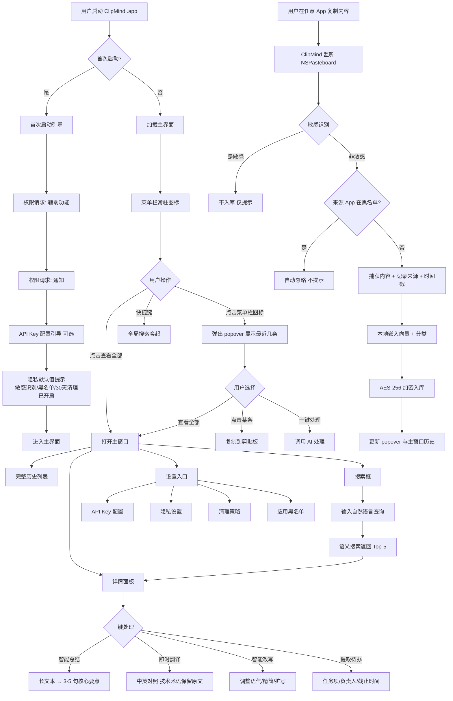

### 3.2 首次启动流程

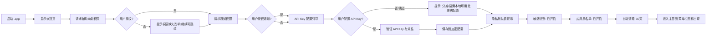

### 3.3 复制捕获流程

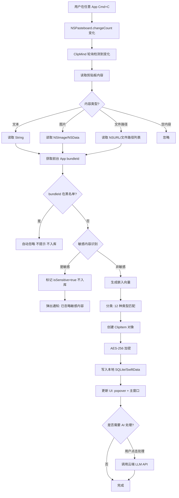

### 3.4 分类入库流程

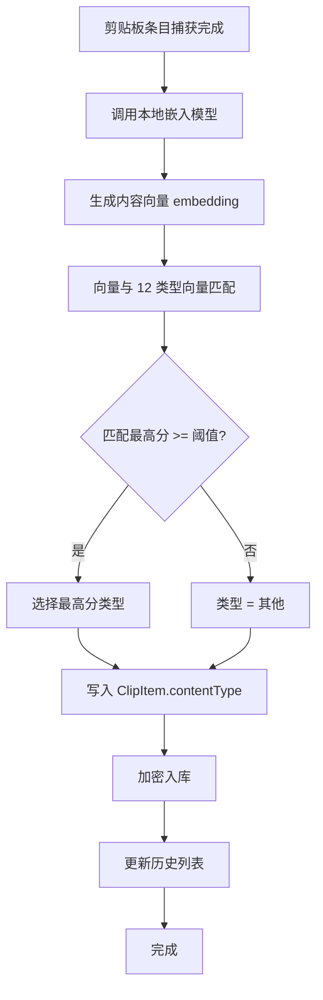

**12 种分类类型**：

| 类型 | 中文名 | 英文标识 | 识别特征 |
|------|--------|---------|---------|
| 代码 | code | CODE | 包含函数定义、语法关键字、代码缩进、分号结尾 |
| 链接 | link | LINK | URL 格式（http/https/www） |
| 报错 | error | ERROR | 包含 "error"/"exception"/"fatal"/"traceback"/堆栈信息 |
| 文章 | article | ARTICLE | 长文本（>200字）、段落结构、无代码特征 |
| 待办清单 | todo | TODO | 包含 "TODO"/"待办"/"- [ ]"/checkbox 结构 |
| 会议纪要 | meeting | MEETING | 包含 "会议"/"参会"/"议题"/时间地点人物结构 |
| 密码Token敏感 | sensitive | SENSITIVE | 密码模式、Token 格式、验证码、银行卡号、身份证号 |
| 翻译素材 | translation | TRANSLATION | 包含外文（英文/日文/韩文）且非代码非报错 |
| 产品需求 | requirement | REQUIREMENT | 包含 "需求"/"功能"/"用户故事"/"PRD" |
| API文档 | api_doc | API_DOC | 包含 "API"/"接口"/"请求"/"响应"/JSON 结构 |
| 英文资料 | english_doc | ENGLISH_DOC | 纯英文长文本、非代码、非报错 |
| 其他 | other | OTHER | 不匹配以上任何类型 |

### 3.5 搜索流程


**搜索特性**：
- 跨语言：中文查询可匹配英文内容（向量空间对齐）
- 模糊描述：支持"上次那个窗口管理的报错"这类自然语言查询
- 来源过滤：可按来源 App 过滤
- 时间维度：支持"上周"、"最近"等时间描述（解析为时间范围过滤）

### 3.6 一键处理流程

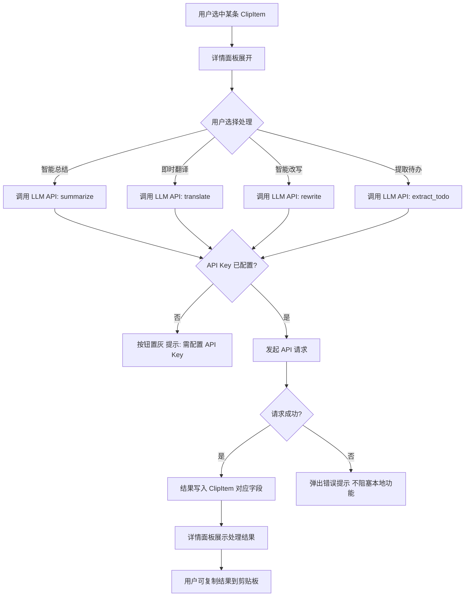

**4 种处理类型详细**：

| 处理类型 | 输入 | 输出 | Prompt 设计要点 |
|---------|------|------|----------------|
| 智能总结 | 长文本（>200字） | 3-5 句核心要点 | 提取关键信息、保留事实、去重 |
| 即时翻译 | 中/英文文本 | 中英对照 + 技术术语保留原文 | 识别技术术语（如 NSWindowController）保留原文 |
| 智能改写 | 任意文本 | 调整语气/精简/扩写三选一 | 提供 3 种模式选项 |
| 提取待办 | 会议纪要/聊天/需求 | 任务项 + 负责人 + 截止时间 | 结构化输出 JSON |

### 3.7 隐私保护流程

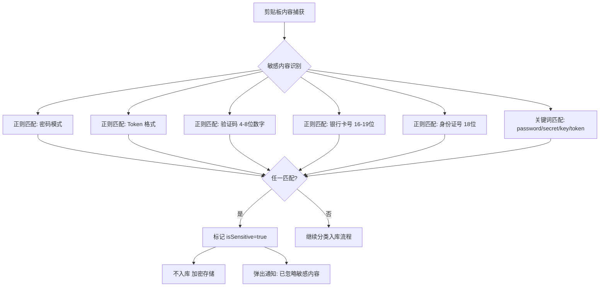

### 3.8 设置配置流程

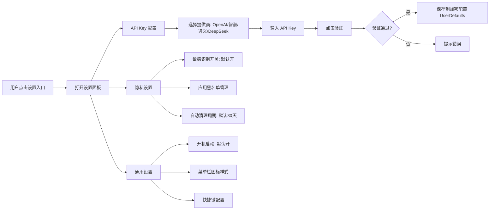

### 3.9 交互入口汇总

| 入口 | 触发方式 | 功能 |
|------|---------|------|
| 菜单栏图标（NSStatusItem） | 系统菜单栏常驻 | 点击弹出 popover |
| popover | 点击菜单栏图标 | 显示最近 5-10 条剪贴内容 + 搜索框 + 查看全部 |
| 主窗口 | popover "查看全部" / 快捷键 | 完整历史、搜索、详情、设置 |
| 全局搜索（快捷键） | Cmd+Shift+V（默认） | 唤起主窗口并聚焦搜索框 |
| 首次启动引导 | 首次启动 .app | 权限请求 + API Key + 隐私提示 |

---

## 4. 行为规则和状态机

### 4.1 剪贴板条目状态机

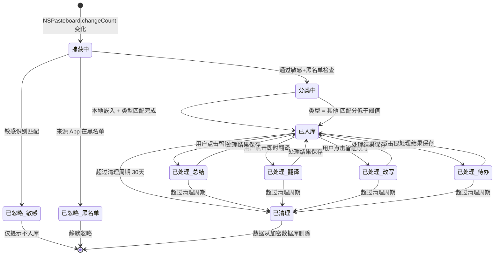

**状态说明**：

| 状态 | 说明 | 持久化 | UI 表现 |
|------|------|--------|---------|
| 捕获中 | 正在读取剪贴板内容 | 否（内存） | 无（<100ms） |
| 已忽略_敏感 | 匹配敏感模式 | 否（不入库） | 通知"已忽略敏感内容" |
| 已忽略_黑名单 | 来源 App 在黑名单 | 否（不入库） | 无（静默） |
| 分类中 | 正在生成嵌入向量 + 分类 | 否（内存） | popover 暂不显示 |
| 已入库 | 加密存储完成，分类完成 | 是（AES-256） | popover + 主窗口历史显示 |
| 已处理_xxx | AI 处理完成，结果已保存 | 是 | 详情面板展示处理结果 |
| 已清理 | 超过清理周期，已删除 | 否（已删除） | 不再显示 |

### 4.2 敏感识别状态机

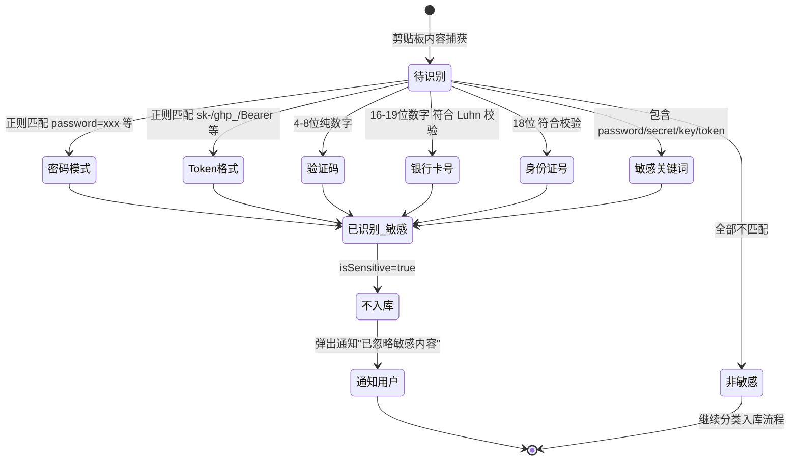

**敏感模式正则规则**：

| 类型 | 正则模式 | 示例 |
|------|---------|------|
| 密码模式 | `password\s*[=:]\s*\S+` | `password=abc123` |
| Token 格式 | `^(sk-|ghp_|gho_|Bearer\s)` 前缀 + 32+ 位 | `sk-proj-abc123...` |
| 验证码 | `^\d{4,8}$`（纯数字 4-8 位） | `123456` |
| 银行卡号 | `^\d{16,19}$` + Luhn 校验通过 | `6225880123456789` |
| 身份证号 | `^\d{17}[\dXx]$` + 校验通过 | `110101199001011234` |
| 敏感关键词 | 包含 `password|secret|api_key|access_token|private_key` | `api_key=xxx` |

### 4.3 应用黑名单状态机

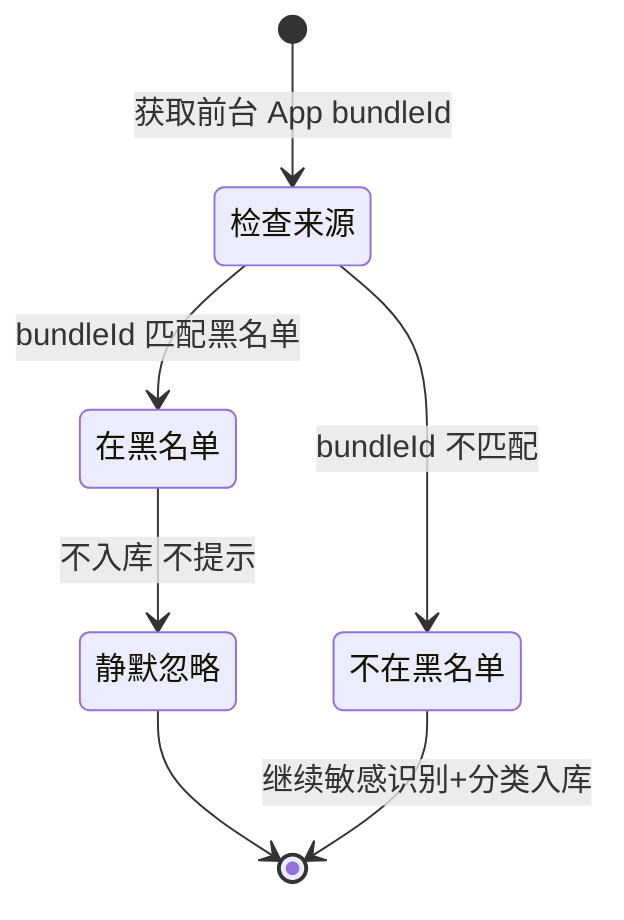

**默认黑名单应用**（首启预置，用户可增删）：

| 应用 | bundleId | 加入理由 |
|------|---------|---------|
| 1Password | `com.agilebits.onepassword-os` | 密码管理器 |
| 钥匙串访问 | `com.apple.keychainaccess` | 系统密码管理 |
| 银行类 App（工商银行/招商银行等） | `com.icbc.*` / `com.cmb.*` 等 | 银行业务 |
| 支付宝 | `com.alipay.*` | 支付敏感 |
| 微信支付（Mac 版） | `com.tencent.xinWeChat`（仅支付场景） | 支付敏感 |

### 4.4 API Key 配置状态机

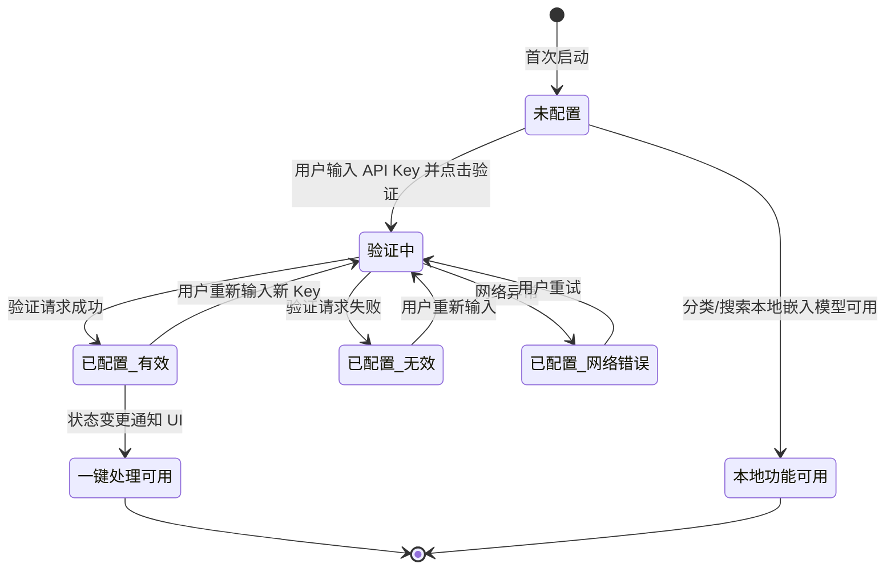

---

## 5. 数据模型、接口、配置、持久化影响

### 5.1 核心数据模型

#### 5.1.1 ClipItem（剪贴板条目）

```swift
struct ClipItem: Identifiable, Codable {
    let id: UUID                    // 唯一标识
    let content: ClipContent       // 内容（文本/图片/文件路径）
    var contentType: ContentType   // 12 种分类类型
    let sourceApp: String          // 来源 App bundleId
    let sourceAppName: String      // 来源 App 显示名
    let timestamp: Date            // 捕获时间戳
    var summary: String?           // AI 总结结果
    var translation: String?       // 翻译结果
    var rewrite: String?           // 改写结果
    var todos: [TodoItem]?          // 提取的待办列表
    var isSensitive: Bool          // 是否敏感（已忽略的标记）
    var tags: [String]             // 用户标签（初赛仅自动标签）
    var embeddings: [Float]?        // 本地嵌入向量（用于语义搜索）
    var isProcessed: Bool          // 是否已处理
    var processedAt: Date?         // 处理时间
}

enum ClipContent: Codable {
    case text(String)              // 文本内容
    case image(Data)               // 图片二进制（缩略图 + 原图引用）
    case filePath([URL])           // 文件路径列表
}

enum ContentType: String, Codable, CaseIterable {
    case code = "code"
    case link = "link"
    case error = "error"
    case article = "article"
    case todo = "todo"
    case meeting = "meeting"
    case sensitive = "sensitive"
    case translation = "translation"
    case requirement = "requirement"
    case apiDoc = "api_doc"
    case englishDoc = "english_doc"
    case other = "other"
}

struct TodoItem: Identifiable, Codable {
    let id: UUID
    var task: String               // 任务项
    var assignee: String?          // 负责人
    var dueDate: String?           // 截止时间（自然语言解析）
    var isCompleted: Bool           // 是否完成
}
```

#### 5.1.2 AppSettings（应用设置）

```swift
struct AppSettings: Codable {
    var apiProvider: APIProvider?   // LLM 提供商
    var apiKey: String?            // API Key（加密存储）
    var sensitiveDetectionEnabled: Bool  // 敏感识别开关，默认 true
    var appBlacklist: [String]      // 应用黑名单 bundleId 列表
    var autoCleanupEnabled: Bool    // 自动清理开关，默认 true
    var cleanupDays: Int            // 清理周期天数，默认 30
    var launchAtLogin: Bool         // 开机启动，默认 true
    var hotkey: String              // 全局快捷键，默认 "cmd+shift+v"
    var privacyMode: Bool          // 隐私模式（全部不入库），默认 false
}

enum APIProvider: String, Codable, CaseIterable {
    case openai = "openai"        // OpenAI GPT
    case zhipu = "zhipu"           // 智谱 GLM
    case qianwen = "qianwen"       // 通义千问
    case deepseek = "deepseek"     // DeepSeek
}
```

#### 5.1.3 BlacklistEntry（黑名单条目）

```swift
struct BlacklistEntry: Identifiable, Codable {
    let id: UUID
    let bundleId: String           // App bundleId
    let appName: String            // App 显示名
    let addedAt: Date               // 添加时间
    let isDefault: Bool             // 是否预置默认
}
```

### 5.2 系统接口

#### 5.2.1 NSPasteboard（剪贴板监听）

```swift
class PasteboardWatcher {
    private var timer: Timer?
    private var lastChangeCount: Int
    private let pasteboard: NSPasteboard
    
    // 轮询间隔：0.5s（平衡性能与实时性）
    func startWatching(interval: TimeInterval = 0.5) {
        timer = Timer.scheduledTimer(withTimeInterval: interval, repeats: true) { [weak self] _ in
            guard let self = self else { return }
            if self.pasteboard.changeCount != self.lastChangeCount {
                self.lastChangeCount = self.pasteboard.changeCount
                self.handlePasteboardChange()
            }
        }
    }
    
    private func handlePasteboardChange() {
        // 1. 读取内容（text/image/fileURL）
        // 2. 获取前台 App bundleId
        // 3. 调用 ClipCaptureService.process()
    }
}
```

**接口约束**：
- 轮询间隔：0.5s（NSPasteboard 不支持通知，必须轮询）
- 支持类型：`NSPasteboard.PasteboardType.string` / `.fileURL` / `.tiFF`
- 去重：连续相同内容不重复入库

#### 5.2.2 NSWorkspace（前台 App 识别）

```swift
class AppDetector {
    func currentFrontmostApp() -> (bundleId: String, appName: String)? {
        guard let app = NSWorkspace.shared.frontmostApplication else { return nil }
        return (app.bundleIdentifier ?? "unknown", app.localizedName ?? "Unknown")
    }
}
```

#### 5.2.3 本地嵌入模型（Core ML / MLX）

```swift
protocol EmbeddingService {
    func embed(text: String) async throws -> [Float]      // 生成向量
    func classify(content: String, embedding: [Float]) async throws -> ContentType
}

class LocalEmbeddingService: EmbeddingService {
    // 使用 Core ML 模型 或 MLX 框架
    // 模型选择：MiniLM-L6-v2 或 all-MiniLM-L12-v1（多语言）
    // 向量维度：384 或 768
    // 推理方式：本地 CPU/GPU
    
    func embed(text: String) async throws -> [Float] {
        // 调用 CoreML 模型推理
    }
    
    func classify(content: String, embedding: [Float]) async throws -> ContentType {
        // 1. 与 12 类型向量计算余弦相似度
        // 2. 返回最高分类型（低于阈值返回 .other）
    }
}
```

**模型选择**：
- 嵌入模型：`all-MiniLM-L6-v2`（多语言，384 维，模型大小 ~22MB）
- 转换格式：Core ML `.mlmodelc`（通过 `coremltools` 从 ONNX 转换）
- 推理性能：单次推理 < 100ms（M1 芯片）

#### 5.2.4 云端 LLM API

```swift
protocol LLMService {
    func summarize(text: String) async throws -> String
    func translate(text: String, from: String, to: String) async throws -> String
    func rewrite(text: String, mode: RewriteMode) async throws -> String
    func extractTodos(text: String) async throws -> [TodoItem]
}

enum RewriteMode: String {
    case adjustTone = "adjust_tone"   // 调整语气
    case condense = "condense"         // 精简
    case expand = "expand"             // 扩写
}

class MultiProviderLLMService: LLMService {
    // 根据 AppSettings.apiProvider 路由到对应实现
    // OpenAI: https://api.openai.com/v1/chat/completions
    // 智谱: https://open.bigmodel.cn/api/paas/v4/chat/completions
    // 通义: https://dashscope.aliyuncs.com/api/v1/services/aigc/text-generation/generation
    // DeepSeek: https://api.deepseek.com/v1/chat/completions
}
```

**API 请求约束**：
- 超时：30s
- 重试：最多 2 次（指数退避）
- 错误处理：网络错误不阻塞本地功能，弹出提示
- 请求体：包含 system prompt（指导 LLM 输出格式）+ user content

### 5.3 配置项

| 配置项 | 类型 | 默认值 | 存储位置 | 加密 |
|--------|------|--------|---------|------|
| API Provider | Enum | nil（未配置） | UserDefaults | 否 |
| API Key | String | nil | Keychain | 是 |
| 敏感识别开关 | Bool | true | UserDefaults | 否 |
| 应用黑名单 | [String] | 预置 5 个 | UserDefaults（JSON） | 否 |
| 自动清理开关 | Bool | true | UserDefaults | 否 |
| 清理周期 | Int | 30 | UserDefaults | 否 |
| 开机启动 | Bool | true | UserDefaults | 否 |
| 全局快捷键 | String | "cmd+shift+v" | UserDefaults | 否 |
| 隐私模式 | Bool | false | UserDefaults | 否 |

### 5.4 持久化方案

#### 5.4.1 加密 SQLite（推荐方案）

```swift
class EncryptedStore {
    // 使用 SQLCipher 或 CryptoKit + SQLite.swift
    // 数据库文件路径：~/Library/Application Support/ClipMind/clipmind.db
    // 加密算法：AES-256-GCM
    // 密钥派生：PBKDF2（设备唯一标识 + 固定 salt）
    
    let dbPath: URL = {
        let appSupport = FileManager.default.urls(for: .applicationSupportDirectory, in: .userDomainMask).first!
        let clipMindDir = appSupport.appendingPathComponent("ClipMind", isDirectory: true)
        try? FileManager.default.createDirectory(at: clipMindDir, withIntermediateDirectories: true)
        return clipMindDir.appendingPathComponent("clipmind.db")
    }()
    
    func save(_ item: ClipItem) throws {
        // 1. 序列化为 JSON Data
        // 2. AES-256-GCM 加密
        // 3. 写入 SQLite
    }
    
    func loadAll() throws -> [ClipItem] {
        // 1. 从 SQLite 读取加密数据
        // 2. AES-256-GCM 解密
        // 3. 反序列化为 ClipItem
    }
    
    func search(query: [Float], limit: Int = 5) throws -> [ClipItem] {
        // 1. 加载所有 embeddings
        // 2. 计算余弦相似度
        // 3. 返回 Top-N
    }
    
    func cleanup(olderThan days: Int) throws {
        // DELETE FROM clips WHERE timestamp < ?
    }
}
```

#### 5.4.2 数据库 Schema

```sql
CREATE TABLE clips (
    id TEXT PRIMARY KEY,                  -- UUID
    content_blob BLOB NOT NULL,           -- 加密的 ClipItem JSON
    content_type TEXT NOT NULL,           -- ContentType rawValue（用于索引）
    timestamp REAL NOT NULL,              -- Date.timeIntervalSince1970
    source_app TEXT,                      -- bundleId（用于过滤）
    is_sensitive INTEGER DEFAULT 0,       -- Bool
    embeddings_blob BLOB                  -- 加密的向量数据
);

CREATE INDEX idx_clips_timestamp ON clips(timestamp);
CREATE INDEX idx_clips_content_type ON clips(content_type);
CREATE INDEX idx_clips_source_app ON clips(source_app);

CREATE TABLE app_settings (
    key TEXT PRIMARY KEY,
    value_blob BLOB                       -- 加密的值
);

CREATE TABLE blacklist (
    id TEXT PRIMARY KEY,
    bundle_id TEXT NOT NULL,
    app_name TEXT NOT NULL,
    added_at REAL NOT NULL,
    is_default INTEGER DEFAULT 0
);
```

#### 5.4.3 加密方案

| 数据 | 加密算法 | 密钥来源 |
|------|---------|---------|
| 剪贴板内容（content_blob） | AES-256-GCM | PBKDF2(设备唯一标识, 固定 salt, 10000 轮) |
| 嵌入向量（embeddings_blob） | AES-256-GCM | 同上 |
| API Key | Keychain（kSecAttrAccessibleWhenUnlocked） | 系统管理 |
| 其他设置 | UserDefaults | 不加密 |

**验证要求**（AC-05）：
- 数据库文件 `clipmind.db` 无法被 SQLite Browser 直接打开（加密）
- 使用十六进制查看器查看文件内容为乱码
- 仅 ClipMind 进程能解密读取

---

## 6. 兼容性、迁移和回滚策略

### 6.1 兼容性

#### 6.1.1 macOS 版本要求

| 要求 | 版本 | 理由 |
|------|------|------|
| 最低 macOS 版本 | macOS 14.0（Sonoma） | SwiftUI 新特性（NavigationStack/Observable）、SwiftData 可选 |
| 推荐版本 | macOS 14.5+ | 稳定性 + 性能优化 |

**SwiftUI/SwiftData 可用性确认**：
- `NavigationStack`：macOS 13+ 可用，本项目目标 14+ 满足
- `@Observable` 宏：macOS 14+ 可用，本项目采用
- `SwiftData`：macOS 14+ 可用，但本项目选择 SQLite + 手动加密（控制加密粒度）

#### 6.1.2 架构支持

| 架构 | 支持 | 验证方式 |
|------|------|---------|
| Apple Silicon（arm64） | 是 | 在 M1/M2/M3 Mac 上测试 |
| Intel（x86_64） | 是 | Universal Binary 构建 |
| Universal Binary | 是 | `lipo -info ClipMind.app/Contents/MacOS/ClipMind` 验证包含双架构 |

#### 6.1.3 权限要求

| 权限 | 用途 | 必需性 | Info.plist 键 |
|------|------|--------|---------------|
| 辅助功能（Accessibility） | 获取前台 App bundleId | 必需 | `NSAppleEventsUsageDescription` |
| 通知（Notifications） | 敏感内容忽略提示 | 可选 | `NSUserNotificationsUsageDescription` |

### 6.2 迁移策略

**新项目，无历史数据迁移**。

- 首次启动：创建空数据库，预置默认黑名单
- 不存在旧版本数据格式兼容问题
- 不存在用户配置迁移问题

### 6.3 回滚策略

#### 6.3.1 版本回滚

| 场景 | 回滚方式 |
|------|---------|
| 新版本崩溃无法启动 | 用户手动删除 `~/Library/Application Support/ClipMind/`，重新启动 |
| 数据库损坏 | 自动备份机制：每周一次全量备份到 `clipmind.db.bak`，损坏时恢复 |
| 配置错误 | 设置面板"重置为默认"按钮 |

#### 6.3.2 数据备份

```swift
class BackupService {
    // 每周一次全量备份
    // 备份位置：~/Library/Application Support/ClipMind/backup/clipmind_yyyyMMdd.db
    // 保留最近 4 个备份
    // 损坏时自动恢复最近一次有效备份
}
```

#### 6.3.3 紧急回滚

- **数据紧急清空**：设置面板提供"清空所有数据"按钮（二次确认）
- **重置为初始状态**：设置面板提供"重置应用"按钮（清空数据 + 重置配置 + 重启）

---

## 7. 可观测性

### 7.1 日志系统

#### 7.1.1 日志级别

```swift
import os

enum LogCategory: String {
    case capture = "Capture"        // 剪贴板捕获
    case classify = "Classify"      // 分类
    case search = "Search"          // 搜索
    case llm = "LLM"                // LLM API 调用
    case storage = "Storage"        // 持久化
    case privacy = "Privacy"        // 隐私识别
    case ui = "UI"                  // UI 交互
    case app = "App"                // 应用生命周期
}

class Logger {
    static let log = os.Logger(subsystem: "com.clipmind.app", category: "default")
    
    static func debug(_ category: LogCategory, _ message: String) {
        os.Logger(subsystem: "com.clipmind.app", category: category.rawValue).debug("\(message, privacy: .public)")
    }
    
    static func info(_ category: LogCategory, _ message: String) {
        os.Logger(subsystem: "com.clipmind.app", category: category.rawValue).info("\(message, privacy: .public)")
    }
    
    static func error(_ category: LogCategory, _ message: String) {
        os.Logger(subsystem: "com.clipmind.app", category: category.rawValue).error("\(message, privacy: .public)")
    }
}
```

#### 7.1.2 关键日志点

| 模块 | 日志事件 | 级别 | 示例 |
|------|---------|------|------|
| Capture | 剪贴板变化检测 | debug | `[Capture] changeCount: 42, type: text` |
| Capture | 内容捕获成功 | info | `[Capture] Captured text, length: 256, source: com.apple.Safari` |
| Capture | 来源 App 在黑名单 | info | `[Capture] Ignored: source in blacklist (com.agilebits.onepassword-os)` |
| Privacy | 敏感内容识别 | info | `[Privacy] Detected sensitive: token format, ignored` |
| Classify | 分类完成 | info | `[Classify] Type: error, score: 0.89` |
| Classify | 分类失败 | error | `[Classify] Failed: model not loaded` |
| Search | 搜索请求 | debug | `[Search] Query: "窗口管理报错", results: 5` |
| Search | 搜索响应时间 | info | `[Search] Completed in 234ms` |
| LLM | API 请求 | debug | `[LLM] Provider: openai, action: summarize` |
| LLM | API 响应 | info | `[LLM] Success: 1.2s` |
| LLM | API 失败 | error | `[LLM] Failed: timeout (30s)` |
| Storage | 数据库写入 | debug | `[Storage] Saved clip: uuid-xxx` |
| Storage | 数据库错误 | error | `[Storage] SQLite error: database locked` |

### 7.2 埋点统计

#### 7.2.1 性能埋点

```swift
class MetricsRecorder {
    // 记录关键操作耗时
    static func recordCaptureLatency(_ ms: Double)
    static func recordClassifyLatency(_ ms: Double)
    static func recordSearchLatency(_ ms: Double)
    static func recordLLMLatency(_ ms: Double, action: String)
    
    // 记录使用频率
    static func recordClipCaptured()
    static func recordSearchPerformed()
    static func recordLLMCalled(action: String)
    static func recordSensitiveIgnored()
    static func recordBlacklistIgnored()
}
```

**性能指标阈值**（用于 AC 验证）：

| 指标 | 阈值 | 超阈值处理 |
|------|------|-----------|
| 剪贴板捕获延迟 | < 3s（AC-01） | 日志 warning |
| 分类延迟 | < 500ms | 日志 warning |
| 搜索延迟 | < 500ms（AC-03） | 日志 warning |
| LLM API 响应 | < 30s | 超时重试或报错 |

#### 7.2.2 使用统计（本地，不上报）

| 统计项 | 用途 |
|--------|------|
| 累计捕获条目数 | 主界面显示 |
| 累计搜索次数 | 主界面显示 |
| 累计处理次数 | 主界面显示 |
| 各类型分布 | 设置面板展示（帮助用户了解使用习惯） |
| 敏感忽略次数 | 隐私保护效果展示 |

### 7.3 调试开关

```swift
struct DebugConfig {
    static var verboseLogging: Bool {     // 详细日志
        get { UserDefaults.standard.bool(forKey: "debug.verbose_logging") }
        set { UserDefaults.standard.set(newValue, forKey: "debug.verbose_logging") }
    }
    
    static var mockLLM: Bool {             // 模拟 LLM 响应（测试用）
        get { UserDefaults.standard.bool(forKey: "debug.mock_llm") }
        set { UserDefaults.standard.set(newValue, forKey: "debug.mock_llm") }
    }
    
    static var disableEncryption: Bool {   // 禁用加密（调试用）
        get { UserDefaults.standard.bool(forKey: "debug.disable_encryption") }
        set { UserDefaults.standard.set(newValue, forKey: "debug.disable_encryption") }
    }
}
```

**调试入口**：
- 主窗口设置面板 → 高级 → 调试模式（隐藏入口，连续点击版本号 5 次激活）
- 命令行：`defaults write com.clipmind.app debug.verbose_logging -bool true`

### 7.4 错误上报

#### 7.4.1 本地错误收集

```swift
class ErrorCollector {
    // 收集运行时错误到本地文件
    // 文件位置：~/Library/Application Support/ClipMind/logs/error.log
    // 滚动策略：单文件最大 5MB，保留最近 3 个文件
    // 格式：[timestamp] [category] [level] [message] [stacktrace?]
    
    static func report(_ error: Error, category: LogCategory, context: [String: Any] = [:])
}
```

#### 7.4.2 错误分类

| 错误类型 | 处理方式 | 用户感知 |
|---------|---------|---------|
| 数据库错误 | 记录 + 尝试备份恢复 | 弹窗"数据库异常，已尝试恢复" |
| LLM API 失败 | 记录 + 重试 + 提示 | 弹窗"AI 处理失败，请检查 API Key 或网络" |
| 嵌入模型加载失败 | 记录 + 降级为关键词搜索 | 日志 warning，功能降级提示 |
| 权限缺失 | 记录 + 引导授权 | 弹窗"需要辅助功能权限" |
| 内存不足 | 记录 + 清理缓存 | 静默处理 |

---

## 8. 验收标准 AC

### 8.1 AC 列表（共 25 条，覆盖 F1.1-F1.7）

> **格式约定**：每条 AC 包含「场景 + 预期 + 验证方式」，验证方式必须包含测试框架（XCTest/XCUITest/手动）。

#### F1.1 剪贴板监听与捕获

**AC-01：复制文本后 3 秒内出现在 popover 与主窗口历史**

- **场景**：用户在 Safari 选中一段文本，按 Cmd+C 复制
- **预期**：3 秒内，菜单栏 popover 顶部出现该条内容；主窗口历史列表顶部同步出现
- **验证方式**：
  - 自动化：XCUITest 启动 App，模拟 `NSPasteboard.general.clearContents()` + `setString("test content", forType: .string)`，断言 popover 列表首条内容包含 "test content"，超时 3s
  - 手动：在 Safari 复制文本，观察 popover 与主窗口

**AC-02：复制图片被捕获为缩略图**

- **场景**：用户在预览 App 复制一张图片
- **预期**：popover 与主窗口显示该图片的缩略图（最大 64x64），原始数据加密存储
- **验证方式**：
  - 自动化：XCTest 调用 `PasteboardWatcher.handlePasteboardChange()`，传入 `NSImage` test fixture，断言 ClipItem.content 为 `.image(_)` 且数据库存在记录
  - 手动：在预览复制图片，观察 UI

**AC-03：复制文件路径被捕获**

- **场景**：用户在 Finder 选中文件，按 Cmd+C
- **预期**：popover 显示文件路径文本，详情面板展示完整路径列表
- **验证方式**：
  - 自动化：XCTest 模拟 `NSPasteboard` 写入 `[NSURL(fileURLWithPath: "/tmp/test.txt")]`，断言 ClipItem.content 为 `.filePath([URL])`
  - 手动：在 Finder 复制文件，观察 UI

**AC-04：连续复制相同内容不重复入库**

- **场景**：用户连续两次复制相同文本
- **预期**：仅入库一次，popover 不出现重复条目
- **验证方式**：
  - 自动化：XCTest 连续两次调用 `handlePasteboardChange()` 传入相同内容，断言数据库仅新增 1 条记录

#### F1.2 自动分类

**AC-05：12 种类型自动分类准确率 ≥ 80%**

- **场景**：使用测试集（每种类型 20 条样本，共 240 条）批量测试分类
- **预期**：分类准确率 ≥ 80%（≥ 192 条正确）
- **验证方式**：
  - 自动化：XCTest `testClassificationAccuracy()`，加载测试集，调用 `LocalEmbeddingService.classify()`，统计准确率，断言 ≥ 0.80
  - 测试集位置：`ClipMindTests/Fixtures/classification_samples.json`

**AC-06：代码片段被识别为 code 类型**

- **场景**：用户复制一段 Swift 代码 `func test() { print("hello") }`
- **预期**：分类为 `ContentType.code`
- **验证方式**：
  - 自动化：XCTest 调用 `classify(content: "func test() { print(\"hello\") }")`，断言结果为 `.code`

**AC-07：报错日志被识别为 error 类型**

- **场景**：用户复制 `Thread 1: Fatal error: Unexpectedly found nil while unwrapping an Optional value`
- **预期**：分类为 `ContentType.error`
- **验证方式**：
  - 自动化：XCTest 调用 `classify()`，断言结果为 `.error`

**AC-08：密码 Token 被识别为 sensitive 类型且不入库**

- **场景**：用户复制 `sk-proj-abcdef1234567890abcdef1234567890abcdef`
- **预期**：分类为 `ContentType.sensitive`，isSensitive=true，不入库，弹出通知"已忽略敏感内容"
- **验证方式**：
  - 自动化：XCTest 调用 `SensitiveDetector.detect("sk-proj-...")`，断言 `isSensitive == true`；调用 `EncryptedStore.save()`，断言数据库无新增记录
  - 手动：复制 Token，观察通知弹出

#### F1.3 自然语言语义搜索

**AC-09：自然语言搜索返回结果 < 500ms**

- **场景**：数据库中有 1000 条 ClipItem，用户输入"上次那个窗口管理的报错"
- **预期**：搜索在 500ms 内返回 Top-5 结果
- **验证方式**：
  - 自动化：XCTest 预填充 1000 条测试数据，调用 `search(query:embed("上次那个窗口管理的报错"), limit: 5)`，测量耗时，断言 < 500ms

**AC-10：Top-5 命中率 ≥ 70%**

- **场景**：使用测试集（50 个查询，每个查询有标注的正确答案）测试搜索
- **预期**：Top-5 结果中包含正确答案的比例 ≥ 70%
- **验证方式**：
  - 自动化：XCTest `testSearchHitRate()`，加载测试集，计算命中率，断言 ≥ 0.70
  - 测试集位置：`ClipMindTests/Fixtures/search_queries.json`

**AC-11：跨语言搜索（中文查询匹配英文内容）**

- **场景**：数据库中有英文 ClipItem "NSWindowController crash on macOS 14"，用户搜索"窗口控制器崩溃"
- **预期**：Top-5 结果中包含该英文条目
- **验证方式**：
  - 自动化：XCTest 预填充英文条目，调用 `search(query: "窗口控制器崩溃")`，断言结果列表包含该条目 ID

**AC-12：搜索支持来源 App 过滤**

- **场景**：数据库中有来自 Xcode 和 Safari 的条目，用户在搜索框输入查询并选择来源"Xcode"
- **预期**：仅返回来自 Xcode 的匹配结果
- **验证方式**：
  - 自动化：XCTest 调用 `search(query:, sourceApp: "com.apple.dt.Xcode")`，断言所有结果 `sourceApp == "com.apple.dt.Xcode"`

#### F1.4 一键处理

**AC-13：智能总结生成 3-5 句核心要点**

- **场景**：用户选中一条长文本（>500字），点击"智能总结"按钮，API Key 已配置且有效
- **预期**：30 秒内返回 3-5 句总结，写入 ClipItem.summary，详情面板展示
- **验证方式**：
  - 自动化：XCTest 使用 `mockLLM=true`，调用 `LLMService.summarize(longText)`，断言返回字符串按句号分割后为 3-5 句
  - 手动：配置真实 API Key，点击总结按钮，观察结果

**AC-14：即时翻译生成中英对照且保留技术术语原文**

- **场景**：用户选中英文 ClipItem "The NSWindowController manages window lifecycle"，点击"即时翻译"
- **预期**：返回中文翻译 + 原文对照，"NSWindowController"保留原文不翻译
- **验证方式**：
  - 自动化：XCTest 使用 mock LLM，调用 `translate()`，断言结果包含"NSWindowController"原文

**AC-15：智能改写提供 3 种模式**

- **场景**：用户选中一段文本，点击"智能改写"
- **预期**：弹出选项"调整语气/精简/扩写"，用户选择后返回改写结果
- **验证方式**：
  - 自动化：XCTest 遍历 3 种 `RewriteMode`，调用 `rewrite()`，断言均返回非空字符串
  - 手动：点击改写，选择模式，观察结果

**AC-16：提取待办返回结构化任务列表**

- **场景**：用户选中会议纪要"张三负责登录模块 06.25 前完成"，点击"提取待办"
- **预期**：返回 `[TodoItem(task: "登录模块完成", assignee: "张三", dueDate: "06.25")]`
- **验证方式**：
  - 自动化：XCTest 使用 mock LLM，调用 `extractTodos()`，断言返回数组包含正确字段

**AC-17：未配置 API Key 时处理按钮置灰并提示**

- **场景**：用户未配置 API Key，选中一条内容尝试点击"智能总结"
- **预期**：按钮置灰不可点击，或点击后弹窗提示"需配置 API Key"
- **验证方式**：
  - 自动化：XCUITest 启动 App（清空配置），点击总结按钮，断言出现提示文案
  - 手动：清空 API Key，尝试点击处理按钮

#### F1.5 本地加密存储

**AC-18：本地存储使用 AES-256 加密，数据文件无法直接读取**

- **场景**：ClipMind 写入若干条目后，关闭应用，用 SQLite Browser 打开 `clipmind.db`
- **预期**：无法打开或内容为乱码
- **验证方式**：
  - 自动化：XCTest 写入测试数据后，读取数据库文件原始字节，断言不包含明文内容（如 "test content"）
  - 手动：用 DB Browser for SQLite 尝试打开 `~/Library/Application Support/ClipMind/clipmind.db`

**AC-19：数据默认不出本机**

- **场景**：用户复制内容、搜索、本地分类全流程
- **预期**：除用户主动点击"一键处理"调用云端 LLM 外，所有数据停留在本机
- **验证方式**：
  - 自动化：XCTest 模拟全流程，监控网络请求，断言除 LLM API 外无其他网络请求
  - 手动：用 Charles/Proxyman 抓包验证

#### F1.6 隐私保护

**AC-20：应用黑名单中的 App 复制内容自动忽略**

- **场景**：用户在 1Password（bundleId: `com.agilebits.onepassword-os`）中复制内容
- **预期**：自动忽略，不入库，不提示
- **验证方式**：
  - 自动化：XCTest 调用 `PasteboardWatcher.handlePasteboardChange()` 传入 `sourceApp: "com.agilebits.onepassword-os"`，断言数据库无新增记录

**AC-21：30 天前内容自动清理**

- **场景**：数据库中有一条 31 天前的 ClipItem
- **预期**：应用启动时或定时任务触发时，自动删除该条目
- **验证方式**：
  - 自动化：XCTest 插入一条 `timestamp: Date().addingTimeInterval(-31*86400)` 的记录，调用 `cleanup(olderThan: 30)`，断言该记录被删除

**AC-22：敏感识别开关可关闭**

- **场景**：用户在设置中关闭"敏感识别"开关，复制一段 Token
- **预期**：Token 被正常入库（不标记敏感）
- **验证方式**：
  - 自动化：XCTest 设置 `sensitiveDetectionEnabled=false`，调用捕获流程，断言 ClipItem 入库且 `isSensitive == false`

#### F1.7 主界面与交互

**AC-23：菜单栏图标常驻，点击弹出 popover**

- **场景**：ClipMind 运行中，用户点击菜单栏图标
- **预期**：弹出 popover，显示最近 5-10 条剪贴内容 + 搜索框 + "查看全部"按钮
- **验证方式**：
  - 自动化：XCUITest 启动 App，点击菜单栏图标，断言 popover 出现且包含列表元素
  - 手动：点击菜单栏图标观察

**AC-24：首次启动引导流程完整**

- **场景**：用户首次启动 ClipMind
- **预期**：依次显示欢迎页 → 权限请求 → API Key 配置引导（可跳过）→ 隐私默认值提示 → 进入主界面
- **验证方式**：
  - 自动化：XCUITest 清空 UserDefaults 后启动 App，遍历引导流程，断言每个步骤页面出现
  - 手动：删除 App 偏好后重新启动

**AC-25：Web 交互预览页可访问且模拟核心流程**

- **场景**：用户访问 GitHub Pages 部署的 Web 预览页
- **预期**：页面可访问，包含产品介绍 + 交互式模拟（复制演示内容→自动分类→搜索→一键处理），4 个核心流程可点击体验
- **验证方式**：
  - 自动化：XCTest（URL 测试）请求 Web 页面 URL，断言 HTTP 200 且包含核心元素
  - 手动：浏览器打开 URL，点击 4 个交互流程

### 8.2 AC 覆盖矩阵

| AC 编号 | 对应功能 | 测试框架 | 自动化 | 手动 |
|---------|---------|---------|--------|------|
| AC-01 | F1.1 | XCUITest | 是 | 是 |
| AC-02 | F1.1 | XCTest | 是 | 是 |
| AC-03 | F1.1 | XCTest | 是 | 是 |
| AC-04 | F1.1 | XCTest | 是 | 否 |
| AC-05 | F1.2 | XCTest | 是 | 否 |
| AC-06 | F1.2 | XCTest | 是 | 否 |
| AC-07 | F1.2 | XCTest | 是 | 否 |
| AC-08 | F1.2/F1.6 | XCTest | 是 | 是 |
| AC-09 | F1.3 | XCTest | 是 | 否 |
| AC-10 | F1.3 | XCTest | 是 | 否 |
| AC-11 | F1.3 | XCTest | 是 | 否 |
| AC-12 | F1.3 | XCTest | 是 | 否 |
| AC-13 | F1.4 | XCTest | 是 | 是 |
| AC-14 | F1.4 | XCTest | 是 | 是 |
| AC-15 | F1.4 | XCTest | 是 | 是 |
| AC-16 | F1.4 | XCTest | 是 | 否 |
| AC-17 | F1.4 | XCUITest | 是 | 是 |
| AC-18 | F1.5 | XCTest | 是 | 是 |
| AC-19 | F1.5 | XCTest | 是 | 是 |
| AC-20 | F1.6 | XCTest | 是 | 否 |
| AC-21 | F1.6 | XCTest | 是 | 否 |
| AC-22 | F1.6 | XCTest | 是 | 否 |
| AC-23 | F1.7 | XCUITest | 是 | 是 |
| AC-24 | F1.7 | XCUITest | 是 | 是 |
| AC-25 | F1.7/Web | XCTest | 是 | 是 |

---

## 9. 测试策略

### 9.1 测试框架

| 框架 | 用途 | 覆盖范围 |
|------|------|---------|
| XCTest | 单元测试 + 性能测试 | 核心模块逻辑、数据模型、服务层 |
| XCUITest | UI 测试 | 关键用户路径、首启流程、菜单栏交互 |
| SwiftLint | 代码风格检查 | 全部 Swift 源码 |

### 9.2 单元测试（XCTest）

#### 9.2.1 覆盖目标

| 模块 | 覆盖率目标 | 关键测试点 |
|------|-----------|-----------|
| PasteboardWatcher | 90% | changeCount 检测、内容读取、去重 |
| SensitiveDetector | 95% | 6 种敏感模式正则、边界用例 |
| BlacklistService | 90% | bundleId 匹配、增删查 |
| LocalEmbeddingService | 80% | 向量生成、分类准确率、模型加载失败处理 |
| EncryptedStore | 90% | 加密读写、搜索、清理、备份恢复 |
| SearchService | 85% | 余弦相似度、Top-N、跨语言、来源过滤 |
| LLMService | 80% | 4 种处理、mock 模式、错误处理、超时重试 |
| CleanupService | 90% | 30 天清理、定时触发 |
| **整体核心模块** | **≥ 70%** | — |

#### 9.2.2 测试组织

```
ClipMindTests/
├── CaptureTests/
│   ├── PasteboardWatcherTests.swift
│   ├── ContentReaderTests.swift
│   └── DeduplicationTests.swift
├── ClassifyTests/
│   ├── LocalEmbeddingServiceTests.swift
│   ├── ClassificationAccuracyTests.swift
│   └── ContentTypeTests.swift
├── SearchTests/
│   ├── SearchServiceTests.swift
│   ├── CrossLanguageSearchTests.swift
│   └── SourceFilterTests.swift
├── LLMTests/
│   ├── LLMServiceTests.swift
│   ├── SummarizeTests.swift
│   ├── TranslateTests.swift
│   ├── RewriteTests.swift
│   └── ExtractTodoTests.swift
├── StorageTests/
│   ├── EncryptedStoreTests.swift
│   ├── EncryptionTests.swift
│   ├── BackupServiceTests.swift
│   └── CleanupServiceTests.swift
├── PrivacyTests/
│   ├── SensitiveDetectorTests.swift
│   ├── BlacklistServiceTests.swift
│   └── PrivacyModeTests.swift
├── Fixtures/
│   ├── classification_samples.json      # 240 条分类测试样本
│   ├── search_queries.json              # 50 个搜索查询+标注答案
│   ├── sensitive_samples.json          # 敏感内容样本
│   └── llm_mock_responses.json         # LLM mock 响应
└── Helpers/
    ├── TestDatabaseHelper.swift
    └── MockLLMService.swift
```

#### 9.2.3 测试数据集

**分类测试集**（`classification_samples.json`）：

```json
{
  "samples": [
    {
      "content": "func viewDidLoad() { super.viewDidLoad() }",
      "expected_type": "code",
      "language": "swift"
    },
    {
      "content": "Thread 1: Fatal error: Unexpectedly found nil",
      "expected_type": "error"
    },
    {
      "content": "https://developer.apple.com/documentation/swiftui",
      "expected_type": "link"
    },
    {
      "content": "sk-proj-abcdef1234567890abcdef1234567890",
      "expected_type": "sensitive"
    }
    // ... 每种类型 20 条，共 240 条
  ]
}
```

**搜索测试集**（`search_queries.json`）：

```json
{
  "queries": [
    {
      "query": "窗口管理报错",
      "expected_ids": ["clip-001", "clip-042"],
      "description": "应匹配 NSWindowController 崩溃日志"
    },
    {
      "query": "上次那个接口文档",
      "expected_ids": ["clip-010"],
      "description": "应匹配 API 文档条目"
    }
    // ... 共 50 个查询
  ]
}
```

### 9.3 UI 测试（XCUITest）

#### 9.3.1 关键路径覆盖

| 测试用例 | 路径 | 验证点 |
|---------|------|--------|
| UI-01 首启完整流程 | 启动 → 欢迎页 → 权限请求 → API Key 跳过 → 隐私提示 → 主界面 | 每个步骤页面出现 |
| UI-02 菜单栏 popover | 点击菜单栏图标 → popover 出现 → 显示最近条目 | popover 列表非空 |
| UI-03 主窗口历史 | 点击"查看全部" → 主窗口打开 → 历史列表展示 | 列表展示条目 |
| UI-04 搜索交互 | 输入查询 → 等待结果 → 点击结果 → 详情面板 | 结果列表 + 详情 |
| UI-05 一键处理（无 Key） | 选中条目 → 点击总结 → 提示"需配置 API Key" | 弹窗出现 |
| UI-06 设置面板 | 打开设置 → 切换敏感识别开关 → 保存 | 开关状态变更 |
| UI-07 应用黑名单管理 | 打开设置 → 黑名单 → 添加/删除条目 | 列表更新 |
| UI-08 自动清理触发 | 修改清理周期为 1 天 → 等待触发 → 历史旧条目消失 | 条目数减少 |

#### 9.3.2 UI 测试代码组织

```
ClipMindUITests/
├── FirstLaunchUITests.swift
├── PopoverUITests.swift
├── MainWindowUITests.swift
├── SearchUITests.swift
├── ProcessingUITests.swift
├── SettingsUITests.swift
└── PrivacyUITests.swift
```

### 9.4 SwiftLint 检查

#### 9.4.1 配置文件

项目根目录创建 `.swiftlint.yml`：

```yaml
included:
  - ClipMind
  - ClipMindTests
  - ClipMindUITests

excluded:
  - Pods
  - ClipMind/Models/Generated

opt_in_rules:
  - empty_count
  - closure_end_indentation
  - first_where
  - operator_usage_whitespace
  - sorted_imports
  - vertical_whitespace_closing_braces

disabled_rules:
  - trailing_whitespace

line_length:
  warning: 120
  error: 200

type_body_length:
  warning: 300
  error: 500

function_body_length:
  warning: 50
  error: 100

file_length:
  warning: 500
  error: 1000
```

#### 9.4.2 集成方式

- **Xcode Build Phase**：添加 "Run SwiftLint" 脚本，编译时自动检查
- **CI 检查**：`swiftlint lint --strict` 作为 CI 必过检查
- **Git 提交钩子**（用户规则要求）：任何 git 提交前执行 SwiftLint 检查

```bash
# .githooks/pre-commit
#!/bin/bash
if ! command -v swiftlint &> /dev/null; then
    echo "Warning: SwiftLint not installed"
    exit 0
fi
swiftlint lint --strict
if [ $? -ne 0 ]; then
    echo "SwiftLint check failed. Please fix issues before committing."
    exit 1
fi
```

### 9.5 测试执行命令

```bash
# 运行全部单元测试
xcodebuild test \
  -project ClipMind.xcodeproj \
  -scheme ClipMind \
  -destination 'platform=macOS' \
  -only-testing:ClipMindTests

# 运行 UI 测试
xcodebuild test \
  -project ClipMind.xcodeproj \
  -scheme ClipMind \
  -destination 'platform=macOS' \
  -only-testing:ClipMindUITests

# 生成覆盖率报告
xcodebuild test \
  -project ClipMind.xcodeproj \
  -scheme ClipMind \
  -destination 'platform=macOS' \
  -enableCodeCoverage YES

# SwiftLint 检查
swiftlint lint --strict
```

---

## 10. UI 可观测性矩阵

### 10.1 UI AC 映射

| UI AC | 对应 AC | 真实入口 | 操作路径 | 可见结果 | 证据类型 |
|-------|---------|---------|---------|---------|---------|
| UI-AC-01 首启引导 | AC-24 | App 启动 | 双击 .app | 欢迎页 → 权限请求 → API Key 引导 → 隐私提示 → 主界面 | XCUITest + 截图 |
| UI-AC-02 菜单栏图标常驻 | AC-23 | 系统菜单栏 | 启动 App 后观察菜单栏 | 菜单栏出现 ClipMind 图标 | 截图 |
| UI-AC-03 popover 弹出 | AC-23 | 菜单栏图标 | 点击图标 | popover 弹出，显示最近 5-10 条 + 搜索框 + "查看全部" | XCUITest + 截图 |
| UI-AC-04 popover 条目展示 | AC-01 | popover | 复制内容后查看 popover | popover 顶部出现新条目（含类型标签 + 内容预览 + 来源 + 时间） | XCUITest + 截图 |
| UI-AC-05 主窗口历史列表 | AC-01 | popover "查看全部" | 点击"查看全部" | 主窗口打开，左侧历史列表，右侧详情面板 | XCUITest + 截图 |
| UI-AC-06 搜索交互 | AC-09, AC-11 | 主窗口搜索框 | 输入查询 → 等待 → 查看结果 | 结果列表按相关度排序，显示相关度百分比 + 类型标签 | XCUITest + 录屏 |
| UI-AC-07 跨语言搜索 | AC-11 | 主窗口搜索框 | 输入中文查询 → 结果含英文条目 | 结果列表包含英文 ClipItem | XCUITest + 截图 |
| UI-AC-08 一键处理按钮（有 Key） | AC-13 | 详情面板 | 选中条目 → 点击"智能总结" | 加载动画 → 30s 内显示总结结果 | XCUITest + 录屏 |
| UI-AC-09 一键处理按钮（无 Key） | AC-17 | 详情面板 | 选中条目 → 点击"智能总结" | 按钮置灰或点击后弹窗提示 | XCUITest + 截图 |
| UI-AC-10 智能总结结果展示 | AC-13 | 详情面板 | 点击总结后 | 详情面板出现"总结"区块，展示 3-5 句要点 | 截图 |
| UI-AC-11 即时翻译结果展示 | AC-14 | 详情面板 | 点击翻译后 | 详情面板出现"翻译"区块，中英对照 + 技术术语原文 | 截图 |
| UI-AC-12 智能改写模式选择 | AC-15 | 详情面板 | 点击改写 → 弹出选项 | 弹出"调整语气/精简/扩写"三选项 | XCUITest + 截图 |
| UI-AC-13 提取待办结果展示 | AC-16 | 详情面板 | 点击提取待办后 | 详情面板出现"待办"区块，展示任务项 + 负责人 + 截止时间 | 截图 |
| UI-AC-14 敏感内容忽略通知 | AC-08 | 系统通知 | 复制 Token → 观察通知 | 系统通知"已忽略敏感内容" | 录屏 |
| UI-AC-15 设置面板入口 | — | 主窗口设置按钮 | 点击设置 | 设置面板打开，包含 API Key / 隐私 / 通用 分区 | XCUITest + 截图 |
| UI-AC-16 API Key 配置 | AC-13 | 设置 → API Key | 选择提供商 → 输入 Key → 验证 | 验证成功显示绿色对勾，失败显示错误 | XCUITest + 截图 |
| UI-AC-17 应用黑名单管理 | AC-20 | 设置 → 隐私 → 黑名单 | 添加/删除条目 | 黑名单列表更新 | XCUITest + 截图 |
| UI-AC-18 自动清理周期配置 | AC-21 | 设置 → 隐私 → 清理 | 修改天数 | 设置保存，旧条目被清理 | XCUITest |
| UI-AC-19 分类标签展示 | AC-06 | popover / 主窗口 | 查看任意条目 | 条目左侧显示类型标签（CODE/LINK/ERROR 等） | 截图 |
| UI-AC-20 Web 交互预览页 | AC-25 | 浏览器 | 访问 GitHub Pages URL | 页面加载，4 个交互流程可点击 | 浏览器截图 |

### 10.2 证据收集规范

| 证据类型 | 命名规范 | 存储位置 |
|---------|---------|---------|
| 截图 | `UI-AC-{编号}_{场景描述}.png` | `docs/planning/P0/F1/screenshots/` |
| 录屏 | `UI-AC-{编号}_{场景描述}.mov` | `docs/planning/P0/F1/recordings/` |
| XCUITest | `UI{编号}{场景}Tests.swift` | `ClipMindUITests/` |

### 10.3 UI 设计风格参考

基于 `docs/ClipMind.html` 设计风格：

| 元素 | 规范 |
|------|------|
| 主色调 | 紫罗兰 `#8b5cf6` + 青色 `#22d3ee` 渐变 |
| 背景 | 深色 `#0a0a0f` / `#0f0f17` / `#14141f` |
| 文字主色 | `#f5f5f7` |
| 文字次色 | `#c7c7d1` / `#8a8a99` |
| 类型标签颜色 | CODE 紫罗兰 / LINK 青色 / ERROR 玫红 / TODO 琥珀 / MEETING 翡翠 |
| 圆角 | 卡片 12px / 按钮 12px / 标签 6px |
| 字体 | 中文 Noto Sans SC / 英文 Fraunces（标题）/ JetBrains Mono（代码） |

---

## 11. 分阶段设计

### 11.1 Phase 0：基础设施

**目标**：搭建可运行的 .app 骨架，实现剪贴板监听 + 本地加密存储 + 菜单栏 UI 骨架。

**范围**：
- F1.1 剪贴板监听与捕获（NSPasteboard.changeCount 轮询）
- F1.5 本地加密存储（AES-256 + SQLite）
- F1.7 部分：菜单栏常驻图标 + popover 骨架 + 主窗口骨架

**交付物**：
| 交付物 | 说明 |
|--------|------|
| ClipMind.xcodeproj | Xcode 项目，配置 macOS 14+ deployment target |
| PasteboardWatcher.swift | 剪贴板轮询监听 |
| EncryptedStore.swift | AES-256 加密 SQLite 存储 |
| AppSettings 模型 | 基础设置结构 |
| 菜单栏 UI 骨架 | NSStatusItem + popover（空列表） |
| 主窗口骨架 | SwiftUI WindowGroup + 空历史列表 |
| Phase 0 单元测试 | PasteboardWatcher + EncryptedStore 测试 |

**验证方式**：
- 单元测试：PasteboardWatcher 去重测试通过
- 手动：复制文本后，popover 出现条目（无分类标签）
- 手动：数据库文件加密验证（DB Browser 无法打开）
- AC 覆盖：AC-01（部分）、AC-04、AC-18

**完成标志**：
- .app 能启动，菜单栏图标常驻
- 复制文本后 popover 显示（无分类、无处理）
- 数据库加密存储可读写
- 单元测试通过

---

### 11.2 Phase 1：核心 AI

**目标**：实现 12 类型自动分类 + 自然语言语义搜索。

**范围**：
- F1.2 自动分类（12 种类型，准确率 ≥ 80%）
- F1.3 自然语言语义搜索（Top-5 命中率 ≥ 70%，响应 < 500ms）

**交付物**：
| 交付物 | 说明 |
|--------|------|
| LocalEmbeddingService.swift | Core ML/MLX 本地嵌入模型封装 |
| 嵌入模型文件 | all-MiniLM-L6-v2 转换为 .mlmodelc |
| ClassificationService.swift | 12 类型向量匹配分类 |
| SearchService.swift | 余弦相似度搜索 + Top-N |
| 分类测试集 | 240 条样本（每种类型 20 条） |
| 搜索测试集 | 50 个查询 + 标注答案 |
| popover 分类标签 UI | 类型标签展示 |
| 主窗口搜索框 UI | 搜索输入 + 结果展示 |
| Phase 1 单元测试 | 分类准确率 + 搜索命中率 + 跨语言测试 |

**验证方式**：
- 单元测试：AC-05（准确率 ≥ 80%）、AC-09（< 500ms）、AC-10（命中率 ≥ 70%）、AC-11（跨语言）、AC-12（来源过滤）
- 手动：复制代码/链接/报错，观察分类标签正确
- 手动：搜索"上次那个报错"，观察结果
- AC 覆盖：AC-05、AC-06、AC-07、AC-09、AC-10、AC-11、AC-12

**完成标志**：
- 12 类型分类准确率 ≥ 80%（测试集验证）
- 搜索响应 < 500ms（1000 条数据测试）
- 跨语言搜索可用
- 分类标签在 UI 正确显示

---

### 11.3 Phase 2：一键处理

**目标**：实现智能总结/即时翻译/智能改写/提取待办 + API Key 多提供商配置。

**范围**：
- F1.4 一键处理（4 种处理类型）
- API Key 配置（OpenAI/智谱/通义/DeepSeek）
- LLM Service 多提供商路由

**交付物**：
| 交付物 | 说明 |
|--------|------|
| LLMService.swift | LLM API 调用协议 + 多提供商实现 |
| APIProvider 枚举 | 4 个提供商配置 |
| APIKeyManager.swift | API Key 加密存储（Keychain） |
| 处理 Prompt 模板 | 4 种处理的 system prompt |
| 详情面板 UI | 一键处理按钮 + 结果展示区 |
| API Key 配置 UI | 设置面板 API Key 输入 + 验证 |
| Phase 2 单元测试 | LLM mock 测试 + 4 种处理测试 |
| Phase 2 UI 测试 | API Key 配置流程 + 处理按钮交互 |

**验证方式**：
- 单元测试：AC-13（总结 3-5 句）、AC-14（翻译保留术语）、AC-15（改写 3 模式）、AC-16（待办结构化）
- UI 测试：AC-17（无 Key 置灰提示）
- 手动：配置真实 API Key，点击 4 种处理，观察结果
- AC 覆盖：AC-13、AC-14、AC-15、AC-16、AC-17

**完成标志**：
- 4 种处理在配置 API Key 后可用
- 未配置时按钮置灰并提示
- API Key 加密存储到 Keychain
- LLM API 错误不阻塞本地功能

---

### 11.4 Phase 3：隐私与设置

**目标**：实现敏感识别 + 应用黑名单 + 自动清理 + 完整设置面板。

**范围**：
- F1.6 隐私保护（敏感识别/应用黑名单/自动清理）
- 完整设置面板（API Key / 隐私 / 通用）
- 首次启动引导流程

**交付物**：
| 交付物 | 说明 |
|--------|------|
| SensitiveDetector.swift | 6 种敏感模式正则检测 |
| BlacklistService.swift | 应用黑名单管理 |
| CleanupService.swift | 定时清理 + 30 天周期 |
| 默认黑名单预置 | 1Password / 钥匙串 / 银行 App |
| 隐私设置 UI | 敏感识别开关 + 黑名单管理 + 清理周期 |
| 通用设置 UI | 开机启动 + 快捷键 + 隐私模式 |
| 首次启动引导 | 欢迎页 + 权限 + API Key + 隐私提示 |
| Phase 3 单元测试 | 敏感检测 + 黑名单 + 清理测试 |
| Phase 3 UI 测试 | 首启流程 + 设置交互 |

**验证方式**：
- 单元测试：AC-08（敏感忽略）、AC-20（黑名单忽略）、AC-21（30 天清理）、AC-22（开关可关）
- UI 测试：AC-23（popover）、AC-24（首启引导）
- 手动：复制 Token 观察忽略通知、在 1Password 复制观察静默忽略
- AC 覆盖：AC-08、AC-20、AC-21、AC-22、AC-23、AC-24

**完成标志**：
- 敏感内容自动识别并忽略（6 种模式）
- 应用黑名单生效（默认 5 个 App）
- 30 天前内容自动清理
- 设置面板完整可用
- 首次启动引导流程完整

---

### 11.5 Phase 4：Web + Demo 帖

**目标**：完成 Web 交互预览页 + Demo 作品帖 + 截图 + Session ID，提交初赛。

**范围**：
- Web 交互预览页（GitHub Pages 部署）
- Demo 作品帖撰写（4 部分完整）
- 关键步骤截图（≥ 3 张）
- Session ID 收集（≥ 3 个）

**交付物**：
| 交付物 | 说明 |
|--------|------|
| Web 交互预览页 | 基于 ClipMind.html 增强，4 个交互流程可点击体验 |
| GitHub Pages 部署 | 可公开访问的 URL |
| Demo 作品帖 | 简介 + 创作思路 + 体验地址 + TRAE 实践过程 |
| 截图 ≥ 3 张 | 开发关键步骤截图 |
| Session ID ≥ 3 个 | TRAE 对话 Session ID |
| 最终 .app 构建 | Universal Binary，可供下载 |

**验证方式**：
- 自动化：AC-25（Web 页面可访问，HTTP 200）
- 手动：浏览器打开 Web URL，点击 4 个交互流程
- 手动：检查作品帖 4 部分完整
- 手动：截图 ≥ 3 张、Session ID ≥ 3 个
- AC 覆盖：AC-25

**完成标志**：
- Web 页面部署到 GitHub Pages，可公开访问
- Demo 作品帖发布到初赛专区
- 截图 + Session ID 齐全
- .app 可下载体验
- 赛道标签"学习工作"

### 11.6 Phase 依赖与顺序

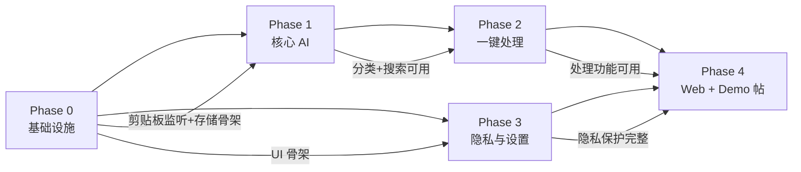

**说明**：
- Phase 0 是所有后续阶段的基础（必须先完成）
- Phase 1 和 Phase 3 可并行（Phase 1 依赖 Phase 0，Phase 3 仅依赖 Phase 0 的 UI 骨架）
- Phase 2 依赖 Phase 1（处理需要分类后的内容）
- Phase 4 依赖 Phase 2 和 Phase 3（需完整功能才能提交 Demo）

---

## 12. 风险和待确认问题

### 12.1 技术风险

| 风险 | 影响 | 概率 | 缓解措施 |
|------|------|------|---------|
| 本地嵌入模型在 Intel Mac 上推理慢 | 搜索/分类延迟超标（>500ms） | 中 | 备选：降级为关键词搜索（TF-IDF）；限制 Intel Mac 性能测试；优先 Apple Silicon |
| Core ML 模型转换失败（ONNX → CoreML） | 无法本地推理 | 低 | 备选：使用 MLX 框架（支持 HuggingFace 模型直接加载）；使用 Apple 官方 NaturalLanguage 框架 |
| NSPasteboard 轮询性能差（CPU 占用高） | 系统卡顿 | 低 | 优化轮询间隔（0.5s → 1s 可调）；检测到无变化时降低频率；仅在前台 App 变化时高频轮询 |
| LLM API 不稳定（某提供商限流/宕机） | 一键处理不可用 | 中 | 多提供商切换；错误重试（指数退避）；本地缓存常见处理结果 |
| AES-256 加密性能差（大量数据时） | 捕获延迟超标 | 低 | 批量加密；仅加密敏感字段（content + embeddings），元数据明文 |
| SQLite 并发访问冲突（主线程 + 清理任务） | 数据库锁错误 | 低 | 使用串行队列（DispatchQueue）串行化数据库访问；WAL 模式 |
| 辅助功能权限被用户拒绝 | 无法获取来源 App | 中 | 降级处理：sourceApp 记录为 "unknown"；引导用户授权 |
| 内存占用过高（大量历史 + 向量） | 系统内存压力 | 中 | 分页加载历史；向量懒加载；定期清理超过阈值的向量 |

### 12.2 产品风险

| 风险 | 影响 | 概率 | 缓解措施 |
|------|------|------|---------|
| 分类准确率不达标（<80%） | 用户体验差 | 中 | 扩大测试集；优化类型向量；规则兜底（正则辅助分类） |
| 搜索命中率不达标（<70%） | 搜索体验差 | 中 | 调整嵌入模型；混合检索（向量 + 关键词） |
| LLM 处理结果质量不稳定 | 用户体验不一致 | 中 | 优化 Prompt；结果后处理（格式校验）；多模型对比选优 |
| 首启流程太长导致用户流失 | 用户放弃配置 | 低 | 精简首启步骤；API Key 可跳过；核心功能无需 API Key |
| Web 交互预览页与实际 .app 体验差异大 | 评审困惑 | 低 | Web 页明确标注"预览版"；.app 下载链接突出 |

### 12.3 初赛风险

| 风险 | 影响 | 概率 | 缓解措施 |
|------|------|------|---------|
| 截止日期前未完成所有 Phase | Demo 不完整 | 中 | 严格按 Phase 顺序开发；Phase 4 预留 2 天缓冲；优先保证 Phase 0-2 |
| .app 在评审设备上无法运行（架构/权限） | 评审无法体验 | 中 | Universal Binary 构建；权限缺失时友好引导；Web 页作为 fallback |
| Web 页 GitHub Pages 访问受限 | 评审无法访问 | 低 | 备选：部署到 Vercel/Netlify；提供 HTML Zip 下载 |
| Session ID 不足 3 个 | 资格不符 | 低 | 开发过程保留所有 TRAE 对话；关键任务单独 Session |
| 截图不足 3 张 | 资格不符 | 低 | 每个 Phase 完成时截图存档 |
| 评审对"学习工作"赛道标签有异议 | 赛道不符 | 低 | 报名帖已确认；作品帖强调学习/工作场景 |

### 12.4 待确认问题

| 问题 | 影响范围 | 建议方案 | 决策时机 |
|------|---------|---------|---------|
| 嵌入模型最终选择（MiniLM-L6 vs L12） | Phase 1 性能 | 推荐 L6（22MB，384 维，平衡速度与质量） | Phase 1 开始前 |
| 数据库方案（SQLCipher vs 手动加密 SQLite） | Phase 0 实现 | 推荐手动加密（CryptoKit + SQLite.swift，避免 SQLCipher 依赖） | Phase 0 开始前 |
| 快捷键默认值（Cmd+Shift+V vs 其他） | Phase 3 设置 | 推荐 Cmd+Shift+V（不与系统冲突） | Phase 3 实现时 |
| 清理周期是否可由用户自定义（除 30 天外） | Phase 3 设置 | 支持 7/14/30/90 天四档选择 | Phase 3 实现时 |
| Web 交互预览页是否需要后端 | Phase 4 实现 | 不需要后端，纯前端模拟（静态 HTML + JS） | Phase 4 开始前 |
| 是否提供 .app 签名 | Phase 4 发布 | 初赛不强制签名（用户需手动信任）；如时间允许则 ad-hoc 签名 | Phase 4 发布前 |
| 银行类 App 黑名单具体范围 | Phase 3 预置 | 预置主流 5 家（工商/招商/建设/农业/中国银行） | Phase 3 实现时 |
| Web 页部署平台（GitHub Pages vs Vercel） | Phase 4 部署 | 推荐 GitHub Pages（与代码仓库同源，免费） | Phase 4 部署时 |

---

## 版本记录

| 版本 | 日期 | 变更说明 |
|------|------|---------|
| v1.0 | 2026-07-12 | 初始版本，初赛 MVP 设计规范，覆盖 F1.1-F1.7 全部功能，包含 25 条 AC、5 阶段拆分、12 种分类类型、3 个状态机、9 个用户流程图 |
