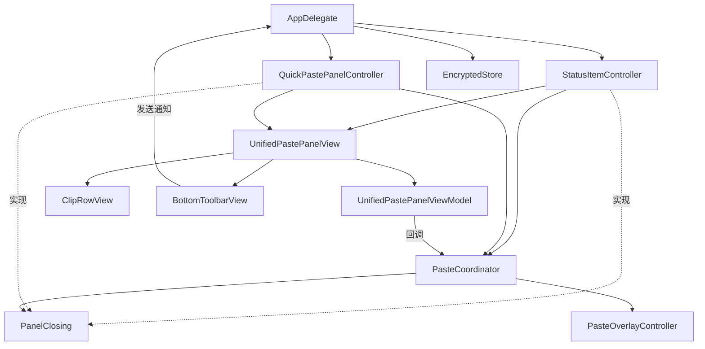

# F1.11 菜单栏弹窗双击粘贴 实现计划

> **面向 AI 代理的工作者：** 必需子技能：使用 superpowers:subagent-driven-development（推荐）或 superpowers:executing-plans 逐任务实现此计划。步骤使用复选框（`- [ ]`）语法来跟踪进度。

> 最后更新：2026-07-25 | 版本：v1.0

**目标：** 把菜单栏弹窗从「仅展示」升级为「完整剪贴复用入口」，与 F1.9 快捷粘贴面板交互完全对齐（双击粘贴 / 回车粘贴 / 方向键导航 / 选中态 / 默认高亮第一行 / Esc 关闭），并合并两个入口的视图层为统一粘贴面板视图，新增底部工具栏「查看全部 / 配置 / 退出」三按钮。

**架构：**
- 视图层合并：把 `PopoverView`（菜单栏弹窗）与 `QuickPasteView`（快捷键面板）合并为 `UnifiedPastePanelView` + `UnifiedPastePanelViewModel`，由 `StatusItemController`（菜单栏弹窗场景）与 `QuickPastePanelController`（快捷键场景）分别包装，通过外部参数 `showsBottomBar` 控制底部工具栏显隐。
- 协议扩展：`StatusItemController` 实现 `PanelClosing` 协议（与 `QuickPastePanelController` 共用同一接口），使 `PasteCoordinator` 通过统一接口关闭两个场景的面板。
- 数据源统一：两个控制器均从 `EncryptedStore` 读取剪贴项列表后注入到视图，视图本身不直接读取存储。
- 底部工具栏：新增 `BottomToolbarView` 组件，通过 `Notification.Name.openMainWindow`（已有）与新增的 `Notification.Name.openSettingsWindow` 通知 `AppDelegate` 打开对应窗口。

**技术栈：** Swift 5.7+ / macOS 13+、SwiftUI（声明式 UI、`onTapGesture`、`accessibilityIdentifier`）、AppKit（`NSStatusItem`、`NSPopover`、`NSEvent.addLocalMonitorForEvents`）、XCTest（单元测试）、XCUITest（UI 自动化测试）。

---

## 目录

1. [计划范围与依赖](#1-计划范围与依赖)
2. [文件结构](#2-文件结构)
3. [Phase 划分](#3-phase-划分)
4. [AC 覆盖度映射](#4-ac-覆盖度映射)
5. [命名约定与类型一致性](#5-命名约定与类型一致性)
6. [验证命令](#6-验证命令)
7. [自检结论](#7-自检结论)

---

## 1. 计划范围与依赖

### 1.1 依赖的规格文档

本计划基于以下 5 份规格文档（已通过 3 维审查）：

- 需求文档：`docs/planning/P0/F1/F1.11_菜单栏弹窗双击粘贴_需求文档.md` v1.0（12 章节、14 FR、7 NFR、14 AC）
- 设计文档：`docs/planning/P0/F1/F1.11_菜单栏弹窗双击粘贴_设计文档.md` v1.0（10 章节、2 新增 + 4 修改 + 7 复用模块）
- 视觉原型：`docs/planning/P0/F1/F1.11_菜单栏弹窗双击粘贴_视觉原型.html` v1.0
- 测试用例表：`docs/planning/P0/F1/F1.11_菜单栏弹窗双击粘贴_测试用例表.md` v1.0（67 条用例：34 AC + 33 NFR）
- 审查结果：`docs/planning/P0/F1/F1.11_菜单栏弹窗双击粘贴_需求文档_审查结果.md`（3 维全通过）

### 1.2 上游基础设施（已就绪，不修改）

| 模块 | 文件路径 | 复用要点 |
|------|---------|---------|
| `PanelClosing` 协议 | `ClipMind/UI/QuickPaste/PasteCoordinator.swift:26-38` | 状态栏图标控制器新增实现 |
| `PasteCoordinator` | `ClipMind/UI/QuickPaste/PasteCoordinator.swift:60-131` | 通过 `panelCloser: PanelClosing` 同时服务两个场景 |
| `QuickPastePanelController` | `ClipMind/UI/QuickPaste/QuickPastePanelController.swift` | 继续实现 `PanelClosing`，改为注入 `UnifiedPastePanelView` |
| `PasteOverlayController` | `ClipMind/UI/QuickPaste/PasteOverlayController.swift` | 降级浮层沿用 |
| `ClipboardWriter` / `ClipboardConsumerWatcher` | `ClipMind/Utils/` | 写入与消费监听沿用 |
| `EncryptedStore` | `ClipMind/Storage/` | 数据源读取沿用 |
| `ClipItem` / `ClipStore` | `ClipMind/Models/` | 数据模型沿用 |
| `LogCategory` | `ClipMind/Utils/` | 日志分类沿用 |
| `Notification.Name.openMainWindow` | `ClipMind/UI/MenuBar/StatusItemController.swift:4-6` | 「查看全部」按钮复用 |
| `NSApp.sendAction(Selector(("showSettingsWindow:")))` | `ClipMind/UI/MainWindow/MainWindow.swift:93-99` | 「配置」按钮通过新增通知间接触发 |

### 1.3 阶段依赖关系

```
Phase 1（视图层合并 + PanelClosing + 数据源统一）
   ↓ 依赖
Phase 2（键盘交互 + 选中态 + 双击粘贴接入 PasteCoordinator）
   ↓ 依赖
Phase 3（底部工具栏三按钮 + openSettings 通知）
   ↓ 依赖
Phase 4（XCUITest 端到端 + F1.9 文档同步 + history 日志）
```

每个 Phase 完成后必须满足的基线：
- **Phase 1 基线**：`xcodebuild build` 通过；`UnifiedPastePanelView` 在两个场景下都能渲染；`StatusItemController` 通过 `PanelClosing` 协议可关闭菜单栏弹窗；F1.9 现有单元测试全部通过。
- **Phase 2 基线**：`xcodebuild test` 通过；菜单栏弹窗场景下双击 / 回车 / 方向键 / Esc / 默认高亮全部生效；F1.9 已有 XCUITest 全部通过（回归保护）。
- **Phase 3 基线**：`xcodebuild test` 通过；底部三按钮可点击并触发对应通知；「配置」按钮可打开设置窗口。
- **Phase 4 基线**：F1.11 全部 14 条 AC 自动化测试通过；F1.9 文档同步更新；history 日志已追加。

---

## 2. 文件结构

### 2.1 新增文件

| 文件路径 | 职责 |
|---------|------|
| `ClipMind/UI/MenuBar/UnifiedPastePanelView.swift` | 统一粘贴面板视图，合并 `PopoverView` 与 `QuickPasteView`，承载列表渲染、键盘事件、选中态、底部工具栏条件渲染 |
| `ClipMind/UI/MenuBar/UnifiedPastePanelViewModel.swift` | 统一粘贴面板视图状态管理器，管理选中索引、单击 / 双击 / 回车 / 方向键 / Esc 事件路由、`shouldShowTextOnlyHint` 状态 |
| `ClipMind/UI/MenuBar/BottomToolbarView.swift` | 底部工具栏组件，渲染「查看全部 / 配置 / 退出」三按钮，通过外部参数控制可见性 |
| `ClipMindTests/UI/UnifiedPastePanelViewModelTests.swift` | 视图状态管理器单元测试 |
| `ClipMindTests/UI/StatusItemControllerTests.swift` | 状态栏图标控制器单元测试（`PanelClosing` 实现 + 数据源注入） |
| `ClipMindTests/UI/BottomToolbarViewTests.swift` | 底部工具栏组件单元测试 |
| `ClipMindTests/UI/PanelClosingProtocolTests.swift` | 面板关闭协议契约测试（两控制器接口一致性） |
| `ClipMindUITests/PopoverDoublePasteUITests.swift` | 菜单栏弹窗双击粘贴 UI 测试（AC-1 ~ AC-5、AC-9、AC-10） |
| `ClipMindUITests/PopoverBottomToolbarUITests.swift` | 菜单栏弹窗底部工具栏 UI 测试（AC-6 ~ AC-8） |

### 2.2 修改文件

| 文件路径 | 修改内容 |
|---------|---------|
| `ClipMind/UI/MenuBar/StatusItemController.swift` | 实现 `PanelClosing` 协议；`@MainActor` 隔离；弹出弹窗前从 `EncryptedStore` 读取剪贴项并注入 `UnifiedPastePanelView`；注入 `PasteCoordinator` 回调；保留 toggle 行为 |
| `ClipMind/UI/MenuBar/PopoverView.swift` | 删除（功能合并到 `UnifiedPastePanelView`） |
| `ClipMind/UI/QuickPaste/QuickPasteView.swift` | 删除（功能合并到 `UnifiedPastePanelView`）；`QuickPasteViewModel` 重命名为 `UnifiedPastePanelViewModel` 并迁移到 `UnifiedPastePanelViewModel.swift` |
| `ClipMind/UI/QuickPaste/QuickPastePanelController.swift` | `setContentView` 改为接收 `UnifiedPastePanelView`；其余不变 |
| `ClipMind/App/ClipMindApp.swift` | `configureActivationPolicy` 中 `statusItemController?.setup()` 改为 `setup(encryptedStore:pasteCoordinator:)`；新增 `handleOpenSettings()` 监听 `openSettingsWindow` 通知 |
| `ClipMind/App/QuickPasteAssembly.swift` | `makeQuickPasteContentController` 改为构造 `UnifiedPastePanelView(viewModel:)`；`loadClipsForQuickPaste` 沿用 |
| `ClipMind/UI/MainWindow/MainWindow.swift` | 抽取 `openSettings()` 逻辑为可复用函数（供 `AppDelegate.handleOpenSettings` 调用）；UI 测试模式下的独立窗口逻辑保留 |
| `project.yml` | 新增文件清单（`UnifiedPastePanelView.swift`、`UnifiedPastePanelViewModel.swift`、`BottomToolbarView.swift`、测试文件）；运行 `xcodegen generate` 重新生成工程 |

### 2.3 文件职责边界



---

## 3. Phase 划分

### Phase 1：视图层合并 + PanelClosing 协议扩展 + StatusItemController 实现 + 数据源统一

**目标**：消除 `PopoverView` 与 `QuickPasteView` 的重复代码，建立单一视图支撑两个场景的基础架构。

**任务列表**（详见 `phase-1-视图层合并.md`）：

1. 任务 1：创建 `UnifiedPastePanelViewModel`（迁移 `QuickPasteViewModel` 全部能力）
2. 任务 2：创建 `UnifiedPastePanelView`（合并两套视图，新增 `showsBottomBar` 参数）
3. 任务 3：`StatusItemController` 实现 `PanelClosing` 协议 + `@MainActor` 隔离
4. 任务 4：`StatusItemController` 注入 `EncryptedStore` 数据源与 `PasteCoordinator` 回调
5. 任务 5：`QuickPastePanelController` 切换到 `UnifiedPastePanelView`
6. 任务 6：删除 `PopoverView.swift` 与 `QuickPasteView.swift`，更新 `project.yml` 重新生成工程
7. 任务 7：`AppDelegate` 初始化 `StatusItemController` 时注入依赖

**Phase 1 基线**：
- `xcodegen generate && xcodebuild build` 通过
- `UnifiedPastePanelView` 在菜单栏弹窗与快捷键面板两个场景下都能渲染列表
- `StatusItemController.closePanel()` 能关闭菜单栏弹窗
- F1.9 现有单元测试全部通过（`xcodebuild test`）

### Phase 2：键盘交互 + 选中态 + 默认高亮 + 双击粘贴接入 PasteCoordinator

**目标**：在菜单栏弹窗场景下激活完整的键盘 / 鼠标交互，与 F1.9 快捷键面板行为对齐。

**任务列表**（详见 `phase-2-键盘交互.md`）：

1. 任务 1：菜单栏弹窗场景接入 `PasteCoordinator.handlePaste` 回调验证
2. 任务 2：验证 `NSEvent.addLocalMonitorForEvents` 在菜单栏 `NSPopover` 场景下生效（与 F1.9 `NSPanel` 场景对比）
3. 任务 3：默认高亮第一行在菜单栏弹窗场景的端到端验证
4. 任务 4：图片 / 文件路径双击提示「仅支持文本粘贴」在菜单栏弹窗场景验证
5. 任务 5：方向键导航边界用例（首行 / 末行 / 自动滚动）验证
6. 任务 6：Esc 关闭菜单栏弹窗验证（不写入剪贴板）
7. 任务 7：F1.9 已有 XCUITest 用例回归验证
8. 任务 8：双击文本行触发粘贴流程端到端验证
9. 任务 9：无辅助功能权限时双击显示降级浮层验证

**Phase 2 基线**：
- `xcodebuild test` 通过
- 菜单栏弹窗场景下：双击 / 回车 / 方向键 / Esc / 默认高亮全部生效
- F1.9 已有 XCUITest 全部通过（AC-F1.11-11 回归保护）

### Phase 3：底部工具栏三按钮 + openSettings 通知

**目标**：在菜单栏弹窗底部新增「查看全部 / 配置 / 退出」三按钮，建立「打开设置窗口」信号链路。

**任务列表**（详见 `phase-3-底部工具栏.md`）：

1. 任务 1：新增 `Notification.Name.openSettingsWindow`
2. 任务 2：创建 `BottomToolbarView` 组件
3. 任务 3：`AppDelegate` 监听 `openSettingsWindow` 通知并打开设置窗口
4. 任务 4：`UnifiedPastePanelView` 集成 `BottomToolbarView`（条件渲染）
5. 任务 5：「查看全部」按钮端到端验证（关闭弹窗 + 打开主窗口 + 获焦）
6. 任务 6：「配置」按钮端到端验证（关闭弹窗 + 打开设置窗口 + 获焦）
7. 任务 7：「退出」按钮端到端验证（仅关闭弹窗，不打开其他窗口）

**Phase 3 基线**：
- `xcodebuild test` 通过
- 底部三按钮可点击并触发对应行为
- 「配置」按钮通过新增通知链路打开设置窗口

### Phase 4：XCUITest 端到端验证 + F1.9 文档同步 + history 日志

**目标**：补齐 AC-F1.11-1 ~ AC-F1.11-14 的自动化测试，同步 F1.9 文档，追加 history 日志。

**任务列表**（详见 `phase-4-xctest验证.md`）：

1. 任务 1：编写 `PanelClosingProtocolTests.swift`（AC-F1.11-12）
2. 任务 2：编写 `UnifiedPastePanelViewModelTests.swift` 补充（AC-13、AC-14）
3. 任务 3：修复 Phase 2 遗漏用例与拼写错误（含 `--UITEST_PREPOPULATE_IMAGE_AND_FILEPATH` 启动参数处理）
4. 任务 4：运行 F1.9 已有用例回归（AC-11）
5. 任务 5：F1.9 文档同步更新（需求 / 设计 / 视觉原型 / 测试用例表）
6. 任务 6：F1.11 history 日志追加
7. 任务 7：全量 `xcodebuild test` 验证
8. 任务 8：Phase 4 完成验证（14 条 AC 核对 + 文档同步确认 + 测试通过确认）

**说明**：`PopoverDoublePasteUITests.swift` 在 Phase 2 创建，`PopoverBottomToolbarUITests.swift` 在 Phase 3 创建，Phase 4 不重复创建这两个文件，仅补齐遗漏用例与修复拼写错误。

**Phase 4 基线**：
- 14 条 AC 全部通过（自动化测试 + 手动验收）
- F1.9 文档同步更新完成
- F1.11 history 日志已追加
- 全量 `xcodebuild test` 通过

---

## 4. AC 覆盖度映射

| AC 编号 | AC 描述 | 实现 Phase | 验证用例编号 | 测试框架 |
|---------|--------|-----------|------------|---------|
| AC-F1.11-1 | 菜单栏弹窗打开后默认高亮第一行 | Phase 2 | TC-F1.11-1-01、TC-F1.11-1-02 | XCUITest |
| AC-F1.11-2 | 双击文本行触发粘贴流程 | Phase 2 | TC-F1.11-2-01、TC-F1.11-2-02 | XCUITest + XCTest |
| AC-F1.11-3 | 回车键触发选中行粘贴 | Phase 2 | TC-F1.11-3-01、TC-F1.11-3-02 | XCUITest |
| AC-F1.11-4 | 方向键移动选中行 | Phase 2 | TC-F1.11-4-01 ~ TC-F1.11-4-05 | XCUITest |
| AC-F1.11-5 | Esc 键关闭菜单栏弹窗 | Phase 2 | TC-F1.11-5-01 | XCUITest |
| AC-F1.11-6 | 底部「查看全部」按钮关闭弹窗并打开主窗口 | Phase 3 | TC-F1.11-6-01 | XCUITest |
| AC-F1.11-7 | 底部「配置」按钮关闭弹窗并打开设置窗口 | Phase 3 | TC-F1.11-7-01 | XCUITest |
| AC-F1.11-8 | 底部「退出」按钮关闭弹窗 | Phase 3 | TC-F1.11-8-01 | XCUITest |
| AC-F1.11-9 | 图片 / 文件路径类型双击显示提示 | Phase 2 | TC-F1.11-9-01 ~ TC-F1.11-9-03 | XCUITest |
| AC-F1.11-10 | 无辅助功能权限时双击显示粘贴浮层 | Phase 2 | TC-F1.11-10-01 ~ TC-F1.11-10-04 | XCTest + 手动 |
| AC-F1.11-11 | 快捷键入口行为与 F1.9 一致（回归保护） | Phase 2 + Phase 4 | TC-F1.11-11-01 ~ TC-F1.11-11-03 | XCUITest 回归 |
| AC-F1.11-12 | 面板关闭协议被状态栏图标控制器实现 | Phase 1 + Phase 4 | TC-F1.11-12-01 ~ TC-F1.11-12-03 | XCTest |
| AC-F1.11-13 | 底部工具栏条件渲染 | Phase 1 + Phase 4 | TC-F1.11-13-01 ~ TC-F1.11-13-03 | XCTest |
| AC-F1.11-14 | 状态栏图标控制器注入的剪贴项与剪贴板存储同步 | Phase 1 + Phase 4 | TC-F1.11-14-01 ~ TC-F1.11-14-03 | XCTest |

**覆盖度结论**：14 条 AC 全部映射到具体 Phase 任务与测试用例，无遗漏。

---

## 5. 命名约定与类型一致性

为保证 4 个 Phase 子计划中类型、方法签名、属性名一致，约定如下：

### 5.1 类型命名

| 类型 | 命名 | 文件位置 |
|------|------|---------|
| 统一粘贴面板视图 | `UnifiedPastePanelView` | `ClipMind/UI/MenuBar/UnifiedPastePanelView.swift` |
| 视图状态管理器 | `UnifiedPastePanelViewModel` | `ClipMind/UI/MenuBar/UnifiedPastePanelViewModel.swift` |
| 底部工具栏组件 | `BottomToolbarView` | `ClipMind/UI/MenuBar/BottomToolbarView.swift` |
| 面板关闭协议 | `PanelClosing`（已有，不重命名） | `ClipMind/UI/QuickPaste/PasteCoordinator.swift` |
| 状态栏图标控制器 | `StatusItemController`（已有，扩展） | `ClipMind/UI/MenuBar/StatusItemController.swift` |
| 快捷键面板控制器 | `QuickPastePanelController`（已有，不重命名） | `ClipMind/UI/QuickPaste/QuickPastePanelController.swift` |
| 粘贴协调器 | `PasteCoordinator`（已有，不修改） | `ClipMind/UI/QuickPaste/PasteCoordinator.swift` |

### 5.2 关键方法签名

```swift
// UnifiedPastePanelView
init(viewModel: UnifiedPastePanelViewModel, showsBottomBar: Bool)

// UnifiedPastePanelViewModel
init(clips: [ClipItem])
var selectedIndex: Int { get }
var clips: [ClipItem] { get }
var shouldShowTextOnlyHint: Bool { get }
var lastTriggeredClipIdForTesting: String? { get }
var onPasteTriggered: ((ClipItem) -> Void)?
var onEscPressed: (() -> Void)?
var onSingleClick: ((Int) -> Void)?
var onDoubleClick: ((ClipItem) -> Void)?
func isSelected(index: Int) -> Bool
func selectIndex(_ index: Int)
func moveSelectionUp()
func moveSelectionDown()
func handleEnterKey()
func handleDoubleClick(clip: ClipItem)
func handleEscKey()

// StatusItemController（新增）
@MainActor
func setup(encryptedStore: EncryptedStore, pasteCoordinator: PasteCoordinator)
func closePanel()  // PanelClosing 协议方法
var isPanelVisible: Bool { get }

// BottomToolbarView
init(onViewAll: @escaping () -> Void, onSettings: @escaping () -> Void, onExit: @escaping () -> Void)

// AppDelegate（新增）
@objc func handleOpenSettings()
```

### 5.3 通知名常量

```swift
// StatusItemController.swift 已有
extension Notification.Name {
    static let openMainWindow = Notification.Name("ClipMindOpenMainWindow")
}

// Phase 3 新增
extension Notification.Name {
    static let openSettingsWindow = Notification.Name("ClipMindOpenSettingsWindow")
}
```

### 5.4 辅助功能标识符约定

| 元素 | 标识符 | 场景 |
|------|--------|------|
| 搜索框 | `popoverSearchField` | 菜单栏弹窗（沿用 PopoverView 既有） |
| 搜索框 | `quickPasteSearchField` | 快捷键面板（F1.9 沿用，不重命名） |
| 列表行 | `popoverRow_\(index)_\(selected?)` | 菜单栏弹窗（新增） |
| 列表行 | `quickPasteRow_\(index)_\(selected?)` | 快捷键面板（F1.9 沿用） |
| 「查看全部」按钮 | `popoverViewAllButton` | 菜单栏弹窗 |
| 「配置」按钮 | `popoverSettingsButton` | 菜单栏弹窗 |
| 「退出」按钮 | `popoverExitButton` | 菜单栏弹窗 |
| 文本提示 | `textOnlyHint` | 两场景共用（F1.9 沿用） |
| 测试触发记录 | `popoverTestTriggeredClipId` | 菜单栏弹窗（新增） |
| 测试触发记录 | `quickPasteTestTriggeredClipId` | 快捷键面板（F1.9 沿用） |

**约束**：F1.9 已有的辅助功能标识符（`quickPasteRow_*`、`quickPasteSearchField`、`quickPasteTestTriggeredClipId`、`textOnlyHint`）保持不变，避免 F1.9 已有用例失败。

---

## 6. 验证命令

### 6.1 标准 Phase 验证命令

每个 Phase 完成后必须运行以下命令并确认通过：

```bash
# 修改 project.yml 后重新生成工程
cd /Users/dengdeng/Working/Competition/ClipMind-worktrees/feature/F1.11-popover-double-click-paste
xcodegen generate

# Lint（含 Swift 改动时强制 strict）
swiftlint lint --strict

# 完整测试（CI 与本地基线测试复用同一命令）
xcodebuild test \
  -project ClipMind.xcodeproj \
  -scheme ClipMind \
  -destination 'platform=macOS' \
  -configuration Debug \
  ARCHS=arm64 \
  ONLY_ACTIVE_ARCH=YES \
  CODE_SIGN_IDENTITY="-" \
  CODE_SIGNING_REQUIRED=NO \
  CODE_SIGNING_ALLOWED=NO

# 快速编译检查（Phase 1 视图层合并后建议先跑一次）
xcodebuild build \
  -project ClipMind.xcodeproj \
  -scheme ClipMind \
  -destination 'platform=macOS' \
  -configuration Debug \
  CODE_SIGN_IDENTITY="-" \
  CODE_SIGNING_REQUIRED=NO \
  CODE_SIGNING_ALLOWED=NO
```

### 6.2 单测试用例定向运行命令

```bash
# 运行指定单元测试类
xcodebuild test \
  -project ClipMind.xcodeproj \
  -scheme ClipMind \
  -destination 'platform=macOS' \
  -configuration Debug \
  ARCHS=arm64 \
  ONLY_ACTIVE_ARCH=YES \
  CODE_SIGN_IDENTITY="-" \
  CODE_SIGNING_REQUIRED=NO \
  CODE_SIGNING_ALLOWED=NO \
  -only-testing:ClipMindTests/UnifiedPastePanelViewModelTests

# 运行指定 XCUITest 类
xcodebuild test \
  -project ClipMind.xcodeproj \
  -scheme ClipMind \
  -destination 'platform=macOS' \
  -configuration Debug \
  ARCHS=arm64 \
  ONLY_ACTIVE_ARCH=YES \
  CODE_SIGN_IDENTITY="-" \
  CODE_SIGNING_REQUIRED=NO \
  CODE_SIGNING_ALLOWED=NO \
  -only-testing:ClipMindUITests/PopoverDoublePasteUITests
```

### 6.3 UI 证据任务（XCUITest 截图）

XCUITest 用例失败时，需在用例末尾追加截图保存逻辑（沿用 F1.9 已有约定）：

```swift
// 在 XCUITest 用例的断言失败后追加：
let attachment = XCTAttachment(screenshot: XCUIScreen.main.screenshot())
attachment.name = "AC-F1.11-X-failure"
attachment.lifetime = .keepAlways
add(attachment)
```

截图保存路径：`/Users/dengdeng/Working/Competition/ClipMind-worktrees/feature/F1.11-popover-double-click-paste/build/Attachments/`

---

## 7. 自检结论

### 7.1 规格覆盖度

- ✅ 14 条 FR（FR-001 ~ FR-014）全部映射到 Phase 任务
- ✅ 14 条 AC（AC-F1.11-1 ~ AC-F1.11-14）全部映射到 Phase 任务与测试用例（见第 4 节）
- ✅ 7 条 NFR 通过测试用例表 67 条用例覆盖（本计划在 Phase 4 任务 1-5 落实）
- ✅ 9 项 Out of Scope 在 Phase 任务中明确不做（如「不重命名 F1.9 标识符」「不修改剪贴板存储持久化逻辑」「不实现图片 / 文件路径自动粘贴」）
- ✅ 7 项复用模块（`PanelClosing` / `PasteCoordinator` / `QuickPastePanelController` / `PasteOverlayController` / `ClipboardWriter` / `ClipboardConsumerWatcher` / `EncryptedStore`）在 Phase 1 任务 3-5 中明确沿用，不修改

### 7.2 占位符扫描

- ✅ 全计划无「TODO」「待定」「后续实现」「补充细节」
- ✅ 全计划无「类似任务 N」「为上述代码编写测试」省略
- ✅ 每个 TDD 步骤包含完整测试代码块与实现代码块
- ✅ 每个任务有精确的 `xcodebuild` / `swiftlint` / `xcodegen` 命令与预期输出

### 7.3 类型一致性

- ✅ `UnifiedPastePanelView` / `UnifiedPastePanelViewModel` / `BottomToolbarView` 命名在 4 个 Phase 子计划中一致（见第 5 节）
- ✅ `StatusItemController.setup(encryptedStore:pasteCoordinator:)` 签名在 Phase 1 任务 4 与 Phase 1 任务 7（AppDelegate 调用方）一致
- ✅ `Notification.Name.openSettingsWindow` 在 Phase 3 任务 1（定义）、任务 3（监听）、任务 4（发送）三处一致
- ✅ `showsBottomBar: Bool` 参数在 Phase 1 任务 2（定义）、任务 5（QuickPastePanelController 调用方）、Phase 3 任务 4（集成 BottomToolbarView）三处一致
- ✅ F1.9 已有标识符（`quickPasteRow_*`、`quickPasteSearchField` 等）在 Phase 2 任务 7 回归验证中明确保持不变

### 7.4 TDD 与 UI 证据

- ✅ 每个功能任务遵循「编写失败测试 → 运行验证失败 → 编写实现 → 运行验证通过 → commit」5 步骤
- ✅ XCUITest 用例在 Phase 2、Phase 3、Phase 4 中明确，包含 `XCUIApplication().launchArguments` 设置与 `XCUIElement` 断言
- ✅ 截图保存路径与命名约定已定义（第 6.3 节）

---

## 版本记录

| 版本 | 日期 | 变更说明 |
|------|------|---------|
| v1.0 | 2026-07-25 | 初始版本，覆盖 F1.11 菜单栏弹窗双击粘贴实现计划，包含 4 个 Phase 子计划、9 个新增文件、7 个修改文件、14 条 AC 全覆盖映射、命名约定与类型一致性约束。基于已通过 3 维审查的 5 份规格文档（需求 / 设计 / 视觉原型 / 测试用例表 / 审查结果）编写。 |
