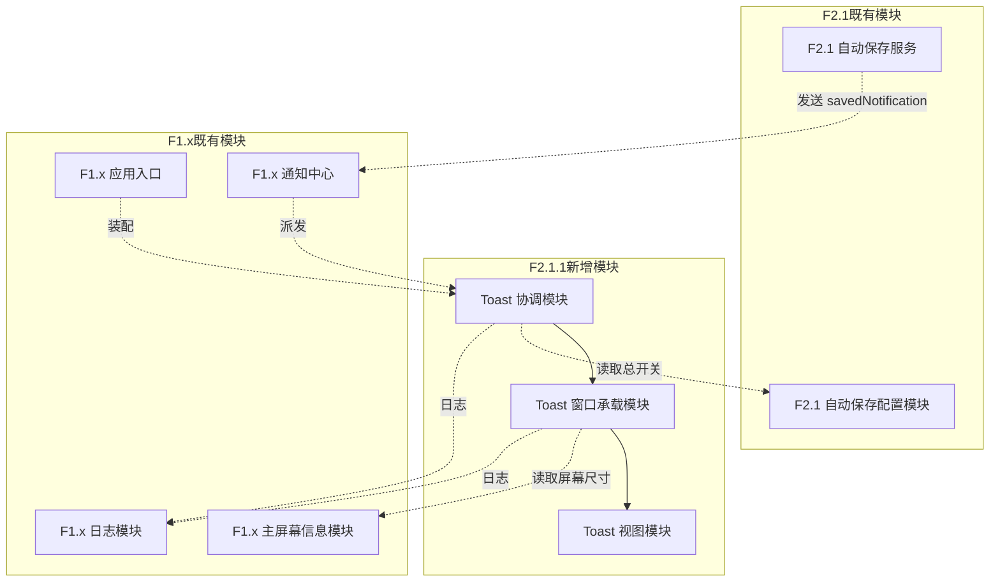
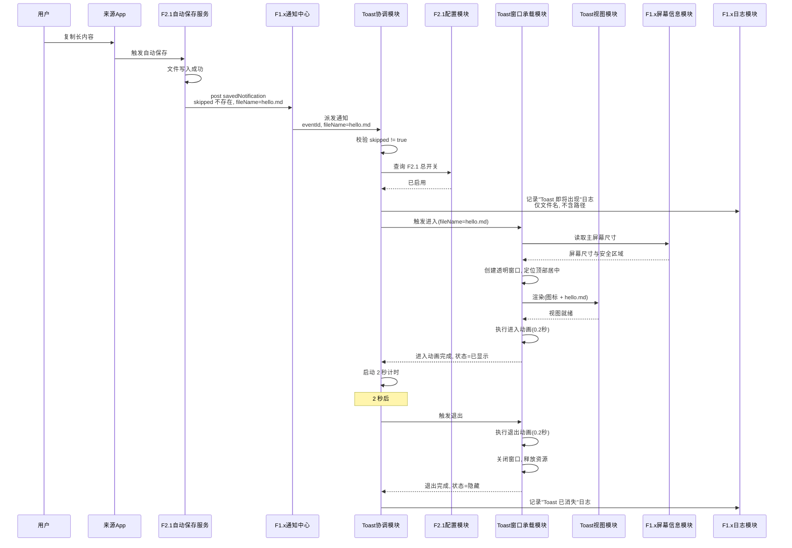
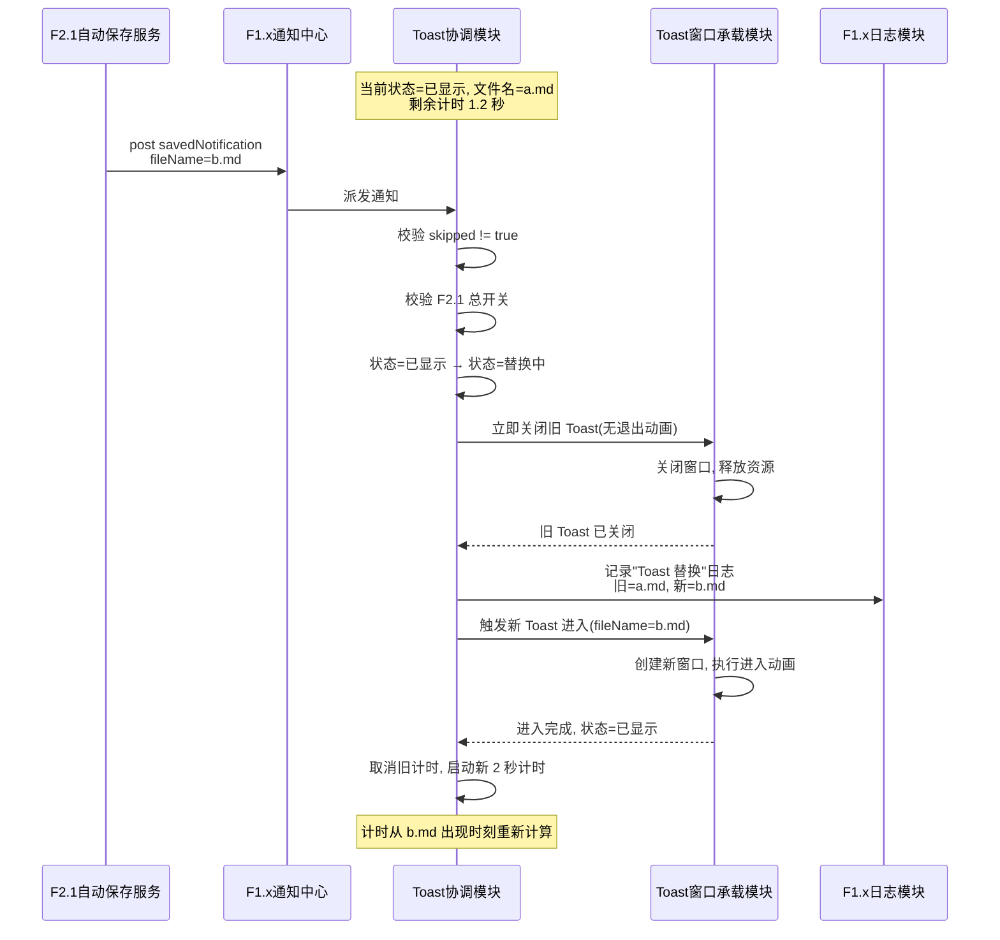
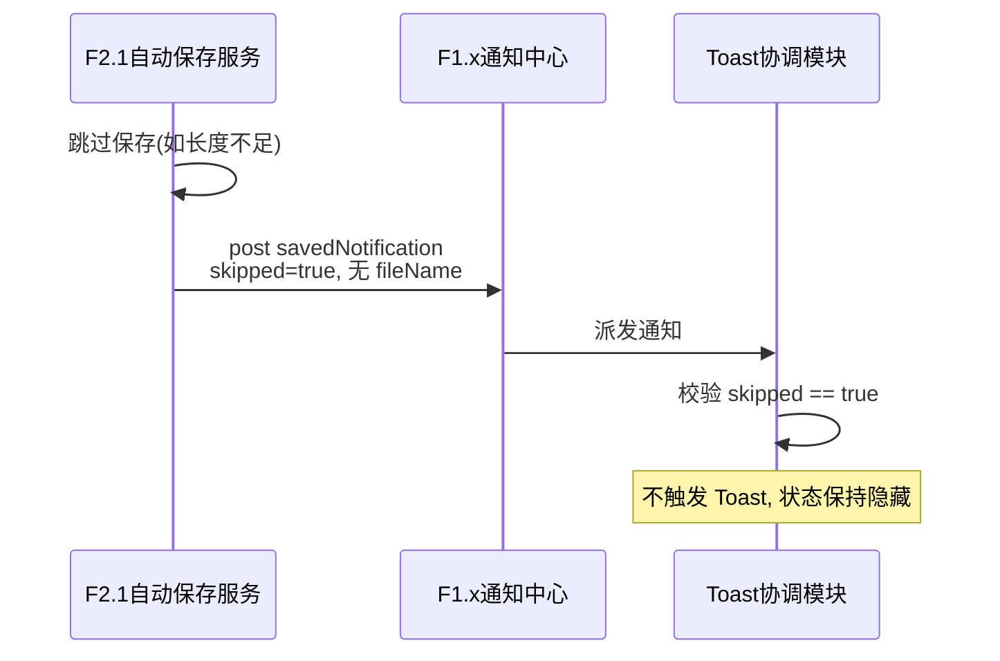
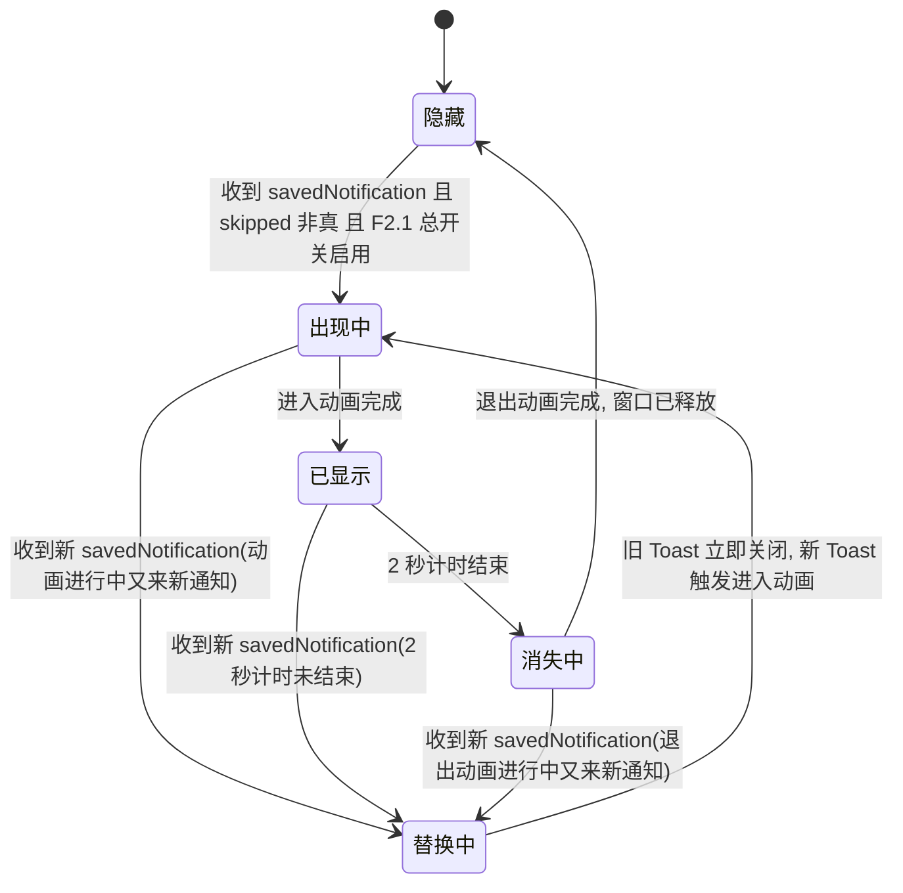

> 最后更新：2026-07-23 | 版本：v1.0

# F2.1.1 保存成功 Toast 提示 设计文档

**功能编号**：F2.1.1
**优先级**：P1（复赛扩展）
**文档存放路径**：`docs/planning/P1/F2.1/F2.1.1_保存成功Toast_设计文档.md`
**前置文档**：`F2.1.1_保存成功Toast_需求文档.md`（v1.0）、`F2.1_自动保存到文件_设计文档.md`（v1.1）
**适用阶段**：复赛扩展阶段（F2.1 自动保存到文件之后）

---

## 目录

1. [架构概览](#1-架构概览)
2. [模块边界](#2-模块边界)
3. [数据流](#3-数据流)
4. [状态模型](#4-状态模型)
5. [错误处理](#5-错误处理)
6. [关键决策](#6-关键决策)
7. [风险与缓解](#7-风险与缓解)
8. [兼容性](#8-兼容性)
9. [性能](#9-性能)
10. [安全与合规](#10-安全与合规)

---

## 1. 架构概览

### 1.1 文档定位

本文档是 F2.1.1 保存成功 Toast 提示功能的**架构契约**，描述"系统内部由谁负责什么"（WHO/WHAT 结构），不描述"具体怎么实现"（HOW 代码）。

**单一需求来源**：本文档以 `F2.1.1_保存成功Toast_需求文档.md`（v1.0）为唯一需求来源，采用编号引用（FR-xxx / NFR-xxx / AC-xxx / C-xxx / O-xxx）而非复制原文。

**变更原则**：即使后续类名、接口签名、实现语言全部重构，本文档基本不需要改。如果发现本文档需要随代码变化而修改，说明本层混入了实现细节，应将其下沉到实现规划层。

**读者对象**：实现规划与代码层作者、审查人员、未来维护者。

**文档边界**：本文档只回答"有哪些模块、职责如何划分、数据如何流动、状态如何变化、为什么这样划分"。不讨论"用户为什么需要"（已由需求文档回答），不写"接口签名/类定义/目录结构"（留给实现规划），不写"AC/测试策略/UI 可观测性矩阵"（留给测试用例表与视觉原型）。

### 1.2 架构总览

F2.1.1 在 F2.1 既有自动保存流程之上**新增一组 Toast 提示相关模块**，采用"屏幕级浮层 + 中心化通知监听 + 状态机驱动"的架构：

- **监听层**：Toast 协调模块通过 F1.x 通知中心订阅 F2.1 自动保存服务发出的 `savedNotification`，仅作为旁路观察者，不修改 F2.1 既有流程；
- **决策层**：Toast 协调模块在收到通知后，校验"非跳过"与"F2.1 总开关启用"两个前置条件，决定是否触发 Toast 显示；
- **承载层**：Toast 窗口承载模块管理屏幕级透明窗口的生命周期（创建、定位、关闭、资源释放）；
- **呈现层**：Toast 视图模块以 SwiftUI 视图承载成功图标 + 文件名文字，由窗口承载模块托管渲染；
- **装配层**：F1.x 应用入口在启动时装配 Toast 协调模块并注册通知监听。

### 1.3 与 F2.1 的对接点（关键契约）

F2.1 自动保存服务在保存流程结束时（成功或跳过）发送 `savedNotification`，本特性通过监听该通知实现对接。**对接契约基于 F2.1 既有实现，不修改 F2.1 公共接口**（根据 C-04）：

| 契约项 | 值 | 来源 |
|--------|------|------|
| 通知名常量 | `AutoSaveService.savedNotification` | F2.1 实现层 |
| 通知名字符串 | `ClipMindAutoSaveSaved` | F2.1 实现层 |
| 载荷键：事件 ID | `eventId`（String，始终存在） | F2.1 实现层 |
| 载荷键：文件名 | `fileName`（String，仅成功时存在） | F2.1 实现层 |
| 载荷键：跳过标记 | `skipped`（Bool，仅跳过时为 `true`；成功时该键不存在） | F2.1 实现层 |
| 成功判定逻辑 | `skipped` 键不存在或非 `true` → 成功 | F2.1 实现层 |
| 失败路径通知 | F2.1 通过 `errorNotification` 触发错误弹窗（不在本特性范围） | F2.1 实现层 |

**说明**：失败路径不发送 `savedNotification`（F2.1 走错误弹窗分支），因此本特性无需区分"失败"与"跳过"——只要 `savedNotification` 触发且 `skipped != true` 即为成功，自然满足 FR-009（跳过不显示）与 FR-010（失败不显示）。

---

## 2. 模块边界

F2.1.1 在 F2.1 既有模块之上**新增三个 Toast 相关模块**，并与 F2.1 自动保存服务、F1.x 应用入口、F1.x 日志模块协作。模块用中文业务术语命名，不绑定具体类名。

### 2.1 模块结构图

### 2.2 模块清单

| 模块名（中文业务术语） | 类型 | 对外契约概述 |
|----------------------|------|------------|
| Toast 协调模块 | 新增·协调者 | 订阅 F2.1 `savedNotification`，校验前置条件（非跳过、F2.1 总开关启用），驱动 Toast 窗口承载模块的生命周期与状态机；管理 2 秒计时；处理替换模式（旧 Toast 立即关闭，新 Toast 触发进入） |
| Toast 窗口承载模块 | 新增·承载者 | 管理屏幕级透明窗口的创建、定位（顶部居中）、动画（进入/退出）、关闭与资源释放；托管 Toast 视图模块的渲染；保证窗口不抢焦点、不影响源 App 前台状态 |
| Toast 视图模块 | 新增·呈现者 | 以 SwiftUI 视图呈现成功图标 + 文件名文字；接收文件名参数；视觉细节（背景色、圆角、字体）由视觉原型决定，本模块只负责承载 |
| F2.1 自动保存服务 | 既有 | 保存流程结束时发送 `savedNotification`（含 `eventId`/`fileName`/`skipped` 载荷）；本特性仅监听，不修改 |
| F2.1 自动保存配置模块 | 既有 | 提供 F2.1 总开关状态查询能力（根据 FR-008 与 C-01） |
| F1.x 应用入口 | 既有 | 在 App 启动时装配 Toast 协调模块并注册通知监听；在 App 退出时反装配 |
| F1.x 通知中心 | 既有 | 提供 `NotificationCenter` 派发能力，承载 F2.1 `savedNotification` 到 Toast 协调模块的传递 |
| F1.x 日志模块 | 既有 | 提供结构化日志输出能力；Toast 关键状态变更（出现、替换、消失）通过日志分类记录（根据 NFR-005） |
| F1.x 主屏幕信息模块 | 既有 | 提供 `NSScreen.main` 屏幕尺寸与安全区域查询能力，供窗口承载模块定位 |

### 2.3 职责边界

#### 2.3.1 Toast 协调模块

- **负责**：订阅 F2.1 `savedNotification`（根据 FR-001）；收到通知后校验 `skipped != true`（根据 FR-009、FR-010）；校验 F2.1 总开关启用（根据 FR-008、C-01）；从载荷读取 `fileName` 并转交窗口承载模块（根据 FR-002）；驱动 Toast 状态机（隐藏 → 出现中 → 已显示 → 替换中 → 消失中 → 隐藏）；管理 2 秒计时（根据 FR-004）；处理替换模式——新 Toast 触发时立即关闭旧 Toast，2 秒计时从新 Toast 出现时刻重新计算（根据 FR-007）；通过 F1.x 日志模块输出关键状态变更日志（根据 NFR-005）
- **不负责**：管理窗口创建与动画（由窗口承载模块负责）；渲染视图内容（由视图模块负责）；决定视觉细节（背景色、圆角等，由视觉原型决定）；修改 F2.1 自动保存服务（受 C-04 约束）；处理失败场景（失败不走 `savedNotification`，由 F2.1 错误弹窗承载，根据 FR-010 与 O-03）

#### 2.3.2 Toast 窗口承载模块

- **负责**：创建屏幕级透明窗口（根据 FR-011）；将窗口定位到主屏幕顶部居中（根据 FR-003）；托管 Toast 视图模块的渲染；执行进入动画（顶部滑入 + 淡入，约 0.2 秒，根据 FR-005）；执行退出动画（反向滑出 + 淡出，约 0.2 秒，根据 FR-006）；窗口关闭后立即释放资源（根据 NFR-003）；保证窗口不抢焦点、不激活 ClipMind 主窗口（根据 FR-011）；从 F1.x 主屏幕信息模块读取屏幕尺寸用于定位
- **不负责**：决定是否触发 Toast（由协调模块负责）；管理 2 秒计时（由协调模块负责）；决定 Toast 视觉细节（由视觉原型决定）；调用 F2.1 配置模块（由协调模块负责）；记录业务级日志（由协调模块负责，本模块只记录窗口生命周期技术日志）

#### 2.3.3 Toast 视图模块

- **负责**：呈现成功图标与文件名文字（根据 FR-002）；接收文件名参数并渲染；保持视图层级正确（图标在左、文字在右）；遵循视觉原型的视觉细节（背景色、圆角半径、字体大小、图标样式）
- **不负责**：决定何时显示或消失（由协调模块驱动）；管理窗口或动画（由窗口承载模块负责）；处理用户交互（本特性不做点击交互，根据 O-03 FC-03 留待未来）；读取 F2.1 配置（由协调模块负责）

#### 2.3.4 与 F2.1 既有模块的边界

- **F2.1 自动保存服务**：本特性仅通过 `NotificationCenter` 监听其 `savedNotification`，不修改其公共接口、不修改通知名与载荷结构（根据 C-04）；失败路径不发送 `savedNotification`，本特性自然不触发 Toast（根据 FR-010）
- **F2.1 自动保存配置模块**：本特性只读取 F2.1 总开关状态，不修改配置；不新增配置项（根据 C-05）；不修改配置面板 UI（根据 O-08）

#### 2.3.5 与 F1.x 既有模块的边界

- **F1.x 应用入口**：本特性在应用启动时由应用入口装配 Toast 协调模块，不修改应用入口的公共行为契约；装配关系是单向的（应用入口持有协调模块，协调模块不持有应用入口）
- **F1.x 通知中心**：本特性复用 `NotificationCenter`，不修改通知中心；不污染系统通知中心（根据 C-03）
- **F1.x 日志模块**：本特性复用其日志分类体系与结构化日志能力，不修改既有日志分类；日志字段必须遵守 NFR-005 与 C-02（不输出文件完整路径或剪贴板原文）
- **F1.x 主屏幕信息模块**：本特性只读取屏幕尺寸与安全区域，不修改屏幕状态

---

## 3. 数据流

### 3.1 主路径数据流（保存成功 → Toast 出现 → 2 秒后消失）

### 3.2 替换模式数据流（Toast 显示中再次触发保存成功）

### 3.3 跳过场景数据流（不显示 Toast）

### 3.4 关键数据流约束

| 约束 | 来源 | 落地位置 |
|------|------|---------|
| 仅监听不修改 F2.1 | C-04、FR-001 | Toast 协调模块通过 `NotificationCenter` 订阅 `savedNotification`，不调用 F2.1 自动保存服务的任何方法 |
| 跳过场景不显示 | FR-009 | 协调模块校验 `skipped != true`，跳过时直接返回不触发 Toast |
| 失败场景不显示 | FR-010 | F2.1 失败路径走错误弹窗分支，不发送 `savedNotification`，协调模块自然不触发 |
| 跟随 F2.1 总开关 | FR-008、C-01 | 协调模块在触发 Toast 前查询 F2.1 总开关状态，关闭时不显示 |
| 替换模式立即切换 | FR-007、AC-04 | 协调模块在"已显示"状态收到新通知时，立即关闭旧 Toast（无退出动画），新 Toast 触发进入动画，2 秒计时从新 Toast 出现时刻重新计算 |
| 屏幕级浮层不依赖焦点 | FR-011、AC-11 | 窗口承载模块使用透明窗口，不激活 ClipMind 主窗口，不抢焦点 |
| 不污染系统通知中心 | C-03、O-05 | 全程使用 `NotificationCenter`（应用内）与 SwiftUI/AppKit 浮层，不调用系统通知 API |
| 日志不含完整路径 | C-02、NFR-005 | 日志仅记录文件名（来自 `fileName` 载荷），不记录文件所在目录的完整路径 |

---

## 4. 状态模型

### 4.1 Toast 协调模块状态机

Toast 协调模块在一次 Toast 生命周期中经历以下状态（**状态名使用中文业务术语**，不使用英文枚举值）：

### 4.2 状态说明与责任归属

| 状态 | 含义 | 责任归属 | 出口条件 |
|------|------|---------|---------|
| 隐藏 | 无 Toast 显示，无窗口资源占用，无计时器 | Toast 协调模块 | 收到符合前置条件的 `savedNotification` → 出现中 |
| 出现中 | 窗口承载模块正在执行进入动画（约 0.2 秒），视图已渲染 | Toast 协调模块 + 窗口承载模块 | 进入动画完成 → 已显示；收到新通知 → 替换中 |
| 已显示 | 进入动画已完成，2 秒计时进行中，Toast 可见 | Toast 协调模块（计时）+ 窗口承载模块（保持窗口） | 2 秒计时结束 → 消失中；收到新通知 → 替换中 |
| 替换中 | 收到新通知，旧 Toast 立即关闭（无退出动画），新 Toast 即将触发进入动画 | Toast 协调模块 | 旧 Toast 关闭完成 → 出现中（新 Toast） |
| 消失中 | 窗口承载模块正在执行退出动画（约 0.2 秒） | Toast 协调模块 + 窗口承载模块 | 退出动画完成 → 隐藏；收到新通知 → 替换中 |

### 4.3 替换模式处理逻辑

**核心规则**（根据 FR-007 与 AC-04）：

- 旧 Toast **立即关闭**，不执行退出动画（避免新旧动画并发导致视觉抖动）；
- 新 Toast **触发进入动画**，从顶部滑入 + 淡入；
- 2 秒计时**从新 Toast 出现时刻重新计算**，取消旧计时器，启动新计时器；
- 旧窗口资源立即释放，新窗口由窗口承载模块重新创建。

**状态转换示例**：

| 当前状态 | 收到新通知 | 转换后状态 | 计时处理 |
|---------|----------|-----------|---------|
| 隐藏 | 是 | 出现中（新 Toast） | 启动新 2 秒计时 |
| 出现中 | 是 | 替换中 → 出现中（新 Toast） | 取消旧计时（如有），启动新 2 秒计时 |
| 已显示 | 是 | 替换中 → 出现中（新 Toast） | 取消旧 2 秒计时，启动新 2 秒计时 |
| 消失中 | 是 | 替换中 → 出现中（新 Toast） | 取消退出动画，启动新 2 秒计时 |
| 替换中 | 是 | 保持替换中（合并为新 Toast，最新通知胜出） | 取消旧计时，启动新 2 秒计时 |

### 4.4 Toast 窗口承载模块状态

窗口承载模块的生命周期状态独立于协调模块的状态机，由协调模块驱动：

| 窗口状态 | 含义 | 触发方 |
|---------|------|--------|
| 未创建 | 无窗口资源，无视图托管 | 初始状态 / 退出动画完成后 |
| 创建中 | 正在创建透明窗口、定位、托管视图 | 协调模块触发进入 |
| 已就绪 | 窗口已显示，进入动画进行中或已完成 | 窗口承载模块完成创建 |
| 关闭中 | 退出动画进行中，即将释放 | 协调模块触发退出（2 秒计时结束） |
| 立即关闭 | 替换模式下，无退出动画，直接释放 | 协调模块触发替换 |

---

## 5. 错误处理

### 5.1 错误场景分类

| 错误场景 | 触发条件 | 处理策略 | 责任归属 |
|---------|---------|---------|---------|
| 通知载荷缺失 `fileName` | F2.1 发送 `savedNotification` 但 `skipped` 非真且无 `fileName`（理论上不应发生） | 记录错误日志（含 `eventId`），不触发 Toast | Toast 协调模块 |
| 通知载荷 `eventId` 缺失 | F2.1 发送通知但无 `eventId`（违反 F2.1 既有契约） | 记录错误日志，仍尝试触发 Toast（降级处理） | Toast 协调模块 |
| F2.1 总开关查询失败 | 配置模块不可用或抛出异常 | 默认不显示 Toast（保守策略，避免误显示） | Toast 协调模块 |
| 屏幕信息查询失败 | `NSScreen.main` 返回 nil（无显示器等极端场景） | 不触发 Toast，记录日志 | Toast 窗口承载模块 |
| 窗口创建失败 | 系统资源不足或 App Sandbox 限制 | 记录错误日志，不触发 Toast，不影响 F2.1 既有流程 | Toast 窗口承载模块 |
| 进入动画异常 | 动画 API 抛出异常或超时 | 直接跳到"已显示"状态，启动 2 秒计时 | Toast 窗口承载模块 + 协调模块 |
| 退出动画异常 | 动画 API 抛出异常或超时 | 直接关闭窗口，释放资源，回到"隐藏"状态 | Toast 窗口承载模块 |
| 计时器异常 | `Timer` 未触发或重复触发 | 协调模块保证同时只有一个有效计时器；超时未触发时由备用超时检查清理 | Toast 协调模块 |

### 5.2 错误处理原则

- **不影响 F2.1 既有流程**：Toast 任何错误都不得回传给 F2.1 自动保存服务，F2.1 完成保存后即与 Toast 解耦（根据 C-04）
- **不影响 F1.x 既有功能**：Toast 错误不传播到 F1.x 捕获、分类、加密、UI 等模块
- **降级而非崩溃**：所有错误场景下 App 不崩溃、不卡死，仅记录日志并跳过本次 Toast（根据 NFR-004 精神）
- **日志含上下文**：错误日志必须包含 `eventId`、错误码、错误阶段（如"窗口创建"、"动画执行"），便于排查（根据 NFR-005）
- **资源最终释放**：即使动画或计时器异常，窗口承载模块必须保证窗口资源最终被释放（根据 NFR-003）

### 5.3 错误日志字段白名单

根据 NFR-005 与 C-02，Toast 错误日志字段限于：

| 字段 | 说明 | 示例 |
|------|------|------|
| `event_id` | 事件 ID（来自载荷） | `550e8400-...` |
| `phase` | 错误阶段 | `notify_receive` / `config_query` / `window_create` / `enter_animation` / `exit_animation` / `timer` |
| `error_code` | 错误码 | `E_PAYLOAD_MISSING_FILENAME` / `E_CONFIG_UNAVAILABLE` / `E_SCREEN_UNAVAILABLE` / `E_WINDOW_CREATE_FAILED` |
| `from_state` / `to_state` | 状态机转换上下文 | `shown` / `replacing` |
| `file_name` | 文件名（不含路径） | `hello.md` |

**禁止输出**：文件完整路径、剪贴板原文、文件路径中的用户名（根据 C-02 与 NFR-005）。

---

## 6. 关键决策

本节记录 F2.1.1 设计评审中通过 grilling 流程确认的 6 条关键决策。决策编号 D1~D6 与需求文档 FR/NFR/AC 的引用一一对应。

### 6.1 D1：Toast 承载方式——独立透明窗口屏幕级浮层

- **决策**：Toast 采用独立透明窗口（`NSPanel` 或 `NSWindow`）作为屏幕级浮层承载，**不使用主窗口 overlay**，不使用菜单栏弹窗
- **原因**：FR-011 明确要求"Toast 不依赖 ClipMind 主窗口或菜单栏弹窗的焦点状态"，用户在源 App（浏览器、IDE）前台复制时 Toast 必须显示在屏幕顶部；若使用主窗口 overlay，则 Toast 必须绑定主窗口可见性与焦点状态——当主窗口隐藏或非活动时 overlay 不可见，违反 FR-011 与 AC-11；复审非阻塞建议已指出"主窗口 overlay 与 FR-011 存在张力"，本决策明确放弃该方案
- **代价**：需要管理独立窗口的生命周期（创建、定位、动画、关闭、释放），实现复杂度高于 overlay
- **为何可接受**：独立窗口可设置 `canBecomeKey = false`、`canBecomeMain = false`、`isOpaque = false`、`backgroundColor = .clear`，不抢焦点、不激活 ClipMind 主窗口；macOS 原生提供 `NSPanel` 与 `NSWindow` 公开 API 支持，无需额外 entitlement（根据 NFR-006 与 C-06）
- **引用**：FR-011、FR-003、AC-11、NFR-006、C-06

### 6.2 D2：Toast 协调模块状态机——5 状态显式模型

- **决策**：Toast 协调模块采用 5 状态显式状态机：**隐藏 → 出现中 → 已显示 → 替换中 → 消失中 → 隐藏**，所有状态转换显式定义，禁用隐式状态切换
- **原因**：FR-007 替换模式要求"新 Toast 立即替换旧 Toast，2 秒计时从新 Toast 出现时刻重新计算"，若无显式状态机，替换逻辑会分散在多个回调中难以维护与测试；显式状态机让"出现中收到新通知"、"已显示收到新通知"、"消失中收到新通知"三种替换场景有统一处理入口
- **代价**：状态机引入额外抽象，代码量增加
- **为何可接受**：5 状态机简洁清晰，每个状态出口条件明确，可独立测试；状态机让替换模式与计时器管理的边界清晰，避免计时器堆积（根据 NFR-004 与 R-03 风险缓解）
- **引用**：FR-004、FR-007、AC-04、NFR-004

### 6.3 D3：监听方式——中心化 NotificationCenter 订阅

- **决策**：Toast 协调模块通过 `NotificationCenter.default.addObserver` 订阅 F2.1 的 `savedNotification`，**不使用闭包回调**
- **原因**：F2.1 自动保存服务已通过 `NotificationCenter` 发送 `savedNotification`（见第 1.3 节对接契约），本特性只需订阅即可，无需修改 F2.1 公共接口（根据 C-04）；闭包回调要求 F2.1 暴露 `onSaved` 闭包属性，属于修改 F2.1 公共接口，违反 C-04；`NotificationCenter` 是 macOS 标准发布订阅机制，解耦发布者与订阅者，F2.1 无需感知 Toast 模块存在
- **代价**：通知载荷是 `[String: Any]` 字典，类型安全性弱于闭包参数
- **为何可接受**：协调模块在收到通知后立即解析载荷并校验类型，失败时记录日志并跳过；载荷契约由 F2.1 设计文档与代码双重保证，相对稳定
- **引用**：FR-001、C-04、第 1.3 节对接契约

### 6.4 D4：F2.1 总开关查询方式——读取配置快照

- **决策**：Toast 协调模块在收到 `savedNotification` 后，**同步读取 F2.1 配置快照**查询总开关状态（调用 F2.1 自动保存配置模块的读取接口），不使用闭包查询
- **原因**：F2.1 已实现配置模块并提供读取接口（见 F2.1 设计文档 3.11 节"自动保存配置模块"），复用该接口一致性最高；闭包查询要求 F2.1 暴露查询闭包，属于修改 F2.1 公共接口，违反 C-04；同步读取配置快照开销小（内存读取），不影响主线程响应
- **代价**：Toast 触发时机读取配置，与 F2.1 事件使用的配置快照可能存在时间差（用户在 F2.1 保存过程中关闭总开关）
- **为何可接受**：F2.1 保存流程通常在 3 秒内完成（根据 F2.1 NFR-001），用户在如此短窗口内切换总开关的概率极低；即使读取到旧状态，最坏情况是 Toast 多显示或少显示一次，不影响 F2.1 既有保存行为
- **引用**：FR-008、C-01、C-04

### 6.5 D5：动画实现——原生 NSWindow 透明度与位置动画

- **决策**：Toast 进入与退出动画使用 **`NSWindow.alphaValue` 与 `NSWindow.setFrame(_:display:)` 的原生动画能力**（如 `NSAnimationContext` 闭包动画），不使用 SwiftUI 内置动画，不使用 `CAShapeLayer`
- **原因**：NFR-002 要求 60fps 流畅动画，原生 `NSWindow` 动画由 AppKit 直接驱动，性能优于 SwiftUI 嵌套视图动画（SwiftUI 动画在透明窗口托管场景下可能引入额外合成开销）；`CAShapeLayer` 适用于形状动画，与 Toast 的"滑入 + 淡入"需求不匹配；`NSAnimationContext.runAnimationGroup` 是 macOS 标准动画 API，macOS 12.0+ 可用，满足兼容性
- **代价**：动画代码与窗口管理代码耦合，不如 SwiftUI 声明式动画简洁
- **为何可接受**：Toast 动画类型固定（仅进入/退出两种），代码量可控；原生动画性能可靠，60fps 在主屏幕上无压力
- **引用**：FR-005、FR-006、NFR-002、C-12（macOS 12.4 兼容性）

### 6.6 D6：线程模型——通知回调主线程派发 + @MainActor 边界

- **决策**：
  - F2.1 `savedNotification` 的发送线程不固定（F2.1 在串行队列上下文中发送），Toast 协调模块在通知回调中**立即派发到主线程**处理；
  - Toast 协调模块、Toast 窗口承载模块、Toast 视图模块的所有 UI 状态更新与窗口操作**必须在主线程或 `@MainActor` 边界内完成**；
  - 2 秒计时器使用 `DispatchSourceTimer` 或 `Timer` 主线程 RunLoop 模式，保证回调在主线程
- **原因**：NFR-004 明确要求"Toast 状态更新和视图渲染必须在主线程边界内完成"；AppKit 的 `NSWindow`/`NSPanel` 必须在主线程操作；SwiftUI 视图更新必须在主线程；F2.1 发送通知的线程是 `DispatchQueue(label: "com.clipmind.f2x.autosave")` 串行队列，若 Toast 直接在该线程操作窗口会触发 AppKit 线程违反
- **代价**：通知回调需要一次线程切换（`DispatchQueue.main.async`），引入微小延迟（通常 < 1ms）
- **为何可接受**：相对 NFR-001 ≤0.3 秒的响应预算，1ms 延迟可忽略；线程切换保证 UI 安全，避免竞态
- **引用**：NFR-001、NFR-004、NFR-002

---

## 7. 风险与缓解

### 7.1 R-01：屏幕级 NSWindow 在 App Sandbox 下的权限风险

- **风险/问题**：屏幕级透明窗口在 App Sandbox 启用状态下可能触发额外权限请求，或调用需要额外 entitlement 的 API
- **影响范围**：Toast 窗口承载模块、主 Scheme 合规性
- **缓解方案**：仅使用公开 `NSWindow`/`NSPanel` API，不调用 `CGWindowLevel` 私有 API（使用 `NSWindow.level` 公开枚举如 `.statusBar` 或 `.floating`）；窗口不设置 `accessibilityOverride` 等私有属性；CI 中通过主 Scheme 构建验证；NFR-006 与 AC-10 验证无 TCC 弹窗
- **待确认事项**：实现规划层需要确认 `.floating` 窗口级别在 App Sandbox 下是否需要额外 entitlement（预期不需要，但需 CI 验证）

### 7.2 R-02：替换模式下新旧动画并发导致视觉抖动

- **风险/问题**：替换模式下，旧 Toast 的退出动画与新 Toast 的进入动画并发执行，可能导致两个窗口同时可见、位置重叠、视觉抖动
- **影响范围**：Toast 窗口承载模块、用户视觉体验
- **缓解方案**：根据 D2 状态机与第 4.3 节替换模式处理逻辑，旧 Toast **立即关闭无退出动画**，新 Toast 在旧窗口释放后再创建；协调模块保证"旧关闭"完成后再触发"新进入"，避免并发
- **待确认事项**：实现规划层需要确认"旧窗口释放"与"新窗口创建"的同步机制（如 `DispatchQueue.main.async` 串行化）

### 7.3 R-03：多次快速保存导致计时器堆积

- **风险/问题**：用户在 2 秒内连续触发多次保存成功，每次触发都启动新计时器，若旧计时器未取消会导致计时器堆积，最终 Toast 显示时长不可预测
- **影响范围**：Toast 协调模块、计时器管理
- **缓解方案**：根据 D2 状态机，协调模块在每次触发新 Toast 时**取消旧计时器**，保证同时只有一个有效计时器；2 秒计时从最新一次 Toast 出现时刻重新计算（根据 FR-007）；实现层使用 `DispatchSourceTimer` 或 `Timer` 单实例复用模式
- **待确认事项**：无（已在 D2 与第 4.3 节落地）

### 7.4 R-04：F2.1 通知契约变更导致 Toast 失效

- **风险/问题**：F2.1 未来重构可能修改 `savedNotification` 的通知名或载荷结构，导致 Toast 协调模块订阅失效或解析失败
- **影响范围**：Toast 协调模块、与 F2.1 的对接契约
- **缓解方案**：本设计文档第 1.3 节明确记录对接契约（通知名常量、字符串、载荷键名、成功判定逻辑），作为跨特性契约；F2.1 修改通知契约时需同步更新本设计文档；协调模块对载荷缺失做降级处理（根据第 5.1 节错误场景）
- **待确认事项**：F2.1 后续重构是否计划修改 `savedNotification`？建议在 F2.1 设计文档中标注"本通知被 F2.1.1 订阅"

### 7.5 R-05：源 App 全屏状态下 Toast 不可见

- **风险/问题**：用户在源 App 处于全屏模式（如 Safari 全屏）时复制长内容，Toast 窗口可能被全屏 App 遮挡，不可见
- **影响范围**：Toast 窗口承载模块、用户视觉反馈
- **缓解方案**：窗口承载模块将窗口级别设置为 `.statusBar` 或更高（如 `.floating`），保证覆盖普通 App 窗口；全屏 App 的遮挡行为属于 macOS 系统级窗口管理，本特性不强行突破（避免调用私有 API）；日志记录 Toast 触发事件，用户可通过日志确认保存成功
- **待确认事项**：是否需要在全屏场景下回退到其他反馈方式（如声音、系统通知）？默认不做（根据 O-05 不集成系统通知），由未来 FC-02 多种 Toast 类型扩展时考虑

### 7.6 R-06：Toast 窗口残留导致资源泄漏

- **风险/问题**：Toast 协调模块异常退出（如 App 崩溃后重启）可能导致透明窗口未正确释放，残留为"幽灵窗口"
- **影响范围**：Toast 窗口承载模块、App 内存占用
- **缓解方案**：窗口承载模块在 `deinit` 中保证窗口关闭与释放；协调模块在 App 退出（`applicationWillTerminate`）时主动触发所有 Toast 退出；本特性不持久化 Toast 状态（根据 C-05 与 O-07），App 重启后无历史 Toast，自然无残留
- **待确认事项**：无

---

## 8. 兼容性

### 8.1 与 F2.1 既有功能的兼容性

| 兼容项 | 兼容性保证 | 验证方式 |
|--------|----------|---------|
| F2.1 自动保存流程 | 不修改 F2.1 自动保存服务的公共接口、保存完成通知的名称和载荷结构（根据 C-04） | F2.1 既有测试全部通过 |
| F2.1 剪贴板替换 | 不参与剪贴板替换流程，仅旁路监听 | F2.1 剪贴板替换测试通过 |
| F2.1 文件路径入库 | 不影响 F2.1 `onFilePathSaved` 回调 | F2.1 历史入库测试通过 |
| F2.1 错误弹窗 | 不重复处理失败场景（根据 O-03），失败仍由 F2.1 错误弹窗承载 | F2.1 错误弹窗测试通过 |
| F2.1 总开关 | 跟随 F2.1 总开关（根据 FR-008、C-01），不新增独立开关 | AC-06 验证 |

### 8.2 与 F1.x 既有功能的兼容性

| 兼容项 | 兼容性保证 | 验证方式 |
|--------|----------|---------|
| F1.x 剪贴板监听 | 不修改 F1.x 捕获流程 | F1.x 既有测试通过 |
| F1.x 分类与加密 | 不参与 F1.x 入库流程 | F1.x 既有测试通过 |
| F1.x 隐私保护 | 不读取剪贴板原文，仅读取 F2.1 载荷中的文件名 | 代码审查 + 日志审查 |
| F1.x 菜单栏 UI | 不修改菜单栏弹窗 | F1.x UI 测试通过 |
| F1.x 设置面板 | 不修改配置面板 UI（根据 O-08） | F1.x 配置面板测试通过 |
| F1.x 日志分类 | 复用既有日志分类体系，不新增分类（除非必要） | 代码审查 |

### 8.3 macOS 版本兼容性

- **最低支持版本**：macOS 12.4（与 F1.x、F2.1 一致，根据 F2.1 C-12）
- **不使用的 macOS 13+ 独占 API**：`NavigationStack`、`@Observable` 宏、`SwiftData`（根据 F2.1 F-09）
- **使用的 API 与最低版本**：
  - `NSWindow` / `NSPanel`：macOS 10.0+
  - `NSAnimationContext.runAnimationGroup`：macOS 10.5+
  - `NotificationCenter`：macOS 10.0+
  - `SwiftUI` 视图托管（`NSHostingView`）：macOS 10.15+
  - `DispatchSourceTimer`：macOS 10.0+
- **验证方式**：CI 在 macOS 12.4 模拟器（如可用）或最低支持版本构建验证

### 8.4 老版本升级兼容性

- **无需数据迁移**：本特性不新增持久化字段（根据 C-05），App 重启后无历史 Toast（根据 O-07）
- **配置兼容**：不新增配置项，老版本配置直接兼容
- **二进制兼容**：本特性仅新增模块，不修改既有模块的二进制接口

---

## 9. 性能

### 9.1 性能预算

| 性能指标 | 预算 | 责任模块 | 验证方式 |
|---------|------|---------|---------|
| 通知接收到 Toast 出现延迟 | ≤ 0.3 秒（含动画启动时间，根据 NFR-001） | Toast 协调模块 + 窗口承载模块 | 性能测试记录实际耗时，断言 P95 ≤ 0.3 秒 |
| 进入动画帧率 | 60fps（根据 NFR-002） | Toast 窗口承载模块 | Instruments Core Animation 工具验证 |
| 退出动画帧率 | 60fps（根据 NFR-002） | Toast 窗口承载模块 | Instruments Core Animation 工具验证 |
| Toast 显示期间 CPU 占用 | 不可感知（根据 NFR-003） | Toast 窗口承载模块 + 视图模块 | Instruments Time Profiler 验证 |
| Toast 显示期间内存占用 | 不可感知（根据 NFR-003） | Toast 窗口承载模块 + 视图模块 | Instruments Allocations 验证 |
| Toast 消失后资源释放 | 立即释放（根据 NFR-003） | Toast 窗口承载模块 | Instruments Allocations 验证窗口对象已释放 |

### 9.2 性能优化策略

- **窗口复用 vs 重建**：默认每次 Toast 触发重建窗口（替换模式下旧窗口立即释放，新窗口重建）；若性能测试显示重建开销超预算，可考虑复用窗口（隐藏/显示模式），但需评估复用对状态机的影响
- **视图轻量化**：Toast 视图模块仅包含图标 + 文件名文字，不嵌入复杂布局；SwiftUI 视图层级保持最浅
- **动画时长固定**：进入/退出动画固定 0.2 秒（根据 FR-005、FR-006），不随内容长度变化
- **计时器单实例**：协调模块保证同时只有一个有效计时器，避免计时器堆积

### 9.3 性能风险

- **风险**：透明窗口 + SwiftUI 视图托管的合成开销可能影响 60fps
- **缓解**：使用 `NSWindow.backgroundColor = .clear` + `isOpaque = false`；SwiftUI 视图层级保持最浅；Instruments 验证；若不达标回退到 `NSHostingController` 或纯 AppKit 视图

---

## 10. 安全与合规

### 10.1 App Sandbox 合规

- **完全合规**：本特性仅使用公开 `NSWindow`/`NSPanel`/`NotificationCenter`/`SwiftUI` API，不调用需要额外 entitlement 的 API（根据 NFR-006 与 C-06）
- **不触发 TCC 权限弹窗**：不访问摄像头、麦克风、通讯录、位置等敏感权限；不读取用户目录外的文件；不写入文件系统（Toast 仅在内存中维护状态，根据 C-05）
- **主 Scheme 上架合规**：本特性可在主 Scheme `ClipMind` 中实现，无需暂存到 `ClipMind-Dev`（根据 AGENTS.md 第 10 节）
- **验证方式**：主 Scheme 构建成功 + 运行录屏验证无 TCC 弹窗 + XCUITest 通过（根据 AC-10）

### 10.2 隐私保护

- **不读取剪贴板原文**：Toast 协调模块仅从 F2.1 `savedNotification` 载荷中读取 `fileName`（文件名，已由 F2.1 文件名生成器过滤特殊字符），不读取剪贴板内容
- **不显示文件完整路径**：根据 C-02 与 O-02，Toast 仅显示文件名（含扩展名），不显示文件所在目录的完整路径，避免路径信息泄露
- **日志脱敏**：根据 NFR-005 与 C-02，日志字段限于 `event_id`、`phase`、`error_code`、`from_state`/`to_state`、`file_name`（不含路径）；禁止输出文件完整路径、剪贴板原文、文件路径中的用户名
- **不持久化 Toast 状态**：根据 C-05 与 O-07，Toast 状态仅在内存中维护，App 重启后无历史 Toast

### 10.3 不污染系统通知中心

- **不调用系统通知 API**：根据 C-03 与 O-05，本特性不调用 `UNUserNotificationCenter` 或 `NSUserNotification`，仅在 App 内通过 `NotificationCenter`（应用内通知）与 `NSWindow`/`NSPanel` 浮层实现
- **不向通知中心写入**：不发送任何系统通知，不污染 macOS 通知中心历史
- **验证方式**：运行录屏验证 macOS 通知中心无新增通知

### 10.4 不影响 F2.1 既有合规性

- **不修改 F2.1 文件权限**：F2.1 已通过 D14 设置 POSIX 0600 文件权限，本特性不参与文件写入，不影响文件权限
- **不修改 F2.1 敏感过滤**：F2.1 已通过 D2 实现敏感识别只跑一次，本特性不参与敏感识别，不影响 F2.1 隐私保护
- **不引入新的外部依赖**：根据 C-10 精神，本特性不引入新的第三方库，仅使用 macOS 标准框架

### 10.5 合规待定事项

无。本特性所有实现方案均在主 Scheme 合规范围内，无需暂存到 `ClipMind-Dev`。

---

## 版本记录

| 版本 | 日期 | 变更说明 |
|------|------|---------|
| v1.0 | 2026-07-23 | 初始版本，dd-write-design skill 产出，覆盖 F2.1.1 保存成功 Toast 提示功能的架构契约；包含 10 章节（架构概览 / 模块边界 / 数据流 / 状态模型 / 错误处理 / 关键决策 / 风险与缓解 / 兼容性 / 性能 / 安全与合规）；新增 3 个模块（Toast 协调模块、Toast 窗口承载模块、Toast 视图模块）与 F2.1、F1.x 既有模块的协作关系；6 项关键设计决策（D1 独立透明窗口浮层 / D2 5 状态显式状态机 / D3 中心化 NotificationCenter 订阅 / D4 读取配置快照查询总开关 / D5 原生 NSWindow 动画 / D6 主线程派发 + @MainActor 边界）；6 项风险与缓解；明确与 F2.1 `savedNotification` 的对接契约（通知名常量、字符串、载荷键名、成功判定逻辑） |
