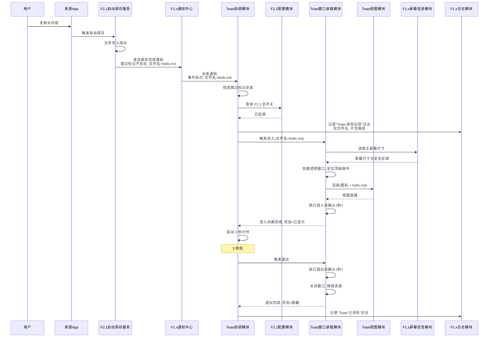
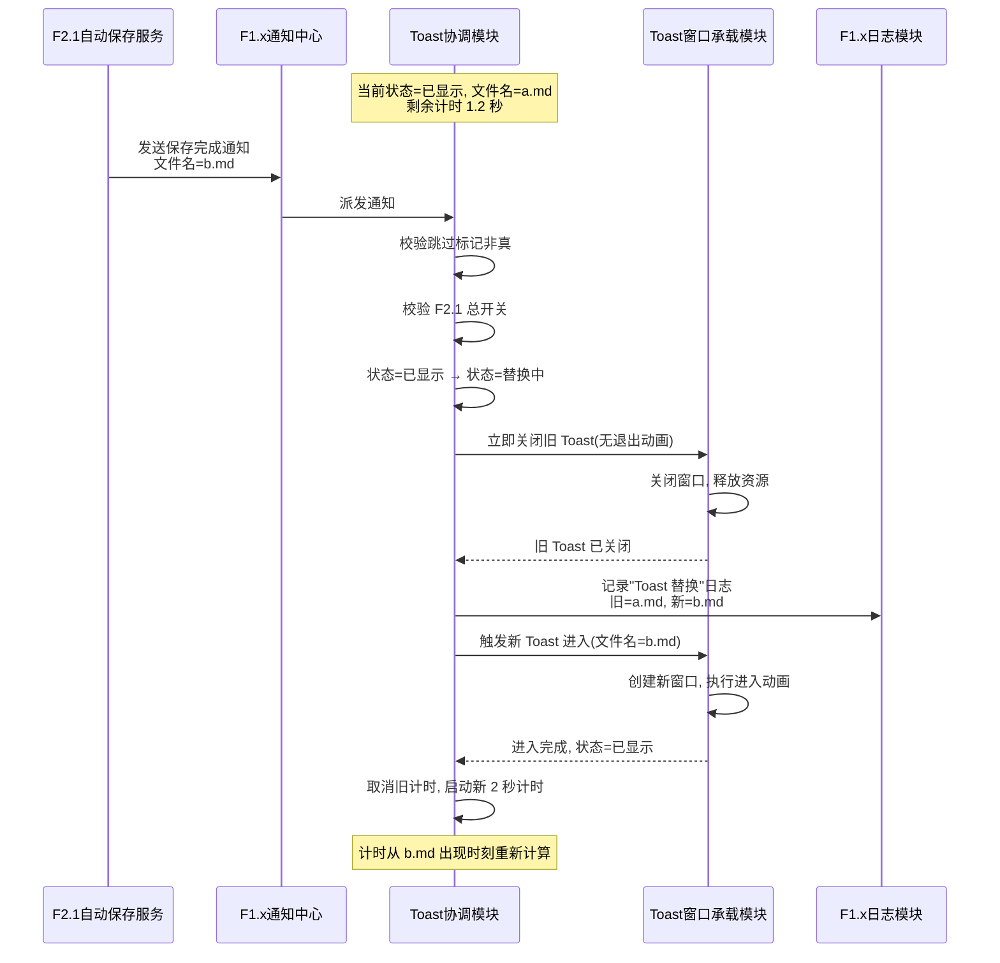
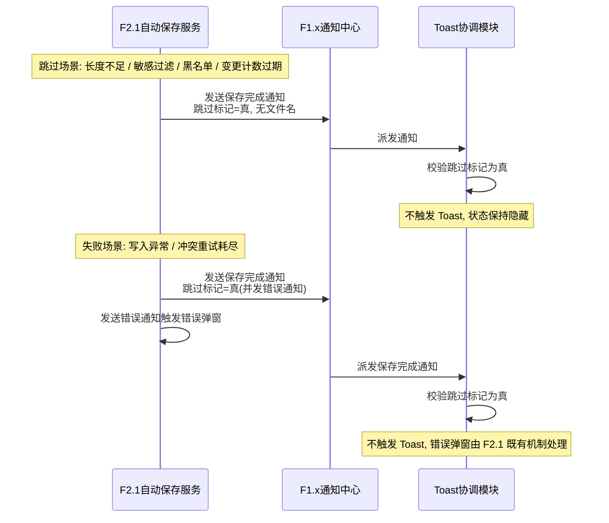
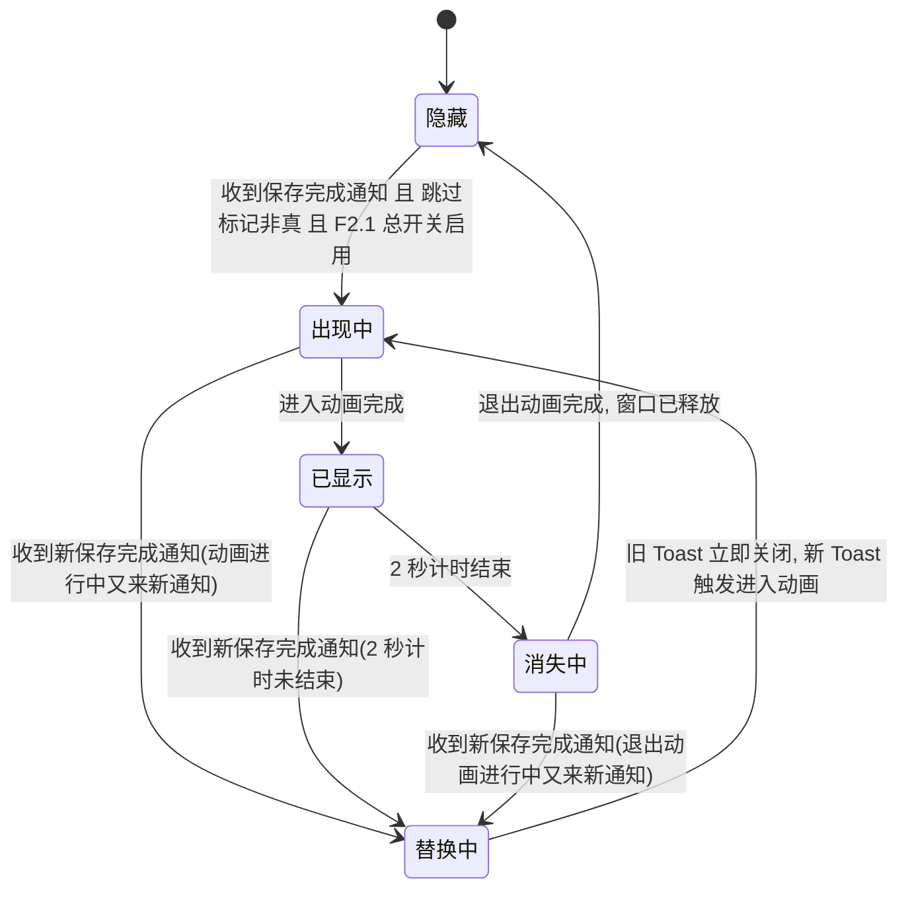

> 最后更新：2026-07-23 | 版本：v1.1

# F2.1.1 保存成功 Toast 提示 设计文档

**功能编号**：F2.1.1
**优先级**：P1（复赛扩展）
**文档存放路径**：`docs/planning/P1/F2.1/F2.1.1_保存成功Toast_设计文档.md`
**前置文档**：`F2.1.1_保存成功Toast_需求文档.md`（v1.0）、`F2.1_自动保存到文件_设计文档.md`（v1.1）
**适用阶段**：复赛扩展阶段（F2.1 自动保存到文件之后）

---

## 目录

1. [文档定位](#1-文档定位)
2. [模块划分](#2-模块划分)
3. [职责边界](#3-职责边界)
4. [数据流](#4-数据流)
5. [状态变化](#5-状态变化)
6. [协作关系](#6-协作关系)
7. [关键设计决策](#7-关键设计决策)
8. [非功能约束落地](#8-非功能约束落地)
9. [与 Requirements 的映射](#9-与-requirements-的映射)
10. [风险和待确认问题](#10-风险和待确认问题)

---

## 1. 文档定位

本文档是 F2.1.1 保存成功 Toast 提示功能的**架构契约**，描述"系统内部由谁负责什么"（WHO/WHAT 结构），不描述"具体怎么实现"（HOW 代码）。

**单一需求来源**：本文档以 `F2.1.1_保存成功Toast_需求文档.md`（v1.0）为唯一需求来源，采用编号引用（FR-xxx / NFR-xxx / AC-xxx / C-xxx / O-xxx）而非复制原文。

**变更原则**：即使后续类名、接口签名、实现语言全部重构，本文档基本不需要改。如果发现本文档需要随代码变化而修改，说明本层混入了实现细节，应将其下沉到实现规划层。

**读者对象**：实现规划与代码层作者、审查人员、未来维护者。

**文档边界**：本文档只回答"有哪些模块、职责如何划分、数据如何流动、状态如何变化、为什么这样划分"。不讨论"用户为什么需要"（已由需求文档回答），不写"接口签名/类定义/目录结构"（留给实现规划），不写"AC/测试策略/UI 可观测性矩阵"（留给测试用例表与视觉原型）。

---

## 2. 模块划分

F2.1.1 在 F2.1 既有自动保存流程之上**新增一组 Toast 提示相关模块**，采用"屏幕级浮层 + 中心化通知监听 + 状态机驱动"的架构。模块用中文业务术语命名，不绑定具体类名。

### 2.1 架构总览

- **监听层**：Toast 协调模块通过应用内通知中心订阅 F2.1 自动保存服务发出的保存完成通知，仅作为旁路观察者，不修改 F2.1 既有流程；
- **决策层**：Toast 协调模块在收到通知后，校验"非跳过"与"F2.1 总开关启用"两个前置条件，决定是否触发 Toast 显示；
- **承载层**：Toast 窗口承载模块管理屏幕级透明窗口的生命周期（创建、定位、关闭、资源释放）；
- **呈现层**：Toast 视图模块以 SwiftUI 视图承载成功图标 + 文件名文字，由窗口承载模块托管渲染；
- **装配层**：F1.x 应用入口在启动时装配 Toast 协调模块并注册通知监听。

### 2.2 模块结构图

### 2.3 模块清单

| 模块名（中文业务术语） | 类型 | 对外契约概述 |
|----------------------|------|------------|
| Toast 协调模块 | 新增·协调者 | 订阅 F2.1 保存完成通知，校验前置条件（非跳过、F2.1 总开关启用），驱动 Toast 窗口承载模块的生命周期与状态机；管理 2 秒计时；处理替换模式（旧 Toast 立即关闭，新 Toast 触发进入） |
| Toast 窗口承载模块 | 新增·承载者 | 管理屏幕级透明窗口的创建、定位（顶部居中）、动画（进入/退出）、关闭与资源释放；托管 Toast 视图模块的渲染；保证窗口不抢焦点、不影响源 App 前台状态 |
| Toast 视图模块 | 新增·呈现者 | 以 SwiftUI 视图呈现成功图标 + 文件名文字；接收文件名参数；视觉细节（背景色、圆角、字体）由视觉原型决定，本模块只负责承载 |
| F2.1 自动保存服务 | 既有 | 保存流程结束时发送保存完成通知（含事件标识、文件名、是否跳过标记）；本特性仅监听，不修改 |
| F2.1 自动保存配置模块 | 既有 | 提供 F2.1 总开关状态查询能力（根据 FR-008 与 C-01） |
| F1.x 应用入口 | 既有 | 在 App 启动时装配 Toast 协调模块并注册通知监听；在 App 退出时反装配 |
| F1.x 通知中心 | 既有 | 提供应用内通知派发能力，承载 F2.1 保存完成通知到 Toast 协调模块的传递 |
| F1.x 日志模块 | 既有 | 提供结构化日志输出能力；Toast 关键状态变更（出现、替换、消失）通过日志分类记录（根据 NFR-005） |
| F1.x 主屏幕信息模块 | 既有 | 提供主屏幕尺寸与安全区域查询能力，供窗口承载模块定位 |

### 2.4 与 F2.1 的对接点（关键契约）

F2.1 自动保存服务在保存流程结束时发送保存完成通知。**对接契约基于 F2.1 既有实现，不修改 F2.1 公共接口**（根据 C-04）：

| 契约项 | 业务描述 |
|--------|---------|
| 通知来源 | F2.1 自动保存服务在保存流程结束时发送应用内通知（成功或跳过均发送） |
| 事件标识 | 载荷包含事件标识字段（始终存在，用于追踪与日志关联） |
| 文件名 | 载荷包含文件名字段（仅保存成功时存在，已由 F2.1 过滤特殊字符） |
| 跳过标记 | 载荷包含跳过标记字段（跳过场景为真，成功场景该字段不存在或非真） |
| 成功判定逻辑 | 跳过标记不存在或非真 → 视为保存成功，触发 Toast |
| 失败路径行为 | 失败路径也发送保存完成通知（跳过标记为真），并发送错误通知触发错误弹窗（错误通知不在本特性范围） |
| 跳过场景 | 长度不足、敏感过滤、黑名单 App、剪贴板变更计数过期等场景均发送跳过标记为真的保存完成通知 |

**说明**：失败与跳过场景均发送保存完成通知（跳过标记为真），仅成功场景跳过标记为假。因此 Toast 协调模块无需区分"失败"与"跳过"，只要跳过标记非真即触发 Toast，自然满足 FR-009（跳过不显示）与 FR-010（失败不显示）。

> 注：具体的通知名常量、字符串值、载荷键名属于实现细节，由实现规划层核对 F2.1 实现层后落地，本设计文档不绑定具体符号。

---

## 3. 职责边界

### 3.1 Toast 协调模块

- **负责**：订阅 F2.1 保存完成通知（根据 FR-001）；收到通知后校验跳过标记非真（根据 FR-009、FR-010）；校验 F2.1 总开关启用（根据 FR-008、C-01）；从载荷读取文件名并转交窗口承载模块（根据 FR-002）；驱动 Toast 状态机（隐藏 → 出现中 → 已显示 → 替换中 → 消失中 → 隐藏）；管理 2 秒计时（根据 FR-004）；处理替换模式——新 Toast 触发时立即关闭旧 Toast，2 秒计时从新 Toast 出现时刻重新计算（根据 FR-007）；通过 F1.x 日志模块输出关键状态变更日志（根据 NFR-005）
- **不负责**：管理窗口创建与动画（由窗口承载模块负责）；渲染视图内容（由视图模块负责）；决定视觉细节（背景色、圆角等，由视觉原型决定）；修改 F2.1 自动保存服务（受 C-04 约束）；处理失败场景的错误弹窗（失败仍发送保存完成通知，协调模块跳过校验自然过滤，错误弹窗由 F2.1 既有机制承载，根据 FR-010 与 O-03）

### 3.2 Toast 窗口承载模块

- **负责**：创建屏幕级透明窗口（根据 FR-011）；将窗口定位到主屏幕顶部居中（根据 FR-003）；托管 Toast 视图模块的渲染；执行进入动画（顶部滑入 + 淡入，约 0.2 秒，根据 FR-005）；执行退出动画（反向滑出 + 淡出，约 0.2 秒，根据 FR-006）；窗口关闭后立即释放资源（根据 NFR-003）；保证窗口不抢焦点、不激活 ClipMind 主窗口（根据 FR-011）；从 F1.x 主屏幕信息模块读取屏幕尺寸用于定位
- **不负责**：决定是否触发 Toast（由协调模块负责）；管理 2 秒计时（由协调模块负责）；决定 Toast 视觉细节（由视觉原型决定）；调用 F2.1 配置模块（由协调模块负责）；记录业务级日志（由协调模块负责，本模块只记录窗口生命周期技术日志）

### 3.3 Toast 视图模块

- **负责**：呈现成功图标与文件名文字（根据 FR-002）；接收文件名参数并渲染；保持视图层级正确（图标在左、文字在右）；遵循视觉原型的视觉细节（背景色、圆角半径、字体大小、图标样式）
- **不负责**：决定何时显示或消失（由协调模块驱动）；管理窗口或动画（由窗口承载模块负责）；处理用户交互（本特性不做点击交互，根据 O-03，FC-03 留待未来）；读取 F2.1 配置（由协调模块负责）

### 3.4 与 F2.1 既有模块的边界

- **F2.1 自动保存服务**：本特性仅通过应用内通知中心监听其保存完成通知，不修改其公共接口、不修改通知名与载荷结构（根据 C-04）；失败路径也发送保存完成通知（跳过标记为真），协调模块跳过校验自然过滤，不触发 Toast（根据 FR-010）
- **F2.1 自动保存配置模块**：本特性只读取 F2.1 总开关状态，不修改配置；不新增配置项（根据 C-05）；不修改配置面板 UI（根据 O-08）

### 3.5 与 F1.x 既有模块的边界

- **F1.x 应用入口**：本特性在应用启动时由应用入口装配 Toast 协调模块，不修改应用入口的公共行为契约；装配关系是单向的（应用入口持有协调模块，协调模块不持有应用入口）
- **F1.x 通知中心**：本特性复用应用内通知中心，不修改通知中心；不污染系统通知中心（根据 C-03）
- **F1.x 日志模块**：本特性复用其日志分类体系与结构化日志能力，不修改既有日志分类；日志字段必须遵守 NFR-005 与 C-02（不输出文件完整路径或剪贴板原文）
- **F1.x 主屏幕信息模块**：本特性只读取屏幕尺寸与安全区域，不修改屏幕状态

---

## 4. 数据流

### 4.1 主路径数据流（保存成功 → Toast 出现 → 2 秒后消失）

**关键不变量**：窗口承载模块先创建窗口并完成视图渲染，再启动进入动画。窗口容器在进入动画期间已存在，AC-08 可在进入动画启动后立即断言 Toast 容器存在。

### 4.2 替换模式数据流（Toast 显示中再次触发保存成功）

### 4.3 跳过与失败场景数据流（不显示 Toast）

### 4.4 关键数据流约束

| 约束 | 来源 | 落地位置 |
|------|------|---------|
| 仅监听不修改 F2.1 | C-04、FR-001 | Toast 协调模块通过应用内通知中心订阅保存完成通知，不调用 F2.1 自动保存服务的任何方法 |
| 跳过场景不显示 | FR-009 | 协调模块校验跳过标记非真，跳过时直接返回不触发 Toast |
| 失败场景不显示 | FR-010 | 失败路径也发送保存完成通知（跳过标记为真），协调模块跳过校验自然过滤；错误弹窗由 F2.1 既有机制承载 |
| 跟随 F2.1 总开关 | FR-008、C-01 | 协调模块在触发 Toast 前查询 F2.1 总开关状态，关闭时不显示（仅覆盖保存完成到 Toast 显示间用户关闭开关的极窄场景） |
| 替换模式立即切换 | FR-007、AC-04 | 协调模块在"已显示"状态收到新通知时，立即关闭旧 Toast（无退出动画），新 Toast 触发进入动画，2 秒计时从新 Toast 出现时刻重新计算 |
| 屏幕级浮层不依赖焦点 | FR-011、AC-11 | 窗口承载模块使用透明窗口，不激活 ClipMind 主窗口，不抢焦点 |
| 不污染系统通知中心 | C-03、O-05 | 全程使用应用内通知中心与 SwiftUI/AppKit 浮层，不调用系统通知 API |
| 日志不含完整路径 | C-02、NFR-005 | 日志仅记录文件名（来自通知载荷），不记录文件所在目录的完整路径 |

---

## 5. 状态变化

### 5.1 Toast 协调模块状态机

Toast 协调模块在一次 Toast 生命周期中经历以下状态（**状态名使用中文业务术语**，不使用英文枚举值）：

### 5.2 状态说明与责任归属

| 状态 | 含义 | 责任归属 | 出口条件 |
|------|------|---------|---------|
| 隐藏 | 无 Toast 显示，无窗口资源占用，无计时器 | Toast 协调模块 | 收到符合前置条件的保存完成通知 → 出现中 |
| 出现中 | 窗口承载模块正在执行进入动画（约 0.2 秒），视图已渲染 | Toast 协调模块 + 窗口承载模块 | 进入动画完成 → 已显示；收到新通知 → 替换中 |
| 已显示 | 进入动画已完成，2 秒计时进行中，Toast 可见 | Toast 协调模块（计时）+ 窗口承载模块（保持窗口） | 2 秒计时结束 → 消失中；收到新通知 → 替换中 |
| 替换中 | 收到新通知，旧 Toast 立即关闭（无退出动画），新 Toast 即将触发进入动画 | Toast 协调模块 | 旧 Toast 关闭完成 → 出现中（新 Toast） |
| 消失中 | 窗口承载模块正在执行退出动画（约 0.2 秒） | Toast 协调模块 + 窗口承载模块 | 退出动画完成 → 隐藏；收到新通知 → 替换中 |

### 5.3 替换模式处理逻辑

**核心规则**（根据 FR-007 与 AC-04）：

- 旧 Toast **立即关闭**，不执行退出动画（避免新旧动画并发导致视觉抖动）；
- 新 Toast **触发进入动画**，从顶部滑入 + 淡入；
- 2 秒计时**从新 Toast 出现时刻重新计算**，取消旧计时器，启动新计时器；
- 旧窗口资源立即释放，新窗口由窗口承载模块重新创建。

**状态转换示例**：

| 当前状态 | 收到新通知 | 转换后状态 | 计时处理 |
|---------|----------|-----------|---------|
| 隐藏 | 是 | 出现中（新 Toast） | 启动新 2 秒计时 |
| 出现中 | 是 | 替换中 → 出现中（新 Toast） | 取消旧计时（如有），启动新 2 秒计时 |
| 已显示 | 是 | 替换中 → 出现中（新 Toast） | 取消旧 2 秒计时，启动新 2 秒计时 |
| 消失中 | 是 | 替换中 → 出现中（新 Toast） | 取消退出动画，启动新 2 秒计时 |
| 替换中 | 是 | 保持替换中（合并为新 Toast，最新通知胜出） | 取消旧计时，启动新 2 秒计时 |

### 5.4 Toast 窗口承载模块状态

窗口承载模块的生命周期状态独立于协调模块的状态机，由协调模块驱动：

| 窗口状态 | 含义 | 触发方 |
|---------|------|--------|
| 未创建 | 无窗口资源，无视图托管 | 初始状态 / 退出动画完成后 |
| 创建中 | 正在创建透明窗口、定位、托管视图 | 协调模块触发进入 |
| 已就绪 | 窗口已显示，进入动画进行中或已完成 | 窗口承载模块完成创建 |
| 关闭中 | 退出动画进行中，即将释放 | 协调模块触发退出（2 秒计时结束） |
| 立即关闭 | 替换模式下，无退出动画，直接释放 | 协调模块触发替换 |

**双状态机同步关系**：协调模块"替换中"状态对应窗口承载模块"立即关闭"→"未创建"→"创建中"→"已就绪"的连续转换；协调模块"消失中"状态对应窗口承载模块"关闭中"→"未创建"的转换。实现规划层需保证两个状态机的同步关系不出现状态错配（详见第 10.6 节风险 R-06）。

---

## 6. 协作关系

### 6.1 协作矩阵

下表展示模块间的协作关系（行依赖列）：

| 协作方 → 被协作方 | F2.1 自动保存服务 | F2.1 自动保存配置模块 | F1.x 应用入口 | F1.x 通知中心 | F1.x 日志模块 | F1.x 主屏幕信息模块 | Toast 协调模块 | Toast 窗口承载模块 | Toast 视图模块 |
|---------------------|---|---|---|---|---|---|---|---|---|
| Toast 协调模块 | 监听保存完成通知 | 读取总开关状态 | — | 订阅通知 | 写入业务日志 | — | — | 驱动生命周期 | — |
| Toast 窗口承载模块 | — | — | — | — | 写入技术日志 | 读取屏幕尺寸 | 受协调模块驱动 | — | 托管渲染 |
| Toast 视图模块 | — | — | — | — | — | — | 接收文件名参数 | 受承载模块托管 | — |
| F1.x 应用入口 | — | — | — | — | — | — | 装配/反装配 | — | — |

### 6.2 关键协作场景说明

**场景 1：保存成功 → Toast 显示**
- F2.1 自动保存服务 → F1.x 通知中心 → Toast 协调模块（校验跳过标记与总开关）→ Toast 窗口承载模块（创建窗口、定位、动画）→ Toast 视图模块（渲染图标 + 文件名）
- 协调模块在主线程边界内驱动所有状态转换与窗口操作（根据 NFR-004）

**场景 2：替换模式**
- F2.1 自动保存服务 → F1.x 通知中心 → Toast 协调模块（已显示状态收到新通知 → 替换中状态）→ Toast 窗口承载模块（立即关闭旧窗口 → 创建新窗口 → 进入动画）→ Toast 视图模块（渲染新文件名）
- 协调模块保证"旧关闭"完成后再触发"新进入"，避免新旧窗口并发（详见 R-02 风险缓解）

**场景 3：跳过或失败场景**
- F2.1 自动保存服务 → F1.x 通知中心 → Toast 协调模块（校验跳过标记为真 → 不触发 Toast，状态保持隐藏）
- 失败场景下 F2.1 自动保存服务并发发送错误通知，错误弹窗由 F2.1 既有机制处理，与本特性无协作关系

**场景 4：App 启动与退出**
- App 启动：F1.x 应用入口装配 Toast 协调模块，注册保存完成通知订阅
- App 退出：F1.x 应用入口触发协调模块反装配，协调模块关闭所有进行中的 Toast 并释放资源

### 6.3 接口契约一致性

- **保存完成通知契约**：F2.1 自动保存服务发送的保存完成通知载荷包含事件标识、文件名（仅成功时）、跳过标记（跳过时为真）；Toast 协调模块按此契约解析载荷
- **F2.1 总开关查询契约**：Toast 协调模块通过依赖注入的查询闭包读取 F2.1 总开关状态，不直接耦合 F2.1 配置模块的具体类型（详见 D4 决策）
- **文件名来源契约**：Toast 协调模块从通知载荷读取的文件名是已由 F2.1 文件名生成器过滤特殊字符后的最终文件名，无需再次过滤
- **日志分类契约**：Toast 模块复用 F1.x 日志模块的分类体系，新增子分类用于 Toast 状态变更日志（具体分类名由实现规划层决定）

---

## 7. 关键设计决策

本节记录 F2.1.1 设计评审中确认的 7 条关键决策。决策编号 D1~D7 与需求文档 FR/NFR/AC 的引用一一对应。

### 7.1 D1：Toast 承载方式——独立透明窗口屏幕级浮层

- **决策**：Toast 采用独立透明窗口作为屏幕级浮层承载，**不使用主窗口 overlay**，不使用菜单栏弹窗
- **原因**：FR-011 明确要求"Toast 不依赖 ClipMind 主窗口或菜单栏弹窗的焦点状态"，用户在源 App（浏览器、IDE）前台复制时 Toast 必须显示在屏幕顶部；若使用主窗口 overlay，则 Toast 必须绑定主窗口可见性与焦点状态——当主窗口隐藏或非活动时 overlay 不可见，违反 FR-011 与 AC-11；复审非阻塞建议已指出"主窗口 overlay 与 FR-011 存在张力"，本决策明确放弃该方案
- **代价**：需要管理独立窗口的生命周期（创建、定位、动画、关闭、释放），实现复杂度高于 overlay
- **为何可接受**：独立窗口可配置为不抢焦点、不激活 ClipMind 主窗口；macOS 原生提供公开窗口管理 API 支持，无需额外 entitlement（根据 NFR-006 与 C-06）
- **引用**：FR-011、FR-003、AC-11、NFR-006、C-06

### 7.2 D2：Toast 协调模块状态机——5 状态显式模型

- **决策**：Toast 协调模块采用 5 状态显式状态机：**隐藏 → 出现中 → 已显示 → 替换中 → 消失中 → 隐藏**，所有状态转换显式定义，禁用隐式状态切换
- **原因**：FR-007 替换模式要求"新 Toast 立即替换旧 Toast，2 秒计时从新 Toast 出现时刻重新计算"，若无显式状态机，替换逻辑会分散在多个回调中难以维护与测试；显式状态机让"出现中收到新通知"、"已显示收到新通知"、"消失中收到新通知"三种替换场景有统一处理入口
- **代价**：状态机引入额外抽象，代码量增加
- **为何可接受**：5 状态机简洁清晰，每个状态出口条件明确，可独立测试；状态机让替换模式与计时器管理的边界清晰，避免计时器堆积（根据 NFR-004 与 R-03 风险缓解）
- **引用**：FR-004、FR-007、AC-04、NFR-004

### 7.3 D3：监听方式——中心化通知订阅

- **决策**：Toast 协调模块通过应用内通知中心订阅 F2.1 保存完成通知，**不使用闭包回调**
- **原因**：F2.1 自动保存服务已通过应用内通知中心发送保存完成通知（见第 2.4 节对接契约），本特性只需订阅即可，无需修改 F2.1 公共接口（根据 C-04）；闭包回调要求 F2.1 暴露保存成功闭包属性，属于修改 F2.1 公共接口，违反 C-04；应用内通知中心是 macOS 标准发布订阅机制，解耦发布者与订阅者，F2.1 无需感知 Toast 模块存在
- **代价**：通知载荷是弱类型字典，类型安全性弱于闭包参数
- **为何可接受**：协调模块在收到通知后立即解析载荷并校验类型，失败时记录日志并跳过；载荷契约由 F2.1 设计文档与代码双重保证，相对稳定
- **引用**：FR-001、C-04、第 2.4 节对接契约

### 7.4 D4：F2.1 总开关查询方式——依赖注入闭包查询

- **决策**：Toast 协调模块通过**依赖注入的查询闭包**读取 F2.1 总开关状态，由装配方在应用入口注入具体查询实现（读取 F2.1 配置模块的快照）；**不直接耦合 F2.1 配置模块的具体类型**，也不暴露新的 F2.1 公共接口
- **原因**：F2.1 配置模块的具体类型是终态类（无协议抽象），受 C-04 约束不能修改 F2.1 公共接口；若协调模块直接依赖具体类型，单元测试无法注入 Mock 实现，必须拉起真实配置模块与持久化层，测试重且耦合 F2.1；通过依赖注入闭包（输入无、输出布尔的查询闭包），协调模块只依赖"查询总开关状态"这一业务能力，测试可注入 Mock 闭包模拟启用/禁用状态
- **代价**：装配方需要构造查询闭包并注入，增加装配复杂度
- **为何可接受**：装配复杂度可控（一行闭包注入）；测试可独立验证协调模块在总开关启用/禁用下的行为，无需拉起 F2.1 持久化层
- **查询场景说明**：本查询仅服务"保存完成通知派发到 Toast 显示间用户关闭总开关"的极窄时间窗；F2.1 自动保存服务入口已有总开关校验（关闭时直接发送跳过标记为真的保存完成通知），AC-06（关闭总开关后复制）的主验证已由跳过标记过滤覆盖，本查询是补充防御
- **引用**：FR-008、C-01、C-04、AC-06

### 7.5 D5：动画实现——原生窗口透明度与位置动画能力

- **决策**：Toast 进入与退出动画使用**原生窗口透明度与位置动画能力**，由窗口承载模块保证 60fps 流畅（根据 NFR-002）
- **原因**：NFR-002 要求 60fps 流畅动画；原生窗口动画由 AppKit 直接驱动，性能优于嵌套视图动画；动画类型固定（仅进入/退出两种），代码量可控
- **代价**：动画代码与窗口管理代码耦合
- **为何可接受**：Toast 动画类型固定（进入/退出两种），由窗口承载模块统一管理；具体动画 API 选型（原生动画闭包、视图动画代理等）属于实现规划层决策，本设计只锁定"原生窗口透明度与位置动画"这一架构方向
- **引用**：FR-005、FR-006、NFR-002

### 7.6 D6：线程模型——通知回调主线程派发 + 主线程边界

- **决策**：
  - F2.1 保存完成通知的发送线程不固定（F2.1 在串行队列上下文中发送），Toast 协调模块在通知回调中**立即派发到主线程**处理；
  - Toast 协调模块、Toast 窗口承载模块、Toast 视图模块的所有 UI 状态更新与窗口操作**必须在主线程或主线程边界内完成**；
  - 2 秒计时器使用主线程运行循环模式，保证回调在主线程
- **原因**：NFR-004 明确要求"Toast 状态更新和视图渲染必须在主线程边界内完成"；AppKit 窗口操作必须在主线程；SwiftUI 视图更新必须在主线程；F2.1 发送通知的线程是串行队列，若 Toast 直接在该线程操作窗口会触发 AppKit 线程违反
- **代价**：通知回调需要一次线程切换，引入微小延迟（通常 < 1ms）
- **为何可接受**：相对 NFR-001 ≤0.3 秒的响应预算，1ms 延迟可忽略；线程切换保证 UI 安全，避免竞态
- **引用**：NFR-001、NFR-004、NFR-002

### 7.7 D7：可测试性决策——可注入时钟与计时器源

- **决策**：Toast 协调模块的 2 秒计时器与 0.2 秒动画时长通过**依赖注入的时钟源与计时器源**实现，**禁用固定睡眠等待**（参照 F2.1 D17 可测试性决策）；具体注入形态：
  - 计时器源：注入"启动计时（时长、回调）→ 取消句柄"的协议抽象，生产实现使用主线程计时器，测试实现使用可手动推进的虚拟计时器
  - 动画时长：作为可注入常量参数（默认 0.2 秒，测试时可缩短为 0 秒验证状态转换不依赖动画时长）
  - 状态可观测：协调模块对外暴露当前状态只读属性（或状态变更回调），测试可断言中途态（替换中、消失中）的转换
- **原因**：若使用真实 2 秒/0.2 秒等待，单元测试慢且中途态 flaky；F2.1 已通过 D17 确立"禁用固定睡眠、改轮询条件+超时"的可测试性原则，本特性继承该原则
- **代价**：计时器抽象引入额外接口与 Mock 实现
- **为何可接受**：抽象仅一层（生产实现与测试实现各一份），复杂度可控；测试可确定性验证状态机所有转换路径（包括替换中、消失中等中途态）
- **引用**：FR-004、FR-005、FR-006、FR-007、NFR-004、AC-02、AC-04、AC-08

---

## 8. 非功能约束落地

### 8.1 NFR → 模块映射表

| NFR 编号 | 要求 | 责任模块 | 落地方式 |
|---------|------|---------|---------|
| NFR-001 | 通知接收到 Toast 出现延迟 ≤ 0.3 秒 | Toast 协调模块 + 窗口承载模块 | 协调模块收到通知后立即派发主线程（≤1ms），窗口承载模块同步创建窗口与启动动画 |
| NFR-002 | 进入/退出动画 60fps 流畅 | Toast 窗口承载模块 | 使用原生窗口动画能力，视图层级保持最浅，SwiftUI 视图轻量化 |
| NFR-003 | Toast 显示期间不占用可感知 CPU/内存，消失后立即释放 | Toast 窗口承载模块 + 视图模块 | 显示期间无定时器轮询（仅 2 秒单次计时）；消失后窗口对象立即释放 |
| NFR-004 | Toast 状态更新与视图渲染必须在主线程边界内 | Toast 协调模块 + 窗口承载模块 + 视图模块 | 通知回调立即派发主线程；所有 UI 操作在主线程边界内；2 秒计时器使用主线程运行循环 |
| NFR-005 | 关键状态变更日志带功能标签前缀，不含文件完整路径或剪贴板原文 | Toast 协调模块 + 窗口承载模块 | 日志字段限于事件标识、错误阶段、错误码、状态转换上下文、文件名（不含路径） |
| NFR-006 | App Sandbox 合规，不触发额外权限请求 | Toast 窗口承载模块 | 仅使用公开窗口管理 API，不调用需额外 entitlement 的 API，不调用私有 API |

### 8.2 Constraints → 模块映射表

| 约束编号 | 约束 | 责任模块 | 落地方式 |
|---------|------|---------|---------|
| C-01 | 跟随 F2.1 总开关，不增加独立配置开关 | Toast 协调模块 | 触发 Toast 前查询 F2.1 总开关状态（通过 D4 注入闭包） |
| C-02 | 不显示文件完整路径 | Toast 协调模块 + 视图模块 + 日志模块 | 视图仅显示文件名；日志仅记录文件名 |
| C-03 | 不污染系统通知中心 | Toast 窗口承载模块 | 仅使用应用内通知中心与 AppKit 浮层，不调用系统通知 API |
| C-04 | 不修改 F2.1 公共接口 | Toast 协调模块 | 仅监听既有保存完成通知，不修改通知名与载荷结构；通过依赖注入读取总开关，不修改 F2.1 配置模块 |
| C-05 | 不新增持久化字段 | Toast 协调模块 | Toast 状态仅在内存中维护，App 重启后无历史 Toast |
| C-06 | 合规优先，穷尽合规方案后再暂存开发验证 Scheme | 全部模块 | 所有实现方案在主 Scheme 合规范围内，无需暂存 ClipMind-Dev |

### 8.3 兼容性约束落地

| 兼容项 | 兼容性保证 | 责任模块 |
|--------|----------|---------|
| F2.1 自动保存流程 | 不修改 F2.1 自动保存服务的公共接口、保存完成通知的名称和载荷结构（根据 C-04） | Toast 协调模块 |
| F2.1 剪贴板替换 | 不参与剪贴板替换流程，仅旁路监听 | Toast 协调模块 |
| F2.1 文件路径入库 | 不影响 F2.1 文件路径回调 | Toast 协调模块 |
| F2.1 错误弹窗 | 不重复处理失败场景（根据 O-03），失败仍由 F2.1 错误弹窗承载 | Toast 协调模块 |
| F1.x 剪贴板监听 | 不修改 F1.x 捕获流程 | Toast 协调模块 |
| F1.x 分类与加密 | 不参与 F1.x 入库流程 | Toast 协调模块 |
| F1.x 隐私保护 | 不读取剪贴板原文，仅读取 F2.1 载荷中的文件名 | Toast 协调模块 + 视图模块 |
| F1.x 菜单栏 UI | 不修改菜单栏弹窗 | Toast 窗口承载模块 |
| F1.x 设置面板 | 不修改配置面板 UI（根据 O-08） | 全部模块 |
| F1.x 日志分类 | 复用既有日志分类体系，不新增分类（除非必要） | Toast 协调模块 + 窗口承载模块 |
| macOS 版本兼容 | 最低支持 macOS 12.4（与 F1.x、F2.1 一致）；不使用 macOS 13+ 独占的导航栈、可观察宏、数据持久化框架等能力；具体 API 最低版本由实现规划层保证 | 全部模块 |
| 老版本升级 | 无需数据迁移，不新增持久化字段（根据 C-05）；配置兼容，不新增配置项；二进制兼容，仅新增模块不修改既有模块接口 | 全部模块 |

### 8.4 错误处理约束落地

| 错误场景 | 触发条件 | 处理策略 | 责任归属 |
|---------|---------|---------|---------|
| 通知载荷缺失文件名 | F2.1 发送保存完成通知但跳过标记非真且无文件名（理论上不应发生） | 记录错误日志（含事件标识），不触发 Toast | Toast 协调模块 |
| 通知载荷事件标识缺失 | F2.1 发送通知但无事件标识（违反 F2.1 既有契约） | 记录错误日志，仍尝试触发 Toast（降级处理） | Toast 协调模块 |
| F2.1 总开关查询失败 | 配置模块不可用或注入闭包抛出异常 | 默认不显示 Toast（保守策略，避免误显示） | Toast 协调模块 |
| 屏幕信息不可用 | 主屏幕与任意屏幕查询均返回空（如 CI 无头环境） | 降级使用 fallback 虚拟布局区域（1920x1080）继续创建 Toast，记录警告日志；仅依赖真实屏幕几何的位置断言跳过验证 | Toast 窗口承载模块 |
| 窗口创建失败 | 系统资源不足或 App Sandbox 限制 | 记录错误日志，不触发 Toast，不影响 F2.1 既有流程 | Toast 窗口承载模块 |
| 动画异常 | 进入或退出动画异常或超时 | 直接跳到目标状态（已显示 / 隐藏），启动 2 秒计时或释放资源（合并进入/退出动画异常为统一分支） | Toast 窗口承载模块 + 协调模块 |
| 计时器异常 | 计时器未触发或重复触发 | 协调模块保证同时只有一个有效计时器；超时未触发时由备用超时检查清理 | Toast 协调模块 |

**错误处理原则**：
- **不影响 F2.1 既有流程**：Toast 任何错误都不得回传给 F2.1 自动保存服务，F2.1 完成保存后即与 Toast 解耦（根据 C-04）
- **不影响 F1.x 既有功能**：Toast 错误不传播到 F1.x 捕获、分类、加密、UI 等模块
- **降级而非崩溃**：所有错误场景下 App 不崩溃、不卡死，仅记录日志并跳过本次 Toast（根据 NFR-004 精神）
- **日志含上下文**：错误日志必须包含事件标识、错误码、错误阶段（如"窗口创建"、"动画执行"），便于排查（根据 NFR-005）
- **资源最终释放**：即使动画或计时器异常，窗口承载模块必须保证窗口资源最终被释放（根据 NFR-003）

### 8.5 安全与合规约束落地

| 合规项 | 要求 | 责任模块 | 验证方式 |
|--------|------|---------|---------|
| App Sandbox 合规 | 仅使用公开窗口管理 API，不调用需额外 entitlement 的 API（根据 NFR-006 与 C-06） | Toast 窗口承载模块 | 主 Scheme 构建成功 + 运行录屏验证无 TCC 弹窗 + XCUITest 通过（根据 AC-10） |
| 不触发 TCC 权限弹窗 | 不访问摄像头、麦克风、通讯录、位置等敏感权限；不读取用户目录外的文件；不写入文件系统 | 全部模块 | 运行录屏验证 |
| 主 Scheme 上架合规 | 本特性可在主 Scheme ClipMind 中实现，无需暂存到 ClipMind-Dev（根据 AGENTS.md 第 10 节） | 全部模块 | 主 Scheme 构建验证 |
| 不读取剪贴板原文 | Toast 协调模块仅从 F2.1 保存完成通知载荷中读取文件名（已由 F2.1 文件名生成器过滤特殊字符） | Toast 协调模块 | 代码审查 + 日志审查 |
| 不显示文件完整路径 | Toast 仅显示文件名（含扩展名），不显示文件所在目录的完整路径（根据 C-02 与 O-02） | Toast 视图模块 | XCUITest 断言 |
| 日志脱敏 | 日志字段限于事件标识、错误阶段、错误码、状态转换上下文、文件名（不含路径）；禁止输出文件完整路径、剪贴板原文、文件路径中的用户名（根据 NFR-005 与 C-02） | Toast 协调模块 + 窗口承载模块 | 代码审查 + 日志审查 |
| 不持久化 Toast 状态 | Toast 状态仅在内存中维护，App 重启后无历史 Toast（根据 C-05 与 O-07） | Toast 协调模块 | 代码审查 |
| 不污染系统通知中心 | 不调用系统通知 API，仅在 App 内通过应用内通知中心与 AppKit 浮层实现（根据 C-03 与 O-05） | Toast 窗口承载模块 | 运行录屏验证 macOS 通知中心无新增通知 |
| 不影响 F2.1 既有合规性 | 不修改 F2.1 文件权限；不修改 F2.1 敏感过滤；不引入新的外部依赖 | 全部模块 | F2.1 既有测试全部通过 |

### 8.6 性能预算落地

| 性能指标 | 预算 | 责任模块 | 验证方式 |
|---------|------|---------|---------|
| 通知接收到 Toast 出现延迟 | ≤ 0.3 秒（含动画启动时间，根据 NFR-001） | Toast 协调模块 + 窗口承载模块 | 性能测试记录实际耗时，断言 P95 ≤ 0.3 秒 |
| 进入动画帧率 | 60fps（根据 NFR-002） | Toast 窗口承载模块 | Instruments Core Animation 工具验证 |
| 退出动画帧率 | 60fps（根据 NFR-002） | Toast 窗口承载模块 | Instruments Core Animation 工具验证 |
| Toast 显示期间 CPU 占用 | 不可感知（根据 NFR-003） | Toast 窗口承载模块 + 视图模块 | Instruments Time Profiler 验证 |
| Toast 显示期间内存占用 | 不可感知（根据 NFR-003） | Toast 窗口承载模块 + 视图模块 | Instruments Allocations 验证 |
| Toast 消失后资源释放 | 立即释放（根据 NFR-003） | Toast 窗口承载模块 | Instruments Allocations 验证窗口对象已释放 |

**性能优化策略**：
- **窗口复用 vs 重建**：默认每次 Toast 触发重建窗口（替换模式下旧窗口立即释放，新窗口重建）；若性能测试显示重建开销超预算，可考虑复用窗口（隐藏/显示模式），但需评估复用对状态机的影响
- **视图轻量化**：Toast 视图模块仅包含图标 + 文件名文字，不嵌入复杂布局；SwiftUI 视图层级保持最浅
- **动画时长固定**：进入/退出动画固定 0.2 秒（根据 FR-005、FR-006），不随内容长度变化
- **计时器单实例**：协调模块保证同时只有一个有效计时器，避免计时器堆积

---

## 9. 与 Requirements 的映射

### 9.1 FR → 负责模块映射表

| FR 编号 | 需求摘要 | 主要负责模块 | 协作模块 | 设计文档章节 |
|---------|---------|------------|---------|------------|
| FR-001 | 自动保存成功后显示 Toast | Toast 协调模块 | F2.1 自动保存服务、F1.x 通知中心 | §3.1、§4.1、§7.3 D3 |
| FR-002 | 显示成功图标 + 文件名 | Toast 视图模块 | Toast 协调模块（传文件名） | §3.3、§4.1 |
| FR-003 | 顶部居中显示 | Toast 窗口承载模块 | F1.x 主屏幕信息模块 | §3.2、§4.1 |
| FR-004 | 2 秒后自动消失 | Toast 协调模块 | Toast 窗口承载模块（退出动画） | §3.1、§5.1、§7.2 D2 |
| FR-005 | 进入动画（滑入 + 淡入，0.2 秒） | Toast 窗口承载模块 | — | §3.2、§7.5 D5 |
| FR-006 | 退出动画（反向滑出 + 淡出，0.2 秒） | Toast 窗口承载模块 | — | §3.2、§7.5 D5 |
| FR-007 | 多次保存替换模式 | Toast 协调模块 | Toast 窗口承载模块 | §3.1、§5.3、§7.2 D2 |
| FR-008 | 跟随 F2.1 总开关 | Toast 协调模块 | F2.1 自动保存配置模块（通过注入闭包） | §3.1、§7.4 D4 |
| FR-009 | 跳过场景不显示 | Toast 协调模块 | — | §3.1、§4.3、§4.4 |
| FR-010 | 失败场景不显示 | Toast 协调模块 | F2.1 错误弹窗（既有） | §3.1、§4.3、§4.4、§2.4 |
| FR-011 | 不依赖窗口焦点 | Toast 窗口承载模块 | — | §3.2、§7.1 D1 |

### 9.2 AC → 验证路径映射表

| AC 编号 | 验证场景 | 设计文档支撑 | UI 证据类型 |
|---------|---------|------------|-----------|
| AC-01 | 自动保存成功后弹出 Toast | §4.1 主路径数据流 | XCUITest 断言 Toast 容器存在 + 文件名文本可见 |
| AC-02 | Toast 2 秒后自动消失 | §5.1 状态机（已显示 → 消失中 → 隐藏） | XCUITest 等待 2.5 秒后断言 Toast 容器不存在 |
| AC-03 | Toast 显示文件名 | §4.1（载荷文件名转交视图模块） | XCUITest 断言 Toast 内文本包含文件名 |
| AC-04 | 快速多次保存触发替换 | §4.2 替换模式数据流 + §5.3 替换模式处理逻辑 | XCUITest 触发两次保存后立即断言 Toast 显示新文件名，再等待 2.5 秒断言已消失 |
| AC-05 | 跳过场景不弹 Toast | §4.3 跳过场景数据流 + §4.4（跳过标记为真不触发） | XCUITest 触发短内容复制后断言 Toast 不存在 |
| AC-06 | F2.1 总开关关闭时不弹 Toast | §4.4（总开关查询）+ §7.4 D4（查询场景说明） | XCUITest 关闭 F2.1 总开关后复制长内容，断言 Toast 不存在 |
| AC-07 | 失败场景不弹 Toast | §4.3 失败场景数据流 + §4.4（跳过标记为真自然过滤） | XCUITest 断言 Toast 不存在 + 错误弹窗存在 |
| AC-08 | 进入/退出动画存在 | §4.1 关键不变量（窗口先创建后启动动画）+ §7.5 D5 + §7.7 D7 | 手动录屏验证动画视觉效果 + XCUITest 在进入动画启动后立即断言 Toast 容器存在 |
| AC-09 | Toast 位置在屏幕顶部居中 | §3.2（窗口承载模块定位） | 手动验收截图 + XCUITest 断言 Toast 容器水平居中且垂直位置在屏幕顶部 0-50pt 范围内 |
| AC-10 | App Sandbox 合规 | §8.5 安全与合规约束落地 + §7.1 D1 | 主 Scheme 构建成功 + 运行录屏验证无 TCC 弹窗 + XCUITest 通过 |
| AC-11 | Toast 不依赖窗口焦点 | §7.1 D1（独立透明窗口） | 手动验收截图（源 App 前台 + Toast 可见）+ XCUITest 在源 App 处于前台时触发保存后断言 Toast 容器存在 |

### 9.3 Out of Scope 落地说明

| O 编号 | 不做项 | 设计文档对应说明 |
|--------|------|----------------|
| O-01 | 不增加独立 Toast 开关 | §3.1（跟随 F2.1 总开关）、§7.4 D4 |
| O-02 | 不显示文件完整路径 | §3.3、§8.5 |
| O-03 | 不处理失败场景（错误弹窗） | §3.1（失败由 F2.1 既有机制承载）、§4.3 |
| O-04 | 不处理跳过场景 | §3.1、§4.3 |
| O-05 | 不做通知中心集成 | §3.5、§8.5 |
| O-06 | 不做堆叠或队列模式 | §5.3（仅替换模式） |
| O-07 | 不持久化 Toast 状态 | §8.5 |
| O-08 | 不修改 F2.1 配置面板 UI | §3.4、§8.3 |

---

## 10. 风险和待确认问题

### 10.1 R-01：屏幕级窗口在 App Sandbox 下的权限风险

- **风险/问题**：屏幕级透明窗口在 App Sandbox 启用状态下可能触发额外权限请求，或调用需要额外 entitlement 的 API
- **影响范围**：Toast 窗口承载模块、主 Scheme 合规性
- **缓解方案**：仅使用公开窗口管理 API，不调用私有窗口级别 API；窗口不设置私有属性；CI 中通过主 Scheme 构建验证；NFR-006 与 AC-10 验证无 TCC 弹窗
- **待确认事项**：实现规划层需要确认"浮层窗口级别"在 App Sandbox 下是否需要额外 entitlement（预期不需要，但需 CI 验证）。**优先在实现计划阶段验证**：主 Scheme 构建一次最小化透明窗口 demo，直接关系 AC-10 合规验收；若验证失败，需回到 D1 重新评估承载方案

### 10.2 R-02：替换模式下新旧动画并发导致视觉抖动

- **风险/问题**：替换模式下，旧 Toast 的退出动画与新 Toast 的进入动画并发执行，可能导致两个窗口同时可见、位置重叠、视觉抖动
- **影响范围**：Toast 窗口承载模块、用户视觉体验
- **缓解方案**：根据 D2 状态机与第 5.3 节替换模式处理逻辑，旧 Toast **立即关闭无退出动画**，新 Toast 在旧窗口释放后再创建；协调模块保证"旧关闭"完成后再触发"新进入"，避免并发
- **待确认事项**：实现规划层需要确认"旧窗口释放"与"新窗口创建"的同步机制（如主线程串行化）

### 10.3 R-03：多次快速保存导致计时器堆积

- **风险/问题**：用户在 2 秒内连续触发多次保存成功，每次触发都启动新计时器，若旧计时器未取消会导致计时器堆积，最终 Toast 显示时长不可预测
- **影响范围**：Toast 协调模块、计时器管理
- **缓解方案**：根据 D2 状态机，协调模块在每次触发新 Toast 时**取消旧计时器**，保证同时只有一个有效计时器；2 秒计时从最新一次 Toast 出现时刻重新计算（根据 FR-007）；实现层使用计时器单实例复用模式
- **待确认事项**：无（已在 D2 与第 5.3 节落地）

### 10.4 R-04：F2.1 通知契约变更导致 Toast 失效

- **风险/问题**：F2.1 未来重构可能修改保存完成通知的通知名或载荷结构，导致 Toast 协调模块订阅失效或解析失败
- **影响范围**：Toast 协调模块、与 F2.1 的对接契约
- **缓解方案**：本设计文档第 2.4 节明确记录对接契约（业务术语描述），作为跨特性契约；F2.1 修改通知契约时需同步更新本设计文档；协调模块对载荷缺失做降级处理（根据第 8.4 节错误场景）
- **待确认事项**：F2.1 后续重构是否计划修改保存完成通知？建议在 F2.1 设计文档中标注"本通知被 F2.1.1 订阅"

### 10.5 R-05：源 App 全屏状态下 Toast 不可见

- **风险/问题**：用户在源 App 处于全屏模式（如 Safari 全屏）时复制长内容，Toast 窗口可能被全屏 App 遮挡，不可见
- **影响范围**：Toast 窗口承载模块、用户视觉反馈
- **缓解方案**：窗口承载模块将窗口级别设置为"浮层"或更高（如"状态栏级别"），保证覆盖普通 App 窗口；全屏 App 的遮挡行为属于 macOS 系统级窗口管理，本特性不强行突破（避免调用私有 API）；日志记录 Toast 触发事件，用户可通过日志确认保存成功
- **待确认事项**：是否需要在全屏场景下回退到其他反馈方式（如声音、系统通知）？默认不做（根据 O-05 不集成系统通知），由未来 FC-02 多种 Toast 类型扩展时考虑

### 10.6 R-06：双状态机同步错配

- **风险/问题**：Toast 协调模块 5 状态机 + Toast 窗口承载模块 5 状态机共 10 个状态，由"协调模块驱动"耦合，若实现时未明确两者的同步关系，可能出现状态错配（如协调模块"替换中"但窗口承载模块仍处于"已就绪"）
- **影响范围**：Toast 协调模块 + 窗口承载模块
- **缓解方案**：设计文档第 5.4 节明确双状态机的同步关系（协调模块"替换中"对应窗口承载模块"立即关闭 → 未创建 → 创建中 → 已就绪"）；实现规划层需画一张状态对应表，避免实现时出现状态错配
- **待确认事项**：无（已在第 5.4 节落地，实现规划层落地为状态对应表）

### 10.7 R-07：Toast 窗口残留导致资源泄漏

- **风险/问题**：Toast 协调模块异常退出（如 App 崩溃后重启）可能导致透明窗口未正确释放，残留为"幽灵窗口"
- **影响范围**：Toast 窗口承载模块、App 内存占用
- **缓解方案**：窗口承载模块在对象析构时保证窗口关闭与释放；协调模块在 App 退出回调时主动触发所有 Toast 退出；本特性不持久化 Toast 状态（根据 C-05 与 O-07），App 重启后无历史 Toast，自然无残留
- **待确认事项**：无

### 10.8 待确认问题汇总

| 编号 | 待确认事项 | 责任层 | 阻塞 AC |
|------|----------|--------|--------|
| Q-01 | 浮层窗口级别在 App Sandbox 下是否需要额外 entitlement | 实现规划层（优先验证） | AC-10 |
| Q-02 | 旧窗口释放与新窗口创建的同步机制 | 实现规划层 | 无（非阻塞） |
| Q-03 | F2.1 是否计划修改保存完成通知契约 | F2.1 团队 | 无（非阻塞） |

---

## 版本记录

| 版本 | 日期 | 变更说明 |
|------|------|---------|
| v1.0 | 2026-07-23 | 初始版本，dd-write-design skill 产出，覆盖 F2.1.1 保存成功 Toast 提示功能的架构契约；包含 10 章节（架构概览 / 模块边界 / 数据流 / 状态模型 / 错误处理 / 关键决策 / 风险与缓解 / 兼容性 / 性能 / 安全与合规）；新增 3 个模块（Toast 协调模块、Toast 窗口承载模块、Toast 视图模块）与 F2.1、F1.x 既有模块的协作关系；6 项关键设计决策（D1 独立透明窗口浮层 / D2 5 状态显式状态机 / D3 中心化通知订阅 / D4 读取配置快照查询总开关 / D5 原生窗口动画 / D6 主线程派发 + 主线程边界）；6 项风险与缓解；明确与 F2.1 保存完成通知的对接契约 |
| v1.1 | 2026-07-23 | 3 子代理第一轮审查后修复：① 章节结构按 dd-write-design 默认 10 章节重组（新增协作关系、非功能约束落地、与 Requirements 的映射三章）；② 清理所有代码符号（窗口管理类、动画类、通知订阅方法、属性赋值等改为业务术语）；③ 对接契约改用业务术语描述，移除具体通知名常量与载荷键名；④ 状态名统一中文（日志字段示例值不再用英文枚举）；⑤ D4 明确依赖注入闭包查询总开关，解决测试无法 mock 问题，并说明查询仅覆盖极窄场景；⑥ 新增 D7 可测试性决策（可注入时钟与计时器源，参照 F2.1 D17 禁用固定睡眠）；⑦ 修正失败路径描述（失败也发送保存完成通知跳过标记为真，并发错误通知，协调模块跳过校验自然过滤）；⑧ D5 简化为"原生窗口透明度与位置动画能力"，具体 API 选型留给实现规划层；⑨ R-05 措辞修正（浮层级别低于状态栏级别）；⑩ R-06 新增双状态机同步错配风险；合并进入/退出动画异常为统一分支 |
