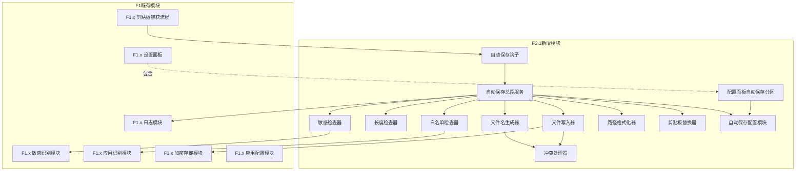
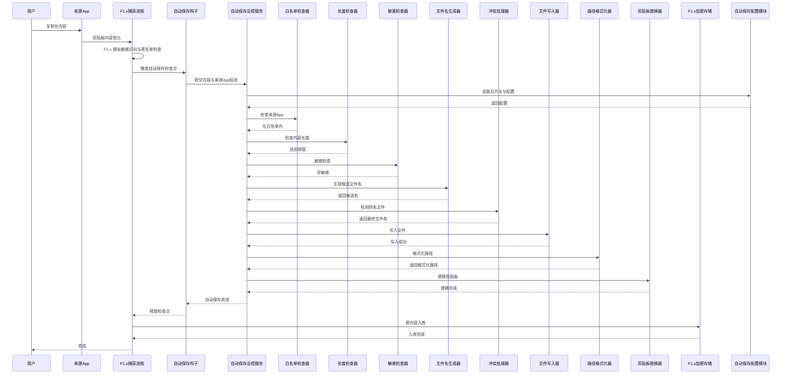
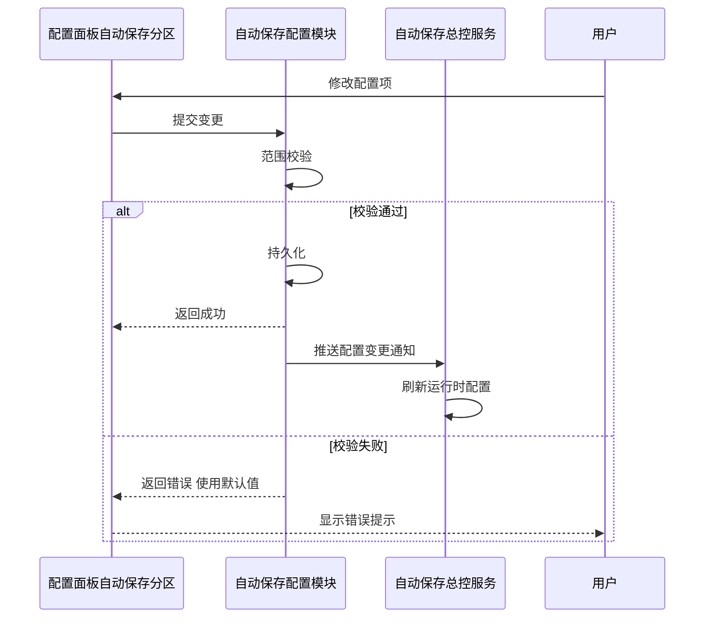
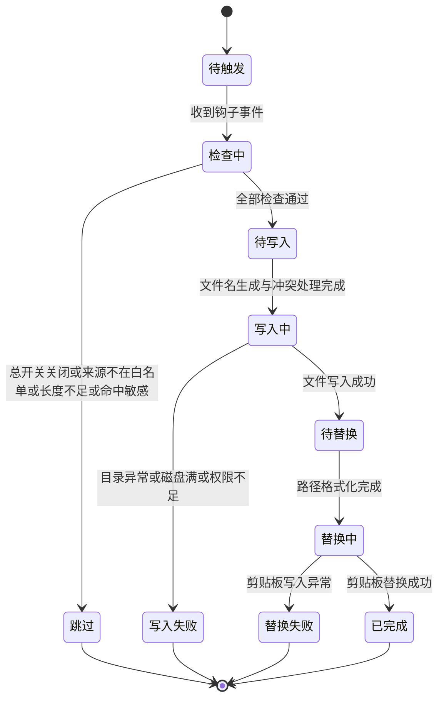
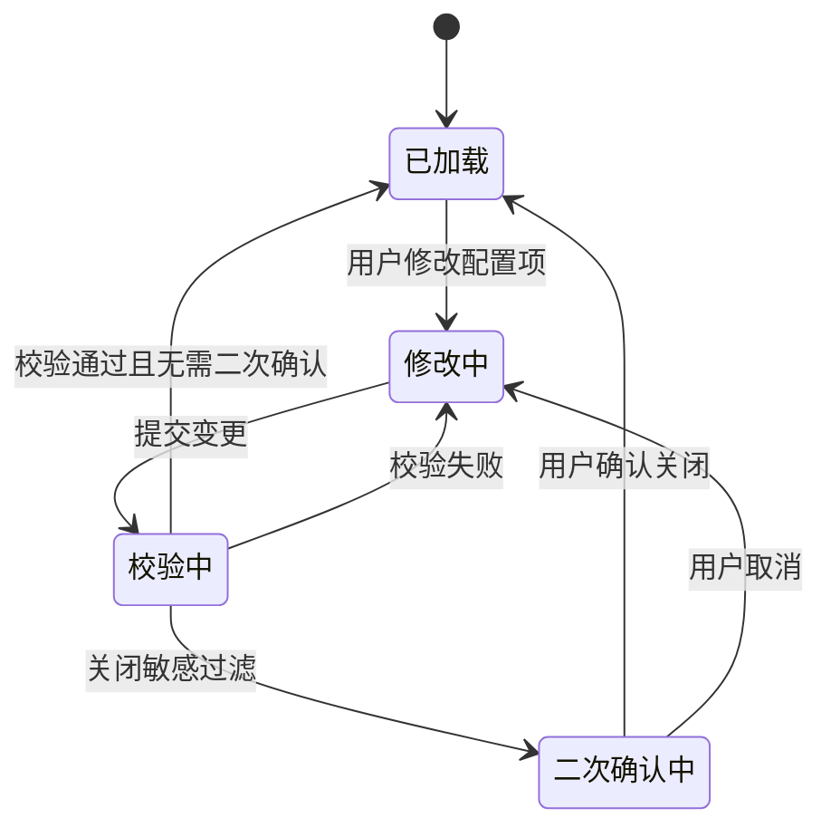

> 最后更新：2026-07-21 | 版本：v1.0

# F2.1 自动保存到文件 设计文档

**功能编号**：F2.1
**优先级**：P1（复赛扩展）
**文档存放路径**：`docs/planning/P1/F2.1/F2.1_自动保存到文件_设计文档.md`
**前置文档**：`F2.1_自动保存到文件_需求文档.md`（v1.0）
**适用阶段**：复赛扩展阶段（F1.x MVP 之后）

---

## 目录

1. [文档定位](#1-文档定位)
2. [模块划分](#2-模块划分)
3. [职责边界](#3-职责边界)
4. [数据流](#4-数据流)
5. [状态变化](#5-状态变化)
6. [协作关系](#6-协作关系)
7. [关键设计决策](#7-关键设计决策)
8. [非功能约束落地](#8-非功能约束落地)
9. [与 Requirements 的映射](#9-与-requirements-的映射)
10. [风险和待确认问题](#10-风险和待确认问题)

---

## 1. 文档定位

本文档是 F2.1 自动保存到文件功能的**架构契约**，描述"系统内部由谁负责什么"（WHO/WHAT 结构），不描述"具体怎么实现"（HOW 代码）。

**单一需求来源**：本文档以 `F2.1_自动保存到文件_需求文档.md`（v1.0）为唯一需求来源，采用编号引用（FR-xxx / NFR-xxx / AC-xxx / C-xxx / O-xxx / FC-xxx）而非复制原文。

**变更原则**：即使后续类名、接口签名、实现语言全部重构，本文档基本不需要改。如果发现本文档需要随代码变化而修改，说明本层混入了实现细节，应将其下沉到实现规划层。

**读者对象**：实现规划与代码层作者、审查人员、未来维护者。

**文档边界**：本文档只回答"有哪些模块、职责如何划分、数据如何流动、状态如何变化、为什么这样划分"。不讨论"用户为什么需要"（已由需求文档回答），不写"接口签名/类定义/目录结构"（留给实现规划），不写"AC/测试策略/UI 可观测性矩阵"（留给测试用例表与视觉原型）。

---

## 2. 模块划分

F2.1 在 F1.x 既有模块之上**新增一组自动保存相关模块**，并与 F1.x 既有捕获流程、配置模块、日志模块协作。模块用中文业务术语命名，不绑定具体类名。

### 2.1 模块结构图

### 2.2 模块清单

| 模块名（中文业务术语） | 类型 | 对外契约概述 |
|----------------------|------|------------|
| 自动保存钩子 | 新增·入口 | 在 F1.x 捕获流程的指定位置接收剪贴板事件，转交自动保存总控服务 |
| 自动保存总控服务 | 新增·协调者 | 协调白名单检查、长度检查、敏感检查、文件名生成、冲突处理、文件写入、路径格式化、剪贴板替换的执行顺序与异常分支 |
| 白名单检查器 | 新增·检查者 | 判断来源 App 是否在用户配置的白名单内 |
| 长度检查器 | 新增·检查者 | 判断内容字符数是否达到阈值 |
| 敏感检查器 | 新增·检查者（复用 F1.x 能力） | 调用 F1.x 敏感识别能力判断内容是否敏感，受"敏感过滤开关"控制是否启用 |
| 文件名生成器 | 新增·生成者 | 根据内容前缀与配置生成候选文件名（含过滤特殊字符、长度截断） |
| 冲突处理器 | 新增·检查者 | 检测目标目录是否存在同名文件，存在则追加序号直到无冲突 |
| 文件写入器 | 新增·执行者 | 将内容写入目标目录，处理目录异常、磁盘满等错误 |
| 路径格式化器 | 新增·格式化者 | 将绝对路径按用户配置格式（纯路径字符串、file:// URI、Markdown 链接）输出 |
| 剪贴板替换器 | 新增·执行者 | 将系统剪贴板内容替换为格式化后的路径 |
| 自动保存配置模块 | 新增·配置 | 持久化与读取自动保存相关配置项（总开关、保存目录、白名单、文件格式、长度阈值、文件名长度、敏感过滤开关、路径格式） |
| 配置面板自动保存分区 | 新增·UI | 设置面板中新增的独立分区，承载所有自动保存配置项的交互 |
| F1.x 剪贴板捕获流程 | 既有 | 监听剪贴板、调用敏感识别、调用应用识别、入库到加密存储 |
| F1.x 敏感识别模块 | 既有 | 提供敏感内容识别能力（密码模式、Token 格式、验证码、银行卡号、身份证号、敏感关键词） |
| F1.x 应用识别模块 | 既有 | 提供来源 App 的应用 Bundle ID 识别能力 |
| F1.x 加密存储模块 | 既有 | 提供剪贴板条目的入库能力 |
| F1.x 应用配置模块 | 既有 | 提供 F1.x 既有配置项的持久化能力（F2.1 不修改其公共字段） |
| F1.x 日志模块 | 既有 | 提供结构化日志输出能力与日志分类体系 |
| F1.x 设置面板 | 既有 | 提供 F1.x 既有配置分区（API Key 配置、隐私设置、通用设置），F2.1 在其中新增"自动保存"分区 |

---

## 3. 职责边界

### 3.1 自动保存钩子

- **负责**：在 F1.x 捕获流程中"敏感识别与黑名单检查之后、入库之前"的位置接收事件，将剪贴板内容与来源 App 信息转交给自动保存总控服务；保证自动保存与 F1.x 入库流程互不阻塞（根据 FR-014）
- **不负责**：决定是否触发自动保存（由总控服务决定）；执行任何文件写入或剪贴板替换；修改 F1.x 既有捕获流程的公共回调

### 3.2 自动保存总控服务

- **负责**：按"白名单 → 长度 → 敏感 → 文件名 → 写入 → 路径格式化 → 剪贴板替换"顺序协调各子模块；管理自动保存流程的状态变化；处理子模块异常并决定是否进入失败分支；与自动保存配置模块协作读取运行时配置；通过 F1.x 日志模块输出关键节点日志（根据 NFR-007）
- **不负责**：直接执行任何文件 I/O；直接调用 F1.x 敏感识别模块（由敏感检查器代理）；直接修改系统剪贴板（由剪贴板替换器执行）；决定配置默认值（由自动保存配置模块负责）

### 3.3 白名单检查器

- **负责**：接收来源 App 的应用 Bundle ID，与自动保存配置模块中的白名单集合做匹配；返回"匹配 / 不匹配"结果
- **不负责**：识别来源 App（由 F1.x 应用识别模块负责）；维护白名单集合（由自动保存配置模块负责）；处理"是否启用自动保存"的判断（由总控服务根据总开关决定）

### 3.4 长度检查器

- **负责**：接收剪贴板内容，统计字符数，与配置的长度阈值比较；返回"达到阈值 / 未达到阈值"结果
- **不负责**：阈值范围校验（由自动保存配置模块在持久化时校验，根据 C-05）；内容是否敏感（由敏感检查器负责）

### 3.5 敏感检查器

- **负责**：根据"敏感过滤开关"决定是否启用检查；启用时调用 F1.x 敏感识别能力判断内容是否敏感，返回"敏感 / 非敏感"结果；关闭时直接返回"非敏感"（根据 FR-004 与 AC-14）
- **不负责**：修改 F1.x 敏感识别规则（受 F-02 约束）；决定敏感内容是否入库（由 F1.x 既有流程独立决定）

### 3.6 文件名生成器

- **负责**：根据内容前缀与配置生成候选文件名；过滤换行符、路径分隔符与文件系统特殊字符；保留中文；按配置长度截断（根据 FR-006 与 AC-10）；附加文件扩展名（根据文件格式配置）
- **不负责**：检测同名文件（由冲突处理器负责）；处理文件名模板变量（不在 F2.1 范围，见 O-11）；生成按日期或来源 App 命名的文件名（不在 F2.1 范围）

### 3.7 冲突处理器

- **负责**：接收候选文件名，查询目标目录是否存在同名文件；存在则按"序号从 1 开始递增"的规则生成新候选名，直到无冲突；返回最终文件名（根据 FR-007 与 AC-04）
- **不负责**：决定目标目录（由配置决定）；处理跨目录的冲突；维护全局唯一文件名缓存

### 3.8 文件写入器

- **负责**：将内容写入目标目录的最终文件；处理目录不存在、无写权限、磁盘空间不足等异常（根据 FR-011 与 AC-09）；写入失败时返回错误，不抛出致命异常；保证文件权限遵循 macOS 默认用户隔离（根据 NFR-005）
- **不负责**：决定文件名（由文件名生成器与冲突处理器决定）；决定文件格式（由配置决定）；处理文件上传或同步（不在 F2.1 范围，见 O-02、O-03）

### 3.9 路径格式化器

- **负责**：接收已写入文件的绝对路径，按配置格式（纯路径字符串、file:// URI、Markdown 链接）输出最终字符串（根据 FR-013 与 AC-11）
- **不负责**：决定保存目录（由配置决定）；处理自定义路径模板（不在 F2.1 范围，见 O-06 与 FC-09）

### 3.10 剪贴板替换器

- **负责**：将系统剪贴板内容替换为格式化后的路径字符串；保证替换操作的并发安全（根据 NFR-010）；替换失败时不破坏原剪贴板内容
- **不负责**：决定路径格式（由路径格式化器决定）；处理原内容是否入库（由 F1.x 既有流程独立决定）

### 3.11 自动保存配置模块

- **负责**：持久化所有自动保存配置项（总开关、保存目录、白名单 App 列表、文件格式、长度阈值、文件名长度、敏感过滤开关、路径格式）；提供配置读取接口；保证配置修改后 1 秒内对下一次复制行为生效（根据 NFR-003 与 AC-07）；保证配置在 App 重启后保留（根据 AC-16）；处理配置项范围校验（根据 C-04、C-05）；保证白名单内应用 Bundle ID 不重复（根据 C-06）
- **不负责**：提供配置 UI（由配置面板自动保存分区负责）；修改 F1.x 既有应用配置模型的公共字段（受 F-01 约束）

### 3.12 配置面板自动保存分区

- **负责**：在 F1.x 设置面板中新增"自动保存"独立分区；承载所有自动保存配置项的交互（开关、目录选择、白名单管理、格式切换、阈值调整、路径格式切换、敏感过滤二次确认）；保证修改后立即生效（根据 FR-010 与 AC-07）；关闭敏感过滤时显示二次确认提示（根据 C-07 与 AC-14）；显示明文文件管理责任提示（根据 C-08）
- **不负责**：修改 F1.x 既有配置面板分区（受 F-10 约束）；直接持久化配置（由自动保存配置模块负责）

### 3.13 与 F1.x 既有模块的边界

- **F1.x 剪贴板捕获流程**：F2.1 仅通过自动保存钩子插入检查点，不修改其公共回调与流程顺序（根据 FR-014 与 F-01）
- **F1.x 敏感识别模块**：F2.1 通过敏感检查器调用其能力，不修改其识别规则（受 F-02 约束）
- **F1.x 应用识别模块**：F2.1 通过白名单检查器调用其能力，不修改其识别逻辑（受 F-03 约束）
- **F1.x 加密存储模块**：F2.1 不修改其 Schema 与加密算法（受 F-06 约束）；自动保存的文件不进入加密数据库，以明文形式存放（根据 C-08）
- **F1.x 应用配置模块**：F2.1 不修改其公共字段（受 F-01 约束）；自动保存配置通过新增独立配置模块承载
- **F1.x 日志模块**：F2.1 复用其日志分类体系与结构化日志能力（根据 NFR-007），不修改既有日志分类（受 F-01 约束）
- **F1.x 设置面板**：F2.1 仅新增"自动保存"分区，不修改既有分区（受 F-10 约束）

---

## 4. 数据流

### 4.1 主路径数据流（白名单 App 复制长内容触发自动保存）

### 4.2 关键数据流约束

| 约束 | 来源 | 落地位置 |
|------|------|---------|
| 自动保存与 F1.x 入库流程互不阻塞 | FR-014 | 自动保存钩子释放检查点后，F1.x 入库流程独立执行；自动保存失败不阻塞入库，入库失败不阻塞自动保存（见 AC-12、AC-13） |
| 敏感内容默认不保存到文件 | FR-004、C-07 | 敏感检查器在"敏感过滤开关"开启时调用 F1.x 敏感识别能力，命中则总控服务进入"跳过保存"分支 |
| 自动保存失败不替换剪贴板 | AC-09、AC-12 | 文件写入器失败时总控服务直接进入失败分支，不调用路径格式化器与剪贴板替换器 |
| 配置修改 1 秒内生效 | NFR-003 | 自动保存配置模块保证配置变更通知在 1 秒内被总控服务感知 |
| 日志不包含剪贴板原文与文件路径中的用户名 | NFR-007 | 总控服务与各子模块通过 F1.x 日志模块输出结构化日志时遵守脱敏规则 |

### 4.3 配置变更数据流

---

## 5. 状态变化

### 5.1 自动保存流程状态机

自动保存总控服务在一次复制事件触发的自动保存流程中经历以下状态：

### 5.2 状态说明与责任归属

| 状态 | 含义 | 责任归属 | 出口条件 |
|------|------|---------|---------|
| 待触发 | 等待 F1.x 捕获流程触发自动保存钩子 | 自动保存钩子 | 收到钩子事件 |
| 检查中 | 依次执行总开关、白名单、长度、敏感检查 | 自动保存总控服务 + 白名单检查器 + 长度检查器 + 敏感检查器 | 全部通过 → 待写入；任一不通过 → 跳过 |
| 跳过 | 不触发自动保存，原内容按 F1.x 既有流程处理 | 自动保存总控服务 | 流程结束 |
| 待写入 | 文件名生成器与冲突处理器已就绪 | 文件名生成器 + 冲突处理器 | 进入写入中 |
| 写入中 | 文件写入器正在写入文件 | 文件写入器 | 写入成功 → 待替换；写入失败 → 写入失败 |
| 写入失败 | 文件写入器返回错误，不替换剪贴板 | 自动保存总控服务（异常分支） | 流程结束，原内容仍按 F1.x 既有流程入库（根据 AC-12） |
| 待替换 | 文件已写入，路径格式化器已就绪 | 路径格式化器 | 进入替换中 |
| 替换中 | 剪贴板替换器正在写入剪贴板 | 剪贴板替换器 | 替换成功 → 已完成；替换失败 → 替换失败 |
| 替换失败 | 剪贴板替换器返回错误，原剪贴板内容保持不变 | 自动保存总控服务（异常分支） | 流程结束，文件已写入但剪贴板未替换 |
| 已完成 | 文件写入与剪贴板替换均成功 | 自动保存总控服务 | 流程结束 |

### 5.3 配置面板状态机

配置面板自动保存分区的交互状态：

### 5.4 自动保存功能开关状态

| 状态 | 含义 | 责任归属 |
|------|------|---------|
| 已启用 | 总开关开启，符合触发条件的复制行为会被自动保存 | 自动保存配置模块 |
| 已禁用 | 总开关关闭，所有复制行为都不触发自动保存，行为与 F1.x 完全一致（根据 FR-001 与 AC-08） | 自动保存配置模块 |

---

## 6. 协作关系

### 6.1 协作矩阵

下表使用"调用 / 读取 / 嵌入于 / 被调用"描述模块间的协作关系。"调用"表示主动发起协作，"读取"表示从配置模块读取数据，"嵌入于"表示 UI 模块嵌入在另一个 UI 模块中。

| 协作方 | 被协作方 | 协作关系 |
|--------|---------|---------|
| F1.x 捕获流程 | 自动保存钩子 | 调用 |
| 自动保存钩子 | 自动保存总控服务 | 调用 |
| 自动保存总控服务 | 白名单检查器 | 调用 |
| 自动保存总控服务 | 长度检查器 | 调用 |
| 自动保存总控服务 | 敏感检查器 | 调用 |
| 自动保存总控服务 | 文件名生成器 | 调用 |
| 自动保存总控服务 | 冲突处理器 | 调用 |
| 自动保存总控服务 | 文件写入器 | 调用 |
| 自动保存总控服务 | 路径格式化器 | 调用 |
| 自动保存总控服务 | 剪贴板替换器 | 调用 |
| 自动保存总控服务 | 自动保存配置模块 | 读取 |
| 自动保存总控服务 | F1.x 日志模块 | 调用 |
| 白名单检查器 | F1.x 应用识别模块 | 调用 |
| 白名单检查器 | 自动保存配置模块 | 读取白名单 |
| 敏感检查器 | F1.x 敏感识别模块 | 调用 |
| 敏感检查器 | 自动保存配置模块 | 读取敏感过滤开关 |
| 文件写入器 | F1.x 加密存储模块 | 不调用（文件写入器仅写入明文文件，不进入加密数据库） |
| 配置面板自动保存分区 | 自动保存配置模块 | 调用 |
| 配置面板自动保存分区 | F1.x 设置面板 | 嵌入于 |

### 6.2 关键协作场景

**场景 1：白名单 App 复制长内容（主路径）**
F1.x 捕获流程触发自动保存钩子 → 钩子转交总控服务 → 总控服务依次调用白名单检查器（调用 F1.x 应用识别模块获取应用 Bundle ID）、长度检查器、敏感检查器（调用 F1.x 敏感识别模块）、文件名生成器、冲突处理器、文件写入器、路径格式化器、剪贴板替换器 → 总控服务释放钩子 → F1.x 捕获流程继续入库。

**场景 2：非白名单 App 复制（跳过路径）**
F1.x 捕获流程触发自动保存钩子 → 钩子转交总控服务 → 总控服务调用白名单检查器返回"不匹配" → 总控服务进入"跳过"状态 → 钩子释放 → F1.x 捕获流程继续入库（根据 AC-02）。

**场景 3：敏感内容命中（敏感过滤开启）**
F1.x 捕获流程触发自动保存钩子 → 总控服务调用敏感检查器 → 敏感检查器调用 F1.x 敏感识别模块返回"敏感" → 总控服务进入"跳过"状态 → 钩子释放 → F1.x 捕获流程按既有敏感过滤逻辑不入库（根据 AC-06）。

**场景 4：文件写入失败（异常路径）**
总控服务调用文件写入器 → 写入器返回错误（目录不存在、无写权限、磁盘满） → 总控服务进入"写入失败"状态 → 不调用路径格式化器与剪贴板替换器 → 钩子释放 → F1.x 捕获流程仍按既有流程入库（根据 AC-09、AC-12）。

**场景 5：用户在配置面板关闭敏感过滤（含二次确认）**
用户在配置面板自动保存分区关闭敏感过滤开关 → 配置面板进入"二次确认中"状态 → 用户确认 → 自动保存配置模块持久化 → 推送配置变更通知到总控服务 → 总控服务下次调用敏感检查器时直接返回"非敏感"（根据 AC-14）。

**场景 6：用户连续复制（并发场景）**
用户连续复制多段长内容 → F1.x 捕获流程触发多个自动保存钩子事件 → 多个总控服务实例并发执行 → 文件写入器、剪贴板替换器、配置读取通过并发控制保证线程安全（根据 NFR-010）。

---

## 7. 关键设计决策

### 7.1 D-01：在 F1.x 捕获流程中插入钩子而非独立监听

- **决策**：通过自动保存钩子在 F1.x 既有捕获流程的"敏感识别与黑名单检查之后、入库之前"位置插入检查点，而非新建独立剪贴板监听器
- **原因**：复用 F1.x 已有的剪贴板监听、应用识别、敏感识别能力，避免双监听导致的竞态；满足 FR-014 对触发时机的要求；满足 NFR-006 对额外延迟的约束（仅在主流程上增加一次检查）
- **代价**：F2.1 与 F1.x 捕获流程存在耦合，F1.x 捕获流程变更可能影响 F2.1
- **为何可接受**：钩子接口稳定（仅传递内容与来源 App 信息），F1.x 捕获流程内部变更不需要修改钩子；耦合代价小于双监听的复杂度
- **引用**：FR-014、NFR-006、A-05

### 7.2 D-02：自动保存与 F1.x 入库流程互不阻塞

- **决策**：自动保存流程的失败不阻塞 F1.x 入库，F1.x 入库的失败不阻塞自动保存已完成的文件写入
- **原因**：满足 FR-014 的"互不阻塞"要求；满足 AC-12（自动保存失败不影响入库）与 AC-13（入库失败不影响已完成的文件写入）
- **代价**：用户可能看到"文件已写入但历史无条目"或"历史有条目但剪贴板未替换"的不一致状态
- **为何可接受**：两种失败都是异常场景，用户可通过日志查证；一致性代价小于强一致性带来的阻塞延迟
- **引用**：FR-014、AC-12、AC-13、NFR-004

### 7.3 D-03：敏感检查器代理 F1.x 敏感识别能力

- **决策**：F2.1 不直接调用 F1.x 敏感识别模块，而是通过新增的敏感检查器代理；敏感检查器根据"敏感过滤开关"决定是否启用检查
- **原因**：满足 F-02（不修改 F1.x 敏感识别规则）与 F-01（不修改 F1.x 公共接口）；满足 FR-004 的"敏感过滤默认开启，可关闭"要求
- **代价**：新增一层代理，增加调用链
- **为何可接受**：代理层职责单一（仅判断开关与转发），不引入性能瓶颈；满足 NFR-006 的额外延迟约束
- **引用**：FR-004、F-01、F-02、NFR-006、AC-06、AC-14

### 7.4 D-04：白名单检查器代理 F1.x 应用识别能力

- **决策**：F2.1 不直接读取系统剪贴板来源 App，而是通过白名单检查器调用 F1.x 应用识别模块获取应用 Bundle ID，再与配置的白名单集合匹配
- **原因**：满足 F-03（不修改 F1.x 应用识别逻辑）与 F-01（不修改 F1.x 公共接口）；满足 FR-002 的"按应用 Bundle ID 标识"要求
- **代价**：新增一层代理
- **为何可接受**：代理层职责单一，满足 NFR-006 的额外延迟约束
- **引用**：FR-002、F-01、F-03、C-06、AC-15

### 7.5 D-05：文件名生成与冲突处理分离

- **决策**：文件名生成器负责生成候选名（前缀 + 过滤 + 截断 + 扩展名），冲突处理器负责检测同名并追加序号
- **原因**：单一职责，便于独立测试（满足 NFR-008）；满足 FR-006 与 FR-007 的分离要求；满足 AC-10（文件名过滤）与 AC-04（冲突处理）的独立验证
- **代价**：两个模块协作完成文件名生成
- **为何可接受**：协作接口稳定（候选名 → 最终名），便于独立测试与未来扩展（如 FC-02 文件名自定义模板）
- **引用**：FR-006、FR-007、AC-04、AC-10、NFR-008、A-01

### 7.6 D-06：路径格式化与剪贴板替换分离

- **决策**：路径格式化器负责按配置格式输出路径字符串，剪贴板替换器负责将字符串写入系统剪贴板
- **原因**：单一职责；满足 FR-008 与 FR-013 的分离要求；满足 AC-11 的三种格式切换验证
- **代价**：两个模块协作完成剪贴板替换
- **为何可接受**：协作接口稳定（绝对路径 → 格式化字符串 → 写入剪贴板），便于未来扩展（如 FC-09 路径格式自定义模板）
- **引用**：FR-008、FR-013、AC-11、A-01

### 7.7 D-07：自动保存配置模块独立于 F1.x 应用配置模块

- **决策**：新增独立的自动保存配置模块承载 F2.1 配置项，不修改 F1.x 应用配置模块的公共字段
- **原因**：满足 F-01（不修改 F1.x 公共接口）与 F-10（不修改 F1.x 既有配置面板分区）；满足 FR-010 的"独立分区"要求
- **代价**：存在两个配置模块（F1.x 应用配置模块与自动保存配置模块），需要协调配置持久化方式
- **为何可接受**：A-04 允许 AI 自由决定配置项的持久化方式（扩展现有应用配置模型、新增独立配置模型、使用系统偏好存储、使用加密存储），独立配置模块是其中一种合理选择
- **引用**：FR-010、F-01、F-10、A-04、AC-07、AC-16

### 7.8 D-08：自动保存的文件不进入 F1.x 加密数据库

- **决策**：自动保存的文件以明文形式存放在用户配置目录，不进入 F1.x 加密数据库
- **原因**：满足 C-08；自动保存的目的是让 Trae 等 AI 工具通过 `@` 引用文件，文件必须是明文可读；加密存储由 F1.x 既有入库流程承担（原内容仍入库加密数据库）
- **代价**：明文文件存在泄露风险，用户需自行承担管理责任
- **为何可接受**：配置面板自动保存分区会显示明文文件管理责任提示（根据 C-08）；敏感过滤默认开启（根据 FR-004）；满足 NFR-005 的"文件权限遵循 macOS 默认用户隔离"
- **引用**：C-08、FR-004、NFR-005、A-04

### 7.9 D-09：复用 F1.x 日志模块与日志分类体系

- **决策**：F2.1 通过 F1.x 日志模块输出结构化日志，复用既有日志分类体系；如需新增分类，遵循既有命名规范
- **原因**：满足 NFR-007 与 F-01（不修改 F1.x 既有日志分类）
- **代价**：F2.1 日志与 F1.x 日志混在同一分类体系
- **为何可接受**：A-06 允许 AI 自由决定日志分类的命名；复用既有体系降低维护成本
- **引用**：NFR-007、F-01、A-06

### 7.10 D-10：并发控制由实现层决定

- **决策**：本文档不规定具体的并发原语（串行队列、Actor、异步任务等），仅要求文件写入、剪贴板替换、配置读取的线程安全
- **原因**：满足 NFR-010 的"不出现竞态条件"要求；A-09 允许 AI 自由决定并发控制方式
- **代价**：实现规划与代码层需要自行选择并发原语
- **为何可接受**：并发原语属于实现细节，换语言或换框架时可能变化；Design 层只描述"必须保证线程安全"的业务约束
- **引用**：NFR-010、A-09

---

## 8. 非功能约束落地

### 8.1 NFR 到模块的映射

| NFR 编号 | 非功能约束 | 负责模块 | 落地方式 |
|---------|----------|---------|---------|
| NFR-001 | 保存延迟 ≤ 3 秒 | 自动保存总控服务 + 文件写入器 + 各检查器 | 主路径各模块的总耗时控制在 3 秒内 |
| NFR-002 | 剪贴板替换延迟 ≤ 500 毫秒 | 剪贴板替换器 | 文件写入成功后 500 毫秒内完成剪贴板替换 |
| NFR-003 | 配置生效延迟 ≤ 1 秒 | 自动保存配置模块 + 自动保存总控服务 | 配置变更通知在 1 秒内被总控服务感知 |
| NFR-004 | 稳定性（不崩溃、不卡死） | 自动保存总控服务 + 文件写入器 | 异常分支不抛出致命错误，错误恢复后无需重启 |
| NFR-005 | 隐私安全（明文文件仅用户可读写） | 文件写入器 | 文件权限遵循 macOS 默认用户隔离 |
| NFR-006 | 性能影响（额外延迟 ≤ 100 毫秒） | 自动保存钩子 + 自动保存总控服务 + 各检查器 | 检查阶段总耗时控制在 100 毫秒内 |
| NFR-007 | 日志可观测性 | 自动保存总控服务 + 各子模块 | 通过 F1.x 日志模块输出结构化日志，遵守脱敏规则 |
| NFR-008 | 可测试性 | 所有新增模块 | 所有模块可通过自动化测试验证，使用临时目录或 mock |
| NFR-009 | 兼容性（macOS 12.4+，不新增依赖） | 所有新增模块 | 不使用 macOS 13+ 独占 API，不引入新的外部依赖 |
| NFR-010 | 并发安全 | 自动保存总控服务 + 文件写入器 + 剪贴板替换器 + 自动保存配置模块 | 文件写入、剪贴板替换、配置读取的线程安全 |

### 8.2 Constraints 到模块的映射

| 约束编号 | 约束内容 | 负责模块 |
|---------|---------|---------|
| C-01 | 保存目录由用户配置，默认用户文档目录下 ClipMind 子目录 | 自动保存配置模块 |
| C-02 | 文件格式仅支持 Markdown 与纯文本 | 文件名生成器 + 文件写入器 |
| C-03 | 路径格式仅支持纯路径字符串、file:// URI、Markdown 链接 | 路径格式化器 |
| C-04 | 文件名前缀长度限制 1-50 字 | 文件名生成器 + 自动保存配置模块 |
| C-05 | 长度阈值限制 1-10000 字 | 长度检查器 + 自动保存配置模块 |
| C-06 | 白名单 App 以应用 Bundle ID 为唯一标识，不可重复 | 白名单检查器 + 自动保存配置模块 |
| C-07 | 敏感过滤默认开启，关闭时显示二次确认 | 敏感检查器 + 配置面板自动保存分区 |
| C-08 | 自动保存文件不进入加密数据库，以明文存放 | 文件写入器 + 配置面板自动保存分区 |
| C-09 | 不修改 F1.x 既有公共接口 | 所有新增模块（仅通过代理或新增接口协作） |
| C-10 | 不引入新的外部依赖 | 所有新增模块 |
| C-11 | 与 F1.x 既有隐私理念一致 | 敏感检查器 + 自动保存总控服务 |
| C-12 | 与 F1.x 既有 macOS 版本兼容性一致 | 所有新增模块 |

---

## 9. 与 Requirements 的映射

### 9.1 FR 到负责模块的对应表

| FR 编号 | 功能需求 | 主要负责模块 | 协作模块 |
|--------|---------|------------|---------|
| FR-001 | 总开关控制 | 自动保存配置模块 + 自动保存总控服务 | - |
| FR-002 | 白名单 App 触发 | 白名单检查器 | F1.x 应用识别模块 |
| FR-003 | 内容长度阈值过滤 | 长度检查器 | 自动保存配置模块 |
| FR-004 | 敏感内容过滤 | 敏感检查器 | F1.x 敏感识别模块 + 自动保存配置模块 |
| FR-005 | 文件保存到指定目录 | 文件写入器 | 自动保存配置模块 |
| FR-006 | 文件名生成 | 文件名生成器 | 自动保存配置模块 |
| FR-007 | 文件名冲突处理 | 冲突处理器 | 文件写入器 |
| FR-008 | 剪贴板替换为文件路径 | 剪贴板替换器 | 路径格式化器 |
| FR-009 | 原内容仍入库 ClipMind 历史 | 自动保存钩子（不阻塞 F1.x 入库流程） | F1.x 加密存储模块 |
| FR-010 | 配置面板独立分区 | 配置面板自动保存分区 | 自动保存配置模块 |
| FR-011 | 保存目录异常处理 | 文件写入器 + 自动保存总控服务 | 配置面板自动保存分区（提示） |
| FR-012 | 白名单 App 管理 | 配置面板自动保存分区 + 自动保存配置模块 | 白名单检查器 |
| FR-013 | 路径格式切换 | 路径格式化器 | 自动保存配置模块 |
| FR-014 | 自动保存触发时机 | 自动保存钩子 + 自动保存总控服务 | F1.x 捕获流程 |

### 9.2 FR 覆盖完整性验证

- ✅ FR-001 ~ FR-014 全部有对应负责模块
- ✅ 每条 FR 至少有一个主要负责模块
- ✅ 主要负责模块均能在第 2 节模块清单中找到
- ✅ 协作模块均能在第 2 节模块清单中找到

---

## 10. 风险和待确认问题

### 10.1 R-01：剪贴板替换与 F1.x 既有剪贴板写入的竞态

- **风险/问题**：F1.x 捕获流程在入库后可能存在其他剪贴板写入操作（如某些 F1.x 子流程），与 F2.1 剪贴板替换器的写入可能产生竞态，导致剪贴板内容错乱
- **影响范围**：剪贴板替换器、F1.x 捕获流程
- **缓解方案**：剪贴板替换器通过并发控制保证写入原子性；实现规划层需要分析 F1.x 捕获流程中所有剪贴板写入点，确保 F2.1 替换发生在 F1.x 不再写入剪贴板的时机
- **待确认事项**：F1.x 捕获流程在入库后是否还有剪贴板写入操作？需要实现规划层确认

### 10.2 R-02：自动保存钩子插入位置与 F1.x 流程的耦合

- **风险/问题**：钩子插入位置依赖 F1.x 捕获流程的内部顺序（敏感识别与黑名单检查之后、入库之前），F1.x 捕获流程重构可能破坏钩子
- **影响范围**：自动保存钩子、自动保存总控服务
- **缓解方案**：钩子接口稳定（仅传递内容与来源 App 信息），F1.x 内部顺序变更不影响钩子接口；实现规划层需要明确钩子插入点的稳定契约
- **待确认事项**：F1.x 捕获流程是否计划重构？如重构，钩子插入点如何迁移？

### 10.3 R-03：文件名冲突检测的并发竞态

- **风险/问题**：用户连续复制相同前缀内容时，多个自动保存流程可能同时检测同名文件，导致冲突处理器的序号追加逻辑产生竞态（两个流程都生成相同序号的文件名）
- **影响范围**：冲突处理器、文件写入器
- **缓解方案**：冲突检测与文件写入需要在同一并发控制范围内（如串行队列或原子操作），保证"检测 → 写入"的原子性
- **待确认事项**：实现规划层需要明确冲突检测与文件写入的并发控制策略

### 10.4 R-04：明文文件的泄露风险

- **风险/问题**：自动保存的文件以明文形式存放，用户误关闭敏感过滤后敏感内容（如 Token、密码）会被写入明文文件，存在泄露风险
- **影响范围**：敏感检查器、配置面板自动保存分区、文件写入器
- **缓解方案**：配置面板关闭敏感过滤时显示二次确认提示（根据 C-07）；配置面板显示明文文件管理责任提示（根据 C-08）；日志记录敏感过滤关闭事件便于追溯
- **待确认事项**：是否需要在关闭敏感过滤后定期提醒用户？是否需要在文件写入前对 Token 类内容做额外标记？

### 10.5 R-05：保存目录配置变更时已有文件的处理

- **风险/问题**：用户修改保存目录后，旧目录中的文件不会被迁移到新目录，可能导致用户混淆
- **影响范围**：自动保存配置模块、配置面板自动保存分区
- **缓解方案**：F2.1 不负责文件迁移（不在范围，见 O-08 文件自动清理）；配置面板在修改保存目录时提示用户"旧目录中的文件不会自动迁移"
- **待确认事项**：是否需要在配置面板显示提示？提示文案由实现规划层决定

### 10.6 R-06：白名单 App 删除后已有文件的处理

- **风险/问题**：用户从白名单删除某 App 后，该 App 之前触发的自动保存文件仍保留在保存目录，可能引起用户混淆
- **影响范围**：配置面板自动保存分区、自动保存配置模块
- **缓解方案**：F2.1 不负责文件清理（不在范围，见 O-08）；删除白名单 App 仅影响后续复制行为，不影响已有文件
- **待确认事项**：是否需要在删除白名单 App 时提示用户"已有文件不受影响"？

### 10.7 R-07：日志脱敏与可观测性的平衡

- **风险/问题**：NFR-007 要求日志不包含剪贴板原文与文件路径中的用户名，但过度的脱敏可能使日志无法定位问题
- **影响范围**：自动保存总控服务、各子模块、F1.x 日志模块
- **缓解方案**：日志输出结构化字段（事件类型、时间戳、来源 App 应用 Bundle ID、文件名前缀摘要、错误码），不输出原文与完整路径；使用 F1.x 既有日志分类体系
- **待确认事项**：日志字段的具体结构由实现规划层决定，需在可观测性与隐私之间平衡

### 10.8 R-08：macOS 12.4 兼容性与新 API 的使用

- **风险/问题**：F2.1 需要满足 C-12 的 macOS 12.4 兼容性，不能使用 macOS 13+ 独占 API；但实现规划层可能在文件写入、剪贴板替换等场景误用新 API
- **影响范围**：所有新增模块
- **缓解方案**：Design 层不指定具体 API；实现规划层与代码层需要明确 macOS 12.4 兼容性检查清单；CI 中通过编译验证
- **待确认事项**：实现规划层需要提供 macOS 12.4 兼容性自检清单

### 10.9 R-09：配置面板自动保存分区的 UI 一致性

- **风险/问题**：新增的"自动保存"分区需要与 F1.x 既有分区（API Key 配置、隐私设置、通用设置）的 UI 风格保持一致，但 Design 层不规定具体 UI 布局
- **影响范围**：配置面板自动保存分区
- **缓解方案**：A-07 允许 AI 根据 F1.x 既有设置面板风格决定 UI 布局；视觉原型（步骤 5b）将提供具体 UI 设计
- **待确认事项**：视觉原型需要在步骤 5b 中明确 UI 布局与交互细节

### 10.10 R-10：自动保存流程的状态可恢复性

- **风险/问题**：自动保存流程在"写入中"或"替换中"状态时 App 异常退出，可能导致文件已写入但剪贴板未替换，或文件写入不完整
- **影响范围**：自动保存总控服务、文件写入器、剪贴板替换器
- **缓解方案**：文件写入器保证原子写入（先写临时文件再重命名）；剪贴板替换失败不影响文件已写入状态；App 重启后不自动恢复未完成的自动保存流程（避免重复写入）
- **待确认事项**：是否需要持久化自动保存流程状态以便 App 重启后恢复？默认不持久化，由实现规划层确认

---

## 版本记录

| 版本 | 日期 | 变更说明 |
|------|------|---------|
| v1.0 | 2026-07-21 | 初始版本，dd-writing-specs 步骤 5a 产出，覆盖 F2.1 自动保存到文件功能的架构契约；包含 10 章节（文档定位 / 模块划分 / 职责边界 / 数据流 / 状态变化 / 协作关系 / 关键设计决策 / 非功能约束落地 / 与 Requirements 的映射 / 风险和待确认问题）；模块用中文业务术语命名，引用需求文档的 FR/NFR/AC/C/FC 编号；包含 12 个新增模块与 7 个 F1.x 既有模块的协作关系；10 项关键设计决策；10 项风险与待确认问题 |
