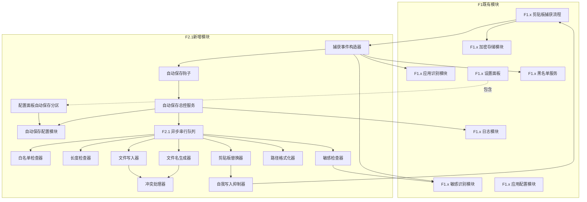
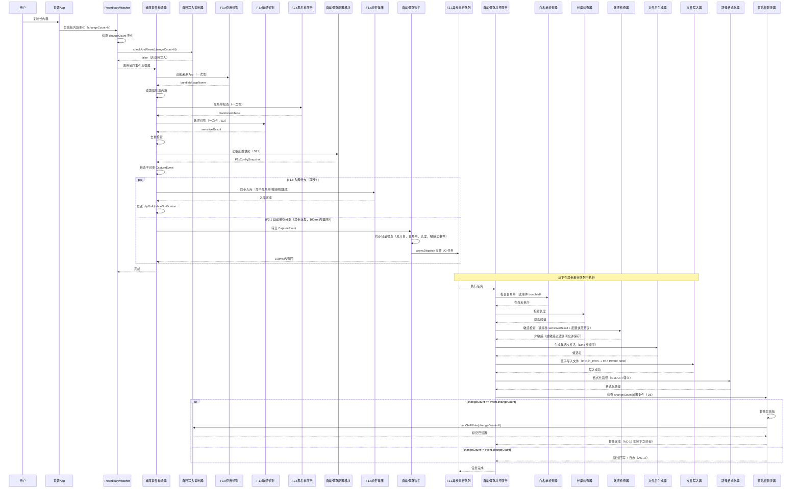
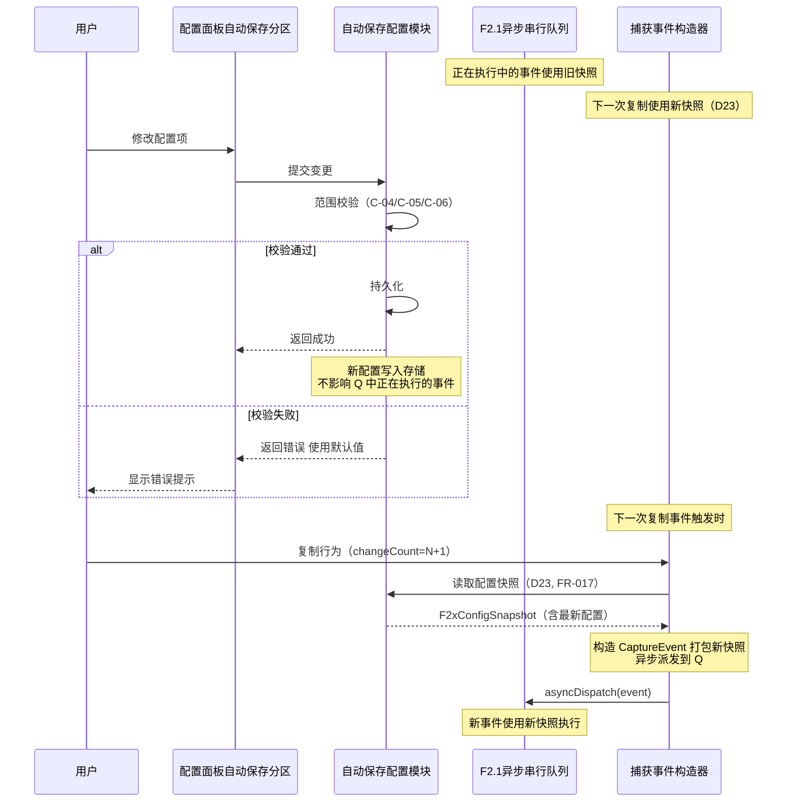
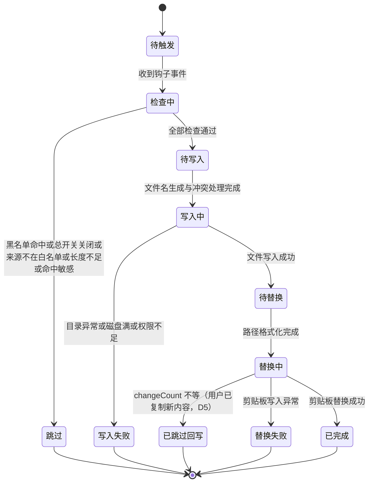
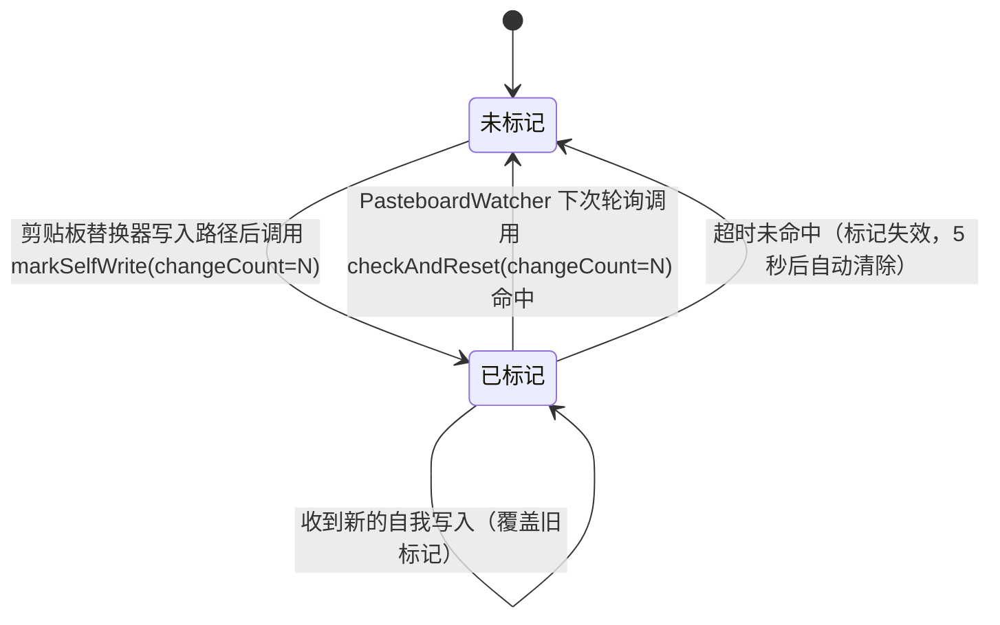
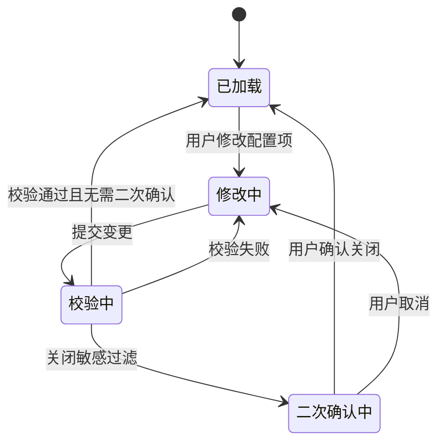

> 最后更新：2026-07-22 | 版本：v1.1

# F2.1 自动保存到文件 设计文档

**功能编号**：F2.1
**优先级**：P1（复赛扩展）
**文档存放路径**：`docs/planning/P1/F2.1/F2.1_自动保存到文件_设计文档.md`
**前置文档**：`F2.1_自动保存到文件_需求文档.md`（v1.0）
**适用阶段**：复赛扩展阶段（F1.x MVP 之后）

---

## 目录

1. [文档定位](#1-文档定位)
2. [模块划分](#2-模块划分)
3. [职责边界](#3-职责边界)
4. [数据流](#4-数据流)
5. [状态变化](#5-状态变化)
6. [协作关系](#6-协作关系)
7. [关键设计决策](#7-关键设计决策)
8. [非功能约束落地](#8-非功能约束落地)
9. [与 Requirements 的映射](#9-与-requirements-的映射)
10. [风险和待确认问题](#10-风险和待确认问题)

---

## 1. 文档定位

本文档是 F2.1 自动保存到文件功能的**架构契约**，描述"系统内部由谁负责什么"（WHO/WHAT 结构），不描述"具体怎么实现"（HOW 代码）。

**单一需求来源**：本文档以 `F2.1_自动保存到文件_需求文档.md`（v1.0）为唯一需求来源，采用编号引用（FR-xxx / NFR-xxx / AC-xxx / C-xxx / O-xxx / FC-xxx）而非复制原文。

**变更原则**：即使后续类名、接口签名、实现语言全部重构，本文档基本不需要改。如果发现本文档需要随代码变化而修改，说明本层混入了实现细节，应将其下沉到实现规划层。

**读者对象**：实现规划与代码层作者、审查人员、未来维护者。

**文档边界**：本文档只回答"有哪些模块、职责如何划分、数据如何流动、状态如何变化、为什么这样划分"。不讨论"用户为什么需要"（已由需求文档回答），不写"接口签名/类定义/目录结构"（留给实现规划），不写"AC/测试策略/UI 可观测性矩阵"（留给测试用例表与视觉原型）。

---

## 2. 模块划分

F2.1 在 F1.x 既有模块之上**新增一组自动保存相关模块**，并与 F1.x 既有捕获流程、配置模块、日志模块协作。模块用中文业务术语命名，不绑定具体类名。

### 2.1 模块结构图

**模块图修订说明**（D1+D2+D3+D4+D6 落地，GPT 问题 #5 修复）：

- 删除原 `B8[文件写入器] --> A4[F1.x 加密存储模块]` 错误连接：文件写入器仅写明文文件，不进入加密数据库；
- 新增 `A1 --> A4`：表示 F1.x 捕获流程自己入库到加密存储（原内容入库由 F1.x 分支同步执行，不依赖 F2.1 文件写入器）；
- 新增 `B0[捕获事件构造器]`：负责识别来源 App、读取内容、调用敏感识别与黑名单检查、构造不可变 `CaptureEvent`，对应 FR-014 步骤 1-7；
- 新增 `B11[自我写入抑制器]`：负责自我写入标记管理，对应 FR-015；
- 新增 `B14[F2.1 异步串行队列]`：D7 落地，F2.1 文件 I/O 在专用串行队列执行；
- `B0 --> A2`、`B0 --> A3`、`B0 --> A8`：敏感识别、应用识别、黑名单检查在捕获事件构造阶段由 B0 调用，结果打包进 CaptureEvent（D2 只跑一次）；
- `B11 --> A1`：自我写入抑制器在 PasteboardWatcher 下次轮询时被检查。

### 2.2 模块清单

| 模块名（中文业务术语） | 类型 | 对外契约概述 |
|----------------------|------|------------|
| 捕获事件构造器 | 新增·入口（在 F1.x 内） | 在 PasteboardWatcher 中识别来源 App、读取内容、执行黑名单与敏感识别（只执行一次）、构造不可变 `CaptureEvent`，对应 FR-014 步骤 1-7 |
| 自动保存钩子 | 新增·入口 | 接收 `CaptureEvent`，同步执行轻量检查（总开关、白名单、长度、敏感），将文件 I/O 异步派发到串行队列，对应 FR-014 步骤 8-10 |
| 自动保存总控服务 | 新增·协调者 | 协调白名单检查、长度检查、敏感检查、文件名生成、冲突处理、文件写入、路径格式化、剪贴板替换的执行顺序与异常分支 |
| 白名单检查器 | 新增·检查者 | 判断来源 App 是否在用户配置的白名单内（仅做集合匹配，不调用应用识别模块，因 Bundle ID 已在事件中） |
| 长度检查器 | 新增·检查者 | 判断内容字符数是否达到阈值 |
| 敏感检查器 | 新增·检查者 | 读取事件中的 `sensitiveResult` + F2.1 敏感过滤开关决定是否跳过保存（不再调用 F1.x 敏感识别模块，因结果已在事件中，D2） |
| 文件名生成器 | 新增·生成者 | 根据 FR-006 的 8 步顺序生成候选文件名 |
| 冲突处理器 | 新增·检查者 | 与文件写入器协同原子解决冲突（D10），使用 O_EXCL 语义 |
| 文件写入器 | 新增·执行者 | 将内容写入目标目录，使用 POSIX 0600 权限（D14），处理目录异常分级（D13） |
| 路径格式化器 | 新增·格式化者 | 将绝对路径按 FR-013 三种格式输出，含 URI 转义（D16） |
| 剪贴板替换器 | 新增·执行者 | 检查 changeCount 前置条件（D5），将系统剪贴板内容替换为格式化后的路径，调用自我写入抑制器设置标记 |
| 自我写入抑制器 | 新增·辅助者 | 管理 ClipMind 自己写入剪贴板的标记，供 PasteboardWatcher 下次轮询时识别并跳过 |
| 自动保存配置模块 | 新增·配置 | 持久化与读取自动保存相关配置项；提供配置快照接口供捕获事件构造器使用 |
| 配置面板自动保存分区 | 新增·UI | 设置面板中新增的独立分区，承载所有自动保存配置项的交互 |
| F2.1 异步串行队列 | 新增·基础设施 | 专用 DispatchSerialQueue，保证 F2.1 文件 I/O 顺序执行，避免并发竞态 |
| F1.x 剪贴板捕获流程 | 既有 | 监听剪贴板变化，调用捕获事件构造器构造事件，分发给 F1.x 入库分支（同步）与 F2.1 自动保存分支（异步） |
| F1.x 敏感识别模块 | 既有 | 提供敏感内容识别能力（密码模式、Token 格式、验证码、银行卡号、身份证号、敏感关键词）；由捕获事件构造器调用一次，结果以结构化 `SensitiveMatchResult` 返回 |
| F1.x 应用识别模块 | 既有 | 提供来源 App 的应用 Bundle ID 识别能力；由捕获事件构造器调用一次 |
| F1.x 黑名单服务 | 既有 | 提供 Bundle ID 黑名单匹配能力；由捕获事件构造器调用一次 |
| F1.x 加密存储模块 | 既有 | 提供剪贴板条目的入库能力；由 F1.x 入库分支同步调用 |
| F1.x 应用配置模块 | 既有 | 提供 F1.x 既有配置项的持久化能力（F2.1 不修改其公共字段） |
| F1.x 日志模块 | 既有 | 提供结构化日志输出能力与日志分类体系；遵守 NFR-007 字段白名单 |
| F1.x 设置面板 | 既有 | 提供 F1.x 既有配置分区（API Key 配置、隐私设置、通用设置），F2.1 在其中新增"自动保存"分区 |

---

## 3. 职责边界

### 3.1 自动保存钩子

- **负责**：在 F1.x 捕获流程中"敏感识别与黑名单检查之后、入库之前"的位置接收事件，将剪贴板内容与来源 App 信息转交给自动保存总控服务；保证自动保存与 F1.x 入库流程互不阻塞（根据 FR-014）
- **不负责**：决定是否触发自动保存（由总控服务决定）；执行任何文件写入或剪贴板替换；修改 F1.x 既有捕获流程的公共回调

### 3.2 自动保存总控服务

- **负责**：按"白名单 → 长度 → 敏感 → 文件名 → 写入 → 路径格式化 → 剪贴板替换"顺序协调各子模块；管理自动保存流程的状态变化；处理子模块异常并决定是否进入失败分支；与自动保存配置模块协作读取运行时配置；通过 F1.x 日志模块输出关键节点日志（根据 NFR-007）
- **不负责**：直接执行任何文件 I/O；直接调用 F1.x 敏感识别模块（由敏感检查器代理）；直接修改系统剪贴板（由剪贴板替换器执行）；决定配置默认值（由自动保存配置模块负责）

### 3.3 白名单检查器

- **负责**：接收 CaptureEvent 中的 `bundleId` 字段，与自动保存配置快照中的白名单集合做匹配；返回"匹配 / 不匹配"结果
- **不负责**：识别来源 App（由捕获事件构造器在事件构造阶段调用 F1.x 应用识别模块一次性确定 Bundle ID 并打包进事件，D6 落地，避免 GPT 问题 #6"用户复制后迅速切换 App 导致来源识别错误"）；维护白名单集合（由自动保存配置模块负责）；处理"是否启用自动保存"的判断（由总控服务根据总开关决定）

### 3.4 长度检查器

- **负责**：接收剪贴板内容，统计字符数，与配置的长度阈值比较；返回"达到阈值 / 未达到阈值"结果
- **不负责**：阈值范围校验（由自动保存配置模块在持久化时校验，根据 C-05）；内容是否敏感（由敏感检查器负责）

### 3.5 敏感检查器

- **负责**：读取 CaptureEvent 中的 `sensitiveResult` 字段（结构化，含命中规则类型与位置）；根据事件配置快照中的"敏感过滤开关"决定是否启用检查；开关开启且事件 `sensitiveResult` 命中敏感时返回"敏感"，否则返回"非敏感"
- **不负责**：调用 F1.x 敏感识别模块（D2 落地：敏感识别在捕获事件构造阶段由捕获事件构造器调用一次，结果打包进事件，敏感检查器只读不调）；修改 F1.x 敏感识别规则（受 F-02 约束）；决定敏感内容是否入库（由 F1.x 入库分支独立决定，与 F2.1 开关状态无关）

### 3.6 文件名生成器

- **负责**：根据内容前缀与配置生成候选文件名；过滤换行符、路径分隔符与文件系统特殊字符；保留中文；按配置长度截断（根据 FR-006 与 AC-10）；附加文件扩展名（根据文件格式配置）
- **不负责**：检测同名文件（由冲突处理器负责）；处理文件名模板变量（不在 F2.1 范围，见 O-11）；生成按日期或来源 App 命名的文件名（不在 F2.1 范围）

### 3.7 冲突处理器

- **负责**：接收候选文件名，与文件写入器协同执行原子冲突解决（D10）：使用 `FileManager.createFile` 的独占创建语义（O_EXCL），若文件已存在则创建失败 → 递增序号 → 重试，直到创建成功；返回最终文件名
- **不负责**：决定目标目录（由配置决定）；单独检测同名文件再交给写入器（旧设计已被 D10 原子契约替代）；处理跨目录的冲突；维护全局唯一文件名缓存

### 3.8 文件写入器

- **负责**：与冲突处理器协同执行原子文件创建（D10）；将内容写入目标目录的最终文件；使用 POSIX 0600 权限创建文件（D14）；按 D13 分级处理目录异常：首次启用默认目录不存在 → 自动创建；用户配置目录被删除 → 报错；父目录存在子目录不存在 → 自动创建；权限失效 → 报错；磁盘空间不足 → 报错（根据 FR-011 与 AC-09）；写入失败时清理半成品文件（D10）；不替换剪贴板内容
- **不负责**：决定文件名（由文件名生成器与冲突处理器决定）；决定文件格式（由配置决定）；处理文件上传或同步（不在 F2.1 范围，见 O-02、O-03）；调用 F1.x 加密存储模块（GPT 问题 #5 修复：自动保存的文件不进入加密数据库）

### 3.9 路径格式化器

- **负责**：接收已写入文件的绝对路径，按配置格式（纯路径字符串、file:// URI、Markdown 链接）输出最终字符串；file:// URI 与 Markdown 链接目标使用标准 URL 编码（D16，含中文、空格、`#`、`%`、括号转义）；Markdown 显示名不转义（因文件名过滤规则已禁止 `[`、`]`）（根据 FR-013 与 AC-11）
- **不负责**：决定保存目录（由配置决定）；处理自定义路径模板（不在 F2.1 范围，见 O-06 与 FC-09）

### 3.10 剪贴板替换器

- **负责**：调用前检查 `pasteboard.changeCount == event.changeCount` 前置条件（D5）：相等 → 替换剪贴板为格式化后的路径字符串，并调用自我写入抑制器设置标记；不等 → 跳过回写，文件保留，输出日志记录跳过原因（事件 ID、原 changeCount、当前 changeCount）；替换失败时不破坏原剪贴板内容（根据 FR-008、AC-17 与 NFR-010）
- **不负责**：决定路径格式（由路径格式化器决定）；处理原内容是否入库（由 F1.x 既有流程独立决定）

### 3.11 自动保存配置模块

- **负责**：持久化所有自动保存配置项（总开关、保存目录、白名单 App 列表、文件格式、长度阈值、文件名长度、敏感过滤开关、路径格式）；提供配置读取接口；**提供配置快照接口**（D23，FR-017 落地）：捕获事件构造器在事件构造阶段调用此接口获取不可变的 `F2xConfigSnapshot`，打包进 `CaptureEvent`；保证配置修改后 1 秒内对下一次复制行为生效（根据 NFR-003 与 AC-07）；保证配置在 App 重启后保留（根据 AC-16）；处理配置项范围校验（根据 C-04、C-05）；保证白名单内应用 Bundle ID 不重复（根据 C-06）
- **不负责**：提供配置 UI（由配置面板自动保存分区负责）；修改 F1.x 既有应用配置模型的公共字段（受 F-01 约束）；保证正在执行中的事件使用最新配置（事件使用快照，新配置仅对下一次事件生效，D23）

### 3.12 配置面板自动保存分区

- **负责**：在 F1.x 设置面板中新增"自动保存"独立分区；承载所有自动保存配置项的交互（开关、目录选择、白名单管理、格式切换、阈值调整、路径格式切换、敏感过滤二次确认）；保证修改后立即持久化到自动保存配置模块（根据 FR-010 与 AC-07）；关闭敏感过滤时显示二次确认提示（根据 C-07 与 AC-14）；显示明文文件管理责任提示（根据 C-08）；提示同步目录（iCloud、Dropbox）风险（根据 NFR-005）
- **不负责**：修改 F1.x 既有配置面板分区（受 F-10 约束）；直接持久化配置（由自动保存配置模块负责）

### 3.13 捕获事件构造器

- **负责**：在 PasteboardWatcher.handlePasteboardChange 中执行：① 检测 changeCount 变化（含自我写入抑制检查，调用自我写入抑制器）；② 识别来源 App（调用 F1.x 应用识别模块）；③ 读取剪贴板内容；④ 黑名单检查（调用 F1.x 黑名单服务）；⑤ 敏感识别（调用 F1.x 敏感识别模块，**只执行一次**，D2）；⑥ 去重检查；⑦ 构造不可变 `CaptureEvent`（含 id、changeCount、content、bundleId、appName、blacklisted、sensitiveResult、f1xConfigSnapshot、f2xConfigSnapshot、timestamp）；⑧ 同步调用 F1.x 入库分支；⑨ 异步派发 F2.1 自动保存分支到串行队列；⑩ 100ms 内返回（对应 FR-014）
- **不负责**：执行任何文件 I/O；修改系统剪贴板；执行 F2.1 的白名单 / 长度 / 敏感 / 文件名等检查（由自动保存钩子与总控服务负责）

### 3.14 自我写入抑制器

- **负责**：管理进程内的"自我写入标记"集合（关联 changeCount 或写入事件 ID）；提供 `markSelfWrite(changeCount:)` 接口供剪贴板替换器在写入路径后调用；提供 `checkAndReset(changeCount:) -> Bool` 接口供 PasteboardWatcher 在下次轮询时调用：命中标记 → 返回 true 并重置标记，PasteboardWatcher 静默跳过完整捕获流程（根据 FR-015 与 AC-18）
- **不负责**：执行剪贴板写入；执行敏感识别 / 黑名单检查；维护 F1.x 历史

### 3.15 F2.1 异步串行队列

- **负责**：作为专用 `DispatchQueue`（serial，qos: .utility），保证 F2.1 文件 I/O 任务顺序执行；接收自动保存钩子异步派发的任务；保证多个 F2.1 事件不并发执行文件写入（D7）
- **不负责**：调度 F1.x 入库任务（F1.x 入库在 PasteboardWatcher 同步线程内执行）；执行任务内容（由自动保存总控服务在队列上下文中执行）

### 3.16 与 F1.x 既有模块的边界

- **F1.x 剪贴板捕获流程**：F2.1 通过捕获事件构造器在 PasteboardWatcher 中扩展回调参数为 `CaptureEvent`（F-11 例外条款），不修改其行为契约；F1.x 入库分支仍由 PasteboardWatcher 同步调用，行为与原 `ClipContent` 一致（根据 FR-014 与 F-11）
- **F1.x 敏感识别模块**：F2.1 通过捕获事件构造器调用其能力一次，结果打包进事件；F2.1 敏感检查器只读事件中的 `sensitiveResult`，不再调用 F1.x 敏感识别模块（D2 落地）；不修改其识别规则（受 F-02 约束）
- **F1.x 应用识别模块**：F2.1 通过捕获事件构造器调用其能力一次，Bundle ID 打包进事件；F2.1 白名单检查器只读事件中的 `bundleId`，不再调用 F1.x 应用识别模块（D6 落地，避免 GPT 问题 #6）；不修改其识别逻辑（受 F-03 约束）
- **F1.x 黑名单服务**：F2.1 通过捕获事件构造器调用其能力一次，结果打包进事件的 `blacklisted` 字段；F2.1 自动保存分支读取 `blacklisted` 字段，命中黑名单始终不保存（FR-018 落地）
- **F1.x 加密存储模块**：F2.1 不修改其 Schema 与加密算法（受 F-06 约束）；自动保存的文件不进入加密数据库，以明文形式存放（根据 C-08）；F1.x 入库分支由 PasteboardWatcher 同步调用加密存储模块，与 F2.1 文件写入器无任何调用关系（GPT 问题 #5 修复）
- **F1.x 应用配置模块**：F2.1 不修改其公共字段（受 F-01 约束）；自动保存配置通过新增独立配置模块承载
- **F1.x 日志模块**：F2.1 复用其日志分类体系与结构化日志能力（根据 NFR-007），不修改既有日志分类（受 F-01 约束）；F2.1 日志字段必须遵守 NFR-007 的字段白名单与禁输出清单（D15）
- **F1.x 设置面板**：F2.1 仅新增"自动保存"分区，不修改既有分区（受 F-10 约束）

---

## 4. 数据流

### 4.1 主路径数据流（捕获事件快照 + 并行分支，D1+D6+D7 落地）

**关键修订**（GPT 问题 #2 修复）：原顺序图把"F1.x 入库"放在"自动保存钩子释放检查点"之后，是 F1.x 等待 F2.1 完成的串行模型，违反 NFR-006 ≤100ms。改为并行分支：捕获事件构造器构造 CaptureEvent 后，F1.x 入库分支同步执行，F2.1 自动保存分支异步派发到串行队列，两者独立完成。

### 4.2 关键数据流约束

| 约束 | 来源 | 落地位置 |
|------|------|---------|
| 捕获事件快照 + 并行分支 | FR-014、D1、D6 | 捕获事件构造器构造 CaptureEvent 后，F1.x 入库分支同步、F2.1 自动保存分支异步派发到串行队列（修复 GPT 问题 #2） |
| 互不阻塞（失败隔离 + 执行非阻塞） | FR-014 | F1.x 入库不等待 F2.1 文件 I/O；F2.1 钩子 100ms 内返回；任一分支失败不影响另一分支 |
| 敏感识别只执行一次 | FR-004、D2 | 捕获事件构造器调用 F1.x 敏感识别模块一次，结果以 `SensitiveMatchResult` 打包进事件；F1.x 与 F2.1 分支共享同一结果 |
| F1.x 黑名单优先于 F2.1 | FR-018、D3 | 捕获事件构造器调用 F1.x 黑名单服务一次，结果打包进事件 `blacklisted` 字段；F2.1 分支命中黑名单始终不保存 |
| 自我写入抑制 | FR-015、D4 | 剪贴板替换器写入路径后调用自我写入抑制器 markSelfWrite；PasteboardWatcher 下次轮询 checkAndReset 命中 → 静默跳过 |
| 剪贴板替换前置条件 | FR-008、D5 | 剪贴板替换器调用前检查 `pasteboard.changeCount == event.changeCount`，不等则跳过回写 |
| 敏感内容默认不保存到文件 | FR-004、C-07 | 敏感检查器读事件 `sensitiveResult` + 配置快照敏感过滤开关：开启且命中敏感 → 跳过；关闭 → 允许保存 |
| 自动保存失败不替换剪贴板 | AC-09、AC-12 | 文件写入器失败时总控服务直接进入失败分支，不调用路径格式化器与剪贴板替换器 |
| 配置快照机制 | FR-017、D23、NFR-011 | 捕获事件构造器在事件构造阶段读取配置快照打包进事件；F2.1 分支异步执行期间不读取实时配置 |
| 配置修改 1 秒内生效 | NFR-003 | 自动保存配置模块保证配置变更在 1 秒内对下一次复制事件生效（不影响正在执行中的事件） |
| 日志字段白名单 | NFR-007、D15 | 总控服务与各子模块通过 F1.x 日志模块输出结构化日志，字段限于事件 ID/Bundle ID/字符数/敏感命中/格式/状态/错误码/路径哈希/耗时 |

### 4.3 配置变更数据流

---

## 5. 状态变化

### 5.1 自动保存流程状态机

自动保存总控服务在一次复制事件触发的自动保存流程中经历以下状态：

**状态机修订说明**（D3+D5 落地）：

- 检查中分支新增"黑名单命中"（D3，FR-018）：F2.1 分支命中黑名单始终不保存，进入跳过状态；
- 替换中新增"已跳过回写"状态（D5，FR-008）：剪贴板替换器检查 `pasteboard.changeCount == event.changeCount` 前置条件，不等则跳过回写，文件保留，输出结构化日志记录跳过原因（事件 ID、原 changeCount、当前 changeCount）。

### 5.2 状态说明与责任归属

| 状态 | 含义 | 责任归属 | 出口条件 |
|------|------|---------|---------|
| 待触发 | 等待 F2.1 异步串行队列调度本事件 | 自动保存钩子 + 异步串行队列 | 收到钩子派发的事件 |
| 检查中 | 依次执行黑名单、总开关、白名单、长度、敏感检查（敏感只读事件 `sensitiveResult`） | 自动保存总控服务 + 白名单检查器 + 长度检查器 + 敏感检查器 | 全部通过 → 待写入；任一不通过 → 跳过 |
| 跳过 | 不触发自动保存，原内容按 F1.x 既有流程处理（F1.x 入库分支独立判断） | 自动保存总控服务 | 流程结束 |
| 待写入 | 文件名生成器与冲突处理器已就绪 | 文件名生成器 + 冲突处理器 | 进入写入中 |
| 写入中 | 文件写入器正在写入文件（O_EXCL + POSIX 0600） | 文件写入器 | 写入成功 → 待替换；写入失败 → 写入失败 |
| 写入失败 | 文件写入器返回错误，不替换剪贴板，清理半成品文件（D10） | 自动保存总控服务（异常分支） | 流程结束，原内容仍按 F1.x 既有流程入库（根据 AC-12、AC-09） |
| 待替换 | 文件已写入，路径格式化器已就绪（D16 URI 转义） | 路径格式化器 | 进入替换中 |
| 替换中 | 剪贴板替换器检查 changeCount 前置条件，写入剪贴板 | 剪贴板替换器 | 替换成功 → 已完成；changeCount 不等 → 已跳过回写；写入异常 → 替换失败 |
| 已跳过回写 | changeCount 前置条件不满足，跳过剪贴板替换，文件保留 | 自动保存总控服务（异常分支） | 流程结束，文件已写入但剪贴板未替换（根据 AC-17） |
| 替换失败 | 剪贴板替换器返回错误，原剪贴板内容保持不变 | 自动保存总控服务（异常分支） | 流程结束，文件已写入但剪贴板未替换 |
| 已完成 | 文件写入与剪贴板替换均成功，自我写入抑制器已设置标记（D4，AC-18） | 自动保存总控服务 | 流程结束 |

### 5.3 自我写入抑制器状态机

自我写入抑制器管理进程内的"自我写入标记"集合，状态独立于自动保存总控服务：

**说明**：

- **未标记**：进程内无自我写入标记或标记已被消费；
- **已标记**：剪贴板替换器写入路径后调用 `markSelfWrite(changeCount:)` 设置标记（关联 changeCount）；
- **超时失效**：若 5 秒内 PasteboardWatcher 未检测到对应 changeCount 变化（极端情况下，剪贴板写入被系统拦截），标记自动失效，避免长期占用；超时阈值由实现规划层根据轮询周期调整。

### 5.4 配置面板状态机

配置面板自动保存分区的交互状态：

### 5.5 自动保存功能开关状态

| 状态 | 含义 | 责任归属 |
|------|------|---------|
| 已启用 | 总开关开启（用户主动启用，默认关闭 D11），符合触发条件的复制行为会被自动保存 | 自动保存配置模块 |
| 已禁用 | 总开关关闭，所有复制行为都不触发自动保存，行为与 F1.x 完全一致（根据 FR-001、C-14 与 AC-08） | 自动保存配置模块 |

---

## 6. 协作关系

### 6.1 协作矩阵

下表使用"调用 / 读取 / 嵌入于 / 被调用"描述模块间的协作关系。"调用"表示主动发起协作，"读取"表示从配置模块读取数据，"嵌入于"表示 UI 模块嵌入在另一个 UI 模块中。

| 协作方 | 被协作方 | 协作关系 |
|--------|---------|---------|
| F1.x 剪贴板捕获流程 | 捕获事件构造器 | 调用（PasteboardWatcher 在 changeCount 变化时调用捕获事件构造器构造 CaptureEvent） |
| 捕获事件构造器 | F1.x 应用识别模块 | 调用（一次性识别来源 App Bundle ID 与 AppName，结果打包进事件，D6） |
| 捕获事件构造器 | F1.x 敏感识别模块 | 调用（一次性执行敏感识别，结果以 `SensitiveMatchResult` 打包进事件，D2） |
| 捕获事件构造器 | F1.x 黑名单服务 | 调用（一次性黑名单检查，结果打包进事件 `blacklisted` 字段，D3） |
| 捕获事件构造器 | 自动保存配置模块 | 读取配置快照（事件开始时，D23，FR-017） |
| 捕获事件构造器 | 自我写入抑制器 | 调用（每次轮询前 `checkAndReset(changeCount:)` 检查是否自我写入，D4） |
| 捕获事件构造器 | F1.x 加密存储模块 | 调用（同步触发 F1.x 入库分支，命中黑名单/敏感则跳过） |
| 捕获事件构造器 | 自动保存钩子 | 调用（异步派发 CaptureEvent 到串行队列，100ms 内返回） |
| 自动保存钩子 | 自动保存总控服务 | 调用（异步派发到串行队列后，由总控服务在队列上下文中执行） |
| 自动保存钩子 | F2.1 异步串行队列 | 调用（asyncDispatch 文件 I/O 任务） |
| F2.1 异步串行队列 | 自动保存总控服务 | 调用（在队列上下文中调度总控服务执行） |
| 自动保存总控服务 | 白名单检查器 | 调用（读事件 `bundleId` 与配置快照白名单集合匹配） |
| 自动保存总控服务 | 长度检查器 | 调用 |
| 自动保存总控服务 | 敏感检查器 | 调用（读事件 `sensitiveResult` + 配置快照敏感过滤开关） |
| 自动保存总控服务 | 文件名生成器 | 调用 |
| 自动保存总控服务 | 冲突处理器 | 调用（与文件写入器协同原子解决冲突） |
| 自动保存总控服务 | 文件写入器 | 调用 |
| 自动保存总控服务 | 路径格式化器 | 调用 |
| 自动保存总控服务 | 剪贴板替换器 | 调用 |
| 自动保存总控服务 | 自动保存配置模块 | 不调用（事件使用配置快照，不读实时配置，D23） |
| 自动保存总控服务 | F1.x 日志模块 | 调用（遵守 NFR-007 字段白名单，D15） |
| 白名单检查器 | F1.x 应用识别模块 | 不调用（Bundle ID 已在事件中，D6 落地） |
| 白名单检查器 | 自动保存配置模块 | 不调用（白名单集合已在事件配置快照中，D23） |
| 敏感检查器 | F1.x 敏感识别模块 | 不调用（`sensitiveResult` 已在事件中，D2 落地） |
| 敏感检查器 | 自动保存配置模块 | 不调用（敏感过滤开关已在事件配置快照中，D23） |
| 冲突处理器 | 文件写入器 | 调用（协同执行 O_EXCL 原子创建，D10） |
| 文件写入器 | F1.x 加密存储模块 | 不调用（文件写入器仅写入明文文件，不进入加密数据库，GPT 问题 #5 修复） |
| 剪贴板替换器 | 自我写入抑制器 | 调用（写入路径后 `markSelfWrite(changeCount:)` 设置标记，D4） |
| 配置面板自动保存分区 | 自动保存配置模块 | 调用（持久化与读取配置） |
| 配置面板自动保存分区 | F1.x 设置面板 | 嵌入于 |
| 自动保存配置模块 | F1.x 日志模块 | 调用（记录配置变更事件，遵守 NFR-007 字段白名单） |

### 6.2 关键协作场景

**场景 1：白名单 App 复制长内容（主路径）**

PasteboardWatcher 检测 changeCount 变化 → 捕获事件构造器先调用自我写入抑制器 `checkAndReset` 返回 false → 调用 F1.x 应用识别模块获取 Bundle ID → 读取剪贴板内容 → 调用 F1.x 黑名单服务返回 false → 调用 F1.x 敏感识别模块返回非敏感 → 去重检查通过 → 读取配置快照 → 构造不可变 CaptureEvent → 同步触发 F1.x 入库分支 → 异步派发自动保存钩子到串行队列 → 钩子 100ms 内返回。串行队列调度总控服务 → 依次调用白名单检查器（读事件 `bundleId`）、长度检查器、敏感检查器（读事件 `sensitiveResult`）、文件名生成器、冲突处理器 + 文件写入器（O_EXCL + POSIX 0600）、路径格式化器、剪贴板替换器 → 剪贴板替换器检查 changeCount 前置条件相等 → 替换剪贴板 → 调用自我写入抑制器 `markSelfWrite` 设置标记 → 总控服务完成。

**场景 2：非白名单 App 复制（跳过路径）**

捕获事件构造器构造 CaptureEvent → 同步触发 F1.x 入库分支（原内容仍入库）→ 异步派发到串行队列 → 总控服务调用白名单检查器返回"不匹配" → 总控服务进入"跳过"状态 → 流程结束（根据 AC-02）。

**场景 3：敏感内容命中（敏感过滤开启，AC-06）**

捕获事件构造器调用 F1.x 敏感识别模块返回"敏感" → 打包进事件 → F1.x 入库分支读到敏感不入库（与 F1.x 既有行为一致）→ F2.1 异步分支调用敏感检查器读事件 `sensitiveResult` + 配置快照敏感过滤开关开启 → 返回"敏感" → 总控服务进入"跳过"状态 → 流程结束。

**场景 4：敏感内容命中但敏感过滤关闭（AC-14）**

捕获事件构造器调用 F1.x 敏感识别模块返回"敏感" → 打包进事件 → F1.x 入库分支读到敏感不入库（与 F1.x 既有行为一致，F2.1 开关状态不影响 F1.x）→ F2.1 异步分支调用敏感检查器读事件 `sensitiveResult` 命中 + 配置快照敏感过滤开关关闭 → 返回"非敏感" → 总控服务继续执行文件写入 → 文件保留（D2 落地，AC-06 与 AC-14 同时成立）。

**场景 5：黑名单 App 复制（D3，FR-018）**

捕获事件构造器调用 F1.x 黑名单服务返回 true → 打包进事件 `blacklisted=true` → F1.x 入库分支读到黑名单不入库 → F2.1 异步分支读到 `blacklisted=true` 始终不保存，无论 F2.1 白名单是否包含该 App、无论 F2.1 敏感过滤开关状态。

**场景 6：文件写入失败（异常路径，AC-09）**

总控服务调用文件写入器 → 写入器返回错误（目录不存在、无写权限、磁盘满） → 写入器清理半成品文件（D10） → 总控服务进入"写入失败"状态 → 不调用路径格式化器与剪贴板替换器 → 流程结束，原内容仍按 F1.x 既有流程入库（根据 AC-09、AC-12）。

**场景 7：用户连续复制（AC-17，changeCount 前置条件不满足）**

用户复制 A（changeCount=N）→ F2.1 异步派发到串行队列 → 在队列等待期间用户复制 B（changeCount=N+1）→ A 的事件被调度执行 → 文件写入成功 → 剪贴板替换器检查 `pasteboard.changeCount == event.changeCount` → N+1 != N → 跳过回写，文件保留，输出结构化日志（事件 ID、原 changeCount=N、当前 changeCount=N+1） → A 流程结束 → B 的事件被调度执行。

**场景 8：自我写入抑制（AC-18）**

剪贴板替换器写入路径后调用自我写入抑制器 `markSelfWrite(changeCount=N)` 设置标记 → PasteboardWatcher 下次轮询（默认 0.5s 后）检测到 changeCount 变化（因 ClipMind 自己写入了路径） → 捕获事件构造器先调用自我写入抑制器 `checkAndReset(changeCount=N+1)` 命中 → 返回 true 并重置标记 → PasteboardWatcher 静默跳过完整捕获流程 → 不会在 F1.x 历史多出一条文件路径条目、不会触发 F2.1 二次保存、不会与 AC-05"历史顶部为原内容"冲突。

**场景 9：用户在配置面板关闭敏感过滤（含二次确认，AC-14）**

用户在配置面板自动保存分区关闭敏感过滤开关 → 配置面板进入"二次确认中"状态 → 用户确认 → 自动保存配置模块持久化 → 流程结束。下一次复制事件触发时，捕获事件构造器读取最新配置快照（敏感过滤开关=关闭）打包进事件 → F2.1 异步分支读到敏感过滤关闭 → 即使事件 `sensitiveResult` 命中敏感也允许保存（D23，配置变更不影响正在执行中的事件）。

**场景 10：用户在复制过程中修改配置（D23，NFR-011）**

用户复制 A（事件使用配置快照 v1） → F2.1 异步派发到串行队列 → 用户在配置面板修改配置（持久化为 v2）→ A 的事件被调度执行时仍使用快照 v1，不受 v2 影响 → A 流程结束。下一次复制 B 触发时，捕获事件构造器读取最新配置快照 v2 打包进事件 → B 使用 v2 执行。该场景保证测试稳定性与执行可预测性。

---

## 7. 关键设计决策

本节记录 F2.1 设计评审中通过 grilling 流程确认的 24 条决策。决策编号 D1~D24 与需求文档 FR/NFR/AC 的引用一一对应。

### 7.1 D1：捕获事件快照 + 并行分支（GPT 问题 #1、#2 修复）

- **决策**：PasteboardWatcher 在 changeCount 变化时构造不可变 `CaptureEvent`（含来源 App、内容、敏感结果、黑名单结果、配置快照），然后并行分发到 F1.x 入库分支（同步）与 F2.1 自动保存分支（异步串行队列）
- **原因**：原顺序图把 F1.x 入库放在 F2.1 释放检查点之后，是 F1.x 等待 F2.1 完成的串行模型，违反 NFR-006 ≤100ms；同时导致 AC-14（敏感过滤关闭时敏感内容仍保存）无法实现，因 F1.x 入库分支在敏感命中时直接 return，F2.1 钩子永远不会被触发
- **代价**：F1.x 既有 `onPasteboardChange: ((ClipContent) -> Void)?` 回调需扩展为 `((CaptureEvent) -> Void)?`（F-11 例外条款）
- **为何可接受**：CaptureEvent 包含 ClipContent 字段，F1.x 入库分支只取 event.content，行为与原 ClipContent 一致；扩展回调参数属于 F-11 允许的例外
- **引用**：FR-014、FR-016、NFR-006、AC-14、F-11

### 7.2 D2：敏感识别只执行一次，结果打包进事件

- **决策**：敏感识别在捕获事件构造阶段由捕获事件构造器调用 F1.x 敏感识别模块一次，结果以结构化 `SensitiveMatchResult` 打包进 `CaptureEvent`；F1.x 入库分支与 F2.1 自动保存分支共享同一结果，按各自规则独立判断
- **原因**：避免两次调用敏感识别模块的重复开销；满足 F-02（不修改 F1.x 敏感识别规则）；让 F1.x 与 F2.1 分支能基于同一敏感结果独立判断，使 AC-06 与 AC-14 同时成立
- **代价**：F1.x 敏感识别模块被调用时机从"入库前"提前到"事件构造阶段"
- **为何可接受**：敏感识别是纯计算无副作用，调用时机不影响结果；CaptureEvent 包含敏感结果字段，F1.x 入库分支读取后判断行为与原逻辑一致
- **引用**：FR-004、FR-016、F-02、AC-06、AC-14

### 7.3 D3：F1.x 黑名单优先于 F2.1

- **决策**：命中 F1.x 黑名单的 App 复制事件，F1.x 入库分支不入库（与 F1.x 既有行为一致），F2.1 自动保存分支始终不保存，无论 F2.1 白名单是否包含该 App、无论 F2.1 敏感过滤开关状态
- **原因**：F1.x 黑名单是用户明确表达"不要记录这个 App 的任何东西"，优先级高于 F2.1 白名单；F2.1 白名单是另一层独立过滤，与黑名单是 AND 关系（黑名单优先判断）
- **代价**：用户在 F1.x 黑名单 App 中复制时，即使该 App 在 F2.1 白名单内也不会触发自动保存
- **为何可接受**：黑名单表达更强的用户意愿（完全不记录），白名单仅控制 F2.1 触发范围；语义清晰可预测
- **引用**：FR-018、AC-02

### 7.4 D4：自我写入抑制（显式标记 + PasteboardWatcher 跳过）

- **决策**：剪贴板替换器写入路径时调用自我写入抑制器 `markSelfWrite(changeCount:)` 设置进程内标记；PasteboardWatcher 下次轮询检测到 changeCount 变化时先调用 `checkAndReset(changeCount:)` 检查标记，命中则静默跳过完整捕获流程并重置标记
- **原因**：ClipMind 自己写入路径到剪贴板会触发 PasteboardWatcher 下次轮询，若不抑制会导致 F1.x 历史多出一条文件路径条目、可能触发 F2.1 二次保存、与 AC-05"历史顶部为原内容"冲突
- **代价**：新增自我写入抑制器模块；PasteboardWatcher 轮询逻辑增加一次标记检查
- **为何可接受**：标记检查是 O(1) 集合查询，对 NFR-006 性能影响可忽略；标记关联 changeCount，可靠区分"ClipMind 自己写入"与"用户/其他 App 写入"
- **引用**：FR-015、AC-05、AC-18、NFR-006

### 7.5 D5：剪贴板替换前置条件（changeCount 检查）

- **决策**：剪贴板替换器调用前必须检查 `pasteboard.changeCount == event.changeCount`：相等 → 替换剪贴板并设置自我写入标记；不等 → 跳过回写，文件保留，输出结构化日志记录跳过原因
- **原因**：用户连续复制时，A 的异步文件 I/O 完成后用户可能已复制 B（changeCount 已变），若仍替换剪贴板会覆盖 B 的内容；该规则保证"用户连续复制时，A 的回写不覆盖 B"
- **代价**：少数情况下文件已写入但剪贴板未替换（用户需手动复制文件路径）
- **为何可接受**：文件保留在保存目录，用户可通过文件管理器访问；不覆盖用户最新复制内容的优先级高于自动替换
- **引用**：FR-008、AC-17、NFR-010

### 7.6 D6：扩展回调参数为 CaptureEvent（F-11 例外）

- **决策**：将 `PasteboardWatcher.onPasteboardChange` 回调参数从 `ClipContent` 扩展为不可变 `CaptureEvent`，属于 F-11 允许的例外条款
- **原因**：F2.1 需要在钩子中获取来源 App Bundle ID 与敏感识别结果，若不扩展回调参数则需要重新调用应用识别与敏感识别模块，违反 D2"只跑一次"原则；同时避免 GPT 问题 #6"用户复制后迅速切换 App 导致来源识别错误"
- **代价**：F1.x 既有 ClipCaptureService 需要适配新签名（只取 event.content 字段，行为不变）
- **为何可接受**：CaptureEvent 包含 ClipContent 字段，F1.x 入库分支只取 event.content，行为与原 ClipContent 一致；F-11 明确允许此扩展
- **引用**：FR-014、FR-016、F-11、C-09

### 7.7 D7：轻量检查同步 + 文件 I/O 异步串行队列

- **决策**：自动保存钩子同步执行轻量检查（总开关、白名单、长度、敏感读事件），将文件 I/O 异步派发到专用 `DispatchQueue`（serial, qos: .utility）；钩子在 100ms 内返回
- **原因**：满足 NFR-006 ≤100ms 性能约束；F2.1 文件 I/O 在专用串行队列执行避免 F2.1 内部并发；串行队列保证多个 F2.1 事件顺序执行，简化并发控制
- **代价**：F2.1 异步执行期间用户可能修改配置或连续复制，需要 D23 配置快照与 D5 changeCount 前置条件配合
- **为何可接受**：异步串行队列是 macOS 标准并发原语，macOS 12.0+ 可用，满足 C-12；轻量检查不涉及 I/O，100ms 内可完成
- **引用**：FR-014、NFR-006、NFR-010、C-12

### 7.8 D8：三层测试策略（XCTest 集成 + XCUITest UI + 手动 OS 边界）

- **决策**：XCTest 集成测试通过构造不可变 `CaptureEvent`（含 bundleId、content、sensitiveResult、配置快照）直接注入 F2.1 钩子或 PasteboardWatcher，验证文件名、文件内容、剪贴板输出、历史入库调用；XCUITest 只验证 UI 交互；手动测试只验证 OS 边界（真实 Safari/Notes/Xcode 复制时 Bundle ID 识别）
- **原因**：原 NFR-008 与测试用例表存在 sleep 3 等待异步结果的反模式（GPT 问题 #4），违反 AGENTS.md 禁止用固定 sleep 代替明确条件等待；CaptureEvent 注入模式让测试结果不依赖运行时配置变更与异步时序
- **代价**：测试需要构造 CaptureEvent fixture，增加测试代码量
- **为何可接受**：测试稳定性与可预测性优先于代码简洁性；CaptureEvent 是不可变 struct，构造简单
- **引用**：NFR-008、NFR-011、AGENTS.md 禁止 sleep

### 7.9 D9：文件名生成 8 步单一确定顺序

- **决策**：文件名生成按"读取内容 → 标准化换行与空白 → 取前 N 字（按 Character 组合字符簇）→ 过滤非法字符 → 去除首尾空白与首尾的点 → 为空时使用备用文件名 → 添加扩展名 → 交给冲突处理器"8 步顺序执行，禁止"先截断再过滤"或"先过滤再截断"的模糊表述
- **原因**：保证测试稳定性与跨实现一致性；emoji 按组合字符簇计算避免拆分代理对
- **代价**：实现需严格按顺序执行，不能合并步骤
- **为何可接受**：8 步顺序清晰可读，每步可独立测试
- **引用**：FR-006、AC-04、AC-10

### 7.10 D10：文件名冲突原子处理（O_EXCL + 半成品清理）

- **决策**：冲突检测与目标文件创建必须处于同一个原子控制范围，使用 `FileManager.createFile` 的独占创建语义（O_EXCL）或等价机制：若文件已存在则创建失败，递增序号重试；写入失败时清理半成品文件，不遗留最终文件名对应的损坏文件
- **原因**：GPT 问题 #3 指出用户连续复制相同前缀内容时，多个自动保存流程可能同时检测同名文件，导致冲突处理器的序号追加逻辑产生竞态；O_EXCL 让文件系统保证原子性，防御用户/其他 App 与 F2.1 的并发竞态
- **代价**：需要处理 O_EXCL 失败重试逻辑
- **为何可接受**：O_EXCL 是 POSIX 标准 API，macOS 原生支持；F2.1 串行队列保证 F2.1 内部事件顺序执行，O_EXCL 主要防御外部并发
- **引用**：FR-007、NFR-010、AC-04

### 7.11 D11：总开关默认关闭

- **决策**：总开关默认关闭，新用户首启与老版本升级后均默认关闭，需用户在配置面板主动启用
- **原因**：本功能会自动创建明文文件、主动修改系统剪贴板、默认白名单包含主流浏览器与 IDE，需用户明确知情同意
- **代价**：用户首次使用需手动开启
- **为何可接受**：默认关闭是隐私优先设计，与 F1.x 既有隐私理念一致；用户主动开启后行为可预测
- **引用**：FR-001、C-14、AC-08

### 7.12 D12：文本输入边界

- **决策**：F2.1 仅处理能够提取非空纯文本的剪贴板事件；纯空白、图片、文件路径列表不触发；富文本中提取的纯文本按纯文本规则处理；UTF-8 编码；单条内容上限 100KB
- **原因**：F2.1 的目的是让 Trae 等 AI 工具通过 `@` 引用文件，AI 工具只读取文本文件；图片与文件路径列表无法转为有意义的文本文件
- **代价**：图片复制不会触发自动保存
- **为何可接受**：图片复制有 F1.x 既有入库流程承载；100KB 上限防御极端长内容导致文件 I/O 阻塞
- **引用**：FR-003、C-13

### 7.13 D13：保存目录异常分级处理

- **决策**：首次启用默认目录不存在 → 自动创建；用户配置目录被删除 → 报错；父目录存在子目录不存在 → 自动创建；权限失效 → 报错；磁盘空间不足 → 报错
- **原因**：不同异常场景的可恢复性不同，自动创建子目录是用户友好，权限失效与磁盘满需要用户介入
- **代价**：实现需要区分多种异常类型
- **为何可接受**：异常分级让用户只在需要介入时被通知，减少打扰
- **引用**：FR-011、AC-09

### 7.14 D14：POSIX 0600 文件权限

- **决策**：创建文件时必须显式设置 POSIX `0600`（仅当前用户可读写），不依赖系统默认 umask
- **原因**：umask 受用户环境影响不可控，显式 0600 保证明文文件仅当前用户可读写
- **代价**：需要使用 `FileManager.createFile(atPath:contents:attributes:)` 并设置 `posixPermissions: 0o600`
- **为何可接受**：POSIX 0600 是标准 API，macOS 原生支持；满足 NFR-005 隐私安全
- **引用**：NFR-005、FR-005

### 7.15 D15：日志字段白名单

- **决策**：F2.1 日志字段限于事件 ID / Bundle ID / 字符数 / 敏感命中布尔值 / 文件格式 / 结果状态 / 错误码 / 路径哈希（SHA-256 前 8 位）/ 耗时；禁止输出剪贴板原文、文件名、文件路径中的用户名、敏感命中具体内容片段、完整文件路径
- **原因**：日志可观测性与隐私保护的平衡，原文与文件名直接派生自剪贴板内容，泄露风险高
- **代价**：日志定位问题能力受限
- **为何可接受**：路径哈希前 8 位足以区分不同文件，事件 ID 可关联同一次复制流程
- **引用**：NFR-007、AGENTS.md 禁止输出敏感信息

### 7.16 D16：URI 标准编码

- **决策**：`file://` URI 与 Markdown 链接目标必须使用标准 URL 编码（`URL(fileURLWithPath:).absoluteString`），中文、空格、`#`、`%`、括号等特殊字符必须正确转义；Markdown 显示名不转义（因文件名过滤规则已禁止 `[`、`]`）
- **原因**：不同 AI 工具对路径格式要求不同，标准编码保证 Trae、Cursor、VSCode 都能正确解析
- **代价**：Markdown 链接显示较长
- **为何可接受**：标准编码是 macOS Foundation 原生能力，无额外实现成本
- **引用**：FR-013、AC-11

### 7.17 D17：禁止使用 sleep 3 等待异步结果

- **决策**：自动化测试禁止使用 `sleep 3` 等固定 sleep 等待异步结果，改为轮询目标条件 + 超时 3s + 条件满足即继续
- **原因**：AGENTS.md 明确禁止用固定 sleep 代替明确条件等待来掩盖异步竞态；sleep 3 让测试变慢且不稳定
- **代价**：测试需要实现轮询工具
- **为何可接受**：轮询工具可复用，一次实现长期受益
- **引用**：NFR-008、AGENTS.md 禁止 sleep

### 7.18 D18：XCTest 集成测试覆盖业务逻辑 AC

- **决策**：XCTest 集成测试覆盖 AC-01~06、AC-08、AC-10~14、AC-17~22 等业务逻辑 AC；通过 CaptureEvent 注入模式验证
- **原因**：业务逻辑 AC 不依赖真实 UI，可通过单元测试覆盖
- **代价**：需要为每个 AC 构造测试 fixture
- **为何可接受**：CaptureEvent 注入模式让测试可重复执行
- **引用**：NFR-008、AC-01~22

### 7.19 D19：XCUITest 只验证 UI 交互

- **决策**：XCUITest 只覆盖 AC-07（配置生效）、AC-09（异常提示 UI）、AC-15（路径格式切换 UI）、AC-16（配置持久化）
- **原因**：UI 交互无法通过单元测试覆盖，但应最小化 XCUITest 数量减少执行时间
- **代价**：XCUITest 数量有限
- **为何可接受**：业务逻辑已由 XCTest 覆盖，XCUITest 只补充 UI 验证
- **引用**：NFR-008、AC-07、AC-09、AC-15、AC-16

### 7.20 D20：手动测试只验证 OS 边界

- **决策**：手动测试只验证真实 Safari/Notes/Xcode 复制时 Bundle ID 识别是否正确
- **原因**：真实 App 的 Bundle ID 识别无法在自动化测试中模拟
- **代价**：需要手动执行
- **为何可接受**：OS 边界场景数量有限，手动执行成本可接受
- **引用**：NFR-008

### 7.21 D21：性能测试记录实际耗时并断言 P95

- **决策**：性能测试不使用固定 sleep 等待，改为记录实际耗时并断言 P95 满足 NFR-001（≤3s）、NFR-002（≤500ms）、NFR-006（≤100ms）
- **原因**：性能测试应测量真实性能，而非等待固定时间后断言
- **代价**：需要实现性能测量工具
- **为何可接受**：性能测量工具可复用
- **引用**：NFR-001、NFR-002、NFR-006、NFR-008

### 7.22 D22：新增 F-11 例外条款

- **决策**：在 C-09（不修改 F1.x 既有公共接口）中新增 F-11 例外条款，允许扩展 `PasteboardWatcher.onPasteboardChange` 的回调参数为不可变 `CaptureEvent`
- **原因**：F2.1 需要在钩子中获取来源 App Bundle ID 与敏感识别结果，若不扩展回调参数则需要重新调用应用识别与敏感识别模块，违反 D2"只跑一次"原则
- **代价**：F1.x 既有 ClipCaptureService 需要适配新签名
- **为何可接受**：CaptureEvent 包含 ClipContent 字段，F1.x 入库分支只取 event.content，行为与原 ClipContent 一致；扩展属于"添加信息"而非"修改行为"
- **引用**：C-09、F-11、FR-014、FR-016

### 7.23 D23：配置快照机制（事件开始时读取）

- **决策**：捕获事件构造器在事件构造阶段（PasteboardWatcher 构造 CaptureEvent 时）读取配置快照打包进事件；F2.1 自动保存分支异步执行期间不读取实时配置；用户在配置面板修改的配置仅对下一次复制事件生效
- **原因**：F2.1 异步执行期间用户可能修改配置，若读取实时配置会让同一事件在不同阶段使用不同配置，导致测试不稳定与执行不可预测
- **代价**：配置变更不会立即影响正在执行中的事件
- **为何可接受**：配置变更通常稀疏，下一次复制即可生效；测试稳定性优先
- **引用**：FR-017、FR-014、NFR-011

### 7.24 D24：错误恢复后不重试旧事件

- **决策**：错误恢复后无需重启 App，下次复制自动重新走完整流程；不重试旧事件
- **原因**：重试旧事件需要持久化事件状态，增加复杂度；下次复制自动恢复满足用户预期
- **代价**：错误发生时本次复制不会自动保存
- **为何可接受**：错误场景是异常，用户可通过日志查证；下次复制即可恢复
- **引用**：FR-011、NFR-004

---

## 8. 非功能约束落地

### 8.1 NFR 到模块的映射

| NFR 编号 | 非功能约束 | 负责模块 | 落地方式 |
|---------|----------|---------|---------|
| NFR-001 | 保存延迟 ≤ 3 秒 | 自动保存总控服务 + 文件写入器 + 各检查器 | 主路径各模块的总耗时控制在 3 秒内（性能测试断言 P95，D21） |
| NFR-002 | 剪贴板替换延迟 ≤ 500 毫秒 | 剪贴板替换器 | 文件写入成功后 500 毫秒内完成剪贴板替换（性能测试断言 P95，D21） |
| NFR-003 | 配置生效延迟 ≤ 1 秒 | 自动保存配置模块 + 捕获事件构造器 | 配置持久化后 1 秒内对下一次复制事件生效（事件使用快照，D23） |
| NFR-004 | 稳定性（不崩溃、不卡死，错误恢复后无需重启） | 自动保存总控服务 + 文件写入器 | 异常分支不抛出致命错误，清理半成品文件（D10），下次复制自动恢复（D24） |
| NFR-005 | 隐私安全（明文文件仅当前用户可读写，提示同步目录风险） | 文件写入器 + 配置面板自动保存分区 | 显式设置 POSIX 0600 文件权限（D14），不依赖 umask；配置面板提示 iCloud/Dropbox 同步目录风险 |
| NFR-006 | 性能影响（额外延迟 ≤ 100 毫秒） | 自动保存钩子 + F2.1 异步串行队列 | 钩子同步执行轻量检查 + 异步派发文件 I/O（D7），100ms 内返回；自我写入抑制检查 O(1)（D4） |
| NFR-007 | 日志可观测性（字段白名单 + 禁输出清单） | 自动保存总控服务 + 各子模块 + 自动保存配置模块 | 通过 F1.x 日志模块输出结构化日志，字段限于事件 ID/Bundle ID/字符数/敏感命中/格式/状态/错误码/路径哈希/耗时（D15）；禁止输出原文/文件名/路径中用户名/敏感命中内容/完整路径 |
| NFR-008 | 可测试性（三层测试策略 + 禁用 sleep） | 所有新增模块 | XCTest 集成测试通过 CaptureEvent 注入覆盖业务逻辑 AC（D8/D18）；XCUITest 只覆盖 UI AC（D19）；手动测试只验证 OS 边界（D20）；禁用 sleep 3（D17），改为轮询目标条件 + 超时 |
| NFR-009 | 兼容性（macOS 12.4+，不新增依赖，F-11 例外） | 所有新增模块 | 不使用 macOS 13+ 独占 API；DispatchQueue serial 在 macOS 12.0+ 可用；扩展 `onPasteboardChange` 参数属于 F-11 例外（D22） |
| NFR-010 | 并发安全（关键并发约束） | 自动保存总控服务 + 文件写入器 + 剪贴板替换器 + 自我写入抑制器 | F2.1 文件 I/O 在专用串行队列（D7）；文件名冲突检测与创建原子化 O_EXCL（D10）；剪贴板替换检查 changeCount 前置条件（D5）；自我写入抑制（D4） |
| NFR-011 | 配置快照一致性 | 捕获事件构造器 + 自动保存配置模块 | 事件开始时读取配置快照打包进 CaptureEvent（D23）；F2.1 异步分支不读实时配置；配置变更仅对下一次事件生效 |

### 8.2 Constraints 到模块的映射

| 约束编号 | 约束内容 | 负责模块 |
|---------|---------|---------|
| C-01 | 保存目录由用户配置，默认用户文档目录下 ClipMind 子目录 | 自动保存配置模块 |
| C-02 | 文件格式仅支持 Markdown 与纯文本 | 文件名生成器 + 文件写入器 |
| C-03 | 路径格式仅支持纯路径字符串、file:// URI、Markdown 链接 | 路径格式化器 |
| C-04 | 文件名前缀长度限制 1-50 字 | 文件名生成器 + 自动保存配置模块 |
| C-05 | 长度阈值限制 1-10000 字 | 长度检查器 + 自动保存配置模块 |
| C-06 | 白名单 App 以应用 Bundle ID 为唯一标识，不可重复 | 白名单检查器 + 自动保存配置模块 |
| C-07 | 敏感过滤默认开启，关闭时显示二次确认 | 敏感检查器 + 配置面板自动保存分区 |
| C-08 | 自动保存文件不进入加密数据库，以明文存放 | 文件写入器 + 配置面板自动保存分区 |
| C-09 | 不修改 F1.x 既有公共接口（F-11 例外：扩展 onPasteboardChange 参数） | 所有新增模块（仅通过代理或新增接口协作） |
| C-10 | 不引入新的外部依赖 | 所有新增模块 |
| C-11 | 与 F1.x 既有隐私理念一致 | 敏感检查器 + 自动保存总控服务 |
| C-12 | 与 F1.x 既有 macOS 版本兼容性一致 | 所有新增模块 |
| C-13 | F2.1 仅处理非空纯文本，UTF-8 编码，100KB 上限 | 长度检查器 + 捕获事件构造器 |
| C-14 | 总开关默认关闭 | 自动保存配置模块 |

---

## 9. 与 Requirements 的映射

### 9.1 FR 到负责模块的对应表

| FR 编号 | 功能需求 | 主要负责模块 | 协作模块 |
|--------|---------|------------|---------|
| FR-001 | 总开关控制（默认关闭 D11） | 自动保存配置模块 + 自动保存总控服务 | - |
| FR-002 | 白名单 App 触发 | 白名单检查器 | 捕获事件构造器（提供事件 bundleId） |
| FR-003 | 内容长度阈值过滤与文本输入边界（D12） | 长度检查器 + 捕获事件构造器 | 自动保存配置模块（配置快照） |
| FR-004 | 敏感内容过滤（敏感只跑一次 D2，两分支独立判断） | 敏感检查器 | 捕获事件构造器（提供事件 sensitiveResult） |
| FR-005 | 文件保存到指定目录 | 文件写入器 | 自动保存配置模块（配置快照） |
| FR-006 | 文件名生成（8 步顺序 D9） | 文件名生成器 | 自动保存配置模块（配置快照） |
| FR-007 | 文件名冲突处理（原子 O_EXCL D10） | 冲突处理器 + 文件写入器 | - |
| FR-008 | 剪贴板替换为文件路径（含 changeCount 前置条件 D5） | 剪贴板替换器 | 路径格式化器 + 自我写入抑制器 |
| FR-009 | 原内容仍入库 ClipMind 历史 | 捕获事件构造器（同步触发 F1.x 入库分支） | F1.x 加密存储模块 |
| FR-010 | 配置面板独立分区 | 配置面板自动保存分区 | 自动保存配置模块 |
| FR-011 | 保存目录异常分级处理（D13） | 文件写入器 + 自动保存总控服务 | 配置面板自动保存分区（提示） |
| FR-012 | 白名单 App 管理 | 配置面板自动保存分区 + 自动保存配置模块 | 白名单检查器 |
| FR-013 | 路径格式切换（含 URI 转义 D16） | 路径格式化器 | 自动保存配置模块（配置快照） |
| FR-014 | 捕获事件快照与并行分发（D1+D6+D7） | 捕获事件构造器 + 自动保存钩子 + F2.1 异步串行队列 | F1.x 剪贴板捕获流程 + F1.x 加密存储模块 |
| FR-015 | 自我写入抑制（D4） | 自我写入抑制器 + 剪贴板替换器 + 捕获事件构造器 | - |
| FR-016 | CaptureEvent 不可变快照契约 | 捕获事件构造器 | - |
| FR-017 | 配置快照机制（D23） | 自动保存配置模块 + 捕获事件构造器 | - |
| FR-018 | F1.x 黑名单优先于 F2.1（D3） | 捕获事件构造器 + 自动保存总控服务 | F1.x 黑名单服务 |

### 9.2 FR 覆盖完整性验证

- ✅ FR-001 ~ FR-018 全部有对应负责模块（v1.0 的 14 条扩展为 v1.1 的 18 条）
- ✅ 每条 FR 至少有一个主要负责模块
- ✅ 主要负责模块均能在第 2 节模块清单中找到
- ✅ 协作模块均能在第 2 节模块清单中找到
- ✅ FR-015、FR-016、FR-017、FR-018 为 v1.1 新增，对应 D4、D1/D2/D6、D23、D3 决策落地

---

## 10. 风险和待确认问题

### 10.1 R-01：剪贴板替换与 F1.x 既有剪贴板写入的竞态

- **风险/问题**：F1.x 捕获流程在入库后可能存在其他剪贴板写入操作，与 F2.1 剪贴板替换器的写入可能产生竞态
- **影响范围**：剪贴板替换器、F1.x 捕获流程
- **缓解方案**：剪贴板替换器通过 D5 changeCount 前置条件检查保证不覆盖用户最新复制内容；通过 D4 自我写入抑制避免自我触发循环
- **待确认事项**：F1.x 捕获流程在入库后是否还有剪贴板写入操作？需要实现规划层确认

### 10.2 R-02：捕获事件构造器与 F1.x 流程的耦合

- **风险/问题**：捕获事件构造器在 PasteboardWatcher 中扩展回调参数为 `CaptureEvent`（F-11 例外），F1.x 捕获流程重构可能影响事件构造逻辑
- **影响范围**：捕获事件构造器、F1.x 剪贴板捕获流程
- **缓解方案**：CaptureEvent 是不可变 struct，接口稳定；F1.x 入库分支只取 event.content，行为与原 ClipContent 一致；F-11 明确允许此扩展
- **待确认事项**：F1.x 捕获流程是否计划重构？如重构，CaptureEvent 构造逻辑如何迁移？

### 10.3 R-03：文件名冲突检测的并发竞态（v1.1 已解决）

- **风险/问题**：用户连续复制相同前缀内容时，多个自动保存流程可能同时检测同名文件，导致冲突处理器的序号追加逻辑产生竞态
- **影响范围**：冲突处理器、文件写入器
- **缓解方案**：✅ v1.1 通过 D10（O_EXCL + 半成品清理）+ D7（F2.1 异步串行队列）解决：F2.1 内部事件顺序执行避免 F2.1 自身竞态；O_EXCL 让文件系统保证原子性，防御用户/其他 App 与 F2.1 的并发竞态
- **待确认事项**：无（已在 D10 落地）

### 10.4 R-04：明文文件的泄露风险

- **风险/问题**：自动保存的文件以明文形式存放，用户误关闭敏感过滤后敏感内容（如 Token、密码）会被写入明文文件，存在泄露风险
- **影响范围**：敏感检查器、配置面板自动保存分区、文件写入器
- **缓解方案**：配置面板关闭敏感过滤时显示二次确认提示（C-07）；配置面板显示明文文件管理责任提示（C-08）；文件写入器显式设置 POSIX 0600 权限（D14）；日志记录敏感过滤关闭事件便于追溯
- **待确认事项**：是否需要在关闭敏感过滤后定期提醒用户？是否需要在文件写入前对 Token 类内容做额外标记？

### 10.5 R-05：保存目录配置变更时已有文件的处理

- **风险/问题**：用户修改保存目录后，旧目录中的文件不会被迁移到新目录，可能导致用户混淆
- **影响范围**：自动保存配置模块、配置面板自动保存分区
- **缓解方案**：F2.1 不负责文件迁移（不在范围，见 O-08 文件自动清理）；配置面板在修改保存目录时提示用户"旧目录中的文件不会自动迁移"
- **待确认事项**：是否需要在配置面板显示提示？提示文案由实现规划层决定

### 10.6 R-06：白名单 App 删除后已有文件的处理

- **风险/问题**：用户从白名单删除某 App 后，该 App 之前触发的自动保存文件仍保留在保存目录，可能引起用户混淆
- **影响范围**：配置面板自动保存分区、自动保存配置模块
- **缓解方案**：F2.1 不负责文件清理（不在范围，见 O-08）；删除白名单 App 仅影响后续复制行为，不影响已有文件
- **待确认事项**：是否需要在删除白名单 App 时提示用户"已有文件不受影响"？

### 10.7 R-07：日志脱敏与可观测性的平衡（v1.1 已解决）

- **风险/问题**：NFR-007 要求日志不包含剪贴板原文与文件路径中的用户名，但过度的脱敏可能使日志无法定位问题
- **影响范围**：自动保存总控服务、各子模块、F1.x 日志模块
- **缓解方案**：✅ v1.1 通过 D15 日志字段白名单解决：日志字段限于事件 ID/Bundle ID/字符数/敏感命中布尔值/文件格式/结果状态/错误码/路径哈希（SHA-256 前 8 位）/耗时；禁止输出原文/文件名/路径中用户名/敏感命中内容/完整路径。路径哈希前 8 位足以区分不同文件，事件 ID 可关联同一次复制流程
- **待确认事项**：无（已在 D15 落地）

### 10.8 R-08：macOS 12.4 兼容性与新 API 的使用

- **风险/问题**：F2.1 需要满足 C-12 的 macOS 12.4 兼容性，不能使用 macOS 13+ 独占 API；但实现规划层可能在文件写入、剪贴板替换等场景误用新 API
- **影响范围**：所有新增模块
- **缓解方案**：Design 层不指定具体 API；实现规划层与代码层需要明确 macOS 12.4 兼容性检查清单；CI 中通过编译验证；DispatchQueue serial 在 macOS 12.0+ 可用（D7 已验证）
- **待确认事项**：实现规划层需要提供 macOS 12.4 兼容性自检清单

### 10.9 R-09：配置面板自动保存分区的 UI 一致性

- **风险/问题**：新增的"自动保存"分区需要与 F1.x 既有分区（API Key 配置、隐私设置、通用设置）的 UI 风格保持一致，但 Design 层不规定具体 UI 布局
- **影响范围**：配置面板自动保存分区
- **缓解方案**：A-07 允许 AI 根据 F1.x 既有设置面板风格决定 UI 布局；视觉原型（步骤 5b）将提供具体 UI 设计
- **待确认事项**：视觉原型需要在步骤 5b 中明确 UI 布局与交互细节

### 10.10 R-10：自动保存流程的状态可恢复性

- **风险/问题**：自动保存流程在"写入中"或"替换中"状态时 App 异常退出，可能导致文件已写入但剪贴板未替换，或文件写入不完整
- **影响范围**：自动保存总控服务、文件写入器、剪贴板替换器
- **缓解方案**：文件写入器通过 D10 O_EXCL + 半成品清理保证不遗留损坏文件；剪贴板替换失败不影响文件已写入状态；App 重启后不自动恢复未完成的自动保存流程（D24，避免重复写入）；自我写入抑制器标记有 5 秒超时失效机制
- **待确认事项**：是否需要持久化自动保存流程状态以便 App 重启后恢复？默认不持久化（D24），由实现规划层确认

### 10.11 R-11：自我写入抑制标记失效导致误触发（v1.1 新增）

- **风险/问题**：剪贴板替换器写入路径后设置自我写入标记，但若 PasteboardWatcher 轮询周期异常（如 Timer 被 RunLoop 阻塞）超过 5 秒，标记会超时失效，导致下次轮询把 ClipMind 自己写入的路径当作用户复制处理
- **影响范围**：自我写入抑制器、PasteboardWatcher、捕获事件构造器
- **缓解方案**：标记关联 changeCount，即使标记失效，只要 changeCount 仍匹配就会被识别；超时阈值由实现规划层根据轮询周期调整（默认 5 秒，约为 10 个轮询周期）；标记失效后下次轮询会触发完整捕获流程，但 F1.x 入库分支会发现内容是文件路径（ClipContent.filePath 类型），不会产生有害副作用
- **待确认事项**：实现规划层需要确认 Timer 阻塞场景的极端情况是否需要额外防御

### 10.12 R-12：F2.1 异步串行队列积压导致延迟超限（v1.1 新增）

- **风险/问题**：用户连续复制多段长内容时，F2.1 异步串行队列可能积压多个任务，导致后续任务的端到端延迟超过 NFR-001 ≤3 秒
- **影响范围**：F2.1 异步串行队列、自动保存总控服务
- **缓解方案**：D5 changeCount 前置条件检查会自动跳过过时事件（用户已复制新内容时，旧事件的回写被跳过，但文件仍会写入）；性能测试（D21）需要覆盖连续复制 20 次的场景，断言 P95 满足 NFR-001
- **待确认事项**：是否需要在队列积压超过阈值时丢弃过时事件？默认不丢弃（文件仍会写入），由实现规划层确认

---

## 版本记录

| 版本 | 日期 | 变更说明 |
|------|------|---------|
| v1.0 | 2026-07-21 | 初始版本，dd-writing-specs 步骤 5a 产出，覆盖 F2.1 自动保存到文件功能的架构契约；包含 10 章节（文档定位 / 模块划分 / 职责边界 / 数据流 / 状态变化 / 协作关系 / 关键设计决策 / 非功能约束落地 / 与 Requirements 的映射 / 风险和待确认问题）；模块用中文业务术语命名，引用需求文档的 FR/NFR/AC/C/FC 编号；包含 12 个新增模块与 7 个 F1.x 既有模块的协作关系；10 项关键设计决策；10 项风险与待确认问题 |
| v1.1 | 2026-07-22 | 基于 GPT 审核报告与 grilling 流程的架构修订。修订摘要：① 模块结构图重画，新增 B0 捕获事件构造器、B11 自我写入抑制器、B14 F2.1 异步串行队列，删除 B8→A4 错误连接，新增 A8 黑名单服务；② 模块清单从 12 项扩展为 15 项新增模块 + 8 项 F1.x 既有模块；③ 责任边界 3.3-3.16 完全重写，明确白名单检查器只读 bundleId、敏感检查器只读 sensitiveResult、冲突处理器原子化、文件写入器 POSIX 0600、路径格式化器 URI 编码、剪贴板替换器 changeCount 前置条件；④ 4.1 主路径数据流重写为并行分支 mermaid（含 par 块），修复 GPT 问题 #1（AC-14 无法实现）与 #2（互不阻塞矛盾）；⑤ 4.3 配置变更数据流 mermaid 反映 D23 配置快照机制；⑥ 5. 状态变化新增自我写入抑制器状态机与"已跳过回写"状态；⑦ 6. 协作矩阵新增 B0/B11/B14 模块关系，关键协作场景从 6 个扩展为 10 个（含自我写入抑制、连续复制、配置快照场景）；⑧ 7. 关键设计决策从 D-01~D-10 重写为 D1~D24 共 24 条决策，覆盖 GPT 4 个阻塞问题与 8 个设计矛盾；⑨ 8. 非功能约束落地新增 NFR-011 配置快照一致性，C-13/C-14 新增约束；⑩ 9. 与 Requirements 的映射从 FR-001~FR-014 扩展为 FR-001~FR-018；⑪ 10. 风险章节 R-03（文件名竞态）与 R-07（日志脱敏）标记为 v1.1 已解决，新增 R-11（自我写入标记失效）与 R-12（队列积压）风险 |
